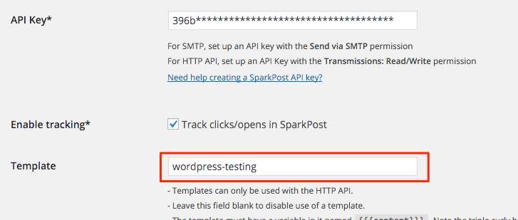

When using stored templates with the [SparkPost WordPress plugin](https://wordpress.org/plugins/sparkpost/), we pass through substitution data that you can use as variables in your template to specify some dynamic settings:

* content - the main body of the email
* subject - the subject of the email
* from - the email address of the sender (e.g. Rick Sanchez <rick.sanchez@DimensionC-137.com>)
* reply_to - the email address to use when users reply to your email

To use these variables in your templates, you'll have to use our [Templates API](https://developers.sparkpost.com/api/templates/) or use our [UI](https://app.sparkpost.com). When you create or update your template, you can supply a payload that looks like this:

```json
{
  "id" : "wordpress-testing",
  "name" : "wordpress testing",
  "published" : true,
  "options": {
    "open_tracking" : true,
    "click_tracking" : true
  },
  "content": {
    "html": " {{{content}}}",
    "subject": "{{subject}}",
    "from": "{{from}}",
    "reply_to": "{{reply_to}}"
  }
}
```

Note that `content` is enclosed in triple curly braces - this allows HTML content to be substituted without escaping. 

Remember to fill in the Template field (in this example `wordpress-testing`) on the settings screen of the SparkPost plugin. You can modify the template name and/or substitution variables dynamically using [hooks supported by SparkPost plugin](https://github.com/SparkPost/wordpress-sparkpost/blob/master/docs/hooks.md). 


