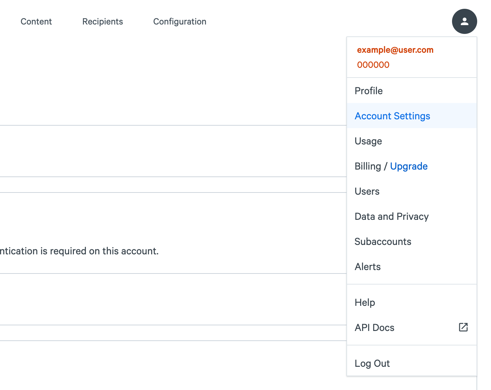
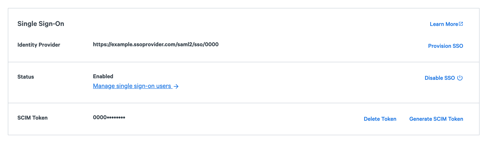
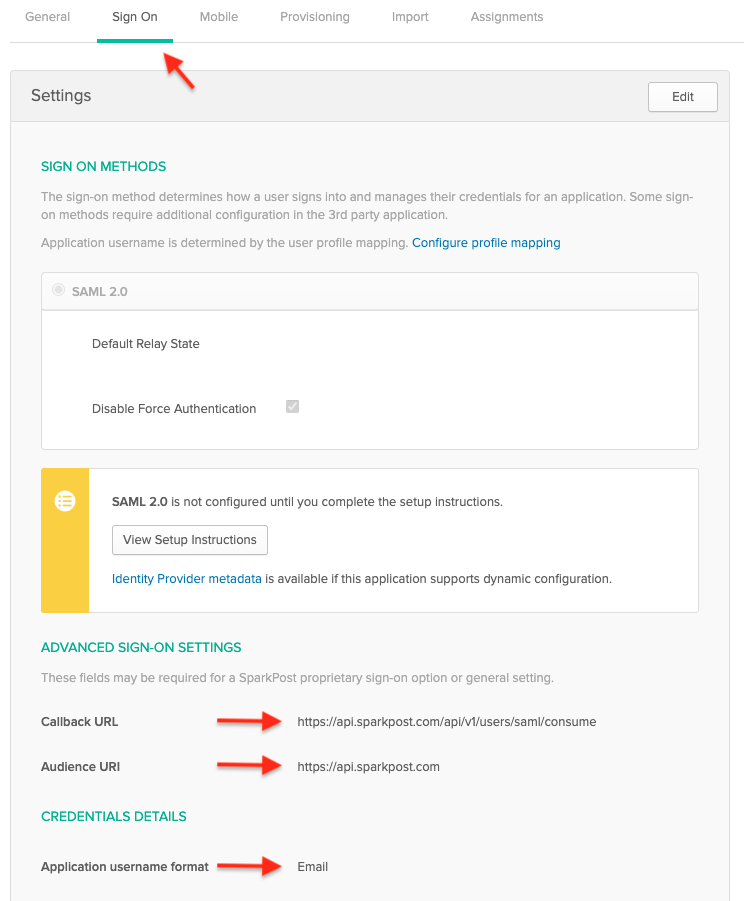
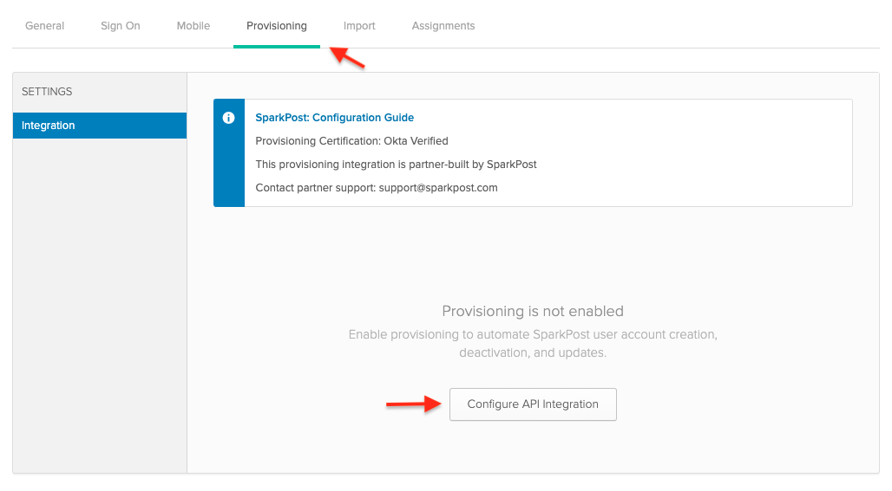
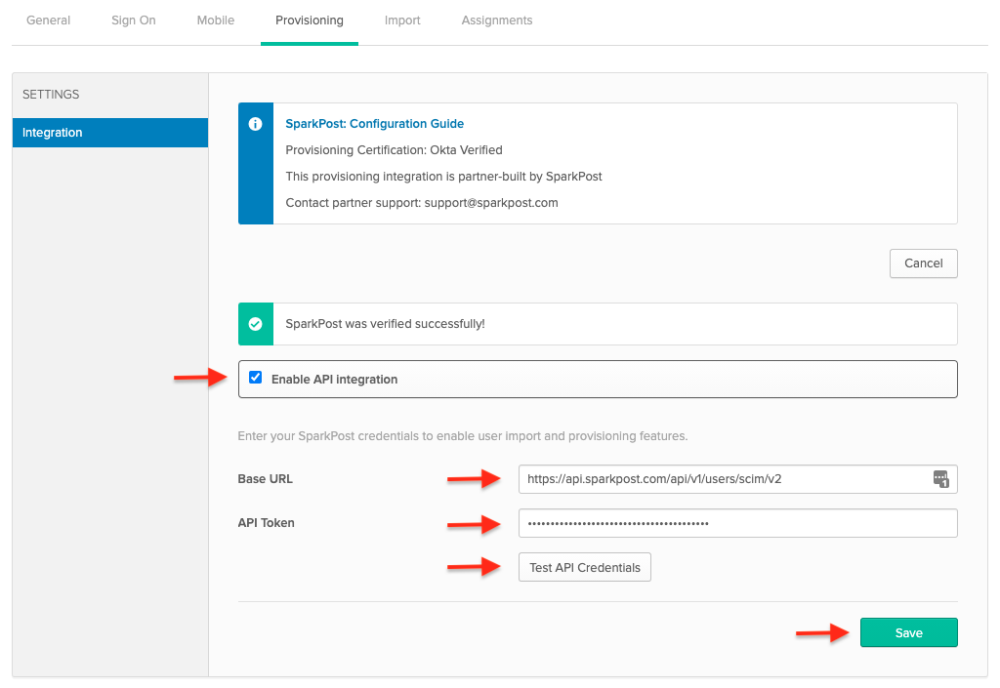
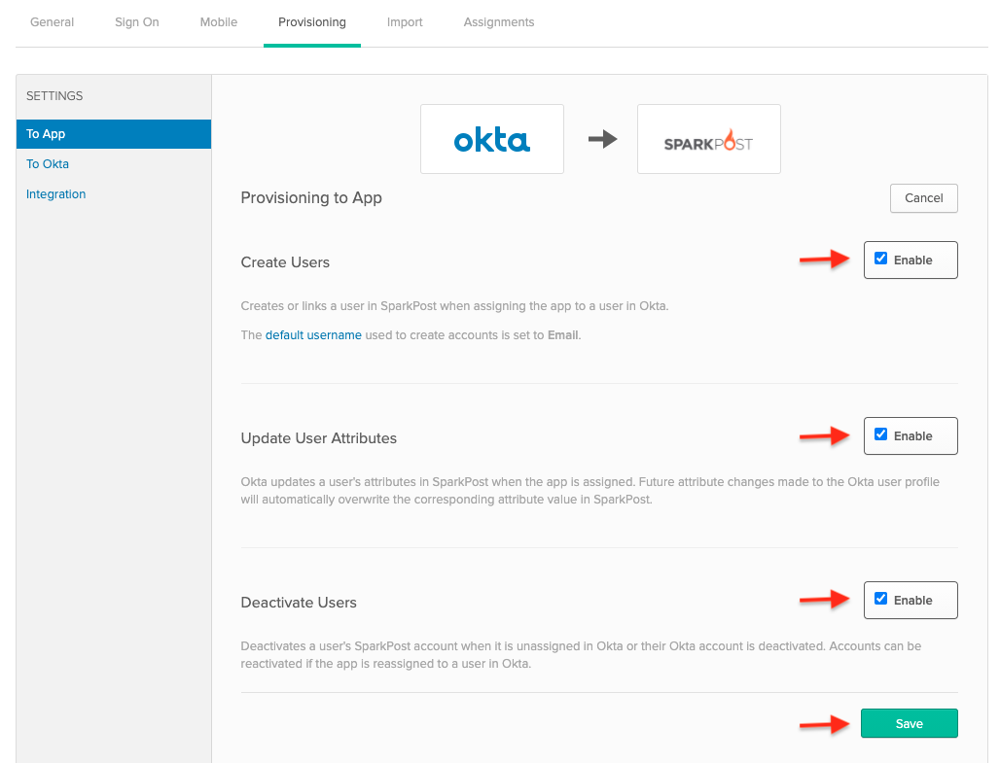
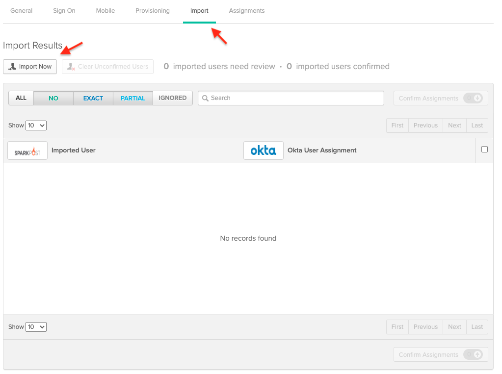
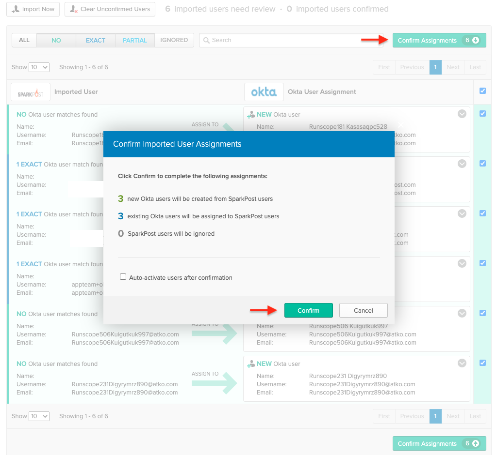
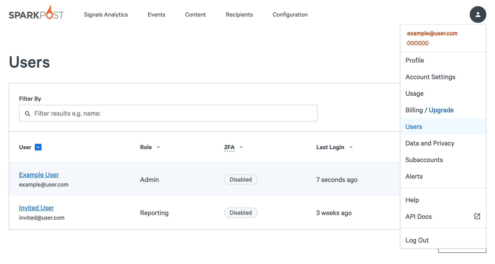

## Features
- **Create users** Okta users will be created in the SparkPost application.
- **Update user roles** SparkPost user roles can be changed via Okta.
- **Deactivate users** Deactivating an Okta user will remove it in the SparkPost application.
- **Import users** Users created in SparkPost can be imported into Okta and either matched against existing Okta users or created as new Okta users.

## Requirements
- You must be a premier or enterprise customer. See our [pricing page](https://www.sparkpost.com/pricing/) for more details. Test accounts can also evaluate SCIM Provisioning.
- SAML SSO must be configured and enabled for your account. See instructions [here](https://www.sparkpost.com/docs/my-account-and-profile/sso/).
- Only admin users can generate SCIM access tokens.

## Configuration in SparkPost
1. From your SparkPost dashboard, navigate to your Account Settings page by clicking on your username at the upper right corner of the screen.

1. Under "Single Sign-On" click "Generate SCIM token".

1. Your token will be displayed. Copy it - you won't be able to see it again (don't worry, if you lose it you can generate a new one).

## Configuration in Okta
1. From the Okta admin console, navigate to "Applications" and select the SparkPost app.
1. Select the "Sign On" tab. Ensure that under "Credentials Details", "Application username format" is set to "Email".
1. Click "View Setup Instructions" to setup SSO and get the Callback URL and Audience URI

1. Select the "Provisioning" tab, and from the "Integration" menu click "Configure API Integration".

1. Check "Enable API Integration"
1. In the "Base URL" field:
    - For US-hosted customers, enter `https://api.sparkpost.com/api/v1/users/scim/v2`
    - For EU-hosted customers, enter `https://api.eu.sparkpost.com/api/v1/users/scim/v2`
    - For Enterprise customers, enter `https://<host>.api.e.sparkpost.com/api/v1/users/scim/v2`
    
        *Enterprise customers: note that you must replace < host > with your SparkPost tenant name. Please see your TAM if you need assistance determining your callback URL.*
    
1. In the "API Token" field, paste the SCIM token you generated.
1. Click "Test API Credentials" to verify settings are correct.
1. Click "Save".

1. In the "To App" section of the "Provisioning" tab, enable "Create Users", "Update User Attributes", and "Deactivate Users".  Click "Save".

## Import Existing SparkPost users
1. Select the "Import" tab and click "Import Now"

1. Verify "Okta User Assignments" match existing users or create new users.
1. Click "Confirm Assignments"
1. Verify changes and click "Confirm".

1. Verify users exist in SparkPost application.

## Known Issues / Troubleshooting
- If you have questions or difficulties with your SparkPost/Okta SCIM integration, please [submit a support ticket](https://www.sparkpost.com/submit-a-ticket).
