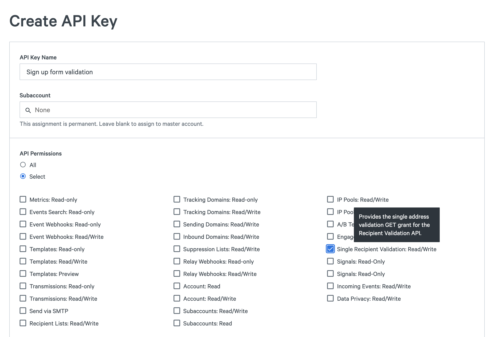
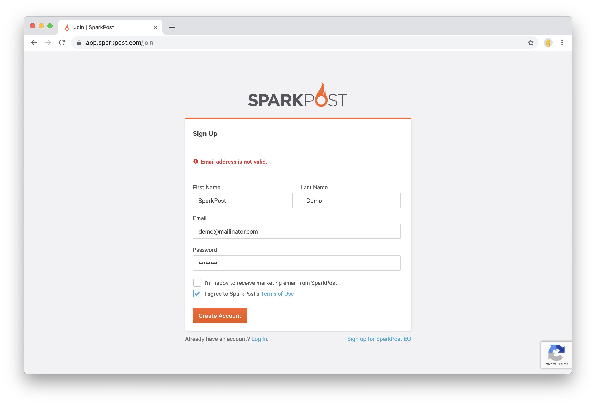

When you collect email addresses, you should put checks in place to protect your email program from being overrun with bad emails and help your users by catching mistakes before they leave.


In addition to using Recipient Validation, we recommend implementing [reCAPTCHA](https://www.google.com/recaptcha/intro/v3.html#) for the best results.

You should put these checks in place in front of any form which accepts an email, from a raffle registration to your product's sign up page.

The integration should follow these steps:
1. The user submits a form with their email
2. Your server checks if the email is valid with Recipient Validation
3. If the email isn't valid, you ask the user for a different email address

## API integration

### 1. Create an API key

First, create an API key. You'll use this key to make the validation request.

Under **Configuration**, navigate to **[API Keys](https://app.sparkpost.com/account/api-keys)([EU](https://app.eu.sparkpost.com/account/api-keys))** and press "Create API Key". Set API Permissions to "Select" and check `Single Recipient Validation: Read/Write`. Finally, press "Create API Key" and copy the key to a secure location. You will not be able to access the key in the future.



### 2. Validate the email address

Next, update your server-side code to validate the email address with Recipient Validation and, if the email isn't valid, return an error back to the user.

Please note SparkPost does not allow you to call the API from the browser to keep your API key secret and to protect your account.

For a product sign up form, we recommend rejecting any email address where the `result` is `risky` or `undeliverable`. We also suggest you discard `is_disposable` email addresses.

For marketing and newsletter forms, you should decide what is most important to you. At a minimum, you should never send to any addresses marked as `undeliverable`.


Below is an example in Node.js using [Express.js](https://expressjs.com) that rejects `undeliverable` and `risky` addresses.   

```js
const SparkPost = require('sparkpost')
const client = new SparkPost('YOUR_RECIPIENT_VALIDATION_KEY');

app.post('/sign-up', function (req, res) {
	// Encoding the email address is necessary if you expect special characters
	const emailAddress = encodeURIComponent(req.body.emailAddress);

	sparkpost.get({ uri: `/api/v1/recipient-validation/single/${emailAddress}` })
	.then((response) => {
		const validation = response.results

		if (validation.result === 'undeliverable' || validation.result === 'risky') {
			res.status(400).send({
				message: 'Invalid email. Please try a different email address.'
			})
		}
		else {
			// continue creating the account
		}
	})
})
```

### 3. Surface the results

Lastly, when an email address is rejected, you should surface that result back to your user so they can use a valid email address instead.

You can see this in action on the SparkPost sign up page. If you try to sign up with disposable email address, you'll get the following error.



---

To learn more about the different fields check out the [getting started guide](./getting-started-recipient-validation/).