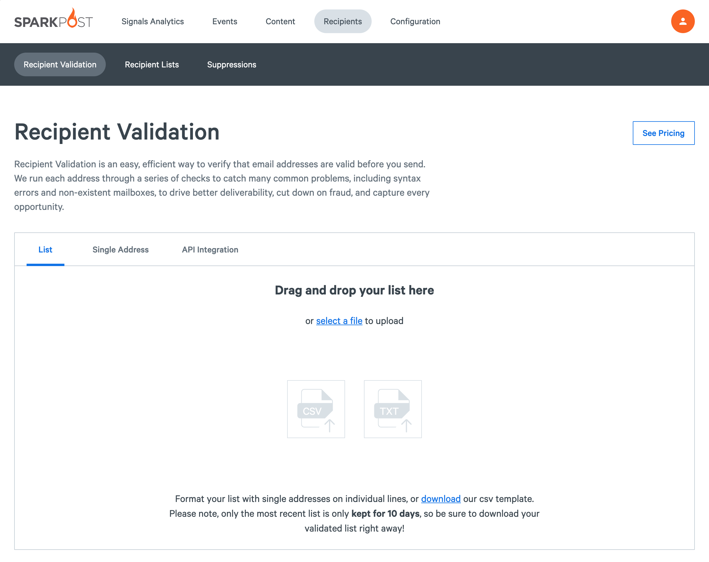
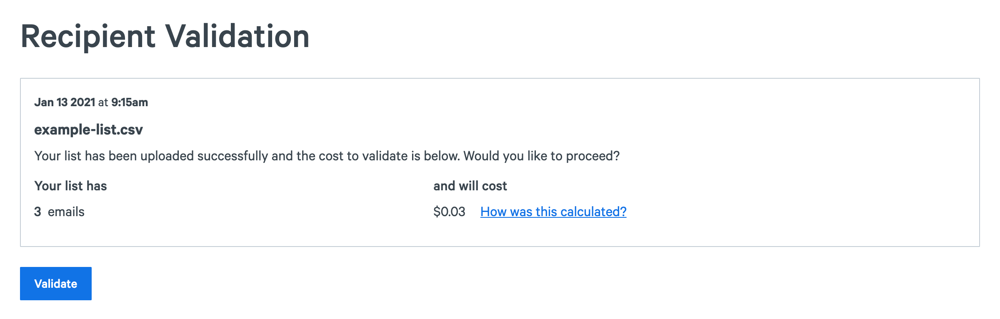
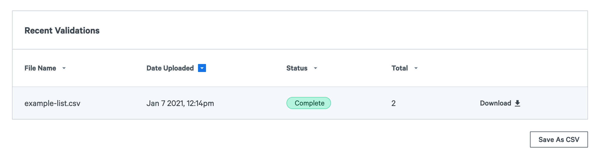

With Recipient Validation you can upload and validate a large list of email addresses. As a best practice, you should contantly remove bad addresses and disengaged subscribers, validate lists you have not sent periodically or consistently, and validate lists when moving between email service providers.

**Note:** You should never purchase lists or send to people who have not explictly opted-in to receive emails from you.

## File requirements

Before uploading your list, make sure it fits the following conditions:
* The file type is `.csv` or `.txt`
* The file does not contain a header row
* Each line should contain a single email address, with no additional columns
* Your file should be under the maximum size of `20MB`

Below is an example of a valid file to upload:

```
harry.potter@hogwarts.edu
hermione.granger@hogwarts.edu
ron.weasley@howgarts.edu
albus.dumbledore@hogwarts.edu
professors@hoggggwarts.edu
hufflepuffs@hogwarts.com
griphook@gringottsbank.com
dobby@freehouseelf.me
hewhomustnotbenamed@thedarkmark.me
```

## Validating a list

To validate your list, visit [Recipient Validation](https://app.sparkpost.com/recipient-validation) ([EU](https://app.eu.sparkpost.com/recipient-validation)) under **Recipients** in the SparkPost app.

### 1. Upload the file

Drag and drop your list into the SparkPost or select your list from the file picker and press "open" to upload your file.



### 2. Confirm pricing

After the list upload completes, you will see the estimated cost for validating all the emails in the file.

To continue, press the "Validate" button.



As the validation progresses, you can see what stage it's running. Feel free to navigate away – the job will continue to run if you leave the page!

### 3. Download the results

After the job completes, you can download the results in the table below. The results are stored and are easily accessible through the app for 10 days after you initially upload the file.



The file you download will contain all of the email addresses you uploaded, with columns for each of the fields Recipient Validation provides, including whether or not they are valid and the reason.

Here is the example of the validation results.

```
email,valid,result,reason,is_role,is_disposable,is_free,did_you_mean
harry.potter@hogwarts.edu, true, valid, false, false, false,
hermione.granger@hogwarts.edu, true, valid, false, false, false,
ron.weasley@howgarts.edu, true, typo, false, false, false, ron.weasley@hogwarts.edu,
albus.dumbledore@hogwarts.edu, true, valid, false, false, false,
professors@hoggggwarts.edu, true, typo, true, false, false, professors@hogwarts.edu,
hufflepuffs@hogwarts.com, true, typo, true, false, false, hufflepuffs@hogwarts.edu,
griphook@gringottsbank.com, true, neutral, false, false, false,
dobby@freehouseelf.me, true, risky, false, false, false,
hewhomustnotbenamed@thedarkmark.me, false, undeliverable, invalid_recipient, false, false, false

```


