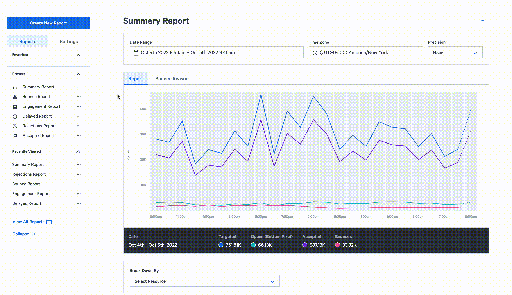

## Overview

Analytics Report is a powerful and flexible tool designed to make it easy for you to visualize time-series trends in your data. You can analyze sending and deliverability events, compare segments with each other, and more.

If you’ve used the reports before, you’ll notice some new, powerful features:

- Saved Reports
- Scheduled Reports
- Selectable time precision
- Comparison Reports
- Mailbox Provider and Mailbox Provider Region Reporting Facets

## Reporting Concepts

#### Date Range

The date selector lets you set the time frame of the data you want to view. All data presented in the report will be limited to the date and time range you set.

#### Time Zone

Data is shown in your local time zone for precisions under 1 day. Coordinated Universal Time or UTC is used otherwise.

#### Precision

Precision is the time range that one data point represents. Precision can be set to 1 minute, 5 minutes, 15 minutes, 1 hour, 1 day, 1 week, or 1 month. For example, setting a precision of 1 hour will aggregate your data into 1 hour data points in a time-series chart. Hovering over the time-series charts will reveal data rolled up to the precision value set.

#### Metrics

We offer 40+ metrics that track the entire email lifecycle. Metrics are categorized by the stage of the email lifecycle: injection, delivery, deliverability\*, and engagement. See [Metric Definitions](https://www.sparkpost.com/docs/reporting/metrics-definitions/) for more information.

Each metric selected will be shown in time-series charts. Depending on the metrics selected, more data could become available. For example, selecting a bounce metric will reveal bounce classification information available through a tab, and selecting an engagement metric will reveal link engagement information.

_\* Available for Deliverability Analytics customers._

#### Filters

A filter lets you view details on specific segments of your traffic. You can include or exclude data with filters. Filtering is available for any type of resource, such as sending domain, campaign, and more.

#### Comparisons

Comparisons let you compare multiple segments to easily see their time-series data at the same time. Just like filters, breakdowns are available for any type of resource. You can compare different subaccounts, campaigns, mailbox providers and so on. This is helpful to explore how your sending performance varies over time.

#### Aggregates

Aggregate data for your selected date range and metrics are displayed below the time-series charts. Remember, the same information is available via the [Metrics API](https://developers.sparkpost.com/api/metrics/), so your own code can retrieve and process it.

#### Breakdowns

Breakdowns give you more visibility into your data by grouping your data by any resource type, and can be exported as CSV files for further analysis in Excel or other tools. This makes it easy to find the highest and lowest performers of any resource type, like campaign, sending domain, and others.

## Building Your First Report

Creating your first report is simple and only takes a few clicks.

#### Step 1: Select Your Metrics

The metrics you select are the basic building blocks of your report. The chosen metrics will be shown in time-series charts.

#### Step 2: Apply Your Filters

Think about what data you would like to isolate, or what data you want to include.

#### Step 3: Choose Your Breakdown

Use the breakdown tool to further segment your data and identify the highest and lowest performers.

#### Step 4: Save Your Report

Save your report for quick access in the future and to avoid reconfiguring your settings each visit.

## Accessing Your Reports

#### Preset Reports

Your account comes with several preset saved reports which are available from the report dropdown. All preset reports are also available through a menu by clicking the “View All Reports” button in the upper right-hand corner.

#### Your Reports

Reports that you’ve saved will also appear in the same dropdown along with preset saved reports. All saved reports are also available through a menu by clicking the “View All Reports” button in the upper right-hand corner. Saved reports are automatically shared with other users on your SparkPost account.

## Scheduling Your Reports

Keep yourself and your stakeholders informed by scheduling any saved report to be emailed straight to your inbox. Reports can be scheduled to be sent on a daily, weekly, or monthly basis.

## Deleting Your Reports

Reports can only be deleted by the user that created them. To delete a report, first click on “View All Reports” in the upper right-hand corner, then under the “My Reports” tab, find the report you want to delete. The delete button is found in the dropdown menu on the right side of each report.

## Limits/Limitations

#### Saved Report Limitations

The number of saved reports is based on your account’s plan. Starter plans are limited to 30 saved reports, and Premier plans are limited to 100.

#### Metrics Limitations

There are no limits on the number of metrics you can select.

#### Filter Limitations

You can apply up to 10 filters on a report.

#### Comparison Limitations

You can create reports with up to 10 resource comparisons.

#### Date Range Limitations

Historical data is available up to 6 months in the past.

#### Precision Limitations

Selectable precision values are based on the selected date range of the report.

#### Time Zone Limitations

Time zone is only adjustable for precision values under a day. This includes 1 minute, 5 minutes, 15 minutes, and 1 hour. Data is only available in UTC for precisions 1 day and above.

## Giving Feedback

For any questions or feedback about SparkPost’s reporting capabilities, please [submit a support ticket](https://www.sparkpost.com/submit-a-ticket/).
