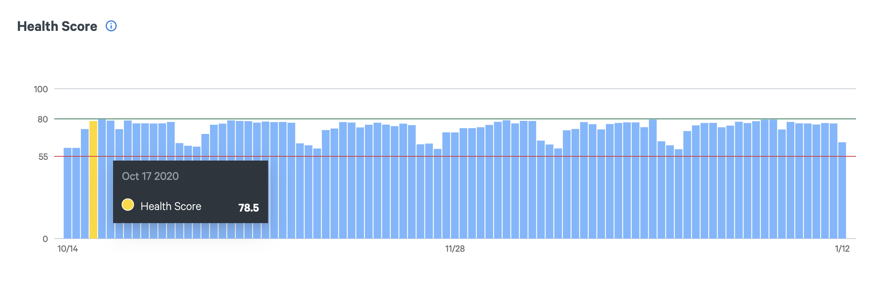
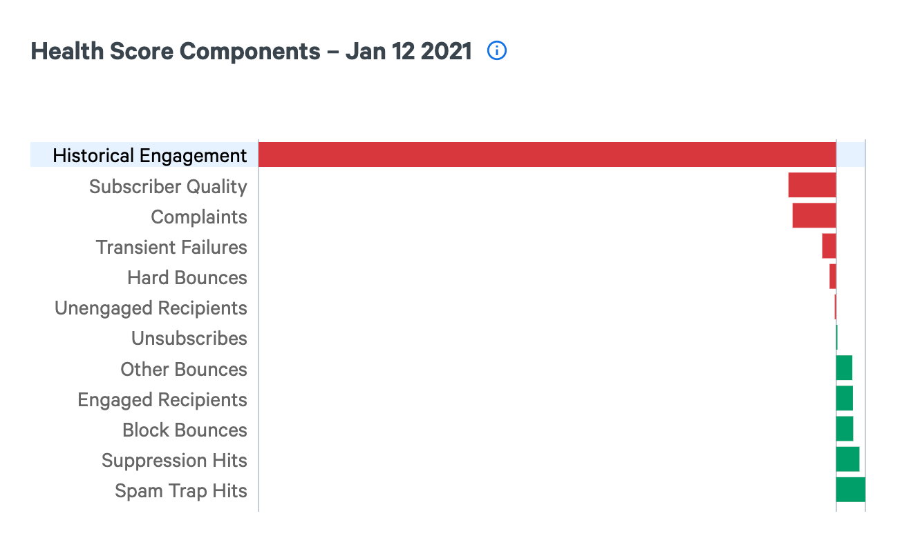
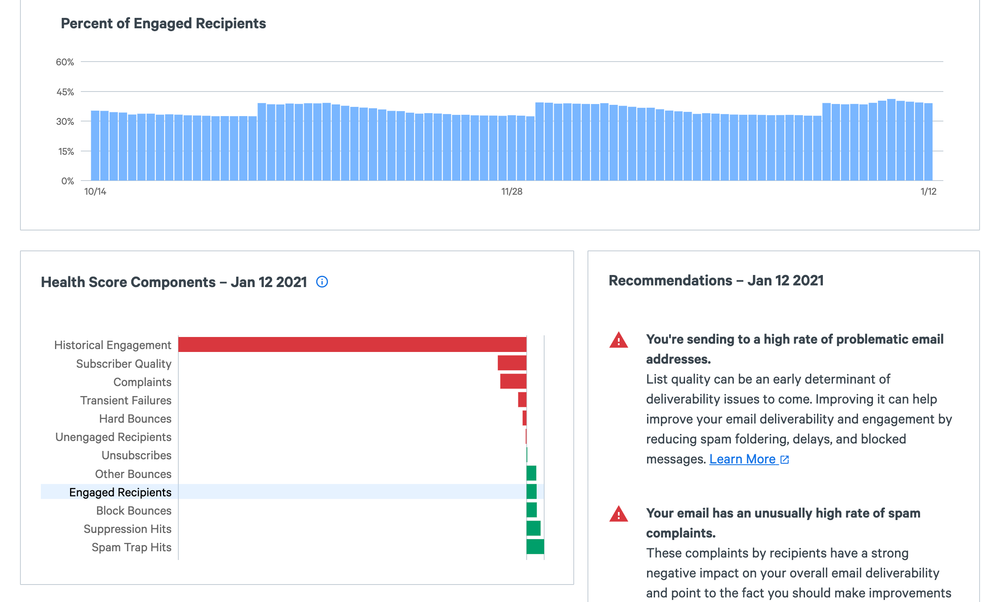

Your Health Score is a predictive score to help you monitor your email health and identify problems before they surface in your normal metrics. Each day, the Health Score model predicts your overall engagement as compared with all senders using SparkPost, by analyzing dozens of different sending factors from your bounce rate to the relationship you have with your recipients. You'll receive a score between 0 and 100, informing you of your sending health. A good score is anything above 80.

_**Note:** To provide the actionable insights and accurate analysis, the Health Score requires a minimum 1000 emails sent each day with open tracking enabled. For any period where your sending does not pass these minimums, you will not have an accurate Health Score._

## Dashboard

On the Health Score dashboard, you'll find the health of your overall account along with the full history, total injections and floor and ceiling.

Below is a summary for each subaccount's health, which can be sliced by campaign, IP pool, or sending domain to help catch issues across any of these facets. Additionally, you can view the data for up to 90 days to analyze trends over time.

## Health Score details

From the dashboard, you can dive into the details page to see a deeper view of your scoring and find curated actions you should take to improve your sending, deliverability, and engagement.

### Components

The Health Score is a combination of twelve different components which are informed by all the message events generated by your sending each day. You can drill into these components for any given day's Health Score.
The relative size of the component in the chart indicates the impact it has on your health score.

- **Subscriber Quality** – The share of injections that match address patterns associated with problematic list procurement and hygiene practices.
- **Hard Bounces** – Percent of injections that returned hard bounces.
- **Block Bounces** – Percent of injections that returned block bounces.
- **Complaints** – Percent of injections that received a spam complaint.
- **Transient Failures** – Percent of injections that returned transient failures.
- **Other Bounces** – Percent of injections that returned a different bounce category.
- **Engaged Recipients** – Percent of injections that were sent to new recipients or recipients who have engaged within the past 30 days.
- **Unengaged Recipients** – Percent of injections that were sent to recipients who most recently engaged more than 90 days ago or never engaged.
- **Spam Trap hits** - Percent of your injections that are sent to spam traps.
- **Suppression Hits** - Percent of the injections that were sent to addresses on your suppression list.
- **Historical Engagement** - Engagement rate calculated for the previous 3 days of emails sent.
- **Unsubscribes** - Share of emails injected that led to the recipient unsubscribing.

### Component changes over time

To examine the raw data for a component, select it in the chart at the bottom. When selected, a chart of the raw data is displayed for the time window selected. This chart allows you to see not only how your health score changed, but also how each component shifted over the selected timeframe.

_**Note:** Unlike SparkPost metrics which are calculated based on the number of sent emails, Signals is calculated based on the number of injected emails. Because of this, you’ll see differing rates for some components such as hard bounces._

### Recommendations

Signals provides a list of items needing attention and actions to take to improve any of the components that are negatively affecting your Health Score. By taking action to improve these items you'll see your Health Score, and therefore your deliverability and engagement, improve over time.
