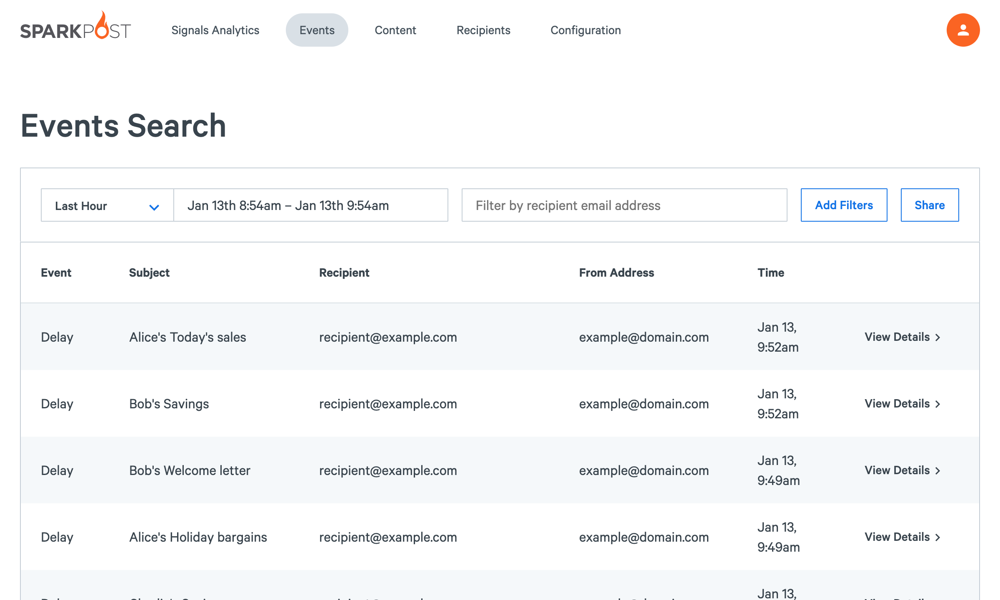
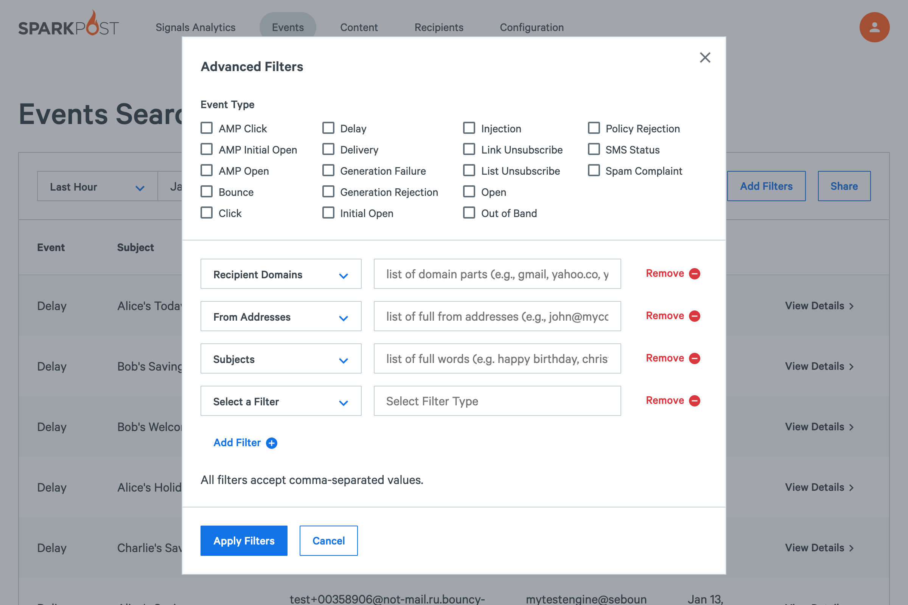

[Events](https://app.sparkpost.com/reports/message-events) ([EU](https://app.eu.sparkpost.com/reports/message-events)) provides powerful searching for email event data based on recipients, campaigns, and more.

With events you can:
* Retrieve all events or specific events, such as bounces, deliveries, or clicks
* Filter the data by date range, campaign, or just about any other field

