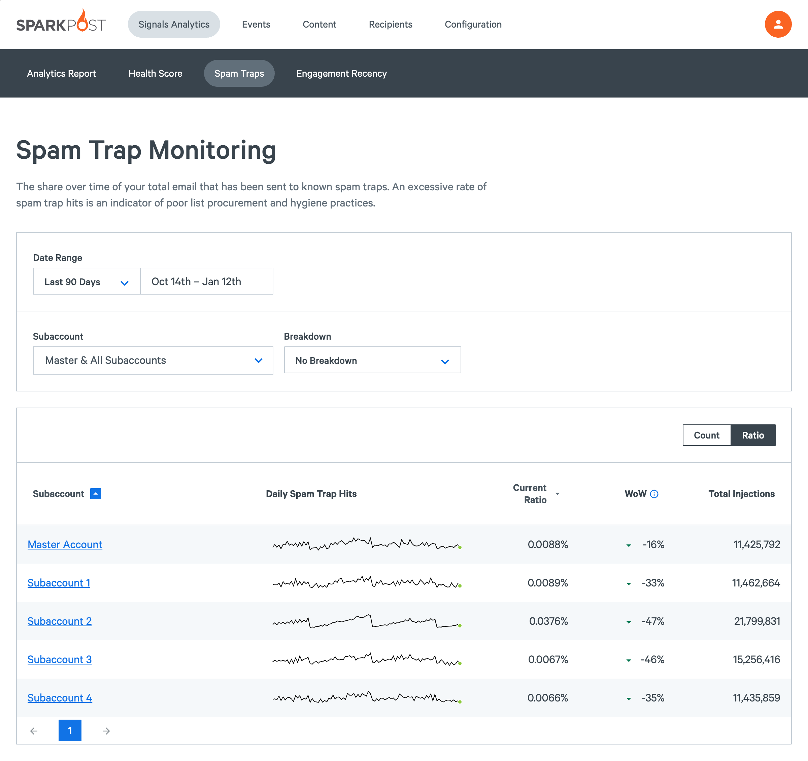
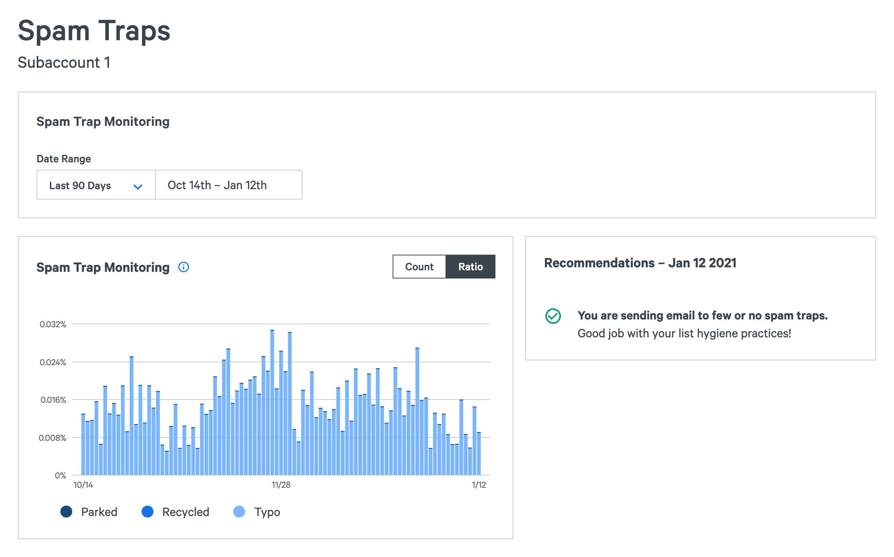

The Spam Trap Monitoring surfaces how much of your mail you are sending to known spam traps. This can help you find problems in your list collection and hygiene practices, and avoid deliverability problems.

## Spam traps

Spam traps, also known as honeypots, are email addresses that are set up by blacklists, filter companies, and mailbox providers as a way to identify senders with bad list hygiene and list collection practices.

As a sender, these addresses have no value since no one is reading the email. When you send to a high number of traps, your mail will be blocked or placed in the spam folder. In sum, you should avoid sending to spam traps as much as possible.

[Learn more](https://www.sparkpost.com/email-deliverability-guide/spam-traps/) about spam traps and how to avoid them.

### Monitored traps

SparkPost has visibility into multiple commercial and non-commercial spam trap networks for the broadest coverage in the industry. Every day we analyze all the emails that were sent to find and monitor new spam traps to provide the most accurate report of your sending possible.

### Trap types

Spam traps are categorized into different types based on their behavior and the way they can end up on your list.

Knowing the type spam trap you’re sending to can help you find where in your email program may have an issue.

- **Recycled** - Email addresses that once were real, but have been converted into a spam trap. If you have these on your list it’s probably a sign you need to clean out old unengaged recipients. You can look at your [engagement recency cohorts](https://app.sparkpost.com/signals/engagement)([EU](https://app.eu.sparkpost.com/signals/engagement)) to see if you are sending to a lot of unengaged recipients.
- **Typo** - Email addresses hosted on a domain that looks like a real mailbox provider, like gmal.com. These usually get onto your list when a real person tries to sign up but “fat fingers” their email address and accidentally adds a trap instead. These addresses signal that you should work to improve your enrollment process. Using a tool like Recipient Validation can help solve this problem.
- **Parked** - These are email addresses hosted by a parked domain provider. These addresses can point to list quality issues, though they will not affect your reputation.

## Spam Trap Monitoring Dashboard

The dashboard shows you the raw count or percent of spam traps you are sending to in the selected time range. On the dashboard you can quickly set the date range to any of the presets or set a custom range to focus. To find specific issues, group the results by subaccount, and any IP pool, sending domain, or campaign.

## Details page

On each Spam trap details page, hover over each day to see the count and rate of total spam traps, as well as the stats broken down by each type of spam trap available. On the right hand side, you will find an assessment on how your performing for the day selected. Click on a different day to learn about your spam trap hits for that day.

If your spam trap hits exceed safe limits, Signals provides actionable advice identifying the most likely source of the problem and guides you to improve your [list quality](https://www.sparkpost.com/docs/signals/list-hygiene/) or [acquisition practices](https://www.sparkpost.com/docs/signals/subscriber-acquisition/).

_*Note:* Setting up spam traps is resource-intensive. To protect the integrity of the traps, SparkPost will never reveal which email addresses are traps. Similarly, the report may be empty if you send to a dangerously high percent of traps. This will only affect spammers._
