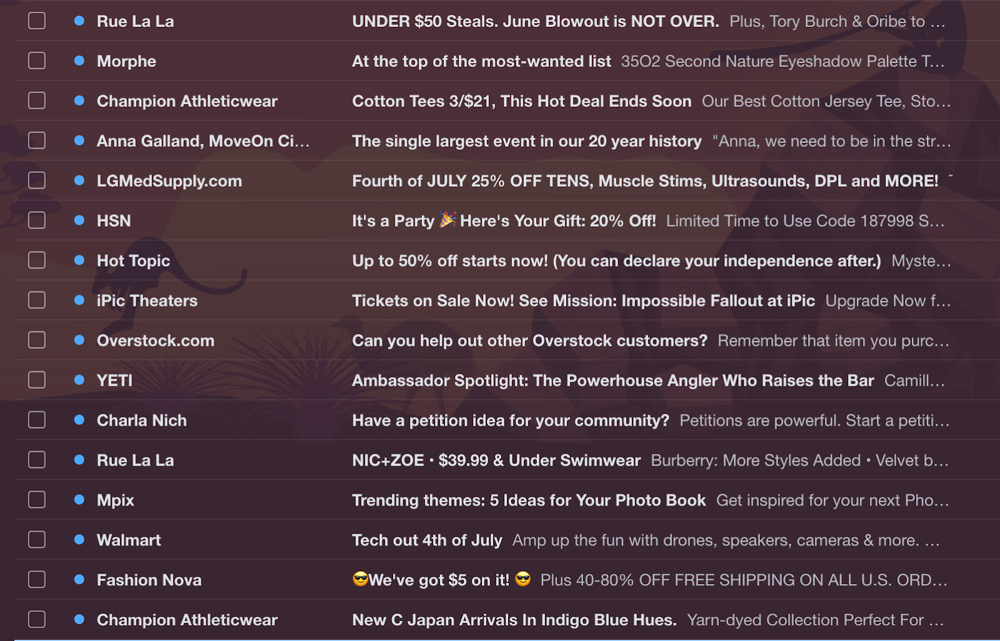

You can expect a quarter of your subscribers disengage each year. Therefore it is key that you work to keep your subscribers engaged and attract new people. Here are some ways to accomplish a healthy list of subscribers. 

1. Keep those on your list engaged. 
    1. Provide quality content.
    1. Create a [list hygiene process](/docs/signals/list-hygiene/).
    1. Set up a [re-engagement campaign](/docs/signals/re-engagement-campaign/) series.
1. Attract new subscribers using social media.
    1. Include an email sign up option on your Facebook page
    1. Tweet offers to drive signup
1. Share archived newsletters on your signup page.
1. Set expectations upon signup. 
    1. Create a [simple preference center](/docs/signals/preference-center/) allowing them to select their own frequency and messaging types.
    1. Send a [welcome campaign](/docs/signals/welcome-campaign/) restating what to expect and give the option to change preferences.

You should also work to stimulate customers’ curiosity by asking questions or compelling users to discover additional information by opening your emails. Using words in your [subject lines](https://www.sparkpost.com/blog/subject-line-best-practices/) that create a sense of urgency performs well. 

