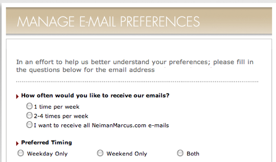
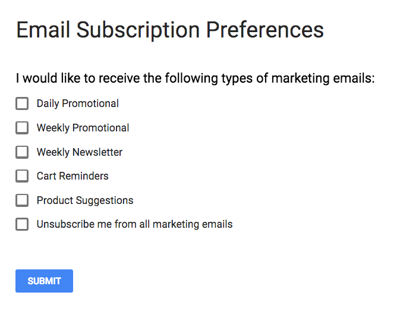
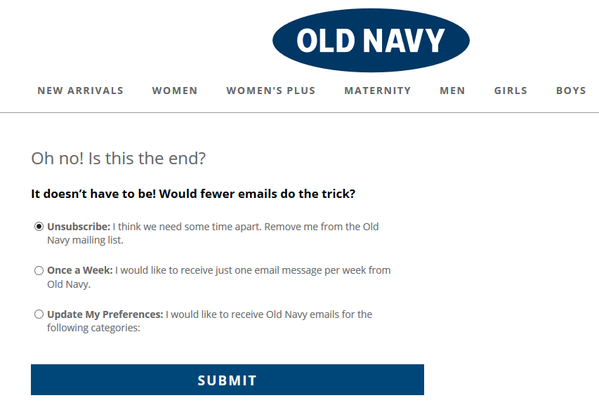
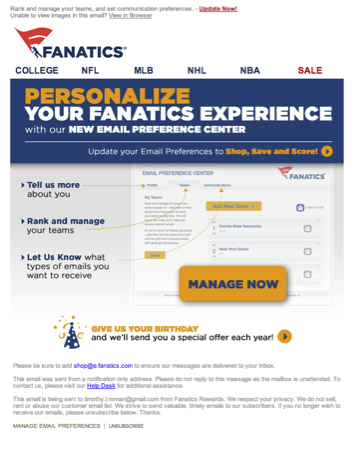

It’s important to give your subscribers a way to tell you what they want or you risk losing them. An email preference center provides an easy way for your subscribers to manage their own subscription rules rather than you guessing.  Giving them the ability to control what they receive and/or when they receive it is a great way to keep subscribers that may otherwise unsubscribe. There are no two senders alike so there is no wrong answer as to what preference center type you use. The goal is to give your subscribers options to avoid having them leave you, and to promote brand loyalty.  

#### Time-based Preference Center
If you send only one type of message stream changing the frequency may do the trick. Giving your subscriber the ability to receive daily digest rather than every single notification is a common way to keep subscribers from getting email burnout. Additionally, you may find it useful to give your subscribers a way to choose between the daily, weekly or even monthly messages as well as what days of the week they wish to receive emails.

#### Content-based Preference Center 
If you send multiple campaign types such as a weekly newsletter, daily offers, and ad hoc special offers you may run the risk in overloading some of your subscribers.  Give them the option to receive each specific type of message to strengthen brand loyalty.  Be sure to set expectations for each message stream so that they know what they will receive.

#### Unsubscribe Options Preference Center
You can add your preference center as part of your unsubscribe process.  It’s a best practice to have a one-click unsubscribe process, and it’s often useful to give the subscriber another option on the same form.  For example, see below: the unsubscribe is pre-checked allowing the customer to one-click unsubscribe but there are two other options presented.

 
#### Preference Center Launch Announcement
A preference center launch email campaign is a great way to re-engage subscribers as well. Here is an example of how to approach this.

