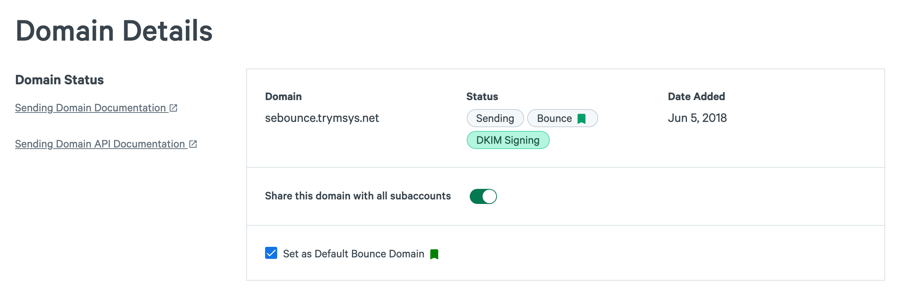

By creating a custom bounce domain, you can customize the address that is used for the Return-Path header, which denotes the destination for out-of-band bounces. This bounce domain overrides the default Return-Path (also known as the envelope FROM) value of "sparkpostmail.com" for all emails sent.

You can set up a custom bounce domain in the different ways outlined below: 

### Recommended Option - Strict Alignment Subdomain

Use a subdomain, like mail.example.com, as both a sending domain and a bounce domain. Add both the TXT record and CNAME records to your DNS.

### Root Domain + Subdomain:

Use a root domain (e.g. example.com) as a sending domain, and a separate subdomain (e.g. bounce.example.com) to be used as a bounce domain. Only add the CNAME record for that subdomain to your DNS and ignore the TXT record.

### Not Recommended - Root Domain Strict Alignment 

Use your root domain (e.g. example.com) as a sending domain and bounce domain. 

**Only do this if you understand the root domain CNAME record caveats**: 
* Using a root domain as a bounce domain means you will **not** be able to receive any mail there, as all messages will be sent to SparkPost. If you intend to receive mail at a root domain, you cannot use it as a bounce domain. 
* Additionally, using a CNAME record at a root domain means you cannot create any subdomains of the root domain, as per limitations of DNS. Because of this limitation, it is **not recommended** that you use a root domain as a bounce domain.

## Setting Up a Bounce Domain

Start from [Domains create](https://app.sparkpost.com/domains/create) ([EU](https://app.eu.sparkpost.com/domains/create)) page and select the Bounce Domain option as you add your domain.

Then add the CNAME records outlined in the Bounce section to your domain's DNS settings and verify the domain.

  

### Set as Default Bounce Domain
You can set a Bounce domain as Default if you want all of your emails to use this bounce domain. If you plan to configure multiple bounce domains, please refer to the end of the article for more information on how to set the bounce domain in your transmission.

## Set Up Using The API

If you prefer to set up a bounce domain via the API, use the following instructions:

1. Register the domain with SparkPost by using the sending domains [create endpoint](https://developers.sparkpost.com/api/sending-domains.html#sending-domains-create-post).
2. CNAME-verify the domain by using the sending domains [verify endpoint](https://developers.sparkpost.com/api/sending-domains.html#sending-domains-verify-post). 
3. Optionally set the domain as your account/subaccount default bounce domain through the [update endpoint](https://developers.sparkpost.com/api/sending-domains/?no-cache=1#sending-domains-put-update-a-sending-domain). This sets it up to be used automatically as the bounce domain for all emails sent through the account/subaccount.

## Using Multiple Custom Bounce Domains

It is important to note that after you create and verify your bounce domain(s), they will not automatically be in use. You will need to specify the desired bounce domain directly in your transmission request:

1. SMTP – You will need to specify the bounce domain in the SMTP `MAIL FROM` command.

1. REST API – You will need to add the bounce domain to the domain part of the `return_path` field. Note that the SparkPost servers will overwrite the local part of the `return_path` address, so this local part can be anything in your transmission request. 

     For example:

     ```
       {
         "campaign_id": "testing",
         "return_path":"anylocalpart@bounce.example.com",
         "recipients": [
           {
             "address": {
               "email": "wilma@flintstone.com",
               "name": "Wilma"
             }
           }
           ],
         "content": {
           "from": {
             "email": "fred@flintstone.com",
             "name": "Fred"
           },

           "subject": "Hi!",
           "html": "Hello, thank you for creating a custom bounce domain."
         }
       }         

      ```

You also have the option of choosing to make a verified bounce domain the default bounce domain to use for all messages injected by the account (or subaccount).  See the `is_default_bounce_domain` flag described above. When a bounce domain is set as the default, all future transmissions will use the domain as their bounce domain (unless otherwise specified in the `return_path` string for transmissions or the `mail from` header in the SMTP payload).  The `is_default_bounce_domain` flag can be applied independently at both the primary account and individual subaccount levels.  Each subaccount may select one of its bounce domains to be used as the subaccount default bounce domain.  If none of the subaccount's bounce domains are flagged as the default, then subaccount messages will fallback to a primary account default bounce domain (if such a domain is configured).
