## Introduction

Email is often read and engaged with on mobile devices. Both iOS (9 and later) and Android (6.0 and later) provide a way for links in your content to take your users directly into an app that you have created, providing your users with a richer interactive experience.
The links that connect a user directly to your app are referred to as deep links.

This article describes how to configure your content and mobile apps to support deep links.

> iOS uses the term Universal Link. The Android term is "App link". We use the term "deep link" in this article to cover the aspects common to both.

When correctly configured, a deep link takes your user directly from the email to your app, without opening the mobile web browser. If the app is not installed, the mobile web browser will open and display the specified page instead.

## Setup requirements

- Known URL path(s) that you want to deep link to your application.
    - When using SparkPost Click Tracking, you choose the Tracking Domain and the custom link sub-path, explained [here](#deep-links-and-click-tracking). It's best to choose a subdomain (e.g. `track.example.com`), so that subdomain can be redirected, while your website uses your organizational domain.

- Deep linking spec files hosted on your website or CDN, in the correct location for the devices to find. The spec file declares the identity of your app, and which URL paths lead to your app - described [here](#deep-linking-spec-files). The spec files must be accessible via HTTPS.

- A mobile app that is registered to handle incoming deep link requests - see [example code](#example-application-code).

The deep link will operate only when all of these match correctly. When you're ready, check your setup against the [summary of setup steps](#summary-of-setup-steps).


##  Writing your mobile app
The following developer documentation explains the deep linking mechanisms in detail.
- [Apple's Universal Links](https://developer.apple.com/library/content/documentation/General/Conceptual/AppSearch/UniversalLinks.html)

- [Android App Links](https://developer.android.com/training/app-links/index.html)

## Deep linking spec files

The spec files must be published on your domain(s) and accessible via HTTPS. They may be hosted on a regular web server, or via a CDN - examples [here](#hosting-the-spec-files).

- For iOS devices, the file is named `apple-app-site-association`
- For Android devices, the file is named `assetlinks.json`

These files should be placed on your website in the directory `.well-known`.

### iOS: example `apple-app-site-association`

```javascript
{
  "applinks": {
    "apps": [],
    "details": [
      {
        "appID": "ABCD1234.com.mycompany.testlinks",
        "paths": [
          "/f/open-in-app/*"
        ]
      }
    ]
  }
}

```

The `appID` is available from your XCode development environment, or from your [Apple Developer Account](https://developer.apple.com/), and follows a specific format:
- A hex prefix (e.g. `ABCD1234`)
- A "team ID" or "bundle ID" that identifies the developer of the app (e.g. `com.mycompany`)
- The app name (e.g. `testlinks`).

Your app needs access to the [Apple "associated domains" entitlement](https://developer.apple.com/documentation/safariservices/supporting_associated_domains). You need a paid Apple Developer account for this. Set up the "associated domains" to match your paths.

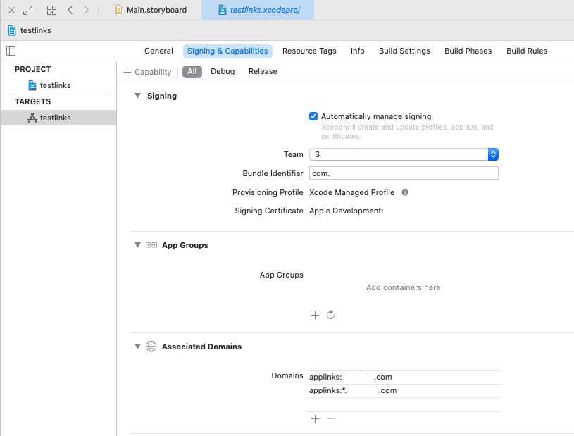

Configure the `paths` section to match the links in your email HTML content, depending on your chosen SparkPost click tracking setup (explained [here](#deep-links-and-click-tracking)).

### Android: example `assetlinks.json`

```javascript
[{
  "relation": ["delegate_permission/common.handle_all_urls"],
  "target": {
    "namespace": "android_app",
    "package_name": "com.example.testlinks",
    "sha256_cert_fingerprints":
    ["<Your_APP_FINGERPRINT>"]
  }
}]
```
The SHA256 fingerprint is unique to your particular app.

#### Android App Links Assistant

The [App Links Assistant](https://developer.android.com/studio/write/app-link-indexing) (Under the Tools menu) helps you configure the associated domains and permissions for your app, and generate the `assetlinks.json` file. It guides you step-by-step.

1. Add URL intent filters

    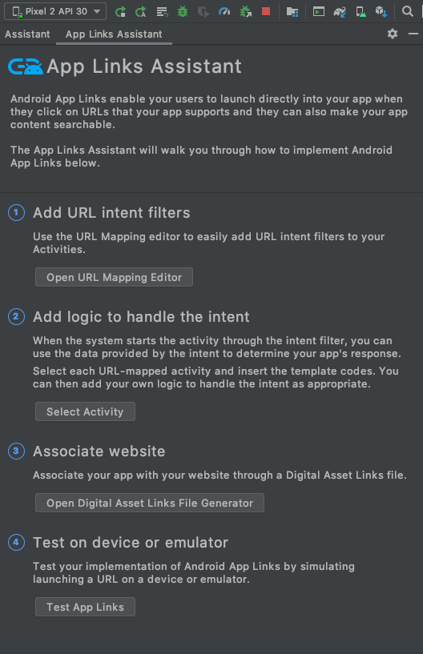

    URL Mapping Editor:

    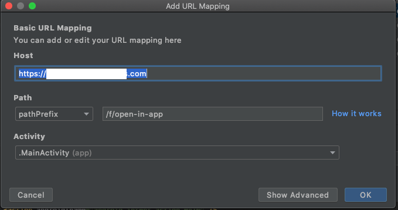

    Add your tracking domain URLs with Path set to "pathPrefix", and add your chosen prefix starting with `/f/`, for example `/f/open-in-app`. Your app can be registered to multiple URLs if you wish.

    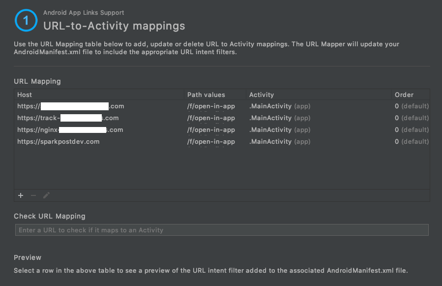

    Use the "Check URL mapping" box to test that your mapping works with a real URL.

1. Add logic to handle the intent

    This works for Java apps but not currently for Kotlin - see [here](#forwarding-clicks-from-android-to-sparkpost) for a Kotlin example.

1. Associate website

    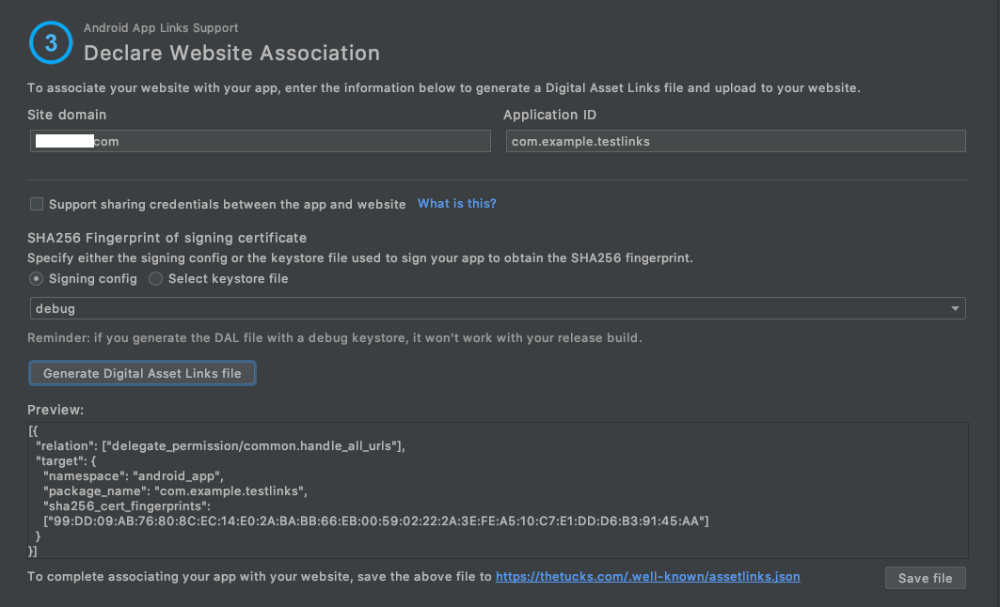

    Enter your site domain.

    Choose "Signing config". During development, "debug" is fine.

    Save your digital asset links file.

1. Test on Device or Emulator

    Test that your URL triggers your app.

    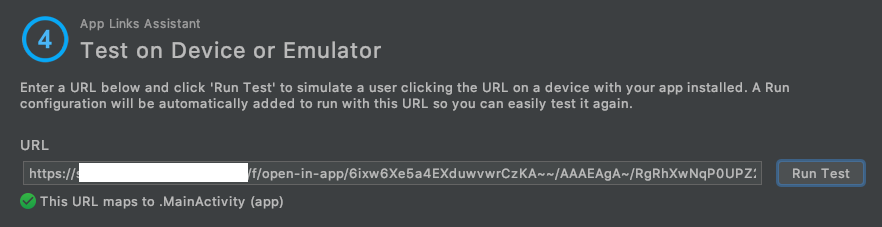

1. Deploy your app.

    On first open, by default, your recipients will be prompted to select whether to select your app. Android remembers the user's preference.

    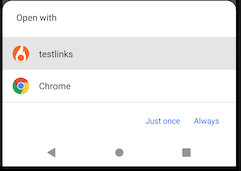

 1. In `AndroidManifest.xml`, you can set your domain `intent-filter` to `autoVerify` to favor opening your app instead of asking the user - see [here](https://developer.android.com/training/app-links/verify-site-associations).


    ```xml
    <intent-filter android:autoVerify="true">
    ```

    This requires your `assetlinks.json` file to be hosted on your specific tracking domain. This is explained further in the [hosting](#hosting) and [troubleshooting](#android-testing-auto-verify) sections.
---
## Deep links and click tracking

Setting up a [custom tracking domain](./enabling-multiple-custom-tracking-domains) is useful for branding and email reputation. It is required for click tracking of deep links in your HTML email.

It's best to choose a subdomain (e.g. `track.example.com`), so that subdomain can be redirected, while your website uses your organizational domain. Each tracking domain can serve regular email tracked links and deep links. Your content can use a mixture of both kinds of link inside the same email.

### HTTPS secure links

It is good practice to use secure (HTTPS) tracking domains, and it's essential if your website has an [HSTS](https://en.wikipedia.org/wiki/HTTP_Strict_Transport_Security) policy. We have articles describing the setup of this for:

-  [Various CDNs](./enabling-https-engagement-tracking-on-sparkpost)
- Your own [web server reverse proxy such as NGINX](./using-proxy-https-tracking-domain)

In both cases, your CDN (or proxy) redirects the specific tracking subdomain(s) to the SparkPost click tracking service, while your web content is served in the usual way.

### How click tracking works

It might be useful to understand how the SparkPost click tracking feature works with HTML links. Other email-service-provider click tracking services work in a similar way.

> When SparkPost encounters an anchor tag in an HTML email, it will replace the `href` attribute with a new URL pointing to the SparkPost click tracking service. When your recipient clicks that link, the SparkPost service receives the request (via CDN for HTTPS links), records the click, and redirects the recipient to your original URL.

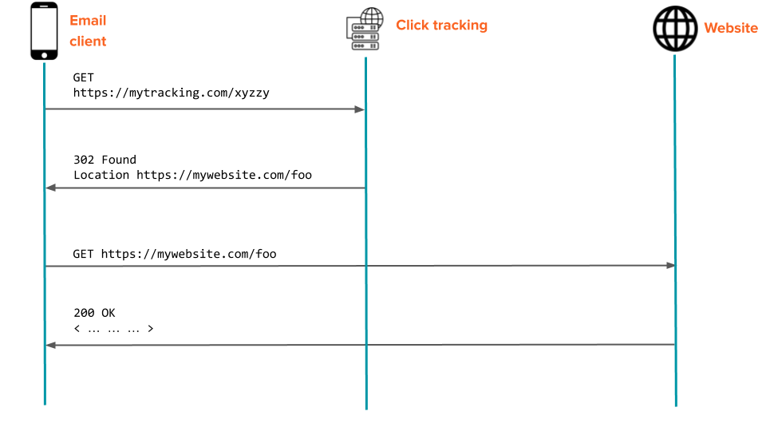
*Normal click tracking (without deep links) - icons by [The Noun Project](https://thenounproject.com/)*

Deep links supersede this flow; after checking the spec file, the  device passes the request directly to your app instead. This means your app will receive the tracked link via an API call and can show the user an appropriate part of your app.

SparkPost won't receive the request and won't register the click in your analytics, unless your app code makes it happen.

A workaround is to disable tracking for deep links. This may be appropriate if you already have analytics for measuring in-app activity.

The preferred solution is to set up Sparkpost click tracking and include code in your app to follow the link. We'll review each of these.

### Workaround: Disabling Tracking of deep links

If you disable SparkPost's click tracking for the mobile deep links in your email, they work just fine with your mobile app with no further effort. This works because SparkPost does not alter untracked links in your email.

The "path" in your Apple spec file needs to match your iOS app "associated domains".

If you're using the SparkPost REST API, you can use the `data-msys-clicktrack` attribute to [disable click tracking for a single link in your email](https://developers.sparkpost.com/api/template-language/#header-per-link-disabling-of-click-tracking):

```html
<a data-msys-clicktrack="0" href="http://my.universallink.example.com/path/">Open in app</a>
```

You can also disable click-tracking on plain-text email content as follows. See [this article](https://developers.sparkpost.com/api/template-language/#header-custom-link-attributes) for more information.

```
http://www.example.com[[data-msys-clicktrack="0"]]
```

This is appropriate where your content has a mix of deep links and links leading to an ordinary website destination.

Alternatively, you can [disable click tracking for a whole transmission request](https://developers.sparkpost.com/api/transmissions.html#header-options-attributes) by setting the `click_tracking` option to `false`. The [SMTP API](https://developers.sparkpost.com/api/smtp-api.html#header-open-and-click-tracking)  supports a similar flag.
You can control [click tracking for SMTP messages](https://app.sparkpost.com/account/smtp) at the account level too.

### Preferred solution: Using SparkPost click tracking on deep links

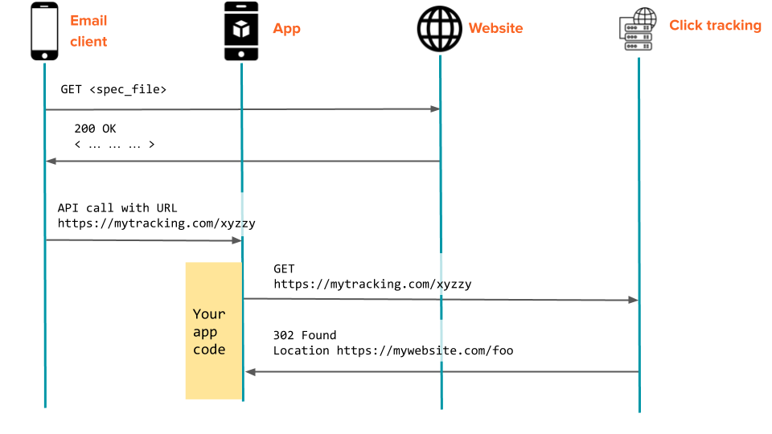
*Deep link flow, app triggers click tracking - icons by [The Noun Project](https://thenounproject.com/)*

The device operating system "wakes up" your app with an API call, passing in  the URL. Your app issues an HTTP(S) GET to the URL, which registers the click. Your app receives the original URL in the response "Location" header; there's no need to follow the redirect and fetch the entire web-page.

Set up your spec files to match your [custom tracking domain](./enabling-multiple-custom-tracking-domains) and custom link sub-path.

#### Custom Link Sub-Paths

Your spec file states which *link paths* should be treated as deep links. Any other paths on that domain will be opened via the device web browser in the usual way. This enables you to use both regular tracked links and deep links with that tracking domain. Deep links are distinguished from regular tracked links as follows.

SparkPost will include a specific string *in the path part* of a tracked URL when your content has the `data-msys-sublink` attribute, for example:

```html
<a href="http://my.universal-link.example.com" data-msys-sublink="open-in-app">Open in app</a>
```

This will cause the tracked link path to start with `/f/open-in-app/` which simplifies writing your `apple-app-site-association` file.

SparkPost supports the use of custom sub-paths on an individual link basis.  This allows you to choose, when setting up your spec file, which app opens depending on the custom subpath.

You can also set up custom sub-paths in plain text email content as follows. See [this article](https://developers.sparkpost.com/api/template-language/#header-custom-link-attributes) for more information.

```
http://www.example.com[[data-msys-sublink="open-in-app"]]
```

If a custom sub-path is not used, the spec files can be configured to open on a wildcard path.

Examples for iOS and Android are shown [here](#example-application-code).

---
## Summary of setup steps

1. Configure your CDN or reverse proxy to host your custom tracking domain.
1. Configure and verify a custom tracking domain on your SparkPost account.
1. Choose the link sub-path(s) to be used for deep linking.
1. Ensure the spec files are set up for your tracking domain(s) and link sub-path(s).
1. Test that your spec files are accessible via HTTPS.
1. Send your email through SparkPost with click tracking enabled, using your custom tracking domain and link sub-path:
    ```
    Your invoice is available <a data-msys-sublink="open-in-app" href="https://www.example.com/invoice/101">here</a>.
    ```
1. Check the fallback cases:
    - the link opens correctly via desktop browser.
    - on a mobile device without your app installed, the link opens via browser.
1. Check the link launches your app on mobile devices.

    *To enable SparkPost to track deep links:*
1.  Have your mobile app code make an HTTP GET request to the SparkPost click tracking service when it handles the incoming click event. Details and sample code for this [below](#example-application-code).
1. Have your app take action based on the original URL which SparkPost returns in its "3xx redirect" HTTP response.


---
## Example application code

## iOS - Swift - forwarding clicks to SparkPost

In your app `AppDelegate.swift`, in class `AppDelegate`, add a handler for an `NSUserActivity`:

```swift
func application(_ application: UIApplication, continue userActivity: NSUserActivity, restorationHandler: @escaping ([UIUserActivityRestoring]?) -> Void) -> Bool {
    print("Continue User Activity called: ") // debug
    if userActivity.activityType == NSUserActivityTypeBrowsingWeb,
        let url = userActivity.webpageURL {

        // Follow the link to trigger click tracking

        let task = URLSession.shared.dataTask(with: url, completionHandler: { (data, response, error) in
            guard let originalURL = response?.url else {
                print("Unexpected URL \(url.absoluteString)")
                return
            }
            print(originalURL)
        })
        task.resume()
        }
    }
    return true
}
```

This code calls the SparkPost click tracking service, which responds with a "3xx" redirect to the original URL from your email, which can be used by your app.

This simple code gets the `Location` header and also follows the redirect to fetch the web-page, which consumes device bandwidth. It's more efficient, but needs more code to stop after the "302" response is received; complete example iOS [app here](https://github.com/SparkPost/deep-links/tree/main/iOS).

#### iOS User Agent

In SparkPost event reporting, the attribute `user_agent` carries information on app name and OS version, for example `"testlinks/1 CFNetwork/1197 Darwin/20.0.0"`. This enables you to use SparkPost analytics to find out which links are being opened via your app.

## Forwarding Clicks From Android To SparkPost

When an Android email client recognizes that an app link has been clicked based on your app `AndroidManifest.xml`, it sends an `intent` which triggers the registered activity in your app. Your app can then make the HTTP(S) request, to register the "click" event in SparkPost and retrieve the original tracked URL from the message.

Here is sample `MainActivity.kt` which uses the `OkHttp4` library to perform the HTTP(S) GET to the SparkPost click tracking service asynchronously, triggering the `onResponse` or `onFailure` functions on completion.

The incoming URL and the original unwrapped URL are shown on the app `TextView` elements.

```kotlin
package com.example.testlinks

// Example deep linking app

import android.content.Intent
import android.net.Uri
import android.os.Bundle
import android.util.Log
import android.widget.TextView
import androidx.appcompat.app.AppCompatActivity
import okhttp3.*
import java.io.IOException

class MainActivity : AppCompatActivity() {
    override fun onCreate(savedInstanceState: Bundle?) {
        super.onCreate(savedInstanceState)
        setContentView(R.layout.activity_main)

        handleIntent(intent)
    }

    override fun onNewIntent(intent: Intent) {
        super.onNewIntent(intent)
        Log.i("MainActivity", "onNewIntent called")
        handleIntent(intent)
    }

    private fun handleIntent(intent: Intent) {
        Log.i("MainActivity", "handleIntent called")

        val appLinkAction = intent.action
        val appLinkData: Uri? = intent.data
        if (Intent.ACTION_VIEW == appLinkAction) {
            // handle URL
            val res : TextView = findViewById(R.id.result)
            res.text = appLinkData.toString()

            // Show this on our simple example app. The function updates the TextView itself
            makeRequest(appLinkData)
        }
    }

    // Basic URL GET request.
    // See https://guides.codepath.com/android/Using-OkHttp
    //     https://square.github.io/okhttp/recipes/

    private fun makeRequest(url: Uri?) {
        // More efficient click-tracking with HTTP GET to obtain the "302" response, but not follow the redirect through to the Location.
        val client = OkHttpClient.Builder()
            .followRedirects(false)
            .build()

        val request = Request.Builder()
            .url(url.toString())
            .build()

        client.newCall(request).enqueue(object : Callback {
            override fun onFailure(call: Call, e: IOException) {
                e.printStackTrace()
            }

            override fun onResponse(call: Call, response: Response) {
                val locationURL = response.headers["Location"]
                if (locationURL != null) {
                    Log.i("locationURL", locationURL)
                    // Show this on our simple example app
                    val originalUrl : TextView = findViewById(R.id.originalURL)
                    originalUrl.text = locationURL
                }
            }
        })
    }
}
```
*Android Kotlin example*

The `makeRequest` function gets the `Location` header without following the redirect, which saves bandwidth and battery power. [See here](https://github.com/SparkPost/deep-links/tree/main/Android) for the complete example app.


#### OkHttp library dependency

In the project `app/build.gradle` file dependencies section, this line fetches and builds the library. We used this library because it gives the required control over the HTTP(S) stack to control how redirects are handled.

```xml
implementation 'com.squareup.okhttp3:okhttp:4.9.0'
```

Your `AndroidManifest.xml` also needs these permissions added to `<manifest` .. `>` scope:

```xml
<uses-permission android:name="android.permission.INTERNET" />
<uses-permission android:name="android.permission.ACCESS_NETWORK_STATE" />
```

#### Android User Agent

In SparkPost event reporting, the attribute `user_agent` carries information on your app. In our demo app, it will be the default set by the library: `"okhttp/4.9.0"`. This enables you to use SparkPost analytics to find out which links are being opened via your app. You can [customize this](https://square.github.io/okhttp/interceptors/) in your code.


---
##  Hosting the spec files

You can use a CDN or an ordinary web-server to host your spec files. Ensure you have a valid certificate for your domain, as devices need to fetch these files using HTTPS.

When set up, you can get a security report by running the [SSL Labs server test](https://www.ssllabs.com/ssltest/analyze.html).

Step-by-step instructions follow, for
* [Apache](#apache)
* [NGINX](#nginx)
* [AWS CloudFront](#aws-cloudfront)
* [CloudFlare](#cloudflare)
* [Fastly](#fastly)
* [Google Cloud](#google-cloud-platform)
* [Microsoft Azure](#microsoft-azure)
* [Branch](#alternative-setup-with-deep-linking-platforms)
* [AppsFlyer](#alternative-setup-with-deep-linking-platforms)

If you are using a deep linking platform such as [Branch](https://branch.io/) or [AppsFlyer](https://www.appsflyer.com/), these platforms automate the spec file creation for you.

### Apache

1. Find the directory used by your web server, known as the web root. The  default is `/var/www/html`, but yours may vary. You can find this by locating the `DocumentRoot` setting in your `.conf` files.

 1. Within this, create a directory `.well-known` if it doesn't already exist, and upload/create your spec files here. This will usually require root privilege on your server.

3. Restart Apache.

4. You can check they are served using your web browser.

    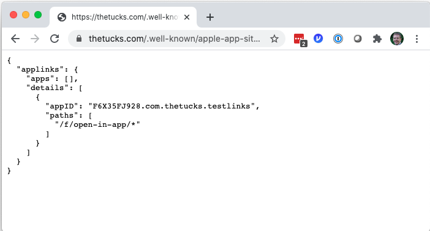

*Checking spec files*

Click the padlock symbol and check the certificate is valid and as expected. Repeat for the Android `assetlinks.json` file.

#### Using specific tracking domain(s) with Apache

The above simple instructions allow deep linking to work via your website's main `/.well-known` URL.

To get Android to [auto-verify](#auto-verify) your app's domains (skipping the user ["Ask" step](#forwarding-clicks-from-android-to-sparkpost-ask)), you need to serve spec files from your *specific* tracking domains, *while also forwarding* opens and clicks to SparkPost on that domain. Follow the steps in [this article](./using-proxy-https-tracking-domain), then modify the Apache patterns to look like this:


```apacheconf
#
# Reverse proxy for SparkPost engagement tracking, and enable specific files to show through
#
<VirtualHost _default_:80>
  ServerName yourtrackingdomain.example.com
  ProxyPass "/f/" "http://spgo.io/f/"
  ProxyPassReverse "/f/" "http://spgo.io/f/"
  ProxyPass "/q/" "http://spgo.io/q/"
  ProxyPassReverse "/q/" "http://spgo.io/q/"

  Alias "/.well-known" "/var/www/html/securetrack/.well-known"
</VirtualHost>

<VirtualHost _default_:443>
  ServerName yourtrackingdomain.example.com
  ProxyPass "/f/" "http://spgo.io/f/"
  ProxyPassReverse "/f/" "http://spgo.io/f/"
  ProxyPass "/q/" "http://spgo.io/q/"
  ProxyPassReverse "/q/" "http://spgo.io/q/"

  Alias "/.well-known" "/var/www/html/securetrack/.well-known"

  SSLEngine on
  SSLCertificateFile "/opt/apache2/conf/server.crt"
  SSLCertificateKeyFile "/opt/apache2/conf/server.key"
  SSLProxyEngine on
</VirtualHost>
```
The paths `/f/` and `/q/` are SparkPost tracked clicks and opens, respectively.

The spec files are made available under URL `https://yourtrackingdomain.example.com/.well-known/` from a specific directory using the `Alias` directive. If you want your files to be identical to your main website, then you can omit this step.

For completeness, the same routing is configured for HTTP on port 80, although mobile devices will request the spec files via HTTPS.

To check your files are served correctly and Android auto-verify is working - see [troubleshooting tips](#troubleshooting-tips).

---

### NGINX

1. Follow the steps in [this article](./using-proxy-https-tracking-domain) to set up your secure tracking domain.

1. Check where your NGINX root directory is, by running `nginx -V`. Look for the path shown after `--prefix=`, for example `--prefix=/usr/share/nginx` (and adjust the following example to suit). This should contain a directory named `html` which is used for your files.

1. Within this, create a directory `.well-known` if it doesn't already exist, and upload/create your spec files here. This will usually require root privilege on your server.

1. Add `location` blocks to your config to declare the spec files on your tracking domain, which will allow Android to [auto-verify](#android-testing-auto-verify). Here is a complete example, including the engagement-tracking `proxy-pass` block done in step 1.

    ```
    server {
        listen 80;
        listen 443 ssl http2;
        server_name     nginx-track.example.com;
        ssl_certificate /etc/letsencrypt/live/nginx-track.example.com/fullchain.pem;
        ssl_certificate_key /etc/letsencrypt/live/nginx-track.example.com/privkey.pem;

        # Security improvements - needed to get an "A" rating
        ssl_protocols TLSv1.2;
        ssl_prefer_server_ciphers on;
        ssl_ciphers ECDH+AESGCM:ECDH+AES256:ECDH+AES128:DH+3DES:!ADH:!AECDH:!MD5;

        # Serve the deep linking spec files using specific patterns
        location = /.well-known/apple-app-site-association {
            root /usr/share/nginx/html;
            default_type "application/json";
            }

        location = /.well-known/assetlinks.json {
        root /usr/share/nginx/html;
        default_type "application/json";
        }

        # pass all other requests through to SparkPost engagement tracking
        location / {
            proxy_pass      https://spgo.io;
            proxy_set_header X-Forwarded-For $remote_addr; # pass the client IP to the open & click tracker
            server_tokens off; # suppress NGINX giving version/OS information on error pages
        }
    }
    ```

    Note the security settings to use only newer TLS versions and disable weaker ciphers, to get an "A" rating on the [SSL Labs server test](https://www.ssllabs.com/ssltest/analyze.html). You may wish to adjust these to suit your own IT policy, e.g. to accept TLS v1.1 as well for compatibility with older email clients / web browsers.

1. Check your configuration is valid using `sudo nginx -t`. If no errors are reported, then reload using `sudo nginx -s reload`.

1. Check your files are served correctly and Android auto-verify is working - see [troubleshooting tips](#troubleshooting-tips).

---

### AWS CloudFront

> As described [here](#deep-linking-spec-files), it's easy to create spec files in your web site. The following steps are needed *only* if you are using a CDN for HTTPS tracking and therefore need to configure the spec files there.

First set up your secure tracking domain using CloudFront - instructions [here](./enabling-https-engagement-tracking-on-sparkpost/#step-by-step-guide-with-aws-cloudfront). This establishes your tracking domain routing and certificate in AWS. This section describes how to:

 * Create an S3 bucket for the spec files;
 * Set up our CloudFront distribution to selectively serve requests on our tracking domain from the bucket;
 * Test the files are served correctly on the specific tracking domain;
 * Ensure our app domain association matches our tracking domain.

With CloudFront we are working with the specific sub-domain used for link tracking. It's therefore an alternative to updating your main website's `.well-known` directory.

#### Create S3 bucket

1. On [AWS S3](https://s3.console.aws.amazon.com/s3/), create a new bucket if you don't already have a bucket for your website. Give it a name, and choose region.

    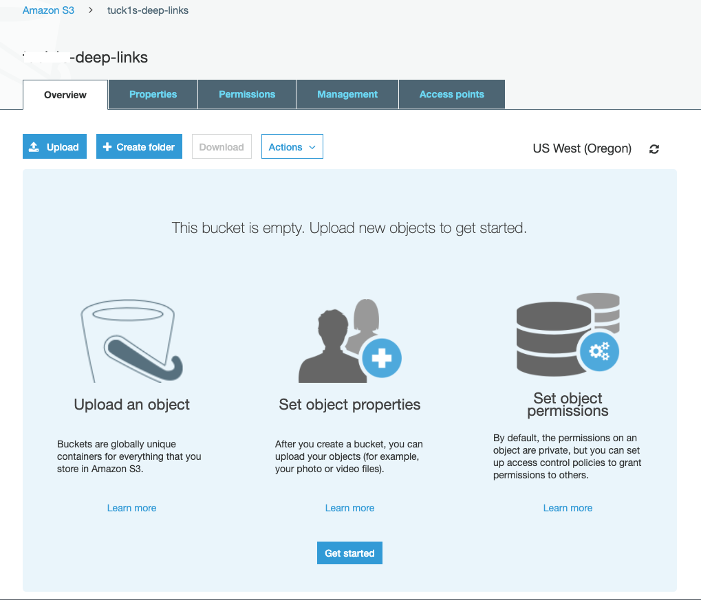

    * Step 2, "Configure options", you can leave these options unset.

    * Step 3, "Set permissions", leave this at default ("Block all") for now.

    * Step 4, "Review", choose "Create bucket". This returns you to the S3 console.

1. On your bucket permissions tab, select Edit, then uncheck "block all public access" and select "Save", then "confirm". Refer to [AWS documentation](https://docs.aws.amazon.com/AmazonS3/latest/dev/WebsiteAccessPermissionsReqd.html) if needed.

    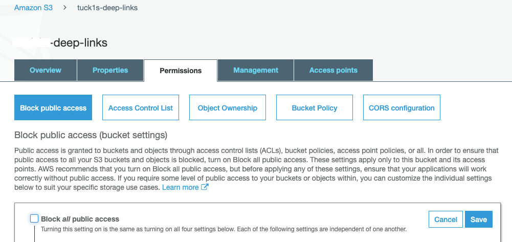

    > Note: you don't need to create a Bucket Policy at this stage, because CloudFront creates a specific policy for you in the next step.

    > There is also no need to enable "Static website hosting", as CloudFront will selectively match specified URL path patterns to serve your files.

1. Select your bucket. If you don't already have a folder named `.well-known`, then create it.

    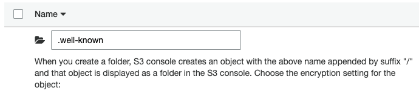

    Leave security settings at "None (Use bucket settings)" and select Save.

1. Select your folder, then select "Upload". Drag and drop in your spec files.

    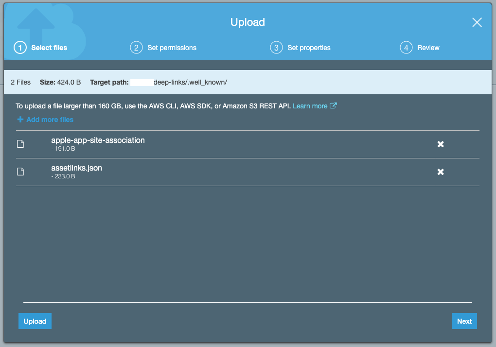

    Select Next. Leave access permissions for your user ID at their defaults, and select Next.

    Choose "Standard" storage class and select Next. After review, complete the upload.

    You should now have two files in your bucket.

    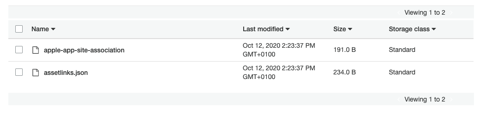

1. Select both files via the check-boxes. Under the "Actions" drop-down menu, select "Change metadata". Under "Select a key", choose `Content-Type`, and type in the value `application-json`. Select "Save" then "Change".

    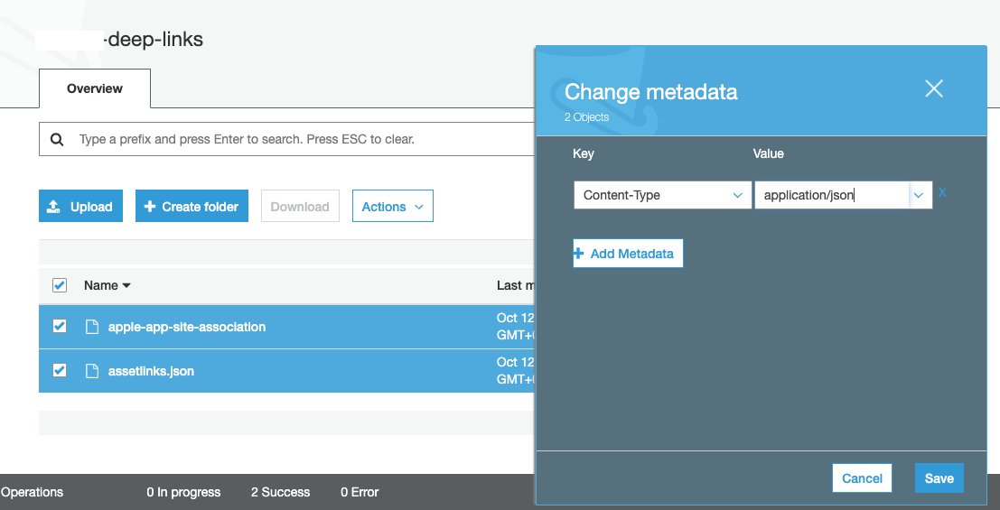

    Your files are now uploaded in S3.

#### Set up AWS CloudFront to serve your spec files

1. On [AWS CloudFront](https://console.aws.amazon.com/cloudfront/home), under "Origins and Origin Groups", select "Create Origin".

    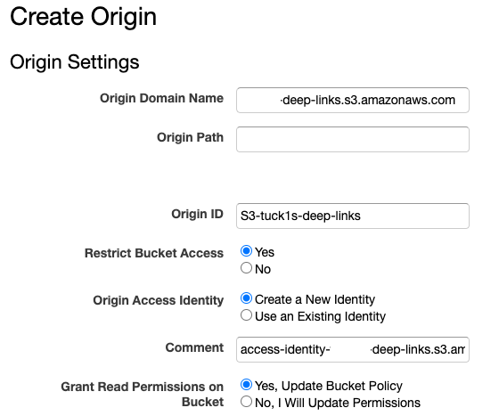

    * In Origin Domain Name, start typing the name of your S3 bucket, then choose it from the drop-down list presented.

    * Leave Origin Path blank, as we have created the S3 bucket with the correct folder-name to fit the incoming path already.

    * On Origin Access Identity, choose "Create a New Identity" if you don't have one already.

    * On Grant Read Permissions on Bucket, choose "Yes, Update Bucket Policy".

    * Leave the other settings at defaults. Scroll down and select "Create".

1. Set up which URL paths will be forwarded by CloudFront to the files in your bucket.

    Select your distribution by clicking on its name. Select the "Behaviors" tab and then "Create Behavior".

    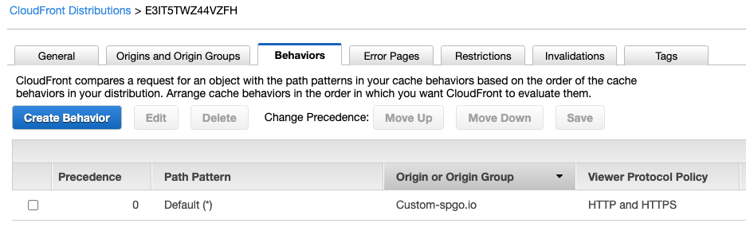

    * In Path Pattern, type `.well-known/*`

        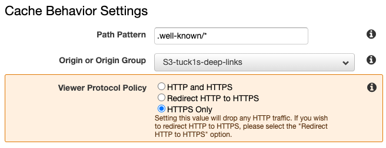

    * In Origin or Origin Group, select your S3 bucket from the drop-down list.

    * In Viewer Protocol Policy, select "HTTPS Only" (as mobile devices will always request using HTTPS).

    * Leave the remaining settings at default. At the bottom of the page, select "Create".

    * Back on the CloudFront Behaviors list view, you should see your new rule has been created.

1. Return to the CloudFront Distributions list, you should see Status "In Progress" as the distribution is deployed.

    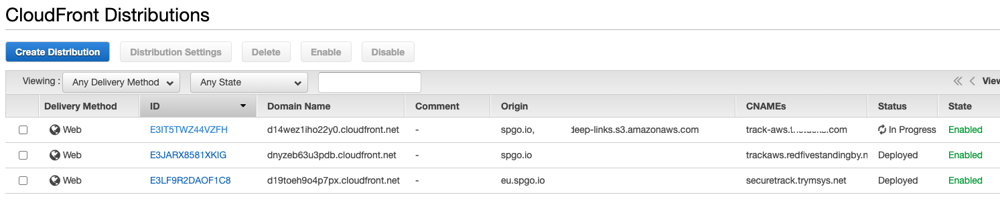

1. Check your S3 bucket configuration is secure using [this tool](https://console.aws.amazon.com/trustedadvisor/home?#/category/security).

1. To check your files are served correctly and Android auto-verify is working, see [troubleshooting tips](#troubleshooting-tips).

---

### CloudFlare

> As described [here](#deep-linking-spec-files), it's easy to create spec files in your web site. The following steps are needed *only* if you are using a CDN for HTTPS tracking and therefore need to configure the spec files there.

> Unlike AWS CloudFront, you need to already have the spec files (`apple-app-site-association` and `assetlinks.json`) hosted elsewhere, such as on a web server. When your clients request *`yourtracking.domain.com/.well-known/*`*, CloudFlare responds with a `301` "moved permanently" redirect to your files. We have found this can work, but it's not recommended by [Apple](https://developer.apple.com/library/archive/documentation/General/Conceptual/AppSearch/UniversalLinks.html) or [Google](https://developer.android.com/training/app-links/verify-site-associations). It prevents Android [auto-verifying](#android-testing-auto-verify) your app.

1. In your CloudFlare dashboard, an additional page rule is necessary to serve the spec files.

    * Page Rules Tab -> Create Page Rule

        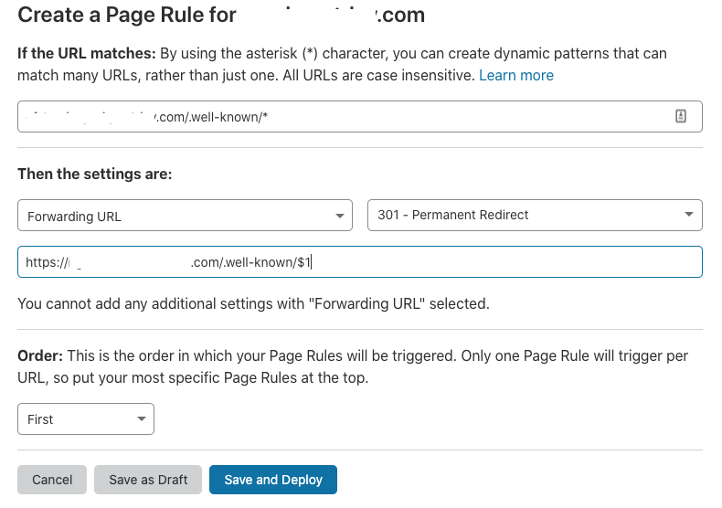

    * Enter your domain without the https prefix, like so: `track.yourdomain.com/.well-known/*`

    * Add a Setting -> Forwarding URL (specify a 301 redirect option)

    * Destination URL is determined by where the spec files are hosted.  The destination URL should be configured as `https://<DEEP_LINK_DESTINATION>/.well-known/$1`. (The `$1` placeholder contains the file name matched by the `*` in the domain rule.)

    * CloudFlare page rules are evaluated in priority order.  Set this page rule to be first, with the page rules for forwarding to SparkPost Engagement Tracking afterwards.

1. Your rules should now look like this.

    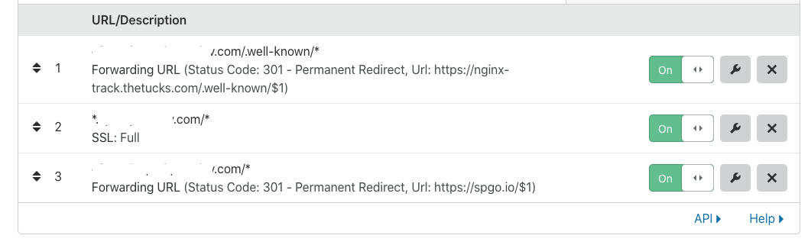

1. To check your files are served correctly - see [troubleshooting tips](#troubleshooting-tips).

---

### Fastly

> As described [here](#deep-linking-spec-files), it's easy to create spec files in your web site. The following steps are needed *only* if you are using a CDN for HTTPS tracking and therefore need to configure the spec files there.

> Unlike AWS CloudFront, you need to already have the spec files (`apple-app-site-association` and `assetlinks.json`) hosted elsewhere, such as on a web server. Fastly can serve requests for these files without sending the client a `301` "moved permanently" redirect, so it supports Android [auto-verifying](#in-androidmanifest-xml-you-can-set-your-domain-intent-filter-to-autoverify-to-favor-opening-your-app-instead-of-asking-the-user-see-here-https-developer-android-com-training-app-links-verify-site-associations) your app.

1. Set up your secure tracking domain - instructions [here](./enabling-https-engagement-tracking-on-sparkpost/#step-by-step-guide-with-fastly). This establishes your tracking domain routing and certificate in Fastly.

1. "Clone" your current configuration. This gives a draft config to edit. The version number increments, while your previous version continues to be active.

    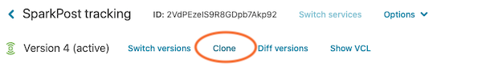

    The following steps should be done on your new draft config.

1. Select Origins / Hosts, then Create a Host.

    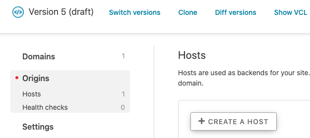

    Enter the address of your website where the spec files will be served. Use the pencil "edit" icon to give your host a meaningful name.

1. Select "Attach a condition", give this a name, such as "well-known". In the "Apply if ..." box, enter the following. The `~` applies a Perl-like regular-expression match on the incoming URL path.

    ```perl
    req.url ~ "^/\.well-known/.*"
    ```

      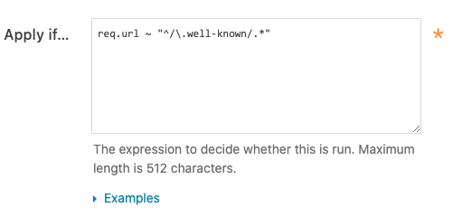

    Leave the priority settings as default.

1. Your host settings should now look like this.

    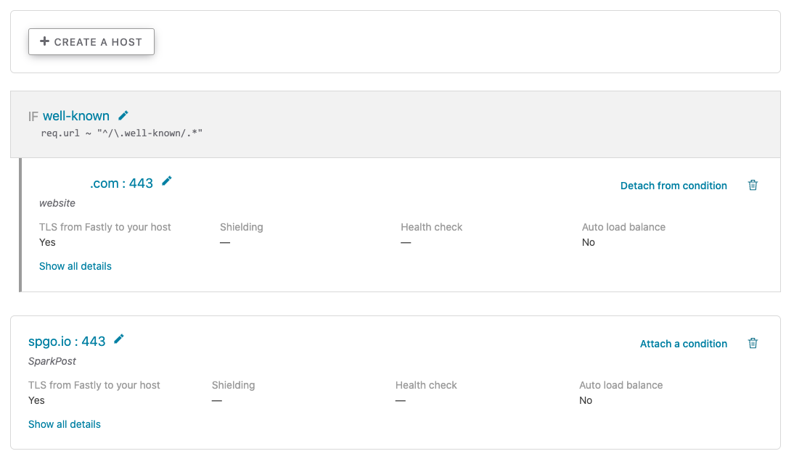

1. Select "Activate" to make your new configuration live.

1. Check your files are served correctly - see [troubleshooting tips](#troubleshooting-tips).

#### Background info: VCL, Fastly boilerplate and "Fiddle"

Fastly is based on [Varnish](https://en.wikipedia.org/wiki/Varnish_(software)) HTTP accelerator, and uses Perl-like [Varnish Configuration Language (VCL)](https://docs.fastly.com/en/guides/guide-to-vcl) to configure forwarding rules. Your entire configuration is a VCL file, which you can view using the "Show VCL" option. The condition you created appears in a section called

```perl
sub vcl_recv {

}
```

For more advanced VCL capabilities, start with the ["boilerplate" code](https://developer.fastly.com/learning/vcl/using/). Edit, then upload it back.

You can also prototype VCL separately from your main configuration, using the online [Fastly Fiddle](https://fiddle.fastlydemo.net/) tool; see [this article](https://www.fastly.com/blog/testing-new-ideas-fastly-fiddle). You enter the origin servers, custom VCL code and test requests.

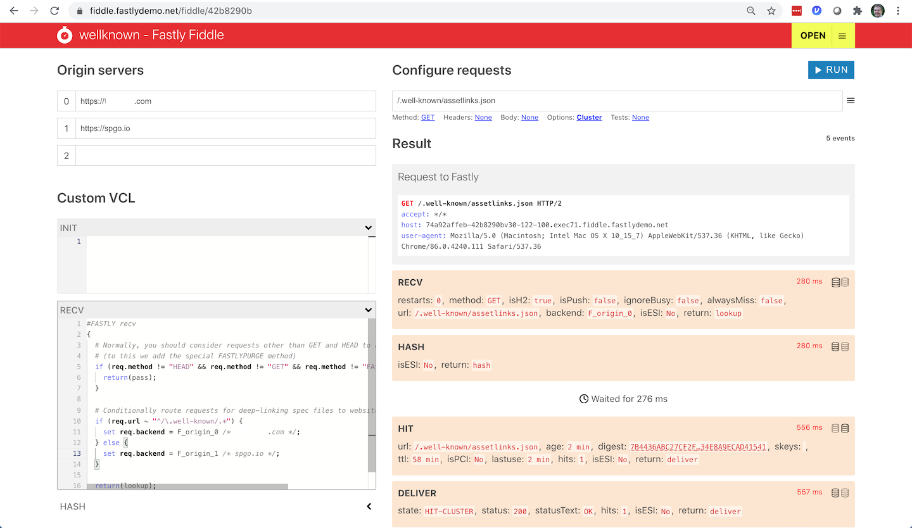

When you run the request, the forwarding decision and result is shown; in this case, fetching the Apple spec file from an Apache server.

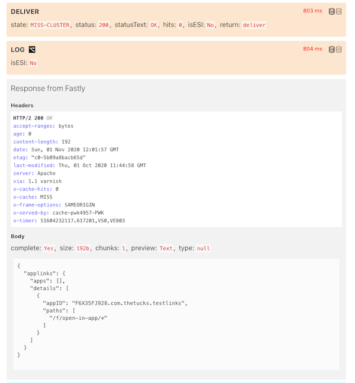

Likewise, if you run a request for a tracked link from a test email sent through your SparkPost account (with a path starting `/f/`), you should see your VCL code forward the request to SparkPost.

---

### Google Cloud Platform

Like AWS CloudFront, you can host the [spec files](#deep-linking-spec-files) (`apple-app-site-association` and `assetlinks.json`) directly on [Google Cloud Platform](https://cloud.google.com/) (GCP) as well as handling HTTPS tracking.

First, set up your secure tracking domain - instructions [here](./enabling-https-engagement-tracking-on-sparkpost/#step-by-step-guide-with-google-cloud-platform). This establishes your tracking domain routing via a GCP ["external" HTTPS load-balancer](https://cloud.google.com/load-balancing/docs/https) with a valid certificate for your domain, and a default routing rule to forward all incoming requests to SparkPost.

1. From the top menu, select your existing project. On the main menu, top left, select "Network Services" then "Load balancing". You can pin the "Network Services" menu for easy access later.

    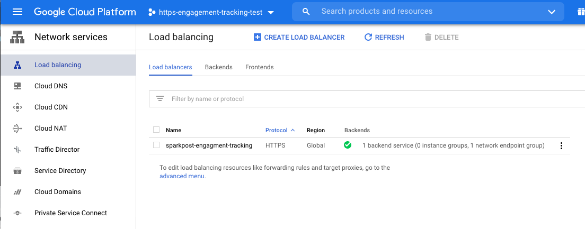

    You will see your named load-balancer.

    * Click the three dots menu on the right, and select "Edit".

      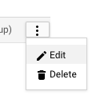

    * <a href="create-gcp-bucket"></a>Select "Backend configuration", then "Create a Backend Bucket".

      

    * Give your backend bucket a name.

      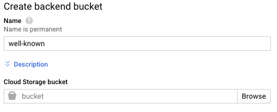

    * Select "Browse". If you don't have a storage bucket yet, select "New bucket".

      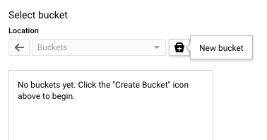

    * Give your storage bucket a name, which must be globally unique (according to Google's naming guidelines in the linked article). It states the bucket names are *publicly visible* to other GCP users.

      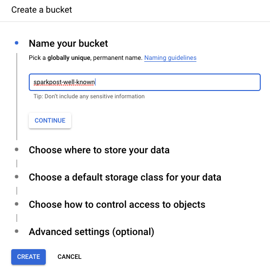

    * Unless you are planning to make frequent changes to your spec files, enable Cloud CDN and select the "Cache static content (recommended)" option.

      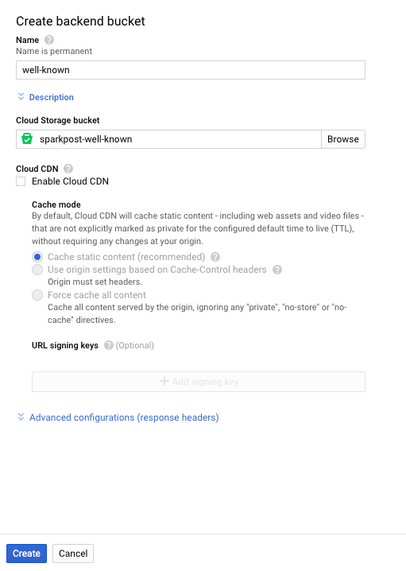

    * Select Create to set up the (empty) bucket associated with your load-balancer.

1. Upload spec files to the bucket. On the main menu, top left, select "Storage" then "Browser". (You can pin the "Storage" menu for easy access.)

    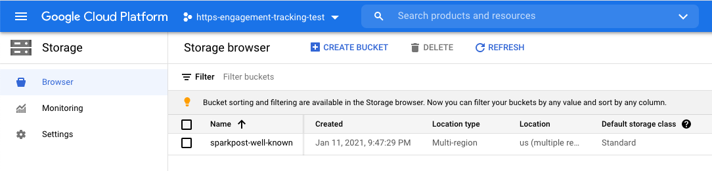

    Click on your named bucket.

    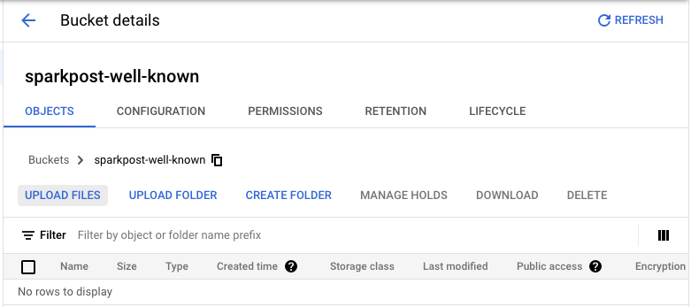

    Select "Create Folder" and give this the name `.well-known`.

    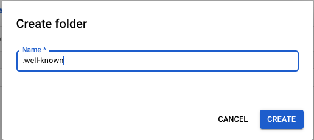

    Click on this folder. Upload your spec files to the bucket. It should now look like this.

    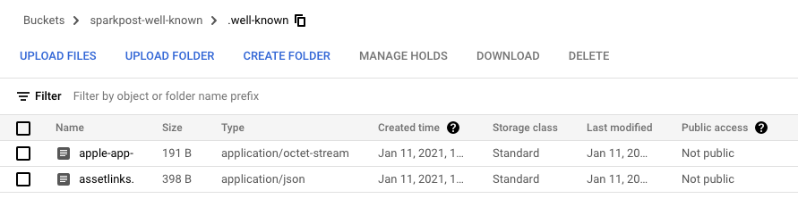

1. Configure the bucket to be public.

    Here we make the entire bucket readable, rather than setting individual file access-controls. For more information on access controls, refer to [this article](https://cloud.google.com/storage/docs/access-control/making-data-public).

    Return to the bucket details page, and select the "Permissions" tab. The bucket is not yet public, it's "subject to object ACLs".

    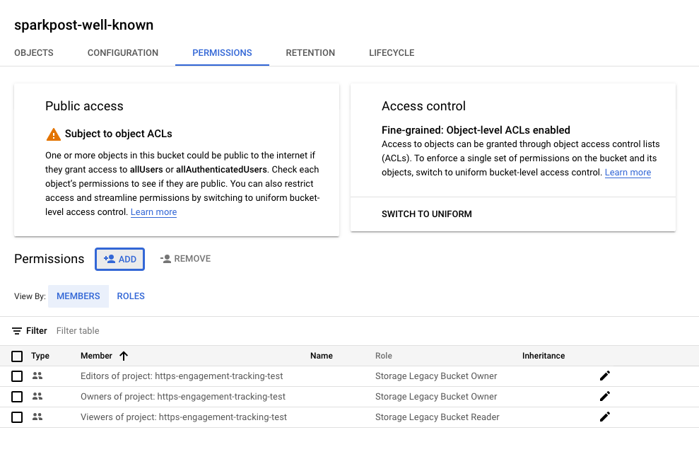

    * Select the "+ ADD" button.

      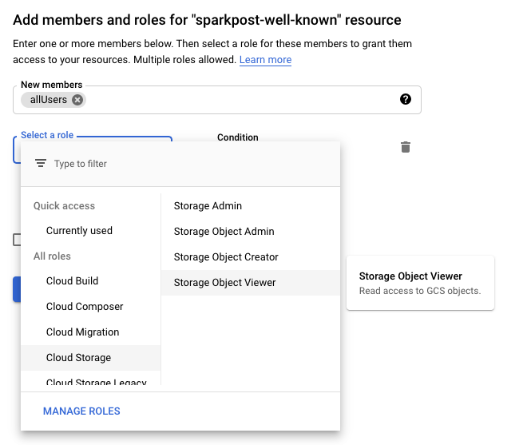

    * In the "New members" field, enter `allUsers`.

    * In the "Select a role" drop down, select the "Cloud Storage" sub-menu, and click the "Storage Object Viewer" option.

    * Click **Save**. You will see the following warning. Select "Allow public access".

      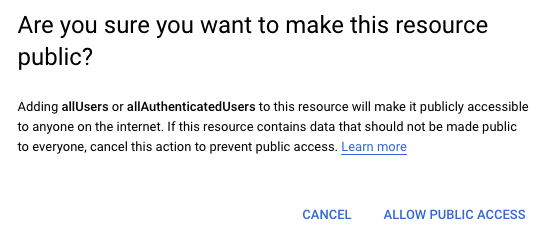

    * Return to the Bucket Details screen, and select the "Objects" tab. You will see both your files are now public, and have a specific URL.

      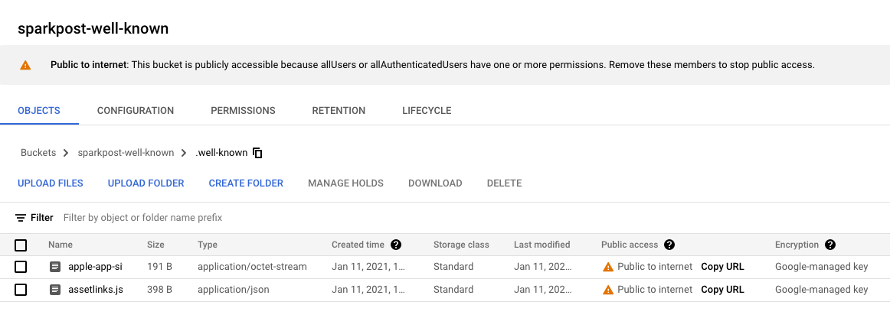

      > This is *not* your tracking-domain URL; it's the address of the bucket. (You can, if you wish, check the files are public by clicking on "Copy URL", then paste the address into your browser which should open/download the file.)

1. Update the Apple file MIME type.

   Note that the Apple file, by default, has MIME type `application/octet-stream`. It's [recommended](https://branch.io/resources/aasa-validator/) to change this to `application/json`.

    * Select the three dots menu on the right of this file, and select "Edit metadata".

      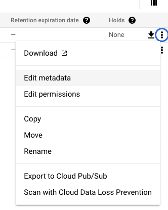

    * Edit the object metadata to set the content type.

      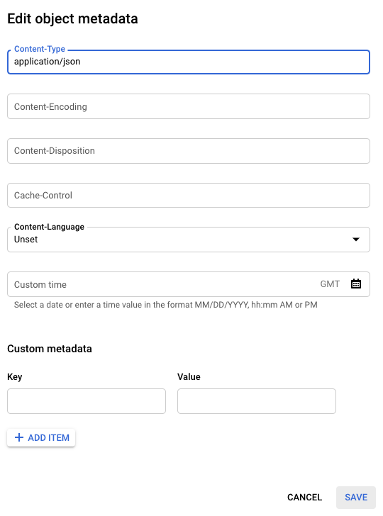

    * Click Save.

1. Set up load-balancer routing rules with the path to your backend bucket.

    On the main menu, top left, select "Network Services" then "Load balancing". Select "Edit", then "Backend configuration". You should see your backend service (that forwards to SparkPost) and your backend bucket. If you don't see it, ensure you followed [these steps](create-gcp-bucket) correctly.

    


    * Select "Host and path rules" from the menu. Create a rule which routes the spec file URL requests to your bucket.

      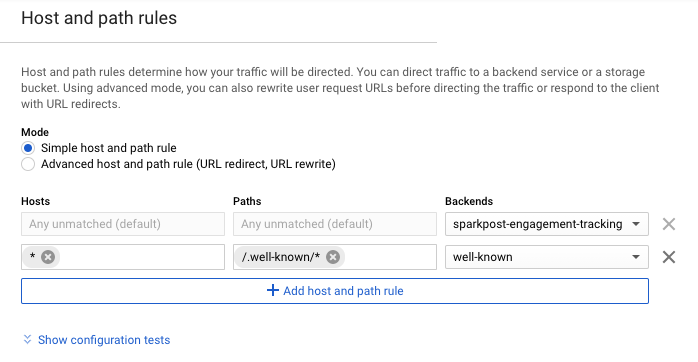

      * Hosts: enter `*`
      * Paths: enter `/.well-known/*`
      * Backends: choose your named backend bucket

    * Select "Update".

    * Use the blue arrow button (top left) to return to the load balancer details view, which should look like this.

      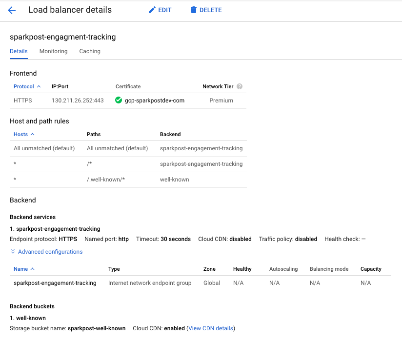

      Note that GCP generated the Hosts `*`  Paths `/*` rule automatically.

1. Check your files are served correctly - see [troubleshooting tips](#troubleshooting-tips).

---

### Microsoft Azure

Like AWS CloudFront, you can host the [spec files](#deep-linking-spec-files) (`apple-app-site-association` and `assetlinks.json`) directly on [Microsoft Azure](https://azure.microsoft.com/) as well as handling HTTPS tracking.

First, set up your secure tracking domain - instructions [here](./enabling-https-engagement-tracking-on-sparkpost/#step-by-step-guide-with-microsoft-azure). This establishes your tracking domain routing via an [Azure Front Door](https://docs.microsoft.com/en-us/azure/frontdoor/front-door-overview) with a valid certificate for your domain, and a default routing rule to forward all incoming requests to SparkPost.

The following instructions follow parts of [this tutorial on hosting a static website on Blob Storage](https://docs.microsoft.com/en-us/azure/storage/blobs/storage-blob-static-website-host), serving only the deep linking spec files rather than a full website.

1. Create a storage account. In the Azure Portal, browse to "Storage accounts". Select "New". Select the resource group that already contains your Front Door service.

    * Give your Storage account a name.
    * Select the location to be the same as your Front Door.
    * Leave other settings at defaults.

        

    * Select "Next: networking".
    * Leave all these settings at defaults, i.e. "Public endpoint" and "Microsoft network routing".

        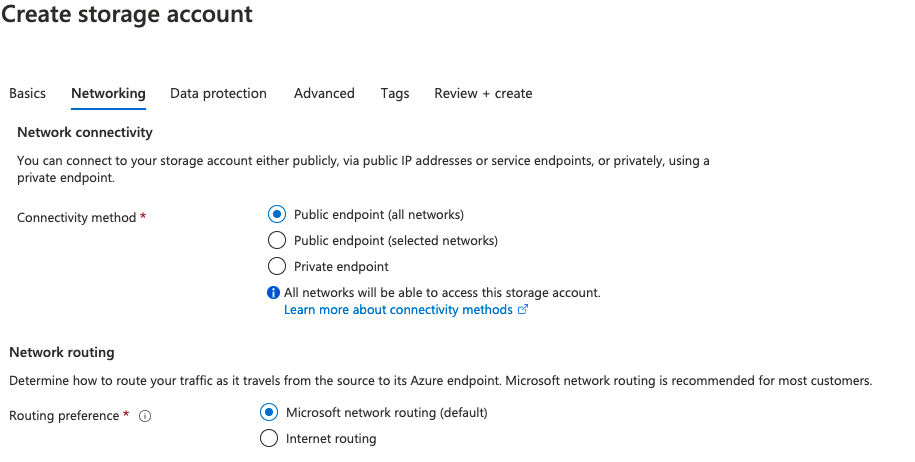

    * Select "Next: Data protection".
    * Leave all these settings at defaults.

        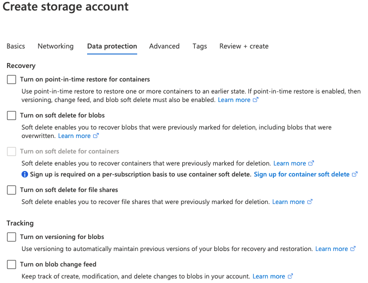

    * Select "Next: Advanced".
    * Leave all these settings at defaults:
        * Minimum TLS version of 1.2
        * Allow Blob public access must be Enabled.

        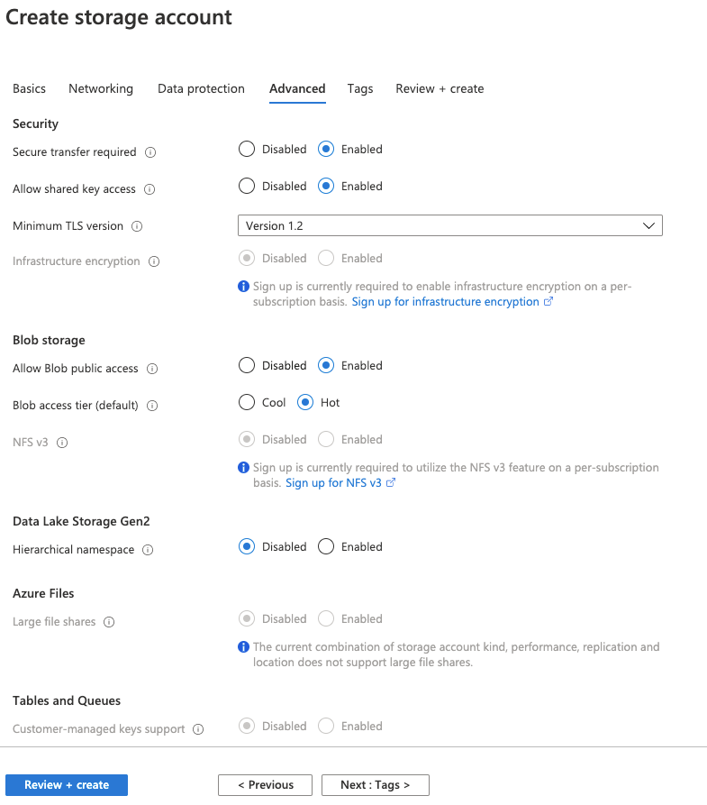

    * Select "Next: Tags", you can leave this blank.

        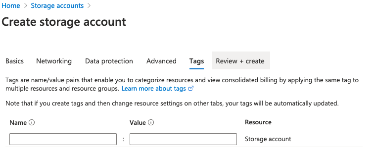

    * Select "Next: Review+Create".

        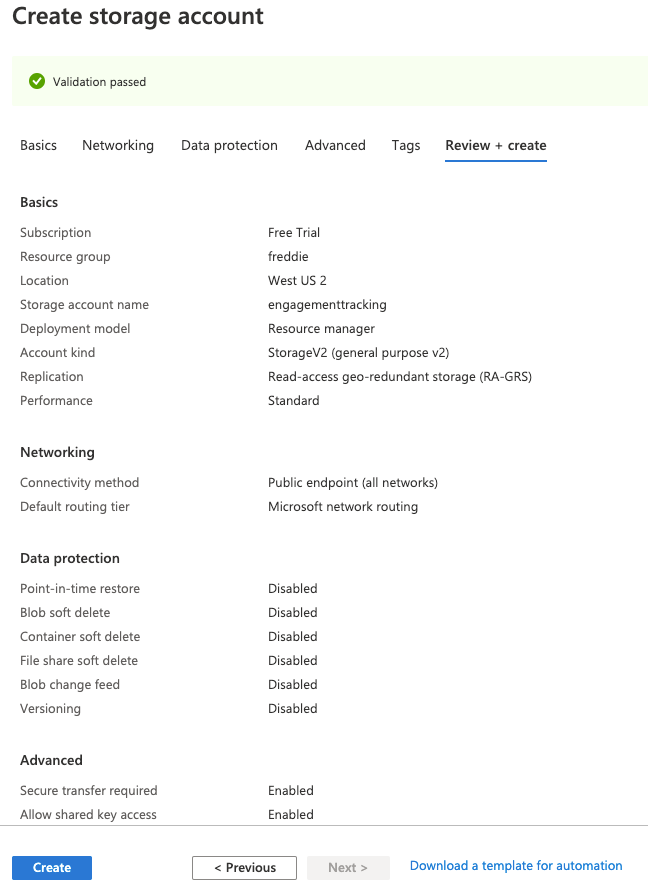

    * Select "Create".
    * After a few moments, you should see the deployment is in progress, and then is complete.

        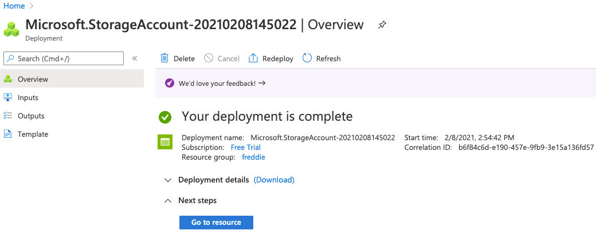

    * You should see a link to download and install a desktop tool, [Azure Storage Explorer](https://azure.microsoft.com/en-us/features/storage-explorer/). While you can do some storage tasks in the portal, some  tasks, such as setting the file `Content-Type` manually on the iOS spec file, appear to require it. We found it's generally easier to work with files via the tool.

        

1. Configure your storage to serve a static website. In the portal, browse to your storage account. Under Settings, select "Static website".

    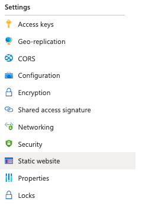

    * Change the setting to "Enabled".
    * You can leave "Index document name" and "Error document path" blank.
    * Take note of the Primary and Secondary endpoint addresses; these are needed later for backend configuration.

    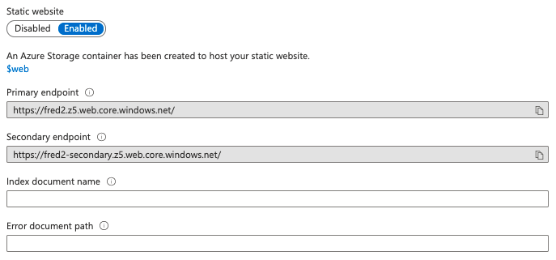

1. Open Azure Storage Explorer and browse to your container.

    * You should find that two containers are now present, called `$logs` and `$web`. Select `$web`.

      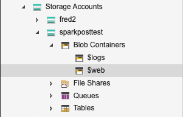


    * Using the "New Folder" item in the top menu, create a directory named `.well-known`.

       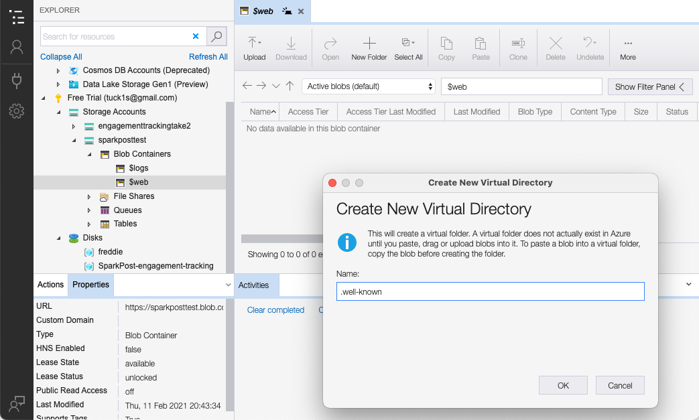

    * Note that not much seems to happen! However the address bar changes to show you're in the directory.

       

    * Using the "Upload files" option (or by dragging and dropping the file across), create your files.

       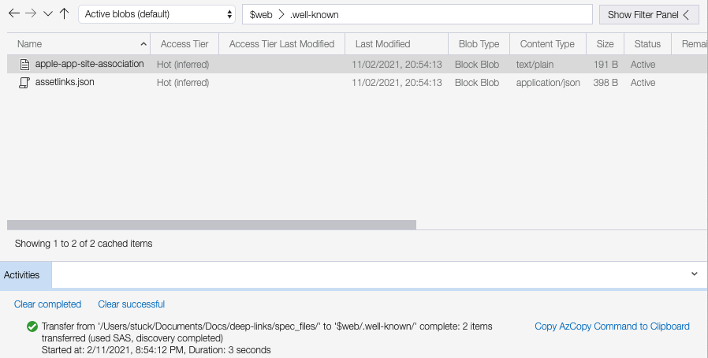

    * Note that the Apple file has default Content-Type of `text/plain`, because it has no file extension. Change this by right-clicking the file, selecting "Properties", and change it to `application/json`.

       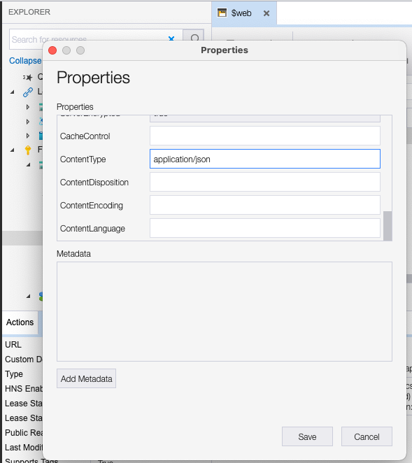

    * Enable public access by right-clicking the `$web` container, select "Set Public Access Level..".

        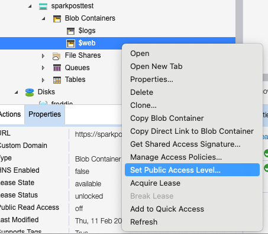

    * Set this to "Public read access for blobs only".

        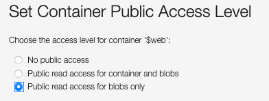

    * Once this has taken effect, check you can view your files via the static site address noted earlier (which will be of the form _your_name.xx.web.core.windows.net_) plus the `.well-known` path to the file. You can do this on the command-line with `curl`, or use a browser, for example:

        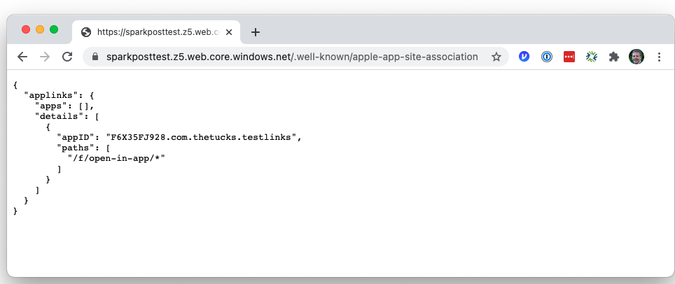

1. Configure Azure Front door back end route to your storage. In the portal, navigate to your Front Door instance.

    * Select the "+" option for "Backend pools" to create a new backend pool.

       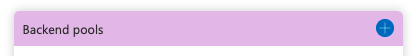

    * Name the pool, for example "well-known".

       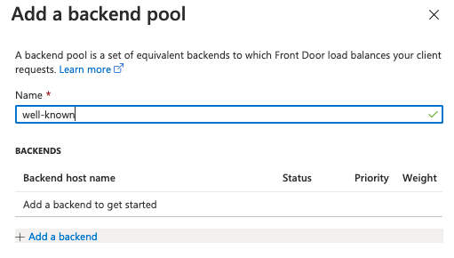

    * Select "Add a backend".
    * For "Backend host type", choose "custom host".
    * Paste in the primary container address you noted earlier. This will update the "Backend host header" entry as well.
    * Leave other settings at defaults.
    * Select "Add".

       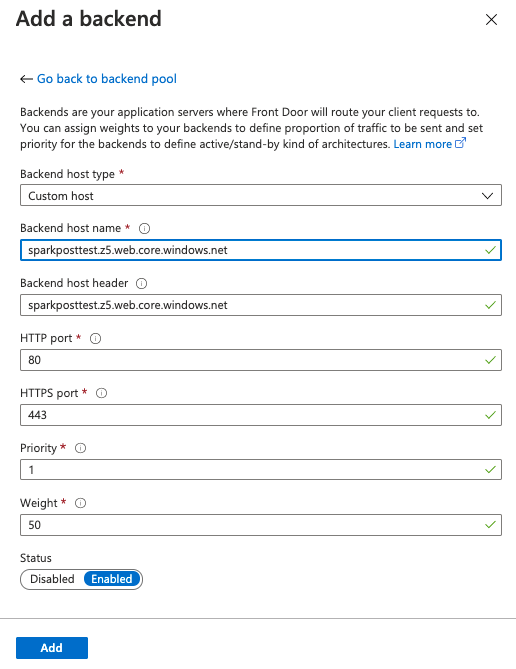

    * Select "Add a backend" again.For "Backend host type", choose "custom host".
    * Paste in the *secondary* container address you noted earlier. This will update the "Backend host header" entry as well.
    * Leave other settings at defaults.  Select "Add".

    * On the top menu, click "Save" to apply.

       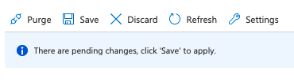

    * After a few seconds, your Front Door will be updated. Click on your backend pool name, it will show the primary and secondary backend hosts,  enabled and with status showing a green check-mark.

       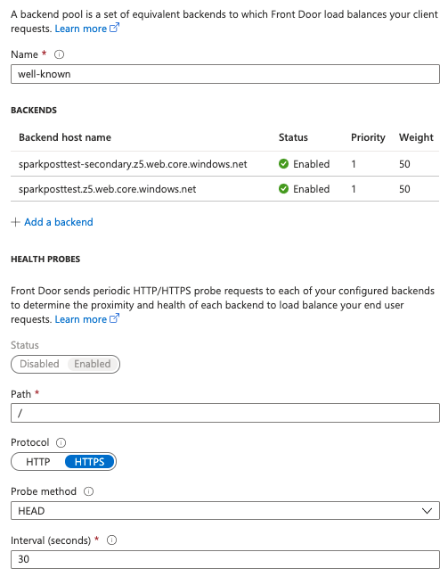

        > Note: while the Front Door Designer "Backend Pools" configuration screen offers a "Backend host type" of "Storage", with corresponding automatic drop-down selection of your storage container, we were unable to make this serve files via Front Door as expected; instead giving a 400 error _"One of the request inputs is out of range"_ response to the HTTPS request. Our approach is based on [this article](https://marcelzehner.ch/2020/04/13/mastering-azure-front-door/).

1. Configure Azure Front Door routing rule to your new backend pool.

    * Select the "+" option for "Routing rules" to create a new routing rule

       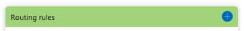

    * Name the pool, for example "well-known".
    * Leave "Accepted protocol" at default "HTTP and HTTPS",
    * On "Frontends/Domains", ensure your custom tracking domain is selected. You could leave the "my_name.azurefd.net" also enabled, or disable it as you wish. Here we select only our custom tracking domain to be active.

       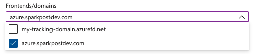

    * On "Patterns to match", type `./well-known/*` and delete the default `/*` rule.
    * On "Route details", leave "Route type" set to the default "Forward".
    * On Backend pool", choose your new pool (in this case, named "well-known").
    * Leave "Forwarding Protocol" set to the default "HTTPS Only".
    * Leave "URL rewrite" set to the default "Disabled".
    * Select "Add".

       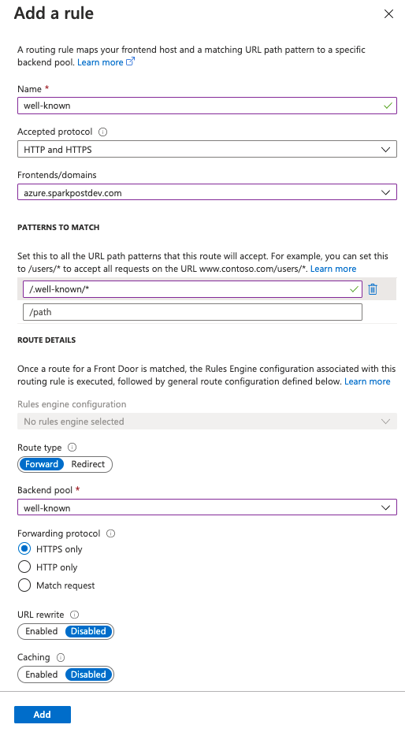

    * On the top menu, click "Save" to apply.

       

    * On the Activity Log, you can see the changes propagate. We found that it can take around 5 minutes before the files are served externally.

1. Check your files are served correctly - see [troubleshooting tips](#troubleshooting-tips).

1. Optional step: block access to your files via the direct static website URLs, i.e. access only via your custom tracking domain Front Door address.

    * In the portal, view your Storage Account. On the left side, under Settings, select "Networking".

       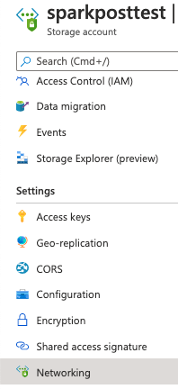

    * In the portal, view your Storage Account. On the left side, under Settings, select "Networking".
    * Under Firewalls and Virtual Networks, select "Allow Access from Selected Networks".
    * Add the IP address range for the Azure Front Door service, which is `147.243.0.0/16` - see [here](https://github.com/MicrosoftDocs/azure-docs/issues/40845#issuecomment-542665873).
    * Your can check the box to also permit access directly your own client IP address.
    * At the top of the page, select "Save".

       

1. Optional step: enable Front Door cache for your spec files. This is best done once your spec file contents are known stable.

    * In the portal, navigate to your Front Door. Select Front Door Designer. Select your existing routing rule "well-known".
    * Scroll down to the "Caching" setting and select "Enabled".
    * The other settings can be left at defaults.

       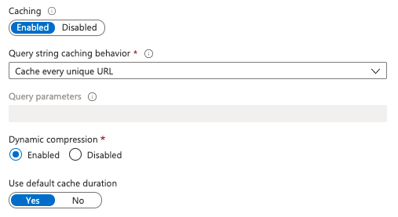

    * Select Update.
    * At the top of the page, Select Save.

---

## Alternative setup with deep linking platforms

If you are using a deep linking platform such as [Branch](https://branch.io/) or [AppsFlyer](https://www.appsflyer.com/), these platforms automate some of the setup process for you, while also working in a specific way.

### Branch

Branch is a mobile linking platform powering deep links and mobile attribution, supporting web and other clients as well as iOS and Android. It provides an SDK which you need to include into your app - see [here](https://help.branch.io/developers-hub) for specific steps for the platforms you're using.

[Universal Email overview](https://help.branch.io/using-branch/docs/branch-universal-email) is an introduction to the how Branch handles links in email.

Branch has built-in integrations for many email service provider setups including SparkPost, Braze + SparkPost, BlueShift + SparkPost, listed [here](https://help.branch.io/using-branch/docs/email-partners-list). Each of these follow the same standard [Universal Email Integration Guide](https://help.branch.io/using-branch/docs/universal-email-integration-guide).


Branch can host your secure Click Tracking Domain (CTD) and spec files, with a certificate for HTTPS access. However Branch also has specific deep linking features:

* Branch creates the spec files (`apple-app-link-association`,  `assetlinks.json`) via configuration in your account, and hosts them on your click tracking domain(s) automatically.
* Your app should include and use the Branch SDK to accept incoming click events and resolve links for your app, rather than native code.

Branch also has a special link format, which can be used for testing with your app prior to testing with tracked email links. You choose a unique name for your `app.link`. This name differs from your email Click Tracking Domain, and is specific to your Branch account.

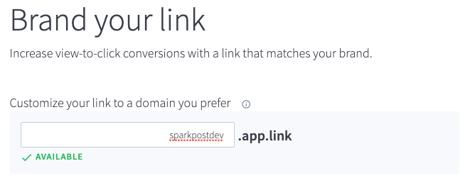

Here are the steps to get your app running with Branch and SparkPost. Your source of help during this process is the Branch online documentation and support system. The first steps are independent of email provider, and are done with your Branch account, code development environment, and Branch SDK.

1. Download and integrate the Branch SDK into your apps ([iOS](https://help.branch.io/developers-hub/docs/ios-sdk-overview), [Android](https://help.branch.io/developers-hub/docs/android-sdk-overview)). Ensure your app has the expected code for receiving incoming events from the Branch SDK. Ensure your app is configured with your Branch account settings. Ensure your Branch account is configured with your app ID & Bundle ID.
1. Create a test message containing your `xyz.app.link` on your test device (e.g. using iMessage or email) and check that your app opens and receives the event.  It may be helpful to print received event parameters to the console during development.

1. Follow the Branch [Universal Email Integration Guide](https://help.branch.io/using-branch/docs/universal-email-integration-guide) to set up your Click Tracking Domain(s) in the Branch dashboard.

    This example shows the standard SparkPost US endpoint address. Be sure to use the address for your SparkPost account region and type, see [here](./enabling-https-engagement-tracking-on-sparkpost/#sparkpost-tracking-endpoints).

    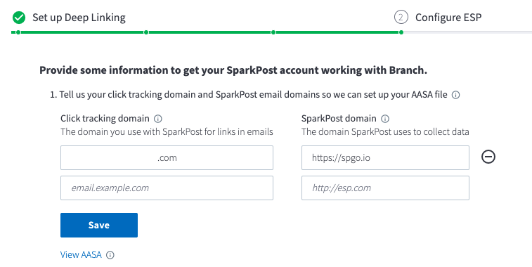

1. The guide directs you to "Point DNS CNAME to Branch". Once this is done, follow the steps [here](./enabling-https-engagement-tracking-on-sparkpost/#switch-tracking-domain-to-secure-and-validate) to set your tracking domain in SparkPost to Secure mode and verify, if not verified already.

1. You can now send email using the Branch-hosted Click Tracking Domain for your links. These should open as usual on a desktop browser, and open your app on mobile devices.

The Branch dashboard shows the status of your email integration.

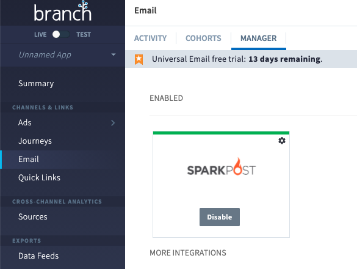

Clicking the gearwheel shows:

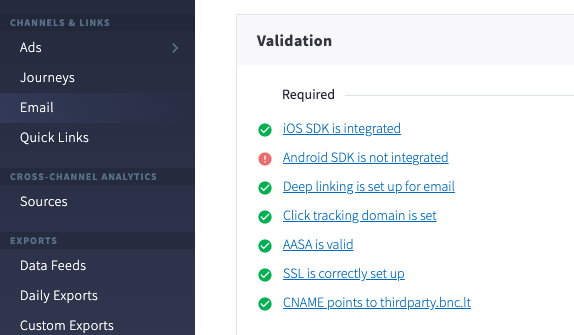

The [troubleshooting](#troubleshooting-tips) tips below can also be used. For example, you can check your spec files are present on your Click Tracking Domain, and check your tracked links are resolving through Branch to SparkPost's endpoint.


### AppsFlyer

AppsFlyer supports [deep links](https://www.appsflyer.com/product/one-link-deep-linking/) from web-to-app, email, and social sources, with built-in integrations for many [email service provider setups](https://support.appsflyer.com/hc/en-us/articles/360004556077-ESPs-Email-service-providers-explained).


- Include the [AppsFlyer SDK](https://support.appsflyer.com/hc/en-us/categories/201114756-SDK-integration-) into your app. Your source of help during this process is the AppsFlyer online documentation and support system.

- For email integration, follow these [step by step instructions](https://support.appsflyer.com/hc/en-us/articles/360014381317) for SparkPost. AppsFlyer supports [Braze+SparkPost](https://support.appsflyer.com/hc/en-us/articles/360001437497-Braze) in the same way.

Complete the steps [here](./enabling-https-engagement-tracking-on-sparkpost/#switch-tracking-domain-to-secure-and-validate) to set your tracking domain in SparkPost to Secure mode and verify, if not verified already.

## Troubleshooting tips

### Check your spec files

You can check your spec files are correctly published and available on the Internet, using `curl` or a web browser. Be sure to specify `https`.

```bash
curl https://your-tracking-domain-here/.well-known/apple-app-site-association

curl https://your-tracking-domain-here/.well-known/assetlinks.json
```

> Note: If your tracking sub-domain does not have spec file(s), mobile devices will also look on the root domain for files in the `/.well-known` directory. This is shown in the above simple [Apache example](#apache).

### Check your tracked links

You can view your encoded links using Gmail, by selecting the three dots menu top-right, then "Show Original". Check the domain is as expected, and the `<A HREF ..` links are using HTTPS. Check that clicking the link takes you to the expected landing page.

You can then use `curl` to request the tracked link, with the `-v` option to see the details of the tracked link request and response; see [here](./enabling-https-engagement-tracking-on-sparkpost#troubleshooting-tips).

### Check your app matches your tracking domain

The domains entitlement in your app(s) must match your tracking domain. This can be done specifically, or (with Apple) a wildcard matching sub-domain. Refer to
* [Apple](#ios-example-apple-app-site-association) configuration
* [Android](android-spec-file) configuration


### Android: testing auto-verify

Getting your app to auto-verify requires the `assetlinks.json` file to be available on your _specific_ tracking domain rather than relying on the organizational domain (main website).

To test auto-verify works for your domain(s), start with a fresh install of your app, as mentioned in [this article](https://levelup.gitconnected.com/the-wrong-hacked-and-correct-way-of-android-deep-linking-for-redirected-multisite-with-autoverify-5c72fb1f8053), because Android remembers the user's choice.

If you are getting the ["ask" prompt](#forwarding-clicks-from-android-to-sparkpost-ask) to choose which application opens the link, you can use the `adb` debugger to investigate the status of your app. If the Status is shown as `ask` then auto-verify is not working as intended. The value `always : 200000000` means it is verified.

```bash
$ adb reconnect
reconnecting emulator-5554 [device]

$ adb shell dumpsys package d
App verification status:
:
:
  Package: com.example.testlinks
  Domains: track.mydomain.com track2.mydomain.com
  Status:  always : 200000000
```

If your app has more than one associated domain, the status will be "`ask`" if _any_ of them fail to auto-verify. You can use `adb` to check your setup from Android Studio without having to delete/reinstall. For more information on using the `adb` debugger, see [this article](https://medium.com/mobile-app-development-publication/unrealized-deeplink-bug-on-many-apps-6ac78a557702).

## Further reading

1. [Branch.io](https://blog.branch.io/how-to-setup-universal-links-to-deep-link-on-apple-ios/) article on setting up iOS Universal Links
1. [Apple](https://developer.apple.com/documentation/xcode/allowing_apps_and_websites_to_link_to_your_content/supporting_universal_links_in_your_app) article on Universal Links including info on MacOS and WatchOS as well as iOS
1. [Tips](https://shinesolutions.com/2017/06/15/universal-linking-a-few-things-to-be-prepared-for/) on iOS app debugging with Universal Links and the XCode device simulator
1. [Apple WWDC 2020](https://developer.apple.com/videos/play/wwdc2020/10098) presentation
1. More on AWS [CloudFront Distributions](https://docs.aws.amazon.com/AmazonCloudFront/latest/DeveloperGuide/distribution-create-delete.html)
1. View email internals including tracked links, with Gmail [Show Original](https://support.google.com/mail/answer/29436?hl=en-GB)
1. NGINX [Location](https://docs.nginx.com/nginx/admin-guide/web-server/web-server/#locations) block
1. [Understanding and Configuring Cloudflare Page Rules](https://support.cloudflare.com/hc/en-us/articles/218411427-Understanding-and-Configuring-Cloudflare-Page-Rules-Page-Rules-Tutorial-)
1. [Android App Links documentation](https://developer.android.com/training/app-links/verify-site-associations) on auto-verify
1. Article on [Android deep links](https://levelup.gitconnected.com/the-wrong-hacked-and-correct-way-of-android-deep-linking-for-redirected-multisite-with-autoverify-5c72fb1f8053) the wrong and right way (specifically, auto-verify on variations of your different domains)
1. Article on [investigating Android deep-link problems with adb](https://medium.com/mobile-app-development-publication/unrealized-deeplink-bug-on-many-apps-6ac78a557702)
1. Android Studio [App Links Assistant](https://developer.android.com/studio/write/app-link-indexing) tool


