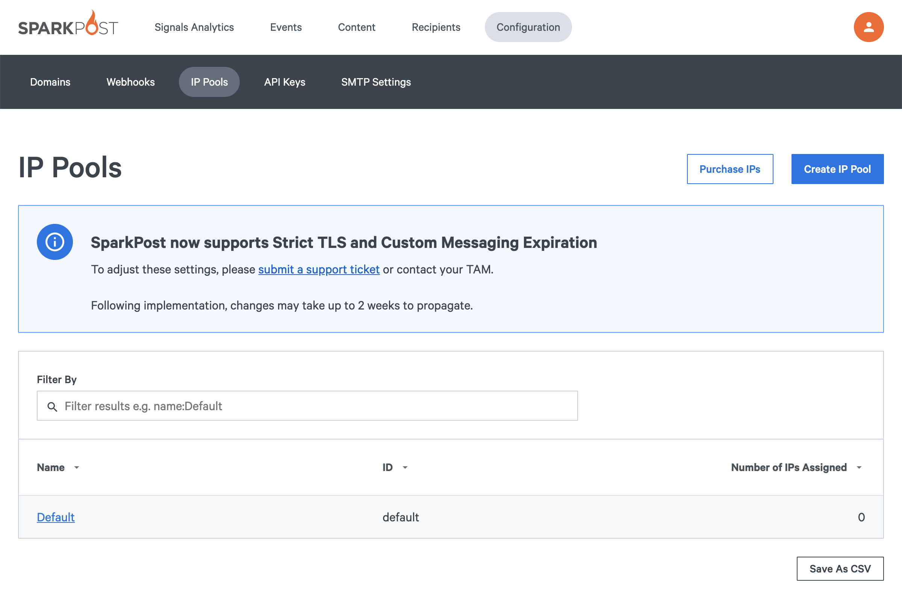

## Introduction ##

DKIM signing by IP pool allows service providers to brand (or white label) the DKIM signature of the messages they send on behalf of their customers/senders. It gives the ability for service providers to use their own DKIM signing domain for groups of senders where having an individual DKIM signature for each from domain is impractical (e.g. because the service provider doesn’t have the ability or access to change their customers’ DNS, or the number of sending domains required of their customer base is very large.) It allows service providers to have different DKIM domains for each group of senders on different IP pools for more granular control of reputation management. This feature also allows the branding of the DKIM domain(s) registered with Yahoo who uses DKIM keys/selectors as the basis for feedback loops.

_Note_: This feature is currently available on SPC, SPC EU and our Enterprise customers on Next Gen Architecture. Enterprise customers, please contact your TAM for an update on the availability of this feature.

## DKIM Signing Logic ##

The following sections explain the logic of how SparkPost will sign messages based upon signing domain and/or IP pool settings.
<br>
<br>

### _DKIM Signing Domain = From Domain_ ###

For senders where the from domain and the DKIM signing domain (`d=`) match, you can use the sending domains API to create the domain and verify it using the DKIM method (or create the domain and verify it via the app). Any messages (regardless of IP Pool being used) sent using that from domain will DKIM sign using the same `d=` domain. 
<br>
<br>

**Example:**

From domain = `mysendingdomain.com`
DKIM signing domain (`d=`) = `mysendingdomain.com`

_Note_: This is the result regardless of the IP pool being used.

More information on how to create sending domains via the API can be found [here](https://developers.sparkpost.com/api/sending-domains.html). The associated [knowledge base article](https://www.sparkpost.com/docs/getting-started/getting-started-sparkpost/#sending-domain-step-2-verifying-domain-ownership) on creating sending domains can be referenced for detailed instructions as well.
<br>
<br>

### _DKIM Signing Domain by IP Pool_ ###

For service providers who group their senders/customers by IP pool and would like to use a specific DKIM signing domain for each IP pool, perform the following steps:

1. Use the Sending Domains API to create and verify the desired signing domain using the DKIM verification method.
1. Use the IP Pools API and provide the desired DKIM signing domain in the `signing_domain` field for that IP pool. For example:

```
PUT /api/v1/ip-pools/mypool2  {
“name”: "My Pool 2",
“signing_domain” : “my-2.serviceproviderdomain.com” }

PUT /api/v1/ip-pools/mypool3  {
“name”: "My Pool 3",
“signing_domain” : “my-3.serviceproviderdomain.com” }
```

_Note_: If you would like the same DKIM signing domain for all IP Pools, repeat the PUT call above for each IP pool using the same signing domain (`d=`).

Reference API documentation for IP pools can be referenced [here](https://developers.sparkpost.com/api/ip-pools.html#ip-pools-ip-pools-resource-put).

<br>

The IP Pools app can also be used to assign a default DKIM signing domain/`d=` to a given IP pool. To access the IP pool page in the app, click on **Configuration** > **IP Pools** in the navigation. To create a new pool, click on the orange "Create IP Pool" button in the upper right.



Name your IP pool and then select your signing domain in the second box. The drop down will present your DKIM-verified sending domain(s) that you can use as a DKIM signing domain for that IP Pool. In the example below, we have selected `elite.trysparkpost.com` as the signing domain.


_Note:_ The operation immediately above can be performed on a pre-existing IP pool by clicking the IP pool name you wish to edit on the IP Pools page, and then selecting a signing domain from the drop down box.
<br>
<br>

**Example Signing by IP Pool**:

Consider the following IP pool and its signing domain:

```
ip_pool: my_pool_2
signing_domain (d=): my-2.serviceproviderdomain.com
```

If a message sent from `my_pool_2` has has a DKIM-verified from domain, it will be signed with a `d=` that matches that from domain, e.g. From = `mysendingdomain.com` / `d= mysendingdomain.com`.

If a message sent from `my_pool_2` does not have a DKIM-verified from domain, it will be signed with the IP Pool `signing_domain`, e.g. from = `unverified-domain.com` / `d= my-2.serviceproviderdomain.com`
<br>
<br>

### **_Yahoo FBL (YCFL) DKIM Signing_** ###

For most customers, SparkPost automatically appends a second DKIM signature with a SparkPost-owned DKIM signing domain that we have registered with Yahoo in order to receive and process FBLs on your behalf. However, for Enterprise service providers who wish to fully brand their headers and set the FBL DKIM signing domain to be one of your own, you must then specify an `fbl_signing_domain` via the IP Pools API. 

_Note_: If the DKIM signing domain you are using is already registered with Yahoo, you do not need to configure a `fbl_signing_domain`.

If the DKIM signing domain you wish to use for your IP Pools is _not_ registered with Yahoo, however, you can work with your TAM to register the DKIM signing domain with Yahoo and set the `fbl_signing_domain` field in the IP Pools API. SparkPost will then append this second signature for messages destined for Yahoo in order to process their FBLs. The following is an example of setting the `fbl_signing_domain` using the IP Pools API:

```
PUT /api/v1/ip-pools/mypool  { 
“name”: "my_pool",
“fbl_signing_domain” : “my.serviceproviderfbldomain.com” }
```

With the above configuration set, any message sent to a Yahoo recipient out of the `my_pool` IP pool will have 2 DKIM signatures, like so:

`signing_domain` = my-2.serviceproviderdomain.com
`fbl_signing_domain` = my.serviceproviderfbldomain.com
<br>
<br>


