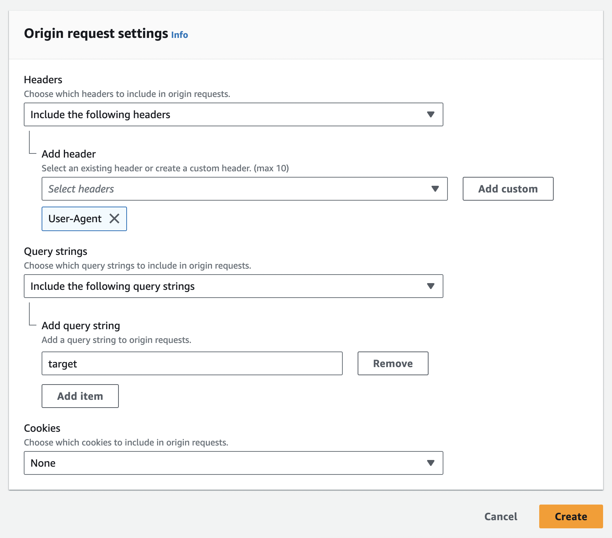
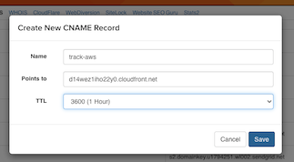

## Overview

SparkPost supports HTTPS engagement tracking for all self-service customers. This article describes how to use a Content Delivery Network (CDN) to enable SSL engagement tracking for your domain. After completing the steps below, your email recipients will see HTTPS links in the email you send. When they visit a tracked link, your CDN will handle the SSL connection, then pass the HTTP request on to SparkPost. SparkPost will record the click event and redirect the recipient to the original URL.

> Alternative: to configure HTTPS engagement tracking using your own proxy, see [this article](https://www.sparkpost.com/docs/tech-resources/using-proxy-https-tracking-domain/).

## Migration planning

If you already have non-secure tracking domains in live service, with a `CNAME` direct to SparkPost's tracking endpoints, you need to plan for what happens when users click on links in previously-delivered emails.

The simplest approach is to leave the current tracking-domain in place, and set up a new, sibling tracking-domain pointing to your CDN. For example, if you are using `click.mycompany.com` with a direct CNAME, set up the proxy with `click2.mycompany.com`. This enables you to test your setup is working before switching over to use it for Production traffic in SparkPost.

If you want to end up with your CDN serving the original domain:
* You'll need your CDN to handle both port 80 (HTTP) and port 443 (HTTPS) requests, so that links in previously delivered mails continue to work
* To minimize disruption, we recommend you test your setup on a sibling domain before switching
* You need to consider your certificates (which may be specific to your subdomain, or may use subdomain wild-card)
* You need to change your DNS setting on the original tracking domain(s) to point to the CDN, only when your setup is tested and working.

## Configuring SSL Certificates

In order for HTTPS engagement tracking to be enabled on SparkPost, our service needs to present a valid certificate that will be trusted by the email recipient’s browser. SparkPost does not manage certificates for customer engagement tracking domains, as we are not the record owner for our customers’ domains.

Use a CDN such as [Cloudflare](http://www.cloudflare.com), [Fastly](http://www.fastly.com) or [AWS Cloudfront](https://aws.amazon.com/cloudfront/) to manage certificates and keys for any custom engagement tracking domains. These services forward requests onward to SparkPost so that HTTPS tracking can be performed.

## Step by Step guides

This document includes step by step guides for the following CDNs.

* CloudFlare:
    * [Create a Domain](#step-by-step-guide-with-cloudflare)
        * (Cloudflare certificates are auto-issued)
* AWS CloudFront:
    * [Create a Domain](#step-by-step-guide-with-aws-cloudfront)
    * [Issue a Certificate](#using-aws-certificate-manager-acm-to-issue-a-certificate-for-your-domains)
* Fastly:
    * [Create a Domain](#step-by-step-guide-with-fastly)
    * [Issue a Certificate](#issue-a-certificate-with-fastly)
* Google Cloud Platform:
    * [Create a Domain](#step-by-step-guide-with-google-cloud-platform)
    * [Issue a Certificate](#issue-a-certificate-with-google-cloud)
* Microsoft Azure:
    * [Create a Domain](#step-by-step-guide-with-microsoft-azure)
    * [Issue a Certificate](#issue-a-certificate-with-microsoft-azure)

If you are using a CDN not listed here, the steps will differ in workflow. Please refer to your CDN documentation and contact their respective support departments if you have any questions.

## SparkPost tracking endpoints

This address is configured as the address your CDN forwards HTTPS requests to, usually known as the "origin server".
|Service|Endpoint|
|--|--|
|SparkPost US|`spgo.io`|
|SparkPost EU|`eu.spgo.io`|
|SparkPost Enterprise accounts with their own service endpoint|Endpoint address is specific to each account; usually follows the format of `<tenant>.et.e.sparkpost.com`, where `<tenant>` is unique to your account. Please check with your Technical Account Manager|
|PowerMTA+Signals|Refer to your PowerMTA User Guide documentation|

## Create a secure tracking domain on SparkPost

After configuring your CDN, you need instruct SparkPost to encode your links using HTTPS and verify your domain - instructions [here](#switch-tracking-domain-to-secure-and-validate).

---
## Step by Step Guide with CloudFlare

_Updated December 2021. Uses a simpler forwarding method without the need for custom page rules. Images and descriptions follow the current CloudFlare web UI._

> CloudFlare requires you to use their nameservers, i.e. to give them control over routing for the entire organizational domain. That means it works differently to the other CDNs listed here.

1. Create (or log in to your existing) CloudFlare account.

1. Go to the "websites" option in the navigation menu on the CloudFlare UI.

   

   If your organizational domain is already shown here, you can skip this step. Otherwise choose "Add a Site".

   CloudFlare will scan your existing DNS provider to collect records, and prompt you to change to use specifically-named CloudFlare nameservers (yours may be different to the example shown below). You will require a login to your existing DNS provider to be able to change them; beyond the scope of this document.

   Wait for the changes to take effect. You can monitor this in the CloudFlare UI.

     

   Note that (as the above screen mentions) the old nameservers may still be cached in the Internet and will take time to update. You can check the nameservers that a machine sees using `dig NS`:

    ```
    dig NS myexample.com
    ```

    ```
    ; <<>> DiG 9.8.2rc1-RedHat-9.8.2-0.68.rc1.87.amzn1 <<>> NS myexample.com
    ;; global options: +cmd
    ;; Got answer:
    ;; ->>HEADER<<- opcode: QUERY, status: NOERROR, id: 4325
    ;; flags: qr rd ra; QUERY: 1, ANSWER: 2, AUTHORITY: 0, ADDITIONAL: 0

    ;; QUESTION SECTION:
    ;myexample.com.		IN	NS

    ;; ANSWER SECTION:
    myexample.com.	300	IN	NS	athena.ns.cloudflare.com.
    myexample.com.	300	IN	NS	sam.ns.cloudflare.com.

    ;; Query time: 8 msec
    ;; SERVER: 172.31.0.2#53(172.31.0.2)
    ;; WHEN: Tue Dec 21 18:02:00 2021
    ;; MSG SIZE  rcvd: 92
    ```

1. Check, and if necessary add the tracking domain CNAME.

   In CloudFlare, go to the "DNS" management menu. If you already have a plain (HTTP) tracking domain set up with SparkPost, it should be already present in the records. Check that it's set to "Proxied".

   If you are setting up a new tracking domain, then select the "Add record" option:

   * Select record type "CNAME".
   * Enter the subdomain you have chosen (in our example, this is `track`). Enter just the subdomain part.
   * Specify the target as the correct SparkPost tracking endpoint address for your service, see [here](#sparkpost-tracking-endpoints).
   * Ensure Proxy status is enabled.

      
   * Select "Save".

1. Check that CloudFlare is set to use HTTPS.

   In CloudFlare, go to the "SSL/TLS" management menu. You should see an Overview  screen showing the encryption mode as "Full".

   


   More information on CloudFlare SSL options can be found in [this article](https://support.cloudflare.com/hc/en-us/articles/200170416).

   After a few minutes, you can verify that the routing is correct using `ping` to your tracking domain. See also [troubleshooting tips](#troubleshooting-tips).

   Cloudflare does not offer control of cache "time to live" (TTL) on free accounts. This may mask repeat opens/clicks, as described [here](#cache-time-to-live-ttl-settings). If you have a paid account, under Caching, check and set your TTL value.


1. Follow [these steps](#switch-tracking-domain-to-secure-and-validate) to update and verify your tracking domain.

---
## Step by Step Guide with AWS CloudFront

*Updated for CloudFront Console v3, as of July 2021.*

Note: If you utilize CloudFront as your CDN to manage certificates and keys for any custom engagement tracking domains, it will result in a loss of user agent data. We include steps below to minimize data loss.

The following is a sample guide for use with AWS CloudFront **only**; please note, the steps to configure your chosen CDN will likely differ from CloudFront in workflow. Please refer to your CDN documentation and contact their respective support departments if you have any questions.
For up to date information on creating a distribution via CloudFront, please refer to the [AWS docs](https://docs.aws.amazon.com/AmazonCloudFront/latest/DeveloperGuide/distribution-web-creating-console.html).

1. Login with your credentials onto AWS console and navigate to the [CloudFront v3 console](https://console.aws.amazon.com/cloudfront/v3/home).

1. Choose **Create Distribution**:

   

1. Origin

   * Origin Domain: enter the correct endpoint address for your service, see [here](#sparkpost-tracking-endpoints).

   * Origin Path: leave blank.

   * Protocol: choose "Match viewer". This provides backwards compatibility with HTTP as well as HTTPS.

   * Leave the port numbers at default.

   * Choose minimum version of TLSv1.2. Note this sets what AWS CloudFront uses to communicate with SparkPost, it does not limit what your distribution offers to clients.

   

   * Optionally, change the name (you can leave this at default).

   * Leave "Enable Origin Shield" disabled.

   * Skip the "Additional settings".

    

1. Default cache behavior

    * "Path Pattern" - use default setting of (*).

    * "Compress objects automatically" - use default setting of "Yes". (This doesn't really affect engagement tracking, as large objects are not transferred).

    * "Viewer Protocol Policy" - use default setting "HTTP and HTTPS". This enables your distribution to serve non-secure links that may be already out there in your delivered email, prior to enabling this.

    * "Allowed HTTP methods" - use default setting of "GET, HEAD".

    * "Restrict viewer access" - use default setting of "No".

    

    * "Cache key and origin requests" - use default setting of "Cache policy and origin request policy (recommended)".

      

    * "Cache policy" - choose "Create policy". This opens a new tab.

    * Give your policy a name, e.g. "SparkPost_ET_short_cache". Spaces are not permitted in names.

    * Set Minimum TTL to 1 second

    * Set Maximum TTL to 10 seconds

    * Set default TTL to 10 seconds. For more information see [Cache Time To Live (TTL) settings](#cache-time-to-live-ttl-settings).

      

    Cache Key Settings:

    * Set Headers, Query Strings and Cookies to None.

    * Leave Compression Support on defaults.

      

    * Click "Create" (on first time) / "Save Changes" (if modifying).

    * You can close this tab.

    Continuing on your original tab, "Cache key and origin requests":

    

    * Under Origin Request policy - choose "Create policy". This opens a new tab.

    * Give your policy a name and optional description.

      

    * Under Origin request settings, "Headers", select "Include the following headers".

    * Select "Add custom".

    * Enable forwarding of the `User-Agent` header. Type in `User-Agent` and click "Add". This allows `User-Agent` data to be present in your engagement events received from SparkPost.

      

    * Leave Query string and Cookies set to defaults (None). Your origin request settings should now look like this.

      

    * Click "Create" (on first time) / "Save Changes" (if modifying).

    * You can close this tab.

1. Continuing on your original tab, under "Function associations - _optional_":

    * Leave these settings at default ("No association").

        

1. Settings:

      * "Price class" - we recommend leaving this set to default ("Use all edge locations").

      * AWS WAF web ACL - leave at default

        

      * Alternate domain name (CNAME) - leave this blank for now.

    * Under "Custom SSL Certificate", select **Custom SSL Certificate** - Upload certificates as needed.

        > If you want to have AWS create a new certificate within AWS instead of importing an existing one, click "Request certificate" and follow the steps [here](#using-aws-certificate-manager-acm-to-issue-a-certificate-for-your-domains) before continuing.

    * Leave the other settings at default / recommended values.

    * At the bottom of the page, press **Create Distribution**. This returns you to the main CloudFront Distributions list.

        

1. Create, or update, a CNAME record with your DNS service to route queries for tracking domain(s) with your CloudFront distribution ID. This will be specific to your DNS service.

   * Get the "Domain Name" for your distribution from the Distributions page. You can use the square "copy" button.

        

    * Create the CNAME record within your DNS service (this will be specific to your provider). If you have a TTL (time to live) field, we suggest to set this to 1 hour.

        

        _Example DNS provider CNAME setup_

    * Go back into your CloudFront distribution, select "Edit", and add the CNAME record. Choose "Add item". Type in your custom tracking domain, without the leading `https://` - e.g. `track.mycompany.com`.

        


    * Select "Save changes". The update will take a few minutes to deploy.

    * You can verify that the routing is successful using `ping` on your created record. You should see a response from CloudFront.

1. Follow [these steps](#switch-tracking-domain-to-secure-and-validate) to update and verify your tracking domain.

---
### Using AWS Certificate Manager (ACM) to issue a certificate for your domain(s)

Once your CNAME is set up with your DNS provider, instead of providing an existing certificate, you can have AWS issue a certificate for your custom tracking domain(s).

1. Navigate to the AWS Certificate Manager (ACM). Choose Request a Certificate, then select Request a public certificate.

    Add your domain name(s), select Next.

    

1. Choose DNS validation. Add tags if you wish. Select Review, then Confirm and Request.

    

1. On your DNS provider, create the CNAME records that are used to by AWS to validate that these domain(s) are yours.

    

1. Check that the certificate is shown with status "Issued", with Validation status of "Success".

    

#### To attach the issued certificate to your CloudFront distribution:

1. Navigate to CloudFront. Select your distribution, then select "Edit":

    

1. Enter your domain names, select "Custom SSL certificate", and select from the drop-down list.

    

1. At the bottom of the page, click on the "Save Changes" button.

1. Follow [these steps](#switch-tracking-domain-to-secure-and-validate) to update and verify your tracking domain, as this requires the certificate to be present and valid.

---
## Step by Step Guide with Fastly

Sign up for Fastly or log in to an existing account.

1. Select the **Configure** tab on the Dashboard, then "Create Service". Give your service a name, and add your tracking domain under "Domains".

    


1. Select "Origins" on the left. Add the correct endpoint address for your service, see [here](#sparkpost-tracking-endpoints).

    

    Fastly detects that SparkPost supports TLS, and shows the host entry like this. Optionally you can use the "pencil" edit icon to set a meaningful name.

    

    Fastly default settings pass the `user_agent` and `ip_address` through to SparkPost engagement tracking as expected.

1. On "Settings", "Cache Settings", set the "Fallback TTL" to ten seconds (explanation [here](#cache-time-to-live-ttl-settings)).

    

## Issue a certificate with Fastly

1. Select the "HTTPS and network" tab, then "Get Started".

    


1. Enter your tracking domain. Let's Encrypt certificates are free, and can be auto-renewed by Fastly, via an additional CNAME record that you will need to create with your DNS provider.

    

    Other options are to use GlobalSign, or to upload your own private key & certificate.

1. For Let's Encrypt option: copy the information shown and create a CNAME record in your DNS provider's account.

    

1. After you create the CNAME, Fastly requests the certificate.

    

    After a short time, you should see

    

1. Select "More Details .." and look for "CNAME records". This is the address the Fastly will use to serve your incoming requests.

    

1. Create the CNAME record within your DNS service (this will be specific to your provider). If you have a TTL (time to live) field, we suggest to set this to 1 hour.

    

    _Example DNS provider CNAME setup_

    You can verify that the routing is successful using `ping` on your created record.

1. Follow [these steps](#switch-tracking-domain-to-secure-and-validate) to update and verify your tracking domain.

Fastly keeps previous versions of your configuration, and can show the "diff" between them. You can also set up advanced routing rules using the VCL language, and monitor statistics on served requests.


---

## Step by Step Guide with Google Cloud Platform

Unlike some other services, [Google Cloud Platform](https://cloud.google.com/) (GCP) can route tracking domains to SparkPost via an ["external" HTTPS load-balancer](https://cloud.google.com/load-balancing/docs/https), with certificate and routing rules. This is conceptually simpler than using a CDN in front of SparkPost tracking, as there is no caching [Time to Live](#cache-time-to-live-ttl-settings) to consider.

GCP organizes resources under named projects.

1. From the top menu, select an existing project, or create a new project.

    

1. On the main menu (top left), scroll down and select "Network Services" then "Load balancing".

    It will take a few minutes for a new project to become ready for adding services.

    >You may see a message such as "_Compute Engine is getting ready_". Refresh your browser to continue.

    

 1. Choose "Create load balancer".

    

1. You will see three options.

    

    Choose "HTTP(S) Load Balancing" and Start configuration.

1. On the question "Internet facing or internal only", choose "From Internet to my VMs" and continue.

    

1. Give your load balancer a meaningful name.

    

    Note the remaining setup steps:

    * Backend (which will be SparkPost's engagement tracking endpoint)
    * Host and Path Rules, and
    * Frontend configuration (which includes the certificate).

    We now configure each of these, then create the load-balancer.

1. Backend configuration:

    

    Choose Backend services / Create a backend service.

    * Give the backend service a name, e.g. "sparkpost-engagement-tracking".
    * For "Backend type", choose "Internet network endpoint group".
    * For Protocol, choose "HTTPS". Leave "Named port" and "Timeout" at defaults.

    

    * In the "New backend" dialog, choose "Create Internet network endpoint group". This will open a new browser tab.

1.  Give your "Network Endpoint Group" a name:

    

    * Set Default port to 443.
    * On "Add through", leave this set at "Fully qualified domain name and port".
    * On "Fully qualified domain name", add the correct endpoint address for your service, see [here](#sparkpost-tracking-endpoints).
    * Select "Create".

    You should now see your "Network Endpoint Group" exists.

     

    Close this tab, and **return to your previous tab**. Unfortunately this does not auto-refresh; however, start typing the name of the Network Endpoint Group you just created, and it will appear.


      

    Choose "Done".

    * Leave "Enable Cloud CDN" unchecked and the other settings at defaults.

    * Scroll to the end of the page and select "Create".

      

    * This returns you to the "New HTTP(S) load balancer" view, showing with blue check marks that "Backend configuration" and "Host and path rules" are done.

      

      For "Host and path rules": the above default configuration (shown in gray) passes all traffic on the load balancer through to our back end; this is sufficient.

1. Frontend configuration

    * Enter a name.
    * For Protocol, select "HTTPS (includes HTTP/2)".

        

    * If you have an existing certificate for your tracking domain, you can upload it via this dialog. Otherwise choose "Create a new certificate". This has the advantage that GCP will handle your renewals.

      

    * For a new certificate, [additional steps](#issue-a-certificate-with-google-cloud) are necessary after you review and finalize. The certificate will be available only after you point your domain to the frontend service.

1. Review and finalize

    Select "Review and Finalize". Your configuration should now look like this:

    

    Ensure your load balancer has a valid name.

    Choose "Create". After a few seconds, you should see the following status.

    

## Issue a certificate with Google Cloud

Creating a new certificate is done through the HTTP(S) load balancer configuration. On the main menu (top left), navigate to "Network Services" then "Load balancing". Select your load balancer by clicking on its name.

If you don't have a named certificate present under the "Frontend" section, follow step "Frontend configuration" above to begin the process.

Once you have a named certificate on your frontend, it should look like this. It may take a few minutes after creating the load balancer for the `IP:Port` to appear.


The gray (i) indicates the certificate is in the "provisioning" state, not yet fully active.

* Click on the certificate name (underlined in blue). You should see the status similar to this.

    

2. Take the IP address from the `IP:Port` value above, and use it to create your DNS record.

  * Point your tracking domain toward the load-balancer frontend with an [A record](https://en.wikipedia.org/wiki/List_of_DNS_record_types). The entry will vary depending on your DNS provider; for example, on GoDaddy, you omit the organizational domain from the "Host" field, i.e. type in only the subdomain part (here, we're using the subdomain "gcp").

    

    Save your record. It will typically take from a few minutes up to several hours before the record is published and visible. While you're waiting, Google Cloud Platform will show the Domain Status with a yellow warning triangle; this is expected.

    

    If your A record is correct, Google Cloud Platform will activate the certificate and make it visible on the screen. The green check mark indicates the domain/certificate is active.

    

    It can take a further few minutes after this before the certificate is fully active on the endpoint. You can check this using the [troubleshooting tips](#troubleshooting-tips).

1. Once the certificate is fully active, follow [these steps](#switch-tracking-domain-to-secure-and-validate) to update and verify your tracking domain.

---

## Step by Step Guide with Microsoft Azure

[Microsoft Azure](https://azure.microsoft.com/)  offers a range of [load-balancer types](https://docs.microsoft.com/en-us/azure/architecture/guide/technology-choices/load-balancing-overview). Most of these are for routing to destinations within Azure. The [Azure Front Door](https://docs.microsoft.com/en-us/azure/frontdoor/front-door-overview) service provides SSL offload with certificate, custom domains, path-based routing, and forwarding to external destinations such as SparkPost tracking. It is a [global service](https://docs.microsoft.com/en-us/azure/frontdoor/front-door-faq#what-regions-is-the-service-available-in), not tied to any specific Azure region.

The steps below are based on [this guide](https://docs.microsoft.com/en-us/azure/frontdoor/quickstart-create-front-door#create-a-front-door-for-your-application) to creating a Front Door instance.

1. From the home page or the Azure menu (top left), select Resource Groups. If you don't have one already, create a Resource Group for your project. Give this a name. Choose a region; this affects only where the Azure project metadata is stored.

    

1. Select "Review and Create", then "Create". This should return you back to your list of Resource Groups.

    

1. From the home page or the Azure menu, select Create a resource. Select Networking > See All > Front Door.

    

    Choose Create.

    

    Select your resource group. Select "Next: Configuration".

1. In Frontends/domains, select `+` to open "Add a frontend host". Give your host a name - this needs to be a valid, unique subdomain of the domain `.azurefd.net`. Choosing a name based on your custom tracking domain should help to ensure uniqueness; you should see a green check mark appear on the right. (We will change this later to be your actual custom domain.)

    

1. Next, we create a backend pool that contains just the SparkPost tracking domain. In Backend pools, select + to open Add a backend pool. Give this a name.


    

1. Select "Add a backend". Set the backend host type to be "Custom host". Set the backend host name to be the correct endpoint address for your service, see [here](#sparkpost-tracking-endpoints).

    

    * The backend host header field will be automatically filled in for you. Leave the HTTP port and HTTPS port settings at defaults. Click Add.

    * Leave the Health probe inactive, as there is only one backend.

1. On "Routing rules", select `+`. Give your rule a name.

    Leave "Accepted protocol" as the default "HTTP and HTTPS". Ensure your "Frontends/domains" setting is your previously configured subdomain name.

    Set the Path to `/*` to match all incoming requests. Leave Route type set to the default "Forward", and set Forwarding Protocol to "Match request". Select "Add".

    

1. Select "Review + create", then "Create".

    

    You should see "Deployment is in progress", followed by a "deployment complete" message.

    

    Your front door is now active on the subdomain we set up, and can be checked using `curl` with added path `/f/a`, for example:

    ```
    curl -v https://my-tracking-domain.azurefd.net/f/a/
    ```

    You should see a default `302` response from SparkPost via your Front Door.

## Issue a certificate with Microsoft Azure

The front door created so far has a certificate for `*.azurefd.net`. Here we set up a custom domain and enable a matching certificate for the custom domain. The following steps are based on [this tutorial](https://docs.microsoft.com/en-us/azure/frontdoor/front-door-custom-domain) followed by [this tutorial](https://docs.microsoft.com/en-us/azure/frontdoor/front-door-custom-domain-https), taking the option "Use a certificate managed by Front Door" and the regular CNAME verification method.

1. Create a CNAME DNS record, pointing your custom domain to your Azure front door. The entry will vary depending on your DNS provider; for example, on GoDaddy, you omit the organizational domain from the "Host" field, i.e. type in only the subdomain part; in this test example, the tracking subdomain is `azure`, yours will be specific to your own name.

    

    Save your record. It will typically take from a few minutes up to several hours before the record is published and visible.

1. Sign in to the Azure portal and browse to the Front Door containing the frontend host that you want to map to a custom domain. Select the Front Door designer.

    

1. On the "Frontends/domains" panel, select `+` to add a custom domain. On "Custom host name", enter your tracking domain. Select "Add".

    

1. The Front Door designer will show a warning about your new domain not yet having a default route. Select "Routing rules". Update your routing rule to select your custom domain, and deselect your previously set `azurefd.net` domain.

    

1. On Frontends/domains, select your new domain. Update the "CUSTOM DOMAIN HTTPS" setting to be "Enabled", with minimum TLS version 1.2. Select "Update".

    

1. The Front Door designer shows that there are pending changes. Select "Save". After this is completed, select your custom domain. You should see that the certificate provisioning [progressing through these stages](https://docs.microsoft.com/en-us/azure/frontdoor/front-door-custom-domain-https#operation-progress).

    

1. After a few minutes, you should see the status of your custom domain certificate change to "complete".

    

    You can check the certificate is being served correctly on your domain using the [troubleshooting tips](#troubleshooting-tips).

1. Once the certificate is fully active, follow [these steps](#switch-tracking-domain-to-secure-and-validate) to update and verify your tracking domain.

---

## Cache Time To Live (TTL) settings

CDNs apply caching, with a "Time to Live" (TTL) for each unique request URL. When a request is first fetched, it is cached. Within the TTL, later requests *may* be served to the client from the CDN cache, without touching the SparkPost endpoint. The client is redirected to the landing page as usual, but a side-effect is that SparkPost does not record the repeat opens/clicks.

SparkPost engagement tracking URLs are unique to a particular recipient, message, and (for links) each individual link in the message.

A TTL of zero means "always pass through to the origin", which is, perhaps surprisingly, not ideal. Some inbound mail gateways repeatedly scan email links, which leads to erroneous high event counts.

To enable SparkPost to record human-driven repeat opens/clicks, while screening robot-driven repeat opens/clicks, we suggest setting the default TTL to 10 seconds.


## Switch tracking domain to secure, and validate

If you have previously created a tracking domain (whether verified or unverified), and wish to switch it from insecure (the default) to secure, use the [Update a Tracking Domain API](https://developers.sparkpost.com/api/tracking-domains/#tracking-domains-put-update-a-tracking-domain) `PUT` call, to update the tracking domain with the `"secure": true` string.

1. Run the PUT call with the following data:

    ```
    {
        "secure"  : true
    }
    ```

    Note: If you would like this tracking domain to be the default, please add `"default": true` to the JSON object above, before updating the domain.

    Detailed information on this operation can be found in our API documentation [here](https://developers.sparkpost.com/api/tracking-domains.html#tracking-domains-retrieve,-update,-and-delete-put).

1. Navigate to the Tracking Domains section in the UI and click the  "test" verification button.

1. Send a test email, examine the internals of the email and check the expected HTTPS URLs using your tracking domain are present.

1. Check that clicking the links takes you to the expected landing page.

### Troubleshooting tips

You can test that your tracking domain is correctly routed to SparkPost, using `curl -v` (verbose). Note the `/f/` path.

```
curl -v https://track.mydomain.com/f/
```
The output will show the TLS negotiation including info on the certificate served by your CDN for your domain. Example:

```
* Server certificate:
*  subject: CN=track-aws.thetucks.com
*  start date: Oct  8 00:00:00 2020 GMT
*  expire date: Nov  7 12:00:00 2021 GMT
*  subjectAltName: host "track-aws.thetucks.com" matched cert's "track-aws.thetucks.com"
*  issuer: C=US; O=Amazon; OU=Server CA 1B; CN=Amazon
*  SSL certificate verify ok.
```

If forwarding is configured properly, you will see a response relayed back from the SparkPost endpoint. The `server` header value below indicates that your CDN is routed to a SparkPost endpoint.

```
< HTTP/2 200
< content-type: text/plain
< content-length: 0
< date: Sat, 31 Oct 2020 10:52:44 GMT
< server: msys-http
```
