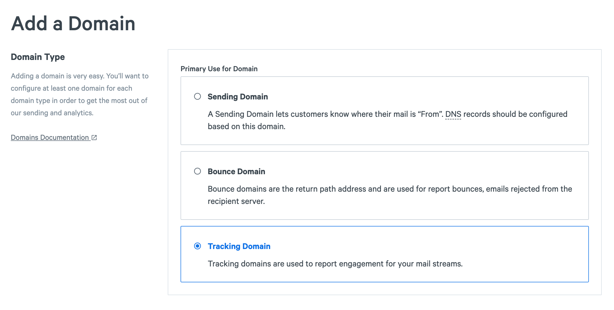
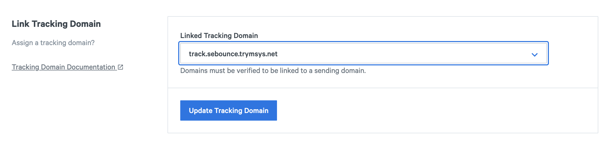

A tracking domain (also referred to as an "engagement tracking domain") is the domain that a tracked link will redirect through before reaching the final URL path of the original link. It is also used as the path for the tracking pixel to track message opens. A recipient will see this domain if they mouse over a tracked link in an HTML message or if they receive a plain text message.

The system default tracking domains are "spgo.io" for US "eu.spgo.io" for EU. When you set up a customer tracking domain you can set it as the default to be used for all of your emails. When you set up multiple tracking domains, you can associate each one with a sending domain and set one as the default for any domains that don't have a tracking domain associated with it.

## Set Up a Tracking Domain 

Start from [Domains create](https://app.sparkpost.com/domains/create) ([EU](https://app.eu.sparkpost.com/domains/create)) page and select the Tracking Domain option as you add your domain.

  

The tracking domain must be a subdomain and not a root domain.

Then add the CNAME record to your domain's DNS settings and verify the domain.

You can also set the tracking domain as default to be used for all of your emails. Otherwise, you can link the tracking domain to a specific sending domain.

## Link Tracking domains to to Sending Domains      

Once your tracking domains is verified, you can link it to specific sending domains.

1. Find the sending domain you want from the [Domains](https://app.sparkpost.com/domains/list) ([EU](https://app.eu.sparkpost.com/domains/list)) page.
2. Select the tracking domain you want to link from the Link Tracking Domain section
  

## Setting up through the API

You can also configure custom tracking domains by using the REST API.

* [Creating a Tracking Domain](https://developers.sparkpost.com/api/tracking-domains/#tracking-domains-post-create-a-tracking-domain) 
* [Verify a Tracking Domain](https://developers.sparkpost.com/api/tracking-domains.html#tracking-domains-verify-post)