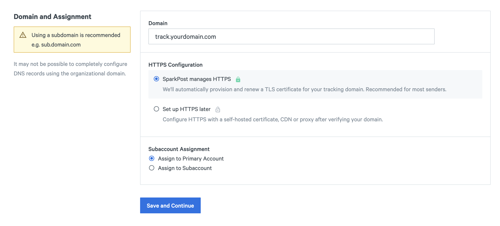
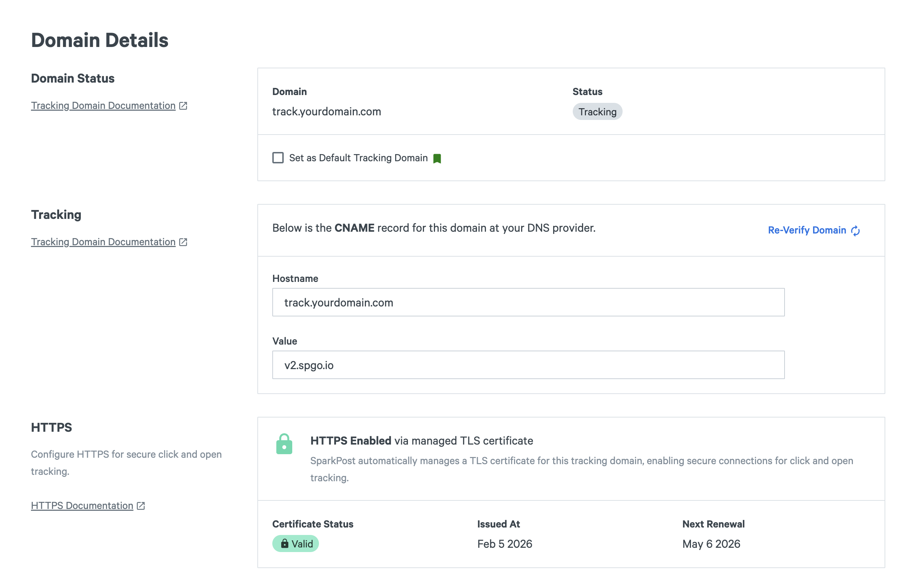
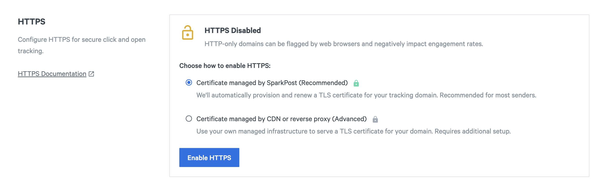
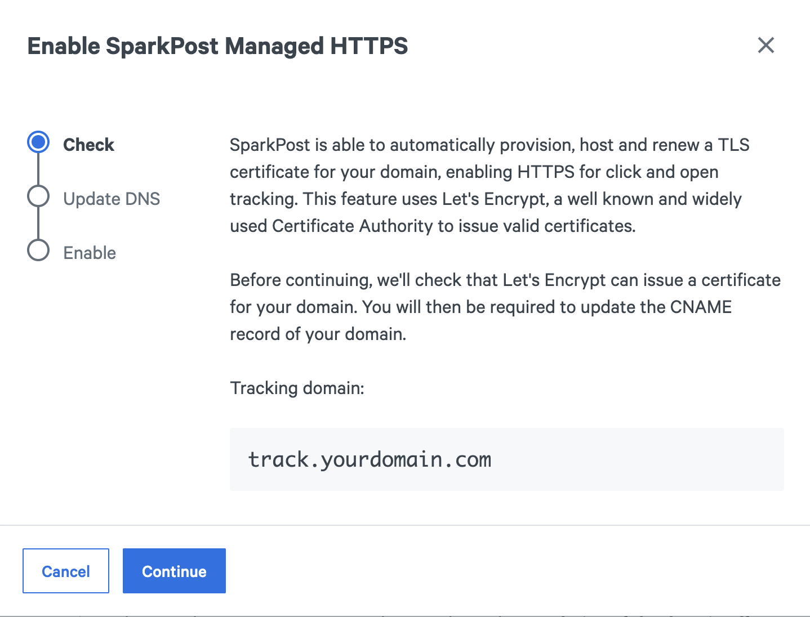
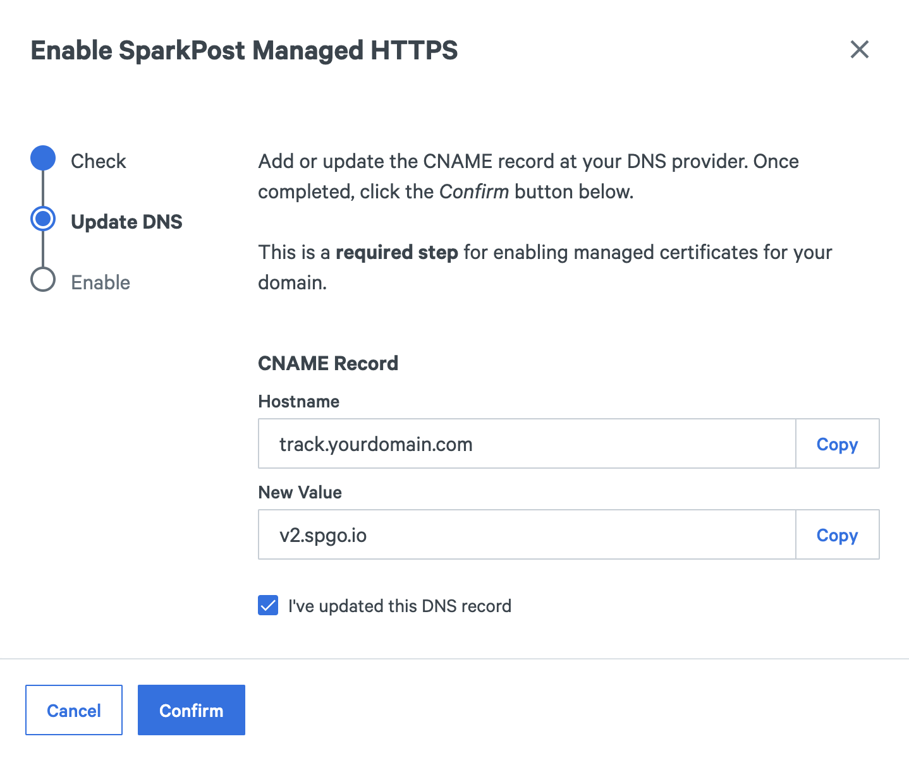
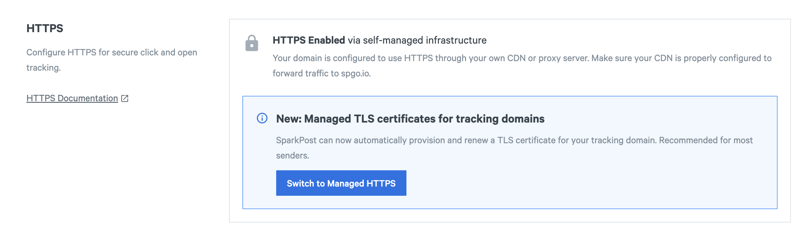
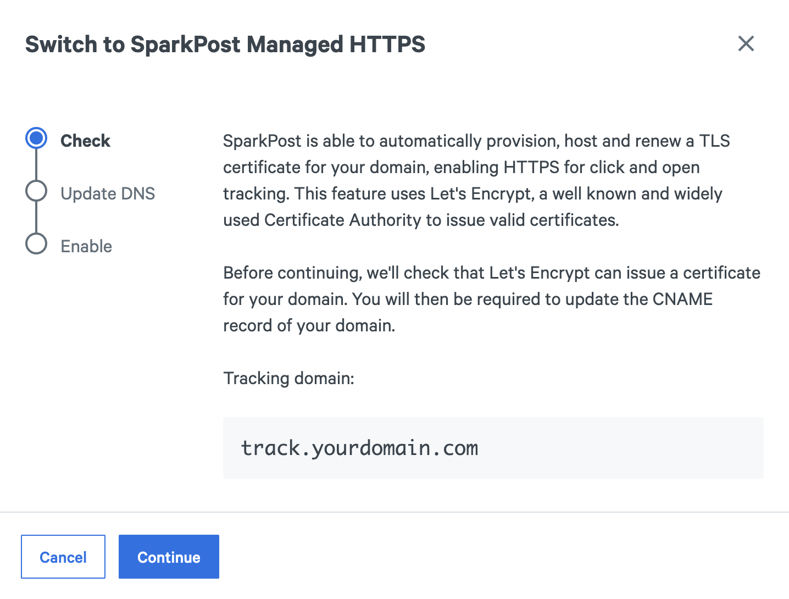
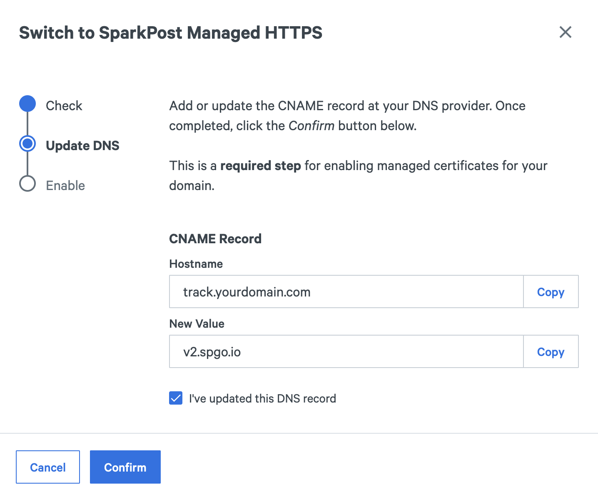
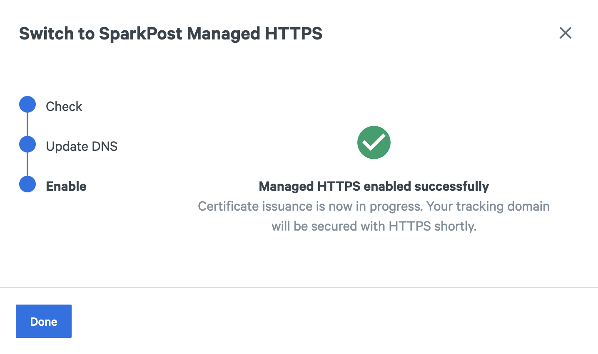

## Overview

SparkPost supports HTTPS engagement tracking through managed TLS certificates. With this option, SparkPost automatically issues and renews certificates for your tracking domains using [Let's Encrypt](https://letsencrypt.org/about/), a free certificate authority trusted by all major browsers. As a result, your email recipients will see HTTPS links in the emails you send.

This is the recommended method for most senders. It requires no certificate management and works with standard CNAME delegation to SparkPost's tracking endpoints.

**Managed HTTPS is enabled by default for all new tracking domains** created after December, 2025. Existing tracking domains can opt in by updating their CNAME record and enabling managed HTTPS in the SparkPost UI.

> **Alternative**: To configure HTTPS using a CDN or reverse proxy with your own certificates, see [this article](./enabling-https-engagement-tracking-on-sparkpost) or [this guide](./using-proxy-https-tracking-domain).

## Why HTTPS matters for Engagement Tracking

HTTPS has become essential for the web as cybersecurity standards evolve. Major browsers now [display warnings for insecure connections](https://security.googleblog.com/2025/10/https-by-default.html), which reduce recipient trust in HTTP-only links. These security warnings may cause recipients to abandon your link destinations, negatively impacting click-through rates.

The industry is also moving toward [shorter certificate lifetimes](https://www.digicert.com/blog/tls-certificate-lifetimes-will-officially-reduce-to-47-days). The maximum validity of TLS certificates will shrink to 47 days by 2029, making manual certificate management increasingly difficult and error-prone. Automation will no longer be optional.

**Managed HTTPS for Tracking Domains** addresses these challenges through automated certificate issuance and renewal, helping you maintain email deliverability, security, and user experience without requiring complex infrastructure or ongoing certificate management work.

## When to Use Managed HTTPS

Managed HTTPS is the recommended option for most senders because:

- No certificate management required: SparkPost handles issuance and renewal automatically
- Minimal setup: Only the standard CNAME delegation is required. No infrastructure to maintain
- Trusted certificates: Certificates issued by Let's Encrypt, trusted by all major browsers and email clients

If you currently use a CDN or reverse proxy to serve TLS certificates for your tracking domain, migrating to SparkPost-managed HTTPS can help reduce infrastructure and maintenance costs while still providing the same level of security for your engagement tracking links.

Consider using a CDN or reverse proxy for HTTPS instead if:

- You need to use a specific Certificate Authority other than Let's Encrypt
- You require an Extended Validation (EV) certificate
- Your business has stricter compliance requirements for certificate handling
- Your domain does not support managed HTTPS due to Let's Encrypt internal policies ([read more](#certificate-status-shows-unavailable))

## How It Works

When managed HTTPS is enabled for a tracking domain:

1. SparkPost validates your domain ownership through the existing CNAME record
2. SparkPost requests a certificate from Let's Encrypt
3. Let's Encrypt performs [HTTP-01](https://letsencrypt.org/docs/challenge-types/#http-01-challenge) validation to confirm SparkPost controls your tracking domain
4. SparkPost installs the certificate and begins serving HTTPS traffic
5. The certificate automatically renews before expiration

Certificate issuance typically completes within 15 minutes. SparkPost handles all certificate management, including renewals.

## Tracking Endpoints

SparkPost provides different types of tracking endpoints:

| Service | Endpoint | Supports Managed HTTPS | Supports HTTPS through CDN/Proxy |
|------|----------|------------------------|----------------|
| SparkPost US | `spgo.io` | No | Yes |
| SparkPost EU | `eu.spgo.io` | No | Yes |
| SparkPost Enterprise | `<tenant>.et.e.sparkpost.com` | No | Yes |
| SparkPost US V2 | `v2.spgo.io` | Yes | Yes |
| SparkPost EU V2 | `eu.v2.spgo.io` | Yes | Yes |

**To use managed HTTPS, your tracking domain must use a V2 endpoint** (`v2.spgo.io` for US accounts or `eu.v2.spgo.io` for EU accounts). New tracking domains created after December, 2025, automatically use V2 endpoints.

## Enabling Managed HTTPS

### Enabling for New Domains

1. Create a tracking domain

   * Navigate to [Domains > Create](https://app.sparkpost.com/domains/create) ([EU](https://app.eu.sparkpost.com/domains/create)) and select Tracking Domain. Enter your subdomain (e.g., `track.yourdomain.com`).
   In the _HTTPS Configuration_ field, make sure the default option _SparkPost manages HTTPS_ is enabled.

   

   * Click on _Save and Continue_.

   > **Note**: Tracking domains must be subdomains, not root domains. New tracking domains are automatically configured to use [V2 endpoints](#tracking-endpoints) and have managed HTTPS enabled by default.

   * Follow the instructions in the page to add a CNAME record in your DNS provider pointing to the engagement tracking service. Click on _Verify Domain_ after the DNS changes to proceed.

2. Check the certificate status

   * Once the domain is verified successfully, go to the domain details page and check the HTTPS section, where the certificate status will be displayed along with the next renewal date.

   

### Enabling for Existing Insecure Domains

If a tracking domain was not yet configured to use HTTPS, it's possible to do so with managed HTTPS:

> **Note**: Links in previously-sent emails continue to work, as SparkPost serves HTTP and HTTPS traffic on both endpoint types.

1. Navigate to the details page of your insecure domain. In the _HTTPS_ section, you will see _HTTPS Disabled_ as the current status.

   

   Under _Choose how to enable HTTPS_, make sure the default option _Certificate managed by SparkPost (Recommended)_ is selected. Click on _Enable HTTPS_ to proceed.

2. Follow the wizard instructions to verify if the domain supports managed HTTPS.

   

   > **Note**: If this step fails, managed HTTPS is unavailable for your domain due to Let's Encrypt policies. See [this article](./enabling-https-engagement-tracking-on-sparkpost) or [this guide](./using-proxy-https-tracking-domain) to setup HTTPS using a CDN or proxy server.

3. Make the necessary DNS changes to verify the domain and click on _Confirm_.

   

   Once the domain is verified successfully, certificate provisioning will be handled in the background.

### Migrating from CDN or Reverse Proxy

If you have previously set up a [CDN](./enabling-https-engagement-tracking-on-sparkpost) or [reverse proxy](./using-proxy-https-tracking-domain) to enable HTTPS for your domain, it's possible to migrate to SparkPost-managed certificates.

> **Note**: Existing links currently served through your CDN/proxy will continue to work after the migration.

1. Navigate to the details page of your domain. In the _HTTPS_ section, you will see _HTTPS Enabled via self-managed infrastructure_ as the current status.

   

   Click on the _Switch to Managed HTTPS_ button.

2. Follow the wizard instructions to verify if the domain supports managed HTTPS.

   

   > **Note**: If this step fails, managed HTTPS is unavailable for your domain due to Let's Encrypt internal policies. See [this article](./enabling-https-engagement-tracking-on-sparkpost) or [this guide](./using-proxy-https-tracking-domain) to setup HTTPS using a CDN or proxy server.

3. Make the required DNS changes and click on _Confirm_. Notice that switching from the standard endpoint to a [V2 endpoint](#tracking-endpoints) is required for tracking links to use the new certificate.

   

   Certificate provisioning will be handled in the background. Links in previously-sent emails continue to work with the new certificate.

   

   > **Important**: It may take up to 48 hours for the DNS changes to fully propagate and new connections to be served using the new certificate.


## TLS Certificate Status

Tracking domains can have the following HTTPS statuses:

| Status | Description |
|--------|-------------|
| Inactive | Domain is not verified |
| Pending | Certificate issuance in progress |
| Valid | Certificate is active |
| Expired | Renewal failed |
| Failed | Certificate issuance failed |
| Unavailable | Domain does not support managed HTTPS |

View certificate status and expiration date in your domain's details page.

## Certificate Renewal

Let's Encrypt certificates are valid for 90 days and SparkPost will renew automatically 15 days before expiration. Renewal happens in the background without service interruption. No action is required.

## Troubleshooting

### Testing the managed certificate

You can test that your tracking domain is being secured by a Let's Encrypt certificate with the following command:

```sh
curl -v https://track.yourdomain.com/f/a/b/c/d
```

The output will show the TLS negotiation including info on the certificate served by SparkPost for your domain. Example:

```
*  subject: CN=tracking.myboxdemo.space
*  start date: Jan 27 19:09:17 2026 GMT
*  expire date: Apr 27 19:09:16 2026 GMT
*  subjectAltName: host "tracking.myboxdemo.space" matched cert's "tracking.myboxdemo.space"
*  issuer: C=US; O=Let's Encrypt; CN=E8
*  SSL certificate verify ok.
```

Note: If DNS changes have not fully propagated, this command can instead show the previously used certificate. Try again later.

### Certificate stuck in _Pending_ status

If your certificate remains in Pending status for more than 30 minutes:

1. Verify the CNAME record points to the correct SparkPost [V2 endpoint](#tracking-endpoints)
2. Confirm the tracking domain is verified
3. Ensure DNS has fully propagated
4. Contact support if the issue persists

### Certificate status shows _Failed_

Common causes:

1. **Domain verification failed** - Domain ownership could not be verified by Let's Encrypt. Re-verify your tracking domain
2. **CNAME not found** - Check your DNS configuration

### Certificate status shows _Expired_

Although the certificate was issued successfully in a previous attempt, the last renewal process could not be completed due to possible DNS misconfigurations. Common causes:

1. **Domain verification failed** - Domain ownership could not be verified by Let's Encrypt. Re-verify your tracking domain
2. **CNAME not found** - Check your DNS configuration

### Certificate status shows Unavailable

Some domains cannot use managed HTTPS due to Let's Encrypt policies. Use a [CDN](./enabling-https-engagement-tracking-on-sparkpost) or [reverse proxy](./using-proxy-https-tracking-domain) instead.

### Links still use HTTP

If new tracking links use HTTP instead of HTTPS:

1. Verify certificate status is _Valid_
2. Confirm the tracking domain is associated with your sending domain
3. Send a new test email with click tracking enabled

### Cannot enable managed HTTPS

If issuance fails repeatedly, verify that your CNAME record points to a [V2 endpoint](#tracking-endpoints):

```bash
dig CNAME track.yourdomain.com
```

The response should show `v2.spgo.io` or `eu.v2.spgo.io`. If it shows `spgo.io` or `eu.spgo.io`, update your CNAME record to use the [V2 endpoint](#tracking-endpoints).

## Multiple Tracking Domains

You can enable managed HTTPS for multiple tracking domains. Each domain receives its own certificate. Certificates renew independently.

See [Custom Tracking Domains](./enabling-multiple-custom-tracking-domains) for information on setting up multiple domains.

## Security

SparkPost generates certificate private keys securely within its infrastructure. Private keys are encrypted and never leave SparkPost systems.

Certificates are issued via Let's Encrypt's ACME protocol using the [HTTP-01](https://letsencrypt.org/docs/challenge-types/#http-01-challenge) challenge. The process uses public validation methods and does not require access to your DNS credentials.

All TLS certificate issuances managed by SparkPost through Let's Encrypt are logged in public [Certificate Transparency logs](https://certificate.transparency.dev/).

## Related Articles

- [Getting Started with Engagement Tracking](../docs/getting-started/engagement-tracking)
- [Custom Tracking Domains](./enabling-multiple-custom-tracking-domains)
- [Enabling HTTPS with a CDN](./enabling-https-engagement-tracking-on-sparkpost)
- [Using a Reverse Proxy for HTTPS](./using-proxy-https-tracking-domain)
- [Tracking Domains API Reference](https://developers.sparkpost.com/api/tracking-domains/)
