PowerMTA 5.0 [launched](https://www.sparkpost.com/blog/welcoming-powermta-5-0/) on September 17th, 2019, after nearly 2 years in beta testing. PowerMTA 5.0 was designed with operational efficiency, security, speed and disaster recovery in mind in addition to a drastic improvement that allows for much faster delivery when using encryption. To officially welcome PMTA under the SparkPost umbrella, we wanted to do something that wasn’t well supported with the older PMTA website - provide a quick resource to share knowledge about the new features we’re releasing. 

# Web Monitor Refresh with Improvements 

We’ve made huge improvements to our Web Monitor to provide a more user friendly experience that’s easier to navigate and customize. By surfacing key definitions, the Web Monitor doubles as a quick reference for many of the things that would have originally required a look up in the User Manual. 

The PMTA 5.0 Web Monitor contains six key improvements features that we think make it a much better travel companion to your journey:

1. Autocomplete support on “commands” tab to help guide the customer

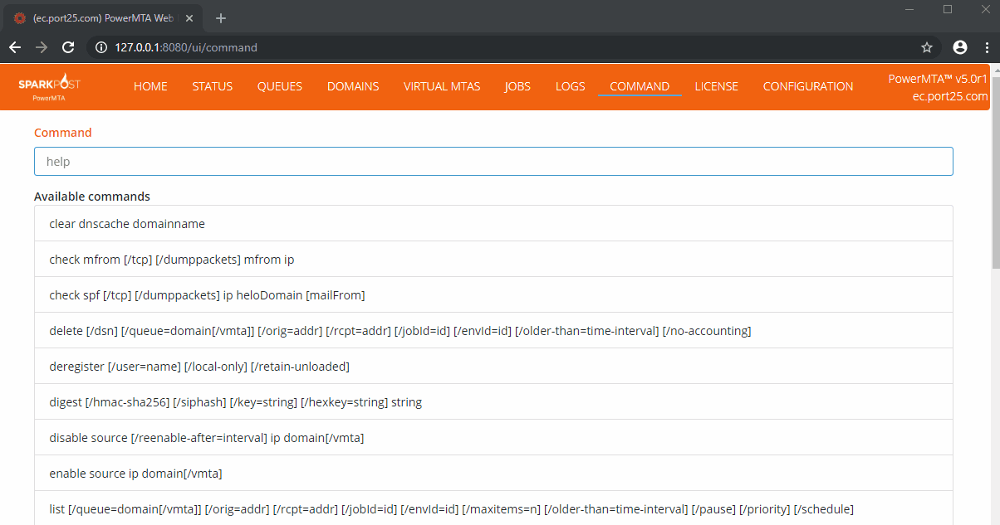

2. Config option to limit access to log file downloads tab

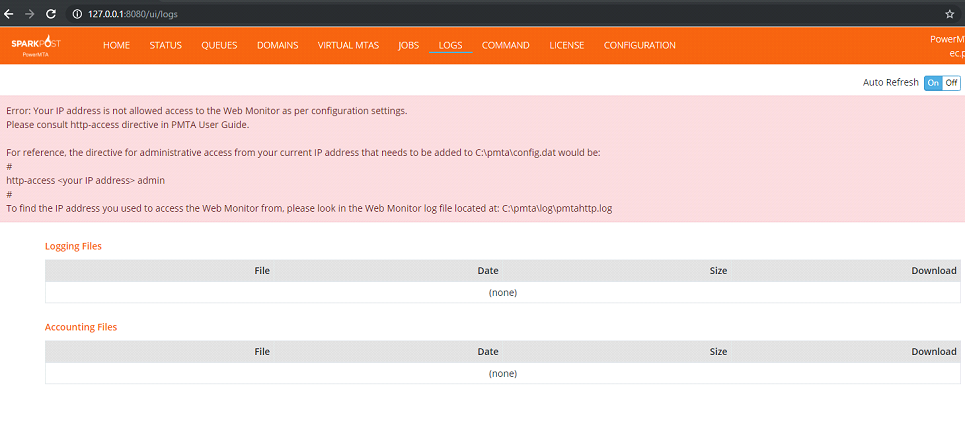

3. Config option for changing the # of items per page and sort order

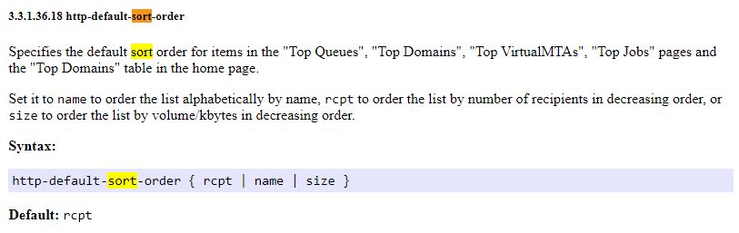

4. Sorting of table headers to give more control over data visualizations

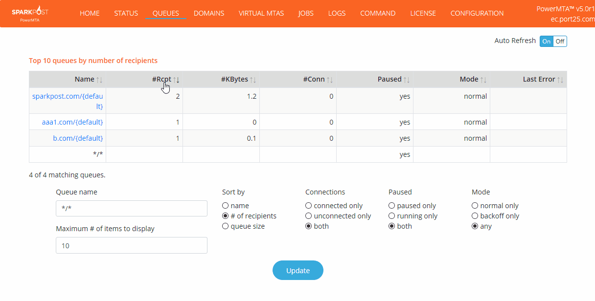

5. Improvements to the Configuration Edit page

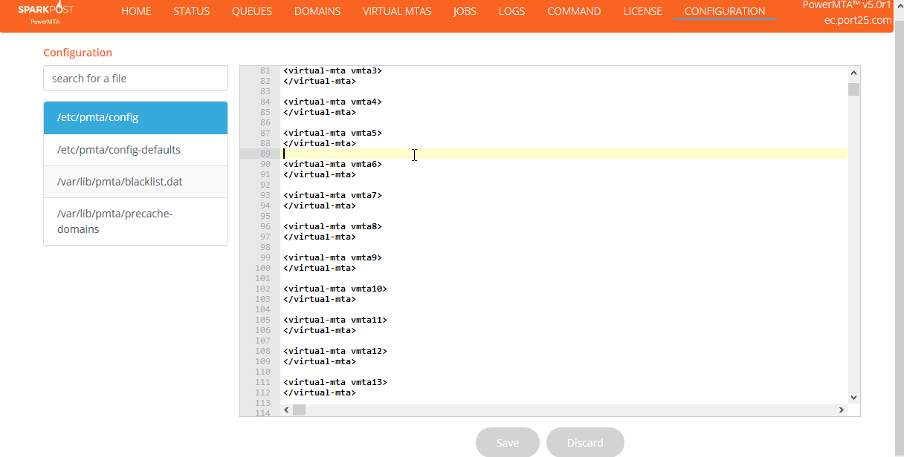

6. Host name displays in the tab at the top of the browser for faster navigation between multiple PMTA instances.

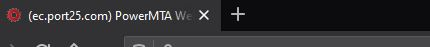

# SparkPost Signals Support 

SparkPost [Signals](https://www.sparkpost.com/platform/signals/) is the world’s most powerful email analytics suite. We analyze data from our massive email footprint (SparkPost products and services collectively are used to send over 37% of the world’s B2C email) and use that knowledge to power your sending. PMTA now ships with a [connector](https://www.sparkpost.com/blog/deploy-sparkpost-signals-for-on-premises-part-1/) that, when enabled, allows logs to be sent to SparkPost for analysis. Compare your on-prem sending to that of many billions of emails a year to get the most out of your program. 

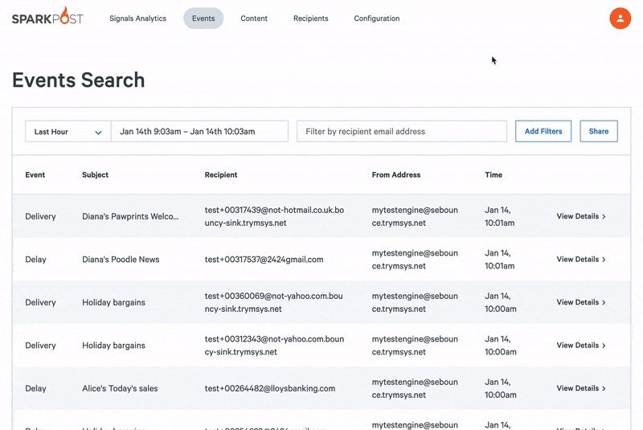

# Email Submissions via HTTP - REST Transmissions 

Customers can directly inject a JSON-preformatted email into PowerMTA using an HTTP REST API interface. This makes it easier to integrate email submission into existing web applications without necessarily having to change context to SMTP to submit messages in to PowerMTA.

One of the great things this enables, is an easy set up of a hot:hot disaster recovery solution in combination with the SparkPost Cloud email delivery service. Since many of the API commands are identical to those in SparkPost Cloud, customers can set up two accounts for resiliency and switch between them nearly seamlessly. Not only that, but with SparkPost Cloud’s auto warm-up functionality, you don’t need to worry about reputational damage in connection with a fast switch during an outage. This is an easy win for teams working to find ways to improve their system’s robustness, save money compared to setting up redundant infrastructure, begin migrating to a cloud solution, or just explore what SparkPost Signals Analytics Suite is capable of without needing to learn an entirely new API. 

# MX Rollup and Cold vMTA

MX Rollup is a PMTA feature that consolidates all recipient domains that are handled by the same MX(es) into a single queue. This creates a better management structure for rate limiting and connection or message caps. It’s common for this feature to be particularly useful for smaller domains but there is also benefit in the feature being used for larger domains such as msn.com. 

Cold vMTA is a feature that’s used to warm cold IPs. It’s a feature designed to limit the traffic to a cold IP and gradually increase that traffic over time to protect the new IP’s reputation. 

Both MX Rollup and Cold vMTA are available in older versions of PMTA. The revision to this pair of features now allows the cold vMTA feature to be aware of any MX Rollup work going on behind the scenes. It helps protect cold IPs more by making sure that the _rolled up_ queue doesn’t have too many messages in it. This is especially useful in regions such as Europe where roll up can occur for dozens of domains. 

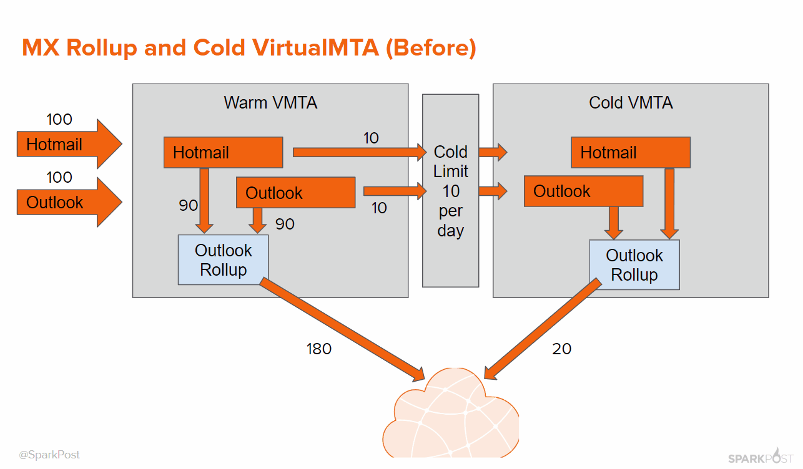

# JSON-Formatted outputs for PowerMTA monitoring commands

New and seasoned developers alike are increasingly adopting JSON format over XML. By providing JSON-formatted outputs, PMTA data is easier to ingest, filter, graph, and generally consume than it would be otherwise. And operationally, working with JSON is easier and often cheaper than using XML.

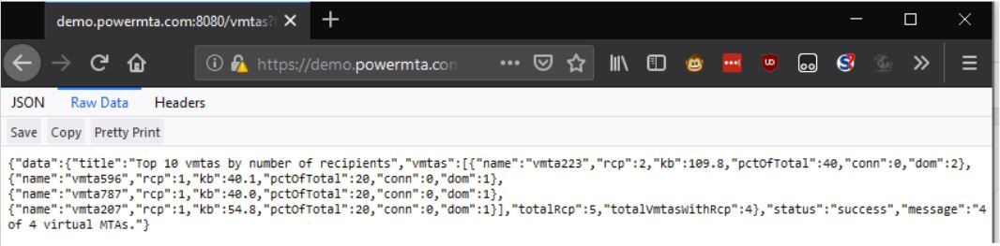

# Outbound Proxy Support 

PowerMTA supports the use of HAProxy protocol for outbound traffic. This allows customers to deploy all their source IPs on an external proxy server instead of being deployed on the individual PowerMTA nodes. The internal PowerMTA nodes will route their email through the correct source IP deployed on proxy node via the use of proxy protocol. This makes it very simple to load balance outbound traffic across multiple PowerMTA nodes. Likewise, if a node is taken down for whatever reason, users will still have access to their full range of IPs.

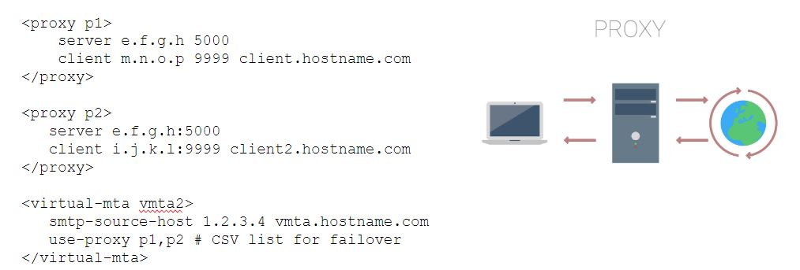

# New User Guide

A revised user guide is now available in HTML format. In addition to the improvements to the Web Monitor, having a User Guide available in a searchable .pdf viewer can make learning the ins-and-out of PMTA a breeze. This is valuable regardless of if you’re a new user just getting started or an experienced user looking to get the most out of PMTA. 

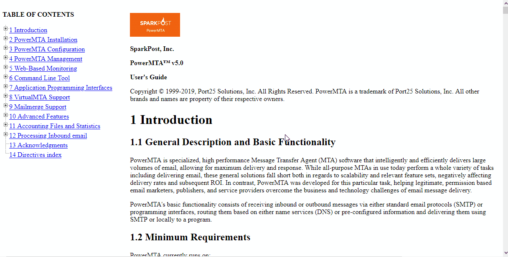

# Opportunistic DANE

DANE stands for DNS-Based Authentication of Named Entities and is now supported by PMTA. It is defined in RFC 7672 and allows digital certificates commonly used for TLS to be bound to domain names. This means that a domain owner is able to specify which Certificate Authorities (CA) are allowed to issue a certificate for a particular resource - combatting the abusive practice where a CA issues certificates for a domain that doesn’t belong to the requesting party. 

# HTTP Delivery Webhooks

Allows emails to be delivered from PowerMTA to a destination endpoint using HTTP/HTTPS. This makes implementing important enhancements such as unsubscribe hooks much easier. 

