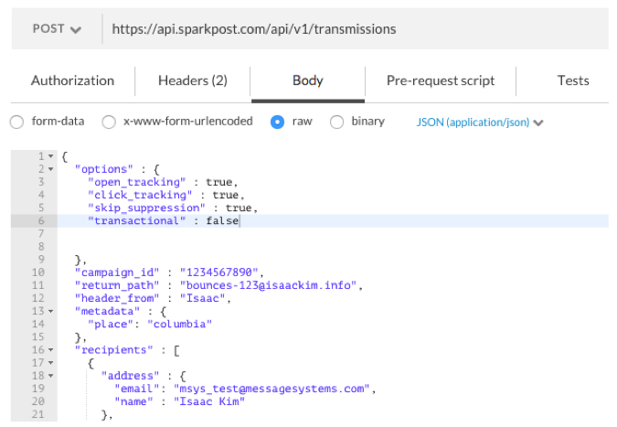
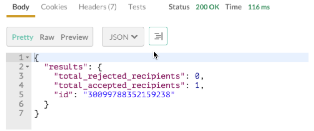

**Note: This Knowledge Base Article Is For SparkPost Enterprise Only**

The skip suppression feature provides the ability to override the suppression of recipient addresses that are listed in the suppression list.  Moreover, this feature allows you to override the intended functionality of the suppression list – namely the checking of recipient addresses on the list before delivery.  This option should be used sparingly and only for those rare circumstances, for example sending legal notices for which you want to guarantee that a delivery has been attempted.  Skip suppression will completely ignore the contents of the suppression list, i.e., messages will be sent whether is has been designated as `non_transactional` or `transactional`.

## Part One: Sending Transmission with Skip Suppression Functionality

The purpose of this article is to demonstrate how to send a message to a given recipient regardless of the contents of the suppression list.

**Step One:**

The skip suppression feature can be enabled in any transmission however, it cannot be enabled within a template.  Within the options object, the skip suppression feature is called as follows:

* **URL:** https://api.sparkpost.com/api/v1/transmissions
* **HTTP Method:** POST

In this example the recipient “msys_test@messagesystems.com” is on the suppression list.  With “skip_suppression” key pair set to true, the e-mail will not be suppressed and the message will be sent to the recipient, i.e., this will “skip” the suppression.

***Note:** By default, the value of the skip_suppression key pair is "false", and does NOT need to be included in the options object if skipping suppression isn't needed for a transmission.*

**Step Two:**

Click “Send” to send the message to the recipient. 

The skip suppression option has been honored and the message will be sent to the recipient even if the recipient’s email address is on the suppression list.

The expected result should be:

***Note:** Regardless of the values of the “non_transactional” and “transactional” options (true/false), if “skip_suppression” option is set to true, the message **WILL** be sent to the recipients.*
