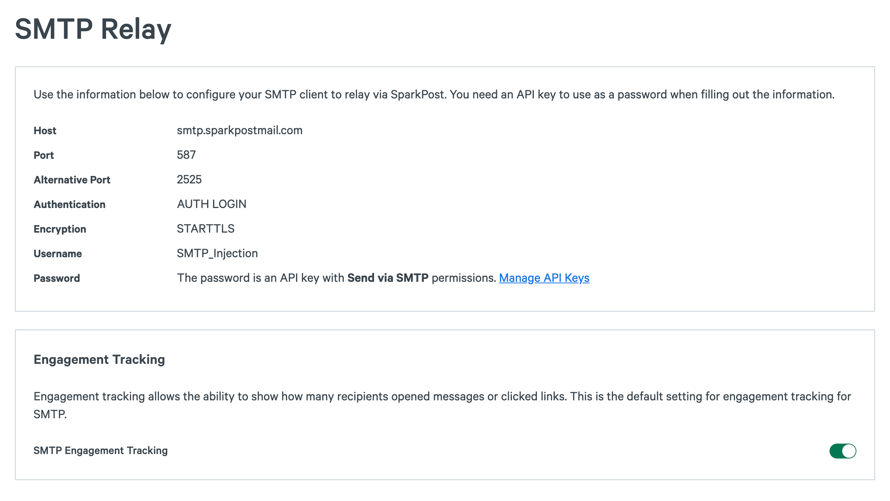

You can control your account’s default setting for tracking of messages submitted via SMTP to be enabled, or disabled.

The option is located under **Configuration** > **SMTP Settings** in the SparkPost app:

Before you make a selection, the system default (Disabled) will apply to your account.

If you have tracking disabled, then you won’t see “open” and “click” events in your event stream (whether via Webhooks, or via the Message Events API). 

What this is actually controlling is whether SparkPost will ‘wrap’ the links in your messages with a Tracking Domain URL, so that your recipients’ browsers will redirect - briefly - via our servers before the final destination.  This allows us to count your recipients’ clicks.

Since 2nd December 2015, the system default is “disabled” for messages injected via SMTP – see [Change Log](https://www.sparkpost.com/docs/tech-resources/change-log-sparkpost/)

## Related Articles

You can also control event tracking from your upstream message source, via our “SMTP API”, as [described here](https://developers.sparkpost.com/api/smtp-api).

You can register [Custom Tracking Domains](https://www.sparkpost.com/docs/tech-resources/enabling-multiple-custom-tracking-domains/) for better message alignment that can improve deliverability.
