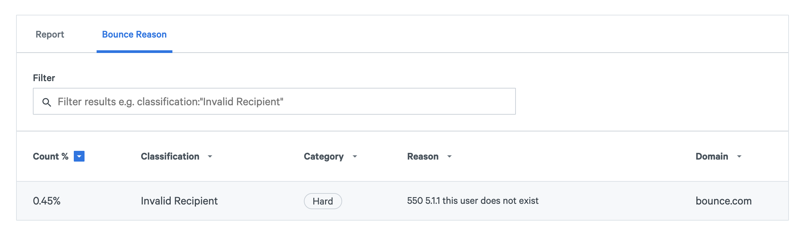
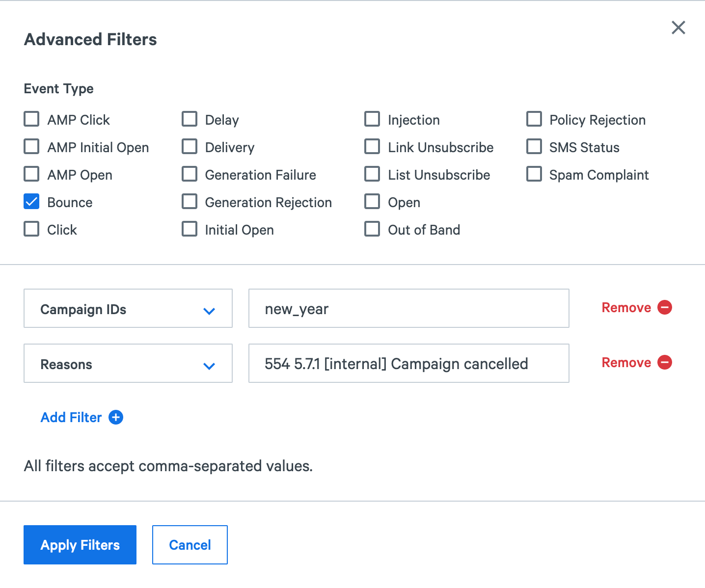

Using the Transmissions API, you can schedule your emails to be delivered up to three days in the future. All you have to do is specify a date and time in your API request, and we will not send your emails until then. Read on to learn more.

## Getting Started

To schedule a transmission, simply set the `options.start_time` field to the desired delivery time in your Transmissions API request. The time should be in ISO-8601 format (`YYYY-MM-DDTHH:mm:ss+-HH:mm`). We strongly encourage you to include a `campaign_id` in your transmission in case you need to cancel it later (more on that below). The `campaign_id` should be the same for your entire campaign; you should not specify a unique `campaign_id` for each transmission. Here is an example transmission that is scheduled to be delivered on January 1, 2021 at 12:00 AM UTC:

```bash
curl -X POST \
  https://api.sparkpost.com/api/v1/transmissions \
  -H 'Authorization: <Your API key>' \
  -H 'Content-Type: application/json' \
  -d '{
  "campaign_id": "new_year",
  "options": {
    "start_time": "2021-01-01T00:00:00+00:00"
  },
  "content": {
    "from": "example@sparkpost.com",
    "subject": "Happy New Year!",
    "text": "Happy New Year from the SparkPost team"
  },
  "recipients": [
    {
      "address": "recipient@sparkpost.com"
    }
  ]
}'
```

## Cancelling Scheduled Transmissions

If you schedule a transmission and later decide that you do not want to send it, then you can cancel it. The Transmissions API allows you to cancel scheduled transmissions by campaign ID. Simply make a `DELETE` request to the Transmissions API, providing the `campaign_id` as a query parameter. If you want to cancel a transmission scheduled by a subaccount, then you must make the request as the subaccount. You can do this by using one of the subaccount's API keys or by setting the `X-MSYS-SUBACCOUNT` header to the subaccount's ID when using a primary account's API key. Here is an example of cancelling all scheduled transmissions in the `new_year` campaign:

```bash
curl -X DELETE \
  'https://api.sparkpost.com/api/v1/transmissions?campaign_id=new_year' \
  -H 'Authorization: <Your API key>'
```

When you cancel transmissions, the API immediately returns a 204 response, and the cancellation process happens asynchronously. Normally, all messages will be cancelled in ten minutes or less. In some rare circumstances, it may take longer than that. For that reason, we highly recommend that you cancel scheduled transmissions far in advance of their scheduled delivery times.

When a message is cancelled, you will receive a bounce event with a reason of "554 5.7.1 [internal] Campaign cancelled". You can use these bounce events to track which messages were cancelled. There are a few different places that you can view these events.

### Viewing Cancellations in the App

Using the SparkPost app, you can quickly see the messages that were cancelled in a campaign. There are a few ways to do this.

#### Using the Bounce Report

The Bounce Report can show you the total number of messages that were cancelled in a campaign. To access it, click on Signals Analytics, then Bounce, and then Admin Bounces. Then, in the search bar, type in your campaign ID. At the bottom of your screen you will see the number of cancellation events that were generated for your campaign.



#### Using Events Search

If you want to inspect individual cancellation events, then you can use Events Search. Click on Events and then Add Filters. Check the box next to Bounce in the Event Type section and select Campaign IDs and Reasons as your filters. In the Reasons field, enter "554 5.7.1 [internal] Campaign cancelled". Finally, click on Apply Filters. You will be presented with a list of cancellation events for your campaign.



### Accessing Cancellations Programmatically

If you want to access cancellations programmatically, then you have a few options.

#### Using the Metrics API

The Metrics API is what powers the Bounce Report described above. You can use the Metrics API to access the total number of messages that were cancelled in a campaign. The example request below can help you get started. It retrieves statistics on bounce events for the `new_year` campaign. In the API response, you want to look at the result that has a `reason` of "554 5.7.1 [internal] Campaign cancelled". The `count_admin_bounce` field represents the total number of cancellations.

```bash
curl -X GET \
  'https://api.sparkpost.com/api/v1/metrics/deliverability/bounce-reason?campaigns=new_year&from=2020-03-19' \
   -H 'Authorization: <Your API key>'
```

#### Using the Events API

Using the Events API, you can retrieve individual cancellation events. This API powers the Events Search feature described above. The example request below retrieves cancellation events for the `new_year` campaign:

```bash
curl -X GET \
  'https://api.sparkpost.com/api/v1/events/message?campaigns=new_year&reasons=Campaign%20cancelled' \
  -H 'Authorization: <Your API key>'
```

#### Using Event Webhooks

You can also receive cancellation events via Event Webhooks. [Click here to learn more about Event Webhooks](https://developers.sparkpost.com/api/webhooks/). 
