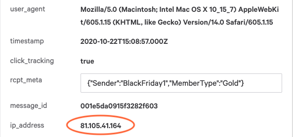

## Overview

SparkPost supports secure tracking domains through the use of content delivery networks (CDNs), reverse proxies, or any method where the customer can host the necessary SSL/TLS certificates.  It is recommended that our customers use SSL as it provides secure transport for engagement data. It's also necessary to support SparkPost engagement tracking with Google’s AMP for Email.

> Alternative: to configure HTTPS engagement tracking using a CDN, see [this article](./enabling-https-engagement-tracking-on-sparkpost).

This post covers how to configure a SparkPost tracking domain, provision an SSL certificate, and be able to use it immediately at SparkPost using a simple reverse proxy.

## Prerequisites

* You have a Linux server that has connection to the internet and is configured as the endpoint for your tracking domain in DNS, if you want to automate certificate creation using Let’s Encrypt.

  This would need to be done before actively using your domain at SparkPost, as changing the DNS while already in use could break your current engagement tracking.

  * If you already have certificates, you can wait and switch DNS at the end once all the work is completed to prevent any interruption in service.

* You have root access on this server for installing software, etc., and that you are using a modern Linux OS with a package manager (I’ll be demoing on Ubuntu 16.04).

This example uses a t2.micro Ubuntu instance on Amazon Web Services and a tracking domain of click.nddurant.com that is CNAME'd to the instance public IPv4 DNS.

Step-by-step instructions follow, for:
* [nginx](#configuring-nginx)
* [Apache](#configuring-apache)

## Migration planning

If you already have non-secure tracking domains in live service, with a `CNAME` direct to SparkPost's tracking endpoints, you need to plan for what happens when users click on links in previously-delivered emails.

The simplest approach is to leave the current tracking-domain in place, and set up a new, sibling tracking-domain pointing to your proxy. For example, if you are using `click.mycompany.com` with a direct CNAME, set up the proxy with `click2.mycompany.com`. This enables you to test your proxy is working before switching over to use it for Production traffic in SparkPost.

If you want to end up with your proxy serving the original domain:
* You'll need your proxy to handle both port 80 (HTTP) and port 443 (HTTPS) requests, so that links in previously delivered mails continue to work
* To minimize disruption, we recommend you test your setup on a sibling domain before switching
* You need to consider your certificates (which may be specific to your subdomain, or may use subdomain wild-card)
* You need to change your DNS setting on the original tracking domain(s) to point to the proxy, only when your proxy is tested and working.

## Configuring nginx

This section uses [nginx](https://www.nginx.com/).  It is easy to get installed and configured as a reverse proxy and Let’s Encrypt for SSL certificates has support for it.  To install nginx, follow the guidelines for your Linux distribution.

Let's Encrypt recommends the use of [**Certbot**](https://letsencrypt.org/getting-started/) to automatically obtain and renew your certificates.

> Note: You may have to perform an apt-get update prior to installing.

```bash
sudo apt-get install nginx
```

On a Debian distribution, this command will install nginx with a sample configuration, located at **/etc/nginx/**.  To enable a reverse proxy back to SparkPost for your tracking domain, see the sample configuration file below (sample tracking domain is click.nddurant.com).

```apacheconf
server { # simple reverse-proxy
   listen       80;
   listen       443 ssl;
   server_name  click.nddurant.com;

   # pass requests for dynamic content to rails/turbogears/zope, et al
   location / {
     proxy_pass      https://spgo.io;
   }
}
```

Creating this file in **/etc/nginx/conf.d** and executing a nginx reload will make the configuration live.

```bash
sudo nginx -s reload
```

## Verify tracking domain, send test email

At this point, if your DNS is pointing to this nginx server, you should be able to verify the tracking domain in SparkPost.  Add your desired tracking domain to your SparkPost account, either through the user interface or [API](https://developers.sparkpost.com/api/tracking-domains/).  Once verified, you can associate the tracking domain with a [sending domain](https://developers.sparkpost.com/api/tracking-domains/#header-association-to-sending-domains-and-defaults) and manually test the tracking links with cURL commands.  The following example is a simple cURL command to send an email through SparkPost with engagement tracking enabled:

```bash
curl -X POST \
  https://api.sparkpost.com/api/v1/transmissions \
  -H 'Accept: application/json' \
  -H 'Authorization: REDACTED' \
  -H 'Content-Type: application/json' \
  -H 'Host: api.sparkpost.com' \
  -d '{
  "options" : {
    "open_tracking" : true,
    "click_tracking" : true,
    "conversion_tracking" : false,
    "transactional": true
  },
  "campaign_id" : "mycampaign",
  "return_path" : "sample@yourdomain.com",
  "header_from" : "Single Recipient",
  "metadata" : {
    "key": "value"
  },
  "recipients" : [
    {
      "address" : {
        "email": "john.doe@yourdomain.com"
      }
    }
  ],
  "content" : {
      "from": {
      "email": "you@yourdomain.com"
    },
    "subject": "Tracking Test",
    "reply_to": "You <you@yourdomain.com>",
    "html" : "<html><h4> Tracking Test </h4> <body><a href=\"http://www.sparkpost.com\">SparkPost Clicktrack</a></body></html>"
  }
}'

```

Once the email is successfully delivered, you should be able to click the link and be successfully redirected to sparkpost.com.  If issues arise, a useful debug method is to right-click on the tracking link in the email and “Copy Link Address”, for use in a cURL command.  This method can show additional information about the **http** session.

```bash
curl -v -X GET http://click.nddurant.com/f/a/Hcv1nwnOfCFeZmc3EvMwsQ~~/AALoUwA~/RgRestfaPwRXA3NwY0IKABvaUtBcfA5Pw1IbbmF0aGFuLmR1cmFudEBzcGFya3Bvc3QuY29tWAQAAAAA?target=http%3A%2F%2Fwww.sparkpost.com
Note: Unnecessary use of -X or --request, GET is already inferred.
*   Trying 52.39.217.5...
* Connected to click.nddurant.com (52.39.217.5) port 80 (#0)
> GET /f/a/Hcv1nwnOfCFeZmc3EvMwsQ~~/AALoUwA~/RgRestfaPwRXA3NwY0IKABvaUtBcfA5Pw1IbbmF0aGFuLmR1cmFudEBzcGFya3Bvc3QuY29tWAQAAAAA?target=http%3A%2F%2Fwww.sparkpost.com HTTP/1.1
> Host: click.nddurant.com
> User-Agent: curl/7.47.0
> Accept: */*
>
< HTTP/1.1 302 Moved Temporarily
< Content-Type: text/plain
< Date: Mon, 06 May 2019 16:28:21 GMT
< Location: http://www.sparkpost.com
< Server: msys-http
< X-Robots-Tag: noindex
< Content-Length: 0
< Connection: keep-alive
<
* Connection #0 to host click.nddurant.com left intact

```

## Get SSL certificate

The next step is to get the necessary SSL certificate in place so that you can enable HTTPS on your configured tracking domain.  Let’s Encrypt can be use to provision free SSL certificates.  These steps are very well outlined by nginx in [this article](https://www.nginx.com/blog/using-free-ssltls-certificates-from-lets-encrypt-with-nginx/).

After completing this, you will have free SSL certificates installed on your nginx server for the desired tracking defined in the `server.conf`.

After the certificate is created, you will be asked if you wish to redirect **http** to **https**.  It is recommended that you do not redirect, as you may wish to change your tracking domain back to **http** in the future if it becomes necessary.

## Set SparkPost tracking domain to "secure"

Once completed, set your tracking domain to “secure” using the [tracking domains API](https://developers.sparkpost.com/api/tracking-domains/#tracking-domains-put-update-a-tracking-domain).  This will make any new emails using your associated tracking domains to use **https** instead of the **http** protocol; instructions [here](enabling-https-engagement-tracking-on-sparkpost.md#switch-to-secure).

Wait a few minutes for propagation, usually around 5 minutes, and send another test email again.  You should see that your link is now starting with **https** instead of **http**.  Again, you should be able to click the link and be redirected to SparkPost.  You could also do the cURL approach mentioned above and see your certificate authenticated.

```bash
curl -v https://click.nddurant.com/f/a/MV0K99nv-x6425iJtSb-qg~~/AALoUwA~/RgResx-JPwRXA3NwY0IKAB-JmtBcCVe9hlIbbmF0aGFuLmR1cmFudEBzcGFya3Bvc3QuY29tWAQAAAAA?target=http%3A%2F%2Fwww.sparkpost.com
*   Trying 172.31.31.57...
* Connected to click.nddurant.com (172.31.31.57) port 443 (#0)
* found 148 certificates in /etc/ssl/certs/ca-certificates.crt
* found 592 certificates in /etc/ssl/certs
* ALPN, offering http/1.1
* SSL connection using TLS1.2 / ECDHE_RSA_AES_256_GCM_SHA384
* 	 server certificate verification OK
* 	 server certificate status verification SKIPPED
* 	 common name: click.nddurant.com (matched)
* 	 server certificate expiration date OK
* 	 server certificate activation date OK
* 	 certificate public key: RSA
* 	 certificate version: #3
* 	 subject: CN=click.nddurant.com
* 	 start date: Mon, 06 May 2019 17:28:17 GMT
* 	 expire date: Sun, 04 Aug 2019 17:28:17 GMT
* 	 issuer: C=US,O=Let's Encrypt,CN=Let's Encrypt Authority X3
* 	 compression: NULL
* ALPN, server accepted to use http/1.1
> GET /f/a/MV0K99nv-x6425iJtSb-qg~~/AALoUwA~/RgResx-JPwRXA3NwY0IKAB-JmtBcCVe9hlIbbmF0aGFuLmR1cmFudEBzcGFya3Bvc3QuY29tWAQAAAAA?target=http%3A%2F%2Fwww.sparkpost.com HTTP/1.1
> Host: click.nddurant.com
> User-Agent: curl/7.47.0
> Accept: */*
>
< HTTP/1.1 302 Moved Temporarily
< Server: nginx/1.10.3 (Ubuntu)
< Date: Mon, 06 May 2019 20:37:51 GMT
< Content-Type: text/plain
< Content-Length: 0
< Connection: keep-alive
< Location: http://www.sparkpost.com
< X-Robots-Tag: noindex
<
* Connection #0 to host click.nddurant.com left intact
```

## Optional: Nginx security settings and tuning

* Support the newer, more efficient `http2` protocol between your proxy and the client.

* Select which TLS versions and ciphers should be offered to your client; anything older than TLSv1.2 is now [considered insecure](https://www.sparkpost.com/blog/upgrading-tls-1-2/).

* Pass the client IP to SparkPost engagement tracking, so that your click events give the correct IP and geo-location information for the person clicking the link.

  This requires the NGINX module [`http_realip`](http://nginx.org/en/docs/http/ngx_http_realip_module.html) to be installed. Check you have this using the command
  ```
  nginx -V
  ```

* Suppress NGINX giving version/OS information on error pages.


The updated configuration file is:
```apacheconf
server { # simple reverse-proxy
    listen       80;
    listen       443 ssl http2;
    server_name  click.nddurant.com;
    ssl_certificate      /etc/letsencrypt/live/click.nddurant.com/fullchain.pem; # managed by Certbot
    ssl_certificate_key  /etc/letsencrypt/live/click.nddurant.com/privkey.pem; # managed by Certbot

    # Security improvements
    ssl_protocols TLSv1.2;
    ssl_prefer_server_ciphers on;
    ssl_ciphers ECDH+AESGCM:ECDH+AES256:ECDH+AES128:DH+3DES:!ADH:!AECDH:!MD5;

    # pass all other requests through to SparkPost engagement tracking
    location / {
        proxy_pass      https://spgo.io;
        proxy_set_header X-Forwarded-For $remote_addr; # pass the client IP to the open & click tracker
        server_tokens off; # suppress NGINX giving version/OS information on error pages
    }
}
```

Once done, you should get an "A" rating for your tracking domain(s) on the [SSL Labs server test](https://www.ssllabs.com/ssltest/analyze.html). You may wish to adjust these to suit your own IT policy, e.g. to accept TLS v1.1 as well, for compatibility with older clients.

### Check NGINX log files

If your proxy is working as expected, the `access_log` file will contain records such as:

```log
66.249.93.55 - - [22/Oct/2020:19:44:06 +0000] "GET /q/dTQ8riSBz-pkMhoxuXiAKw~~/AAAEAgA~/RgRhdGX6PlcDc3BjQgoAK_rgkV9bo5TJUhdib2IubHVtcmVla2VyQGdtYWlsLmNvbVgEAAAAAA~~ HTTP/1.1" 200 44 "-" "Mozilla/5.0 (Windows NT 5.1; rv:11.0) Gecko Firefox/11.0 (via ggpht.com GoogleImageProxy)" "-"
81.105.41.164 - - [22/Oct/2020:19:45:14 +0000] "GET /f/open-in-app/0Y6UTAhVwx-JEnEF7sntYQ~~/AAAEAgA~/RgRhdGX6P0UPZ2V0dGluZ19zdGFydGVkRC9odHRwczovL3d3dy5zcGFya3Bvc3QuY29tL2RvY3MvZ2V0dGluZy1zdGFydGVkL1cDc3BjQgoAK_rgkV9bo5TJUhdib2IubHVtcmVla2VyQGdtYWlsLmNvbVgEAAAAAA~~ HTTP/2.0" 302 0 "-" "Mozilla/5.0 (Macintosh; Intel Mac OS X 10_15_7) AppleWebKit/605.1.15 (KHTML, like Gecko) Version/14.0 Safari/605.1.15" "-"
```

This shows:
* A GET request from a mail client (in this case via Google Image Proxy), fetching a SparkPost open pixel. The request was forwarded to SparkPost and received a `200` (OK) response.
* The second GET request is a link click. The IP address is of the mail client (in this case, Gmail in Safari). Again it's forwarded to SparkPost and received a `302` (Found) response, redirecting the client to the landing page.

Finally, [check your client IP address](#nginx-and-apache-check-client-ip-address) and user_agent is reported in SparkPost.


---

## Configuring Apache

This section describes how to use [Apache](https://httpd.apache.org/) as a reverse proxy for SparkPost HTTPS engagement tracking.

Add the following configuration (putting your own tracking domain into the `ServerName` line):

```apacheconf
<VirtualHost _default_:80>
  ServerName yourtrackingdomain.example.com
  ServerPath "/"
  ProxyPass "/" "http://spgo.io/"
  ProxyPassReverse "/" "http://spgo.io/"
</VirtualHost>
```


* [Verify](#verify-tracking-domain-send-test-email) tracking domain, and send test email.

* Get SSL certificate. Letsencrypt certificates can be issued using "certbot", which automates the process - see [here](https://certbot.eff.org/all-instructions) for detailed steps on many platforms.

## Add HTTPS proxy configuration

Create an additional port 443 proxy configuration as follows. Set the  certificate & key file paths to suit your own configuration.

```apacheconf
<VirtualHost _default_:443>
  ServerName yourtrackingdomain.example.com
  SSLEngine on
  SSLCertificateFile "/opt/apache2/conf/server.crt"
  SSLCertificateKeyFile "/opt/apache2/conf/server.key"
  ServerPath "/"
  ProxyPass "/" "https://spgo.io/"
  ProxyPassReverse "/" "https://spgo.io/"
  SSLProxyEngine on
</VirtualHost>
```

Ensure your have `https:` in the `ProxyPass` and `ProxyPassReverse` lines.

* [Set SparkPost](#set-sparkpost-tracking-domain-to-secure) tracking domain to "secure" and verify. Continue steps below when done.

* If you are going to use HTTPS tracking _only_, you could remove the initial `_default_:80` configuration block.

### Optional: Apache security settings and tuning

Apache has their own security tips page [here](https://httpd.apache.org/docs/2.4/misc/security_tips.html). Here's a (non-exhaustive) example:

* Select which TLS versions and ciphers should be offered to your client; anything older than TLSv1.2 is now [considered insecure](https://www.sparkpost.com/blog/upgrading-tls-1-2/).

```apacheconf
# Only offer TLS v1.2 and above, remove weaker ciphers
Listen 443
SSLProtocol all -SSLv2 -SSLv3 -TLSv1 -TLSv1.1
SSLHonorCipherOrder on
SSLCipherSuite "EECDH+ECDSA+AESGCM EECDH+aRSA+AESGCM EECDH+ECDSA+SHA384 EECDH+ECDSA+SHA256 EECDH+aRSA+SHA384 EECDH+aRSA+SHA256 EECDH !aNULL !eNULL !LOW !3DES !MD5 !EXP !PSK !SRP !DSS !EDH !RC4"
```

Once done, you should get an "A" rating for your tracking domain(s) on the [SSL Labs server test](https://www.ssllabs.com/ssltest/analyze.html). You may wish to adjust these to suit your own IT policy, e.g. to accept TLS v1.1 as well, for compatibility with older clients.

### Check Apache log files

If your proxy is working as expected, the `access_log` file will contain records such as:

```log
66.249.93.2 - - [22/Oct/2020:15:06:36 +0000] "GET /q/LNLi23IQwaclLxzLGCLgCQ~~/AAAEAgA~/RgRhdCVdPlcDc3BjQgoAHl2gkV8ygvYDUhdib2IubHVtcmVla2VyQGdtYWlsLmNvbVgEAAAAAA~~ HTTP/1.1" 200 44
81.105.41.164 - - [22/Oct/2020:15:07:09 +0000] "GET /f/open-in-app/6mCU5FqjTSPBCGZY2h0AVw~~/AAAEAgA~/RgRhdCVdP0UGYmFubmVyRBVodHRwczovL3NwYXJrcG9zdC5jb21XA3NwY0IKAB5doJFfMoL2A1IXYm9iLmx1bXJlZWtlckBnbWFpbC5jb21YBAAAAAA~ HTTP/1.1" 302 -
```

This shows:
* A GET request from a mail client (in this case via Google Image Proxy), fetching a SparkPost open pixel. The request was forwarded to SparkPost and received a `200` (OK) response.
* The second GET request is a link click. The IP address is of the mail client. Again it's forwarded to SparkPost and received a `302` (Found) response, redirecting the client to the landing page.

---

### NGINX and Apache: Check Client IP address

Both proxies set the `X-Forwarded-For` header, which enables SparkPost to report the original client IP address. If you look in your SparkPost events, you should see this reported as client `ip_address` and `user_agent`, useful for your analytics.




## Related Articles

* Now that you have **https** tracking domains, you are ready to begin using SparkPost engagement tracking with your [AMP emails](https://www.sparkpost.com/docs/user-guide/amp-for-email/).

* You can use a [CDN with SparkPost tracking domains](https://www.sparkpost.com/docs/tech-resources/enabling-multiple-custom-tracking-domains/) as an alternative to a reverse proxy.

* Set up engagement tracking with the [SMTP API](https://www.sparkpost.com/docs/tech-resources/smtp-engagement-tracking/) for your SMTP traffic to SparkPost.

* If you have a mobile app, and want to enable it to open when a recipient clicks an email link, see [this article](./deep-links-self-serve).

