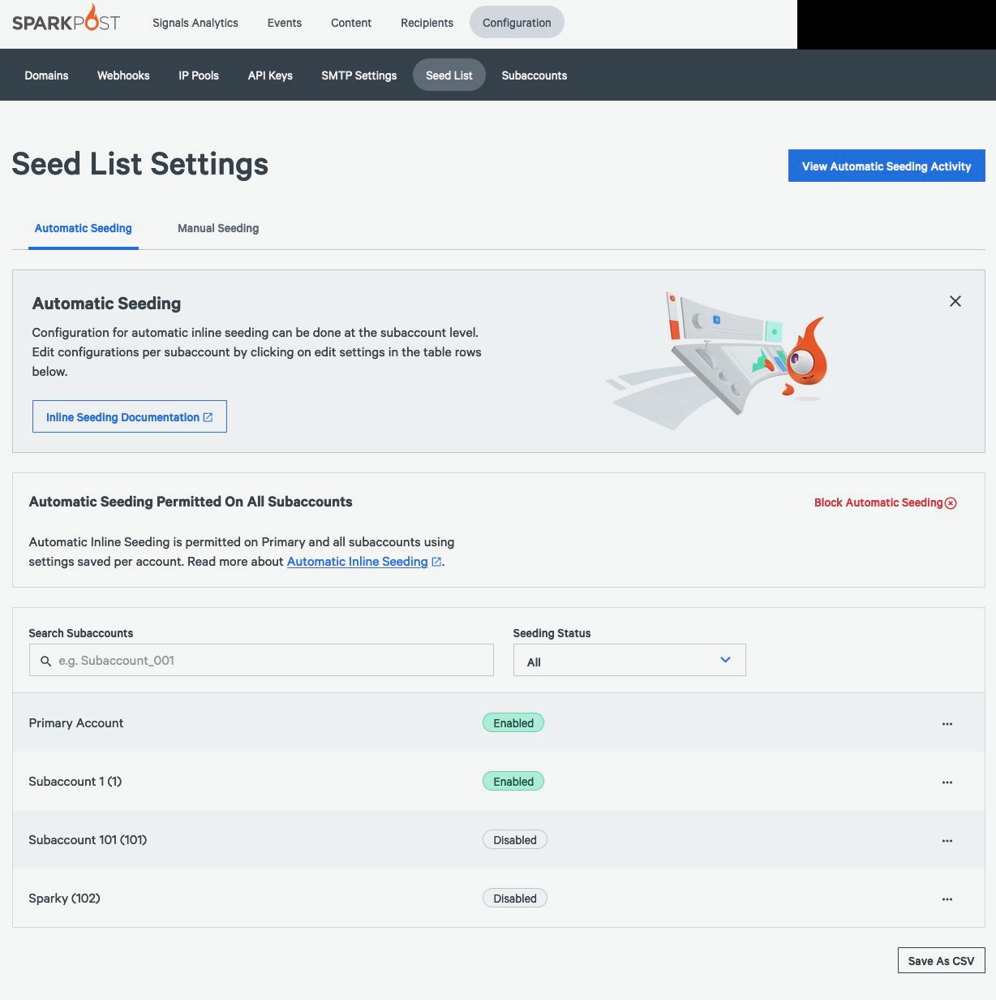
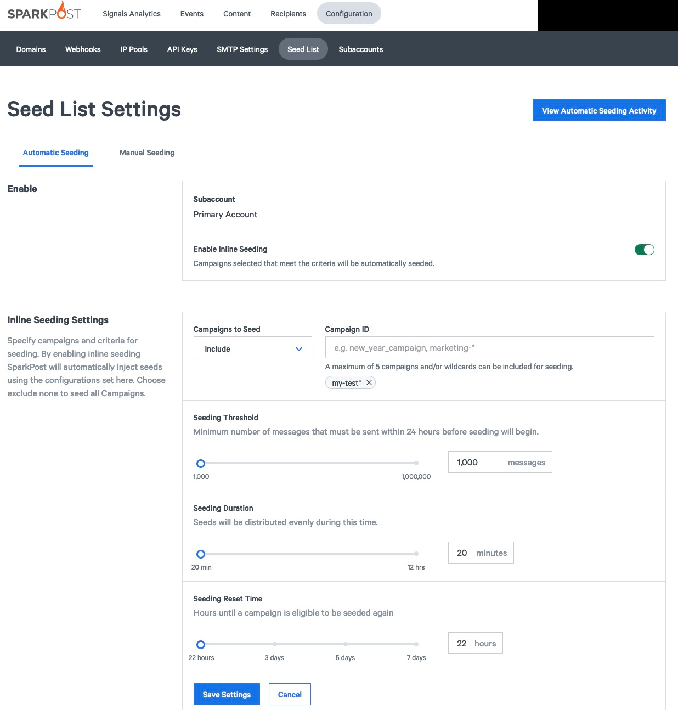
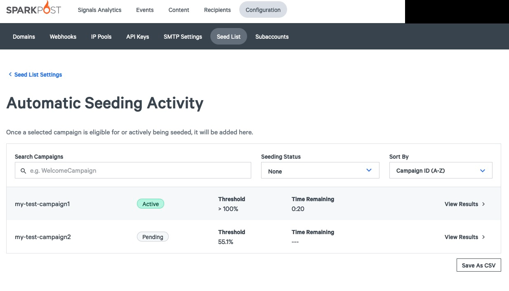
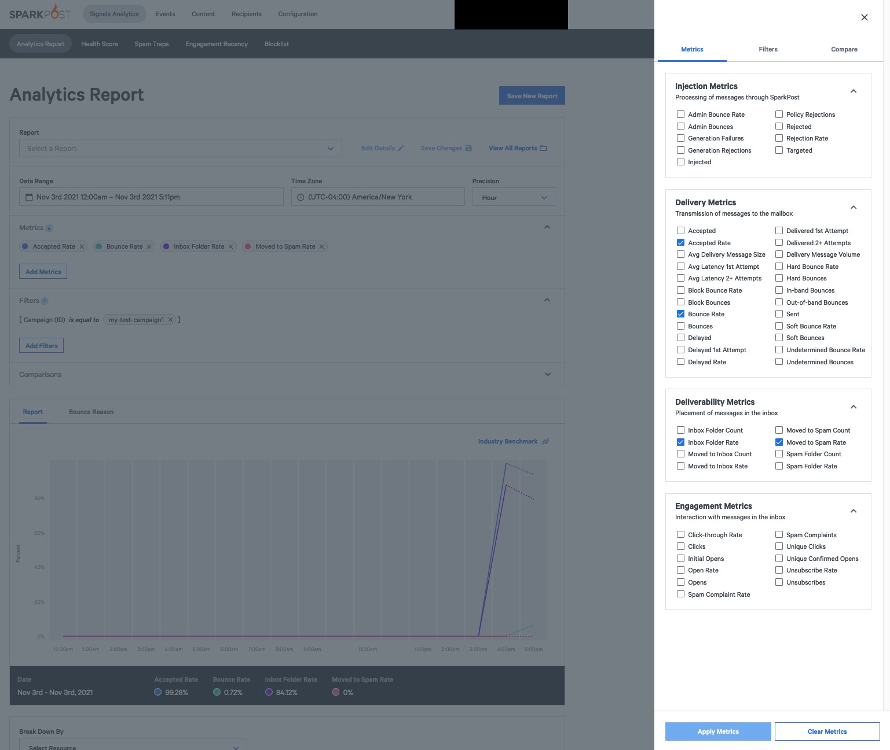
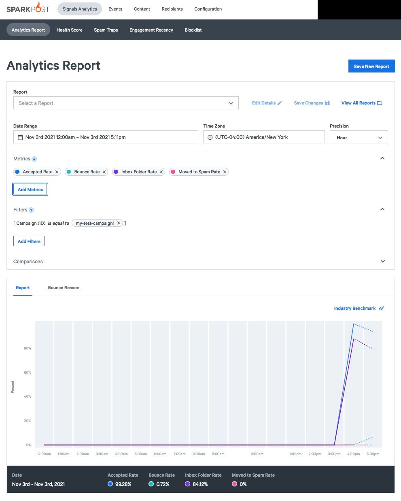

## How to Get Started with Automatic Inline Seeding

Marketers and email delivery experts use “seeding” or “seed listing” to help monitor the health of their email sending campaigns. SparkPost’s Automatic Inline Seeding allows senders to automatically seed campaigns and monitor deliverability data without ongoing effort or involvement from your team.

## What is Seeding
Seeding (or seed listing) is the practice of sending an email to known and monitored inboxes at the same time that you send that same email to your customers or contact list. By sending to known and monitored inboxes, a marketer or email deliverability specialist can analyze how well an email campaign is performing based on whether the email is landing in the Inbox or Spam folders. 

This tool is great for testing out new content - things like new email templates, new Friendly From headers, and new subject lines (How do emojis inbox? 🤔 ). It’s also a great way to check transactional campaigns that don’t change often but might be improved and are critical to your business. 

Seeding is a tool that gives you unique and actionable insight into sending campaigns. A consistent and broad-coverage seeding practice, along with engagement tracking and panel data, provides a great return on investment by allowing content creators to optimize for their desired outcome. If you’re interested in learning more about Seeding or other Deliverability best practices, check out our guide to Deliverability Analytics.

We recommend that you create a seeding strategy that allows you to seed across each sending domain/IP at least once a week. For marketing emails, you may want to seed more often, whereas for transactional emails, once a week is usually sufficient. This will ensure that you always have inboxing data available in your reports and that you can quickly recognize issues should they arise. 


## How to Set Up Automatic Inline Seeding

In order to use Automatic Inline Seeding in SparkPost you must have a SparkPost sending account and paid access to SparkPost Deliverability Analytics. 

### Campaign Setup

Automatic Inline Seeding relies on the `campaign_id` field to group messages and to know which groups of messages should be seeded. You can set `campaign_id` on your messages when sending through API or SMTP.   

A `campaign_id` requires a minimum of 1,000 messages sent before being seeded, to help prevent overseeding (sending to a disproportionately high number of seeds in a campaign). If the campaigns you want to seed are less than 1,000 recipients or if your campaign's duration is too short for our asynchronous seeding processes to complete we recommend continuing to use our manual seeding tool. 

### Getting Started

You can set up Automatic Inline Seeding in the user interface (UI) or using the API. We recommend the UI if your Campaign IDs do not change frequently or if you’re taking the feature for a test drive. 

Using the UI, you can set up five campaign patterns to be seeded in less than 5 minutes! 

The Automatic Inline Seeds API is the best approach if you need ultimate control for deeper integrations, `campaign_id`s that are system-generated and constantly changing, or if you prefer a code-first approach.

### Setting Up Automatic Inline Seeding using the UI 

Navigate to the “Seed List Settings” page through the SparkPost Dashboard > Configurations > Seed List. 



Select the options icon for the account that you want to configure.




### Automatic Inline Seeding Configuration Options
#### Account Selection
* If you’re logged in under the primary account, Account Selection lets you choose which Account you will apply the Automatic Inline Seeding settings to. Only subaccounts with Deliverability Analytics enabled will show in this selection screen. 
* If you’re logged in as a subaccount user, you will not see the Account Selection option. All settings and control will apply directly to the subaccount you are logged in to.

#### Enable Inline Seeding
* This setting lets you quickly turn Automatic Inline Seeding on or off. 
* Toggling this setting to ON will apply the settings to your mailstreams. SparkPost will begin counting messages with a matching `campaign_id` to seed your mailstream when at least 1,000 messages will be sent.
* Toggling this setting to OFF will stop SparkPost from counting any more messages towards your Seeding Thresholds. Your settings will be saved. Toggling this setting to OFF will not stop messages from being sent to seed addresses if the seeding process has already started.

#### Campaigns to Seed 
* This setting lets you to specify which campaigns you want to seed. It is case-sensitive.  
* This setting does not guarantee that these campaigns will be seeded, but it will enable counting of the messages with these campaigns to count towards the Seeding Threshold. 
* The Campaigns to Seed setting allows wildcard matching in some situations.
  * For example: You may choose to use wildcard matching in order to seed all of your marketing campaigns. Set the campaign’s seed setting to `marketing-*` so that any `campaign_id` that started with `marketing-` would be eligible for seeding. 
* You can set up to 5 `campaign_id` patterns to be eligible for seeding at any given time.
* Conversely, you can use the Exclude setting to have SparkPost skip specific campaigns that you do not want to seed; all other campaigns will be seeded.
* SparkPost uses a redaction mechanism to remove potential PII from the emails you send to seed inboxes. This redaction mechanism works by comparing messages with the same `campaign_id` and the obfuscating text or components that are unique. Note that personalization in images may have an impact on results.

#### Seeding Threshold
* The Seeding Threshold sets how many messages should match a specific `campaign_id` before the system should begin seeding. 
* The minimum threshold for seeding is 1,000 messages in a twenty four hour window. This is designed to protect your deliverability and avoid overseeding - an issue that can happen if your campaign includes too high a percentage of seed addresses. 

#### Seeding Duration
* Seeds are distributed evenly across the Seeding Duration. As a best practice, try to match your seeding duration to the approximate time it takes to send your campaign. This will allow detection of changes in deliverability as the campaign is sending.
* For burst campaigns, use the minimum Seeding Duration of 1,000 messages. 
* For ongoing campaigns (examples include password resets, triggered marketing messages, and welcome emails), use a longer Seeding Duration to disperse your seeds over more of your sending.

#### Seeding Reset Time
* The Seeding Reset Time specifies how much time should pass before a `campaign_id` is reseeded.
* The minimum reset time is 22 hours to help avoid overseeding on your IPs. 
* The Seeding Reset Time counter begins counting from the moment a campaign is eligible for seeding.
  * For example: A customer with a burst Daily Newsletter could choose a relatively low Seeding Threshold and a 22 hour Seeding Reset Time to seed their Daily Newsletter every day at about the same time.

### Setting Up Automatic Inline Seeding using the API
To access the Inline Seeds API you need to use an API key with the "inline-seeds/read-write" permission. 

Initializing your configuration via the API is as simple as making the following request, modified to your specific needs.

```
curl --location --request POST 'https://api.sparkpost.com/api/v1/inline-seeds/config' \
--header 'Content-Type: application/json' \
--header 'Accept: application/json' \
--header 'Authorization: <MY_API_KEY>' \
--data-raw '{
   "threshold": 10000,
   "duration": 24,
   "reset": 24,
   "match": [
       "my-seed-test*"
   ]
}'
```

The match array can have up to five entries. Each entry can be appended with an asterisk character to support pattern matching. The above entry would enable Automatic Inline Seeding on campaigns "my-seed-test-one" and "my-seed-test-two".

To check your current configuration you can make a GET request against the same endpoint:
```
curl --location --request GET 'https://api.sparkpost.com/api/v1/inline-seeds/config' \
--header 'Content-Type: application/json' \
--header 'Accept: application/json' \
--header 'Authorization: <MY_API_KEY>'
```

Response:
```
{
   "results": {
       "configs": [
           {
               "threshold": 10000,
               "reset": 24,
               "match": [
                   "my-seed-test*"
               ],
               "exclude": [],
               "duration": 24
           }
       ]
   }
}
```

To update the configuration you can provide the field(s) you want to update in a PUT request. You do not need to specify fields that you do not want to update.

```
curl --location --request PUT 'https://api.sparkpost.com/api/v1/inline-seeds/config' \
--header 'Content-Type: application/json' \
--header 'Accept: application/json' \
--header 'Authorization: <MY_API_KEY>' \
--data-raw '{
   "match": [
       "my-seed-test*",
       "my-new-seed-test*"
   ]
}'
```

Configuration cannot be deleted. Providing an empty array to the "match" field will make it so that no campaigns will be seeded.
Some configuration changes will not take effect until after the next reset period.

Automatic Inline Seeding is paused by default. Check out [our API docs](https://developers.sparkpost.com/api/inline-seeds) for information about how to pause/resume the feature, manage subaccounts, and more!

## Monitoring Activity
The Seeding Activity page is available for you to monitor the progress of the `campaign_id`s that you’ve chosen to seed. This page includes data on the current counts towards the threshold per campaign as well as how much time remains for the threshold to be hit before the count resets. Once a seed event has started, you can use the navigation on the right hand side to jump to the Reports page to see the results for a specific seeding campaign. 




### Viewing Results
Within Signals Analytics (for Deliverability Analytics subscribers), you’ll have access to the eight additional Deliverability Metrics. These are accessed under the “Metrics” tab within the Analytics Report.



You can use the Report Builder to select some or all of these metrics and SparkPost will show the results of your seed results alongside any other metrics you’re plotting. This tool lets you see your inbox rate alongside other critical email health information like acceptance rate, delay rate, and unsubscribe rate to give you a full picture of your email sending.




## Possible Use Case Scenarios

### Diagnosing Email Issues for Your Customers
* A customer contacts your support team to say that they are not receiving a password reset for your site. After confirming that your systems are operational, you choose to seed your password reset campaign. After reviewing the results of this seed test you find that many of your password reset emails have started  going to the spam folder. 
* A proactive approach would be to use the Automatic Inline Seeding functionality to seed your password reset campaign on a regular basis. This way, you could notice sooner that your password reset emails are going to the spam folder more often. This gives you the chance to identify the issue (like bad HTML, broken DKIM records, or a broken link) before it impacts your deliverability. 

### My Campaign_ID is Generated at the Time of Sending
* If the `campaign_id`s you want to seed have a common prefix (for example “marketing”) you can set the Automatic Inline Seeding configuration to seed your `campaign_id`: marketing_* and SparkPost will count all your marketing messages for potential seeding. 
* If your `campaign_id`s are truly unique and have nothing that could be pattern-matched, you can pass the `campaign_id` to the Automatic Inline Seeds API a few seconds before clicking send. SparkPost will take care of the rest once the config is updated or you can use a very relaxed wildcard match. 

### My Campaign_ID’s Don’t Change Often and I want to Seed on a Recurring Basis
* Imagine that you send a weekly newsletter or a regular welcome email. If your `campaign_id`s for these messages do not change often, you can tell SparkPost to seed these campaigns on a regular basis. For example, setting the Seed Reset Time to 7 days will let you seed your `campaign_id`: welcome-email every week and can indicate changes in your deliverability. 
