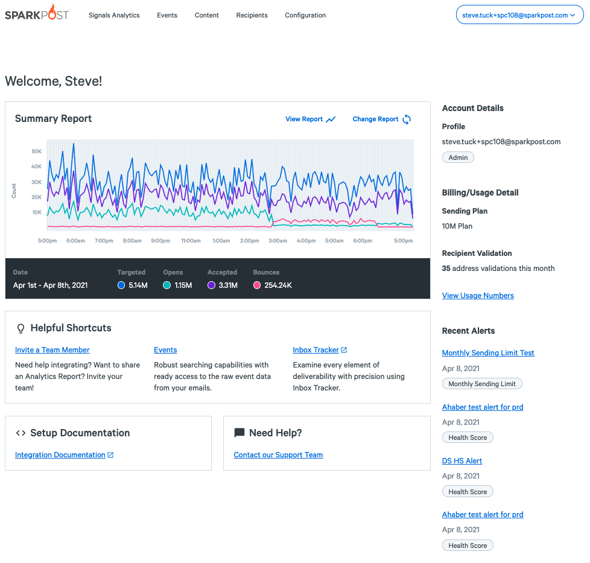

Mailgun Migration Guide Overview
--------------------------------

This Mailgun Migration Guide is for those considering a move from Mailgun (now part of PathWire) to SparkPost. As with our other migration guides, we'll walk through the account setup process and call out any differences along the way, with the goal of reducing the friction on your decision making and migration planning processes.

Terminology
-----------

We'll start with a comparison of terms:

<table>
<tbody>
<tr>
<th>SparkPost term</th>
<th>Mailgun&nbsp;term</th>
</tr>
<tr>
<td>Sink server</td>
<td>Test mode</td>
</tr>
<tr>
<td>Metrics</td>
<td>Stats</td>
</tr>
<tr>
<td>Events</td>
<td>Events (Logs)</td>
</tr>
<tr>
<td>Inbound Relay webhooks</td>
<td>Routes</td>
</tr>
<tr>
<td>Substitution data</td>
<td>Recipient variables / template variables</td>
</tr>
<tr>
<td>Metadata, tags</td>
<td>my-custom-data / X-Mailgun-Variables</td>
</tr>
<tr>
<td>Transmissions</td>
<td>Messages</td>
</tr>
<tr>
<td>Suppression Lists</td>
<td>Suppressions</td>
</tr>
<tr>
<td>Sending domain, bounce domain, tracking domain, inbound domain</td>
<td>Custom Domain</td>
</tr>
<tr>
<td>Recipient Validation</td>
<td>Validations</td>
</tr>
<tr>
<td>Health Score</td>
<td></td>
</tr>
<tr>
<td>Spam Trap Monitoring</td>
<td></td>
</tr>
<tr>
<td>Engagement Recency</td>
<td></td>
</tr>
<tr>
<td>Deliverability Metrics: Inbox Folder and Spam Folder metrics 
<em>(coming soon).</em></td>
<td>Inbox Placement</td>
</tr>
</tbody>
</table>

Where to get help
-----------------

If you're in a hurry, don't have time to read this guide and just want the details, check out our [DevHub](https://developers.sparkpost.com/), [API docs](https://developers.sparkpost.com/api) and [pricing](https://www.sparkpost.com/pricing/). If you have general questions, [take a walk through our support articles](https://www.sparkpost.com/docs/). If you need help, you can open a support ticket [directly from the SparkPost app](https://www.sparkpost.com/docs/faq/submit-a-ticket/).

Signing Up
----------

Sign up for your SparkPost account [here.](https://app.sparkpost.com/join) You can choose the default US-hosted service, or select the EU-hosted service ([more info here](https://www.sparkpost.com/docs/faq/sparkpost-eu-faq/)). On sign-up, your free developer account has a monthly email allowance. You can open both account types if you wish.

If you need separate environments or to send on behalf of multiple clients, you can use subaccounts under a single primary account. This is explained in more detail below.

#### The SparkPost Dashboard

After sign-up and whenever you [sign in](https://app.sparkpost.com/dashboard), you'll see your SparkPost dashboard.  This shows a Summary Report of your sending. You can easily customize the reports in SparkPost, and select your own report to be displayed here.

Under the chart are helpful shortcuts, links to documentation and direct access to open a ticket with our Support Team. On the right, you'll see your account details and billing / usage, with a link to more detail. Below this are your configured alerts that have recently triggered.

Sending Your First Email
------------------------

At this point, you can send email, using the sparkpostbox.com domain in your 'From' address (e.g. "From: something@sparkpostbox.com"). Each SparkPost account has a [small lifetime allowance](https://developers.sparkpost.com/api/transmissions/#header-the-sandbox-domain) of mail from this 'sandbox' domain. This is a little different than Mailgun which creates a "sandbox domain" for you to get started with.

To begin sending real production emails, both Mailgun and SparkPost expect you will use a domain of your own.

If you would like to jump straight in and send your first email, check out the [REST API section](https://www.sparkpost.com/migration-guides/mailgun/#migrating-to-the-rest-api) below.  As with Mailgun, you can also send via [SMTP](https://www.sparkpost.com/migration-guides/mailgun/#sending-mail-over-smtp) if you prefer.

Setting Up A Sending Domain
---------------------------

To begin sending mail from your own domain, you must tell SparkPost about it by adding a sending domain on your account. SparkPost will then check that you own it. You create and manage this from the [Domains](https://app.sparkpost.com/domains/list/sending) menu.

Mailgun's "Custom Domains" group sending, tracking and receiving domain configuration together. SparkPost also provides [sending](https://developers.sparkpost.com/api/sending-domains.html), [bounce](https://developers.sparkpost.com/api/sending-domains/#header-using-a-sending-domain-as-a-bounce-domain), [tracking](https://developers.sparkpost.com/api/tracking-domains.html), and [inbound](https://developers.sparkpost.com/api/inbound-domains.html) domains; our [Getting Started guide](https://www.sparkpost.com/docs/getting-started/getting-started-sparkpost/) walks you through setting these up via the app.

To verify a sending domain, you publish a DKIM DNS record. If this is not possible, you can opt to receive an email to the abuse@ or postmaster@ account for your domain.

*Note: SparkPost only requires that you complete one type of domain ownership verification. However, we recommend that you configure at least DKIM on your domains, as this will improve your domain's reputation, and thus, your chances of consistently hitting the inbox.*

The "Custom Domain" screen in Mailgun asks you to create a set of related DKIM, SPF and MX records for sending. With SparkPost, you create a DKIM (TXT record) and an optional bounce domain (CNAME record). SparkPost ensures custom domain [SPF](https://en.wikipedia.org/wiki/Sender_Policy_Framework) authentication via the CNAME. With SparkPost, MX records are not required for sending; they're needed only if you use Inbound Relay Webhooks.

### Service Providers

If you send on behalf of multiple customers through their own sending domains, you are probably familiar with Mailgun's per domain SMTP and API credentials. SparkPost's analogue is its subaccounts feature, which offers separate credentials, domains, and message events along with an API for programmatic onboarding of your customers. Similar to Mailgun's per domain config, each SparkPost subaccount gets its own API key, and each sending domain a DKIM DNS record. Your customer need only publish the DKIM key in their DNS and then use the API key to start sending email.

Important: Migrate Your Suppression List
----------------------------------------

When you use any modern email service, it will maintain a suppression list of recipients you should not send mail to; for example, people who unsubscribe from your list or complain about your messages, as well as email addresses which are invalid. It's like your own personal "do not call" list.

When switching email providers, it's very important to avoid sending to these addresses again to avoid incurring very high bounce and complaint rates early on. If this happens, we may even have to suspend your account to protect you and our other customers' reputations. Migrating your suppression list from the old service into the new should be one of your first actions.

Mailgun's suppression list collects recipients whose email has bounced, who have complained or who have unsubscribed from your communications. SparkPost's suppression list is similar -- you can [manage it within SparkPost](https://app.sparkpost.com/lists/suppressions) and it also includes an [API endpoint for bulk uploading](https://developers.sparkpost.com/api/suppression-list.html#suppression-list-bulk-insert-update) your suppression list

Migrating to the SparkPost REST API
-----------------------------------

The SparkPost REST API expects JSON requests, in contrast to Mailgun's form-data request formatting. Both respond with JSON. The most commonly used part of the SparkPost API is the [transmissions endpoint](https://developers.sparkpost.com/api/transmissions.html), which is broadly equivalent to Mailgun's messages endpoint since SparkPost transmissions support similar single, batch and scheduled send features.

As a side note, while many Mailgun API endpoints are scoped by sending domain, SparkPost prefers top-level API endpoints in most cases. For example, to send mail from example.com, Mailgun might expect a call to `https://api.mailgun.net/v3/YOUR_DOMAIN_NAME/messages`, a SparkPost user would call `https://api.sparkpost.com/api/v1/transmissions.`

*Note: Mailgun includes mailing lists for maintaining a list of recipients you regularly communicate with. The SparkPost transmissions endpoint is most often used with inline recipients rather than a stored list. SparkPost also has a recipient list capability but it is intended as a short-term cache for your recipient list and not as a database of record for your mailing lists.*

You can call the SparkPost API directly using tools like [Postman](https://developers.sparkpost.com/api/#header-postman), [cURL](https://curl.haxx.se/) or [HTTPie](https://httpie.org/) but it's more common to make HTTPS requests from your own programming language -- see our [developer hub](https://developers.sparkpost.com/) for example code and libraries. If you're not writing your own code, see our [Marketing Campaign partner solutions](https://www.sparkpost.com/partner-category/marketing-campaigns/).

Whichever tools you choose, you will need to [issue yourself an API key](https://www.sparkpost.com/docs/getting-started/create-api-keys/) to start using the SparkPost API. Unlike Mailgun's credential per domain policy, you can create as many API keys as you need, each with their own privileges so you can compartmentalize access rights across your software stack and organization.

Sending Mail Over SMTP
----------------------

SparkPost also accepts email over traditional SMTP -- with a few modern twists. In short, you can set metadata, tags, and configuration options by including a custom header named `X-MSYS-API` in your messages which is roughly analogous to Mailgun's `X-Mailgun-` headers. You can read the full [SparkPost SMTP API reference documentation here](https://developers.sparkpost.com/api/smtp-api.html).

*Note: If you'd like to use advanced features like dynamic message generation with templates and personalization, you should use the REST APIs [transmission](http://developers.sparkpost.com/api/transmissions.html), [template](https://developers.sparkpost.com/api/templates.html) and [substitution](https://developers.sparkpost.com/api/substitutions-reference.html) capabilities.*

Templates
---------

Our templates offer the same basic variable substitution capabilities that are available with Mailgun's recipient and template variables but where Mailgun relies upon fixed key/value pairs, SparkPost substitution data supports structured recipient data. SparkPost's templates also support logic and iteration to translate rich recipient data into customized and preference-driven email content. SparkPost can also store templates within your account for re-use and to separate content management from the API calls that trigger delivery.

It's worth remembering that SparkPost wraps substitution variables with double braces in contrast to Mailgun's percent delimiters. Here are a few example template snippets to show what's possible:

-   Basic substitution: *Hello {{firstName}}*
-   Default values: *Hello {{firstName or 'Captain'}}*
-   Conditionals: *{{if pet.species.name == 'cat'}} Miaow! {{else}} Woof! {{end}*
-   Iteration: *{{each cartItems}} {{loop_var}} {{end}}*

To explore further, you can create, edit and preview your templates (using test substitution data) [within SparkPost](https://app.sparkpost.com/templates) and also using the [templates API endpoint](https://developers.sparkpost.com/api/templates.html).

As well as the usual HTML content, [SparkPost templates](https://www.sparkpost.com/docs/getting-started/creating-template/) can have optional plain-text and [AMP HTML](https://www.sparkpost.com/docs/user-guide/amp-for-email/) parts. The substitution variables work on these parts too.

SparkPost has template [snippets](https://www.sparkpost.com/blog/get-started-snippets-sparkpost-email-templates/). Snippets are modular, reusable content that, once created, can be imported into the HTML, Text, or AMP part of any email template using a `render_snippet` macro call.

SparkPost also supports [A/B testing](https://www.sparkpost.com/docs/tech-resources/a-b-testing-sparkpost/), a common method of comparing templates to see which one performs better. SparkPost provides the means to create automated A/B tests and view completed results.

Tracking Your Email Activity
----------------------------

SparkPost offers two levels of tracking information. The Analytics Report is a richer and more complete form of Mailgun stats -- rolled up, time windowed summaries of your mailing and recipient activity. over 40 metrics are [viewable as customizable time series graphs](https://app.sparkpost.com/signals/analytics) and also available programmatically using our [metrics API endpoint](https://developers.sparkpost.com/api/metrics.html).

The second level of tracking information exposes fine-grained individual activity. This individual activity is also available three ways -- through our [Events Search](https://www.sparkpost.com/docs/reporting/message-events/) interface,  by making use of the [events API endpoint](https://developers.sparkpost.com/api/events/), or by creating a [webhook](https://www.sparkpost.com/docs/tech-resources/webhook-data-streams/) which pushes event data to your own systems.

### Analytics Report

Your SparkPost account includes an [extensive set of aggregate metrics](https://developers.sparkpost.com/api/metrics.html) for tracking your email activity. You can review [summary reports](https://app.sparkpost.com/signals/analytics), including a breakdown of bounces and engagement (our term for opens and clicks), and more. All of these reports can be narrowed by time window. If you choose to set a campaign ID on your transmissions, metrics can also be filtered using those campaign ID values and by other fields such as recipient domain and IP pool. See the links above for a complete list of querying, filtering and comparison capabilities.

All SparkPost aggregate metrics are stored on your account for 6 months.

#### Message Events and Webhooks

SparkPost's events API endpoint provides similar functionality (and then some!) to Mailgun's logs/events capability: [Events Search](https://www.sparkpost.com/docs/reporting/message-events/) provides a view of the last 10 days of events on your account. Those events are available in pull fashion by querying the [events API endpoint](https://developers.sparkpost.com/api/events/) directly and in push fashion if you use [webhooks](https://www.sparkpost.com/docs/tech-resources/webhook-data-streams/).

SparkPost retains events for ten days; Mailgun starter accounts retain events for five days.

Mailgun supports a single webhook per domain and event type. On SparkPost, you may create multiple webhooks, each filtered to receive one or more types of events. You can also create webhooks to [push the events relating to individual subaccounts](https://www.sparkpost.com/docs/user-guide/subaccounts/#summary-of-subaccount-features).

Here's a mapping of each Mailgun event to its SparkPost message event equivalent(s):

<table>
<tbody>
<tr>
<th>Mailgun event</th>
<th>SparkPost event</th>
</tr>
<tr>
<td>accepted</td>
<td>injection</td>
</tr>
<tr>
<td>rejected</td>
<td>policy_rejection, generation_rejection</td>
</tr>
<tr>
<td>delivered</td>
<td>delivery</td>
</tr>
<tr>
<td>failed</td>
<td>bounce, out_of_band</td>
</tr>
<tr>
<td>opened</td>
<td>open, initial_open, amp_open, amp_initial_open</td>
</tr>
<tr>
<td>clicked</td>
<td>click, amp_click</td>
</tr>
<tr>
<td>unsubscribed</td>
<td>list_unsubscribe, link_unsubscribe</td>
</tr>
<tr>
<td>complained</td>
<td>spam_complaint</td>
</tr>
<tr>
<td>stored</td>
<td>–</td>
</tr>
</tbody>
</table>

SparkPost has a single format for all event types, whereas Mailgun has "Webhooks" and "Legacy Webhooks" formats.

SparkPost engagement tracking (opens and clicks) is enabled by default, and can be controlled for templates, individual messages (and specific links in a message) using [API options](https://developers.sparkpost.com/api/transmissions/#header-request-body). Mailgun open and click tracking is disabled by default, and is controlled through per-domain options in your account setup.

#### Events documentation

The SparkPost API includes embedded documentation, in the form of JSON specifications for the [events API](https://developers.sparkpost.com/api/events/#events-documentation) and [webhooks](https://developers.sparkpost.com/api/webhooks/#webhooks-documentation).

### Metadata

SparkPost provides metadata and tag facilities for labelling your email activity with information from your application, similar to Mailgun's `my-custom-data` API field and `X-Mailgun-Variables` SMTP header.

You can provide metadata with your transmissions, [both at the request level](https://developers.sparkpost.com/api/transmissions.html#header-transmission-attributes) and for [each individual recipient](https://developers.sparkpost.com/api/recipient-lists.html#header-recipient-attributes), with recipient metadata overriding the top-level values. As with Mailgun, any metadata you provide at message send time will later be available in all events relating to that message, both through message events and webhooks.

*Note: If you use SMTP, metadata and tags can also be set using the X-MSYS-API message header.*

Inbound Email
-------------

SparkPost's relay webhooks process and forward email addressed to an HTTP endpoint you control, much like using Mailgun's routes mechanism and its `forward()` action. Each relay webhook accepts SMTP traffic on your behalf, and forwards JSON-encoded messages to you over HTTP. SparkPost's relay webhooks are conceptually simpler than Mailgun's routes in that any matching, filtering or storage must take place in your HTTP service.

*Note: SparkPost requires that you *[*register your inbound domain*](https://developers.sparkpost.com/api/inbound-domains.html)* before you can receive inbound mail through a relay webhook.*

Subaccounts
-----------

On SparkPost [plans](https://www.sparkpost.com/docs/faq/difference-between-starter-and-premier/) above "starter" level, you can create [subaccounts](https://www.sparkpost.com/docs/user-guide/subaccounts/) to support separate business units, mail streams or individual customers. Each subaccount has its own suppression list, and can have its own API keys, sending domains, templates etc. You can run reports / analytics by subaccount, get raw message event data by subaccount, get aggregated statistics, create webhooks per subaccount and so on.

In addition you can enable your subaccount users to have permission to inject messages for delivery via their individual subaccount, and to use [the API](https://developers.sparkpost.com/api/subaccounts/) to access subaccount-specific resources.

User Roles
----------

Mailgun and SparkPost both enable you to create users with specific roles. The SparkPost roles are: Admin, Developer, Templates, and Reporting, described [here](https://support.sparkpost.com/docs/user-guide/managing-users).

Alerts
------

Your Mailgun account alerts you by email when approaching your account sending limit. In SparkPost, you can [set up alerts](https://www.sparkpost.com/docs/user-guide/alerts/) to track the following metrics:

-   Block Bounce Rate
-   Hard Bounce Rate
-   Soft Bounce Rate
-   Monthly Sending Limit
-   Health Score

Alerts can send notifications via email, Slack, and webhooks.

Dedicated IPs, IP Pools, and auto-warmup
----------------------------------------

SparkPost enables you to deliver email via IP addresses dedicated to your account (or subaccount). Similar to Mailgun, addresses are managed via [IP Pools](https://www.sparkpost.com/docs/deliverability/managing-dedicated-ip-pools/). Addresses can be set to [automatically warm up](https://support.sparkpost.com/docs/user-guide/automated-ip-warmup) over time, which is helpful in building a clean sender reputation as you migrate messages across.

Health Score and other SparkPost Analytics features
---------------------------------------------------

These advanced analytics features are available in your SparkPost account, and don't have a direct equivalent in the Mailgun dashboard.

-   [Health Score](https://www.sparkpost.com/docs/reporting/health-score/)
-   [Spam Trap Monitoring](https://www.sparkpost.com/docs/reporting/spam-trap-monitoring/)
-   [Engagement Recency](https://www.sparkpost.com/docs/reporting/engagement-recency/)

Mailgun paid accounts provide "inbox placement" monitoring that you can schedule at additional cost, using seed tests.

What next?
----------

If you have an issue with your SparkPost account, you can [check out our support articles here](https://www.sparkpost.com/docs/) and [contact our Support team directly from your app dashboard](https://app.sparkpost.com/dashboard).
