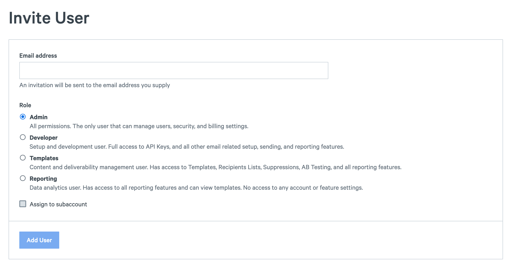
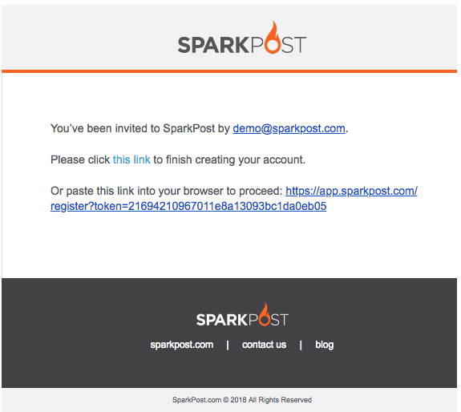

You can invite members of your team to join your SparkPost account. Each user will have a role that defines what they have access to. There are four roles you can chose from when inviting a new user:

**Admin**: Full access user. Admins have all permissions available and are the only users that can manage users, security, and billing settings.

**Developer**: Powerful setup and development user. Developer users are able to create and edit API Keys and have access to all email related account settings.

**Templates**: Content and campaign management user. These users can manage Templates, AB Tests, Recipient Lists, Suppressions. They also have view only access to Domains, Subaccounts, IP Pools, and all reporting and analytics features.

**Reporting**: Data analytics user. They have access to all reporting features and view only access to Domains, Subaccounts, and IP Pools. Reporting users can't edit any account or feature settings. Reporting users can optionally be assigned to a specific subaccount.

### Adding Users To Your Account

Admin users can add new users to their account by from the [Manage Users](https://app.sparkpost.com/account/users) ([EU](https://app.sparkpost.com/account/users)) page.

1. Click on **Invite User** button.
2. Enter the new user's email in the Email address input.
3. Select the role you'd like the new user to have.
4. Click **Add User** to send them the invitation.

	

5. The new user will receive an email to join your account similar to the one below.

	
	
### Subaccount Users
*Limited access. Reach out to our support team or your Technical Account Manager to have this option enabled for your account.

Reporting Users can optionally be assigned to a specific subaccount. Check the "assign to subaccount" box when creating the user and then select the subaccount. Learn more about subaccounts and subaccount users [here](https://www.sparkpost.com/docs/user-guide/subaccounts/).

Only Reporting Users support subaccount assignment at this time.

Subaccount UI access is available to use for free internally within your company and can be made available to your customers via a reseller agreement.
