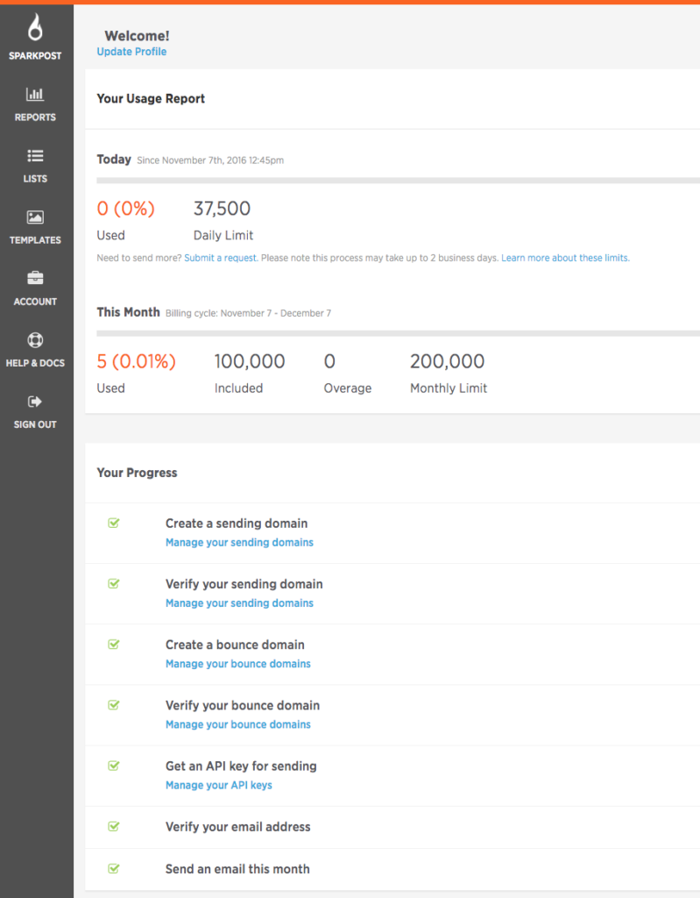

SendGrid Migration Guide Overview
---------------------------------

This SendGrid Migration Guide is here to help make your move from SendGrid to SparkPost as smooth as possible. We'll walk through the key setup steps and highlight the differences in technology and terminology along the way.

Terminology
-----------

First here's a quick primer on the main terminology differences between the two services.

<table>
<tbody>
<tr>
<th>SparkPost term</th>
<th>SendGrid term</th>
</tr>
<tr>
<td>Transmission</td>
<td>mail</td>
</tr>
<tr>
<td>Recipients</td>
<td>personalizations</td>
</tr>
<tr>
<td>Metrics</td>
<td>stats</td>
</tr>
<tr>
<td>Message events</td>
<td>bounces, invalid emails, block, spam reports</td>
</tr>
<tr>
<td>Metadata</td>
<td>custom args</td>
</tr>
<tr>
<td>Tags</td>
<td>categories</td>
</tr>
<tr>
<td>Sending domain</td>
<td>domain whitelabel</td>
</tr>
<tr>
<td>Subaccount</td>
<td>subuser</td>
</tr>
<tr>
<td>Relay webhook</td>
<td>Inbound parse webhook</td>
</tr>
<tr>
<td>X-MSYS-API header</td>
<td>X-SMTPAPI header</td>
</tr>
</tbody>
</table>

Where To Get Help
-----------------

If you're in a hurry, don't have time to read this SendGrid Migration Guide and just want the gritty details, check out our [DevHub](https://developers.sparkpost.com/), [API docs](https://developers.sparkpost.com/api/) and [pricing](https://www.sparkpost.com/pricing/). If you have general questions, [take a look through our support articles](https://support.sparkpost.com/).

Signing Up
----------

Sign up for your SparkPost account [here](https://app.sparkpost.com/sign-up). The first visible difference here is that all API features are available on all plans. That means you can purchase dedicated IPs and use subaccounts (our name for subusers) straight off the bat. Then you can select [add-ons](https://www.sparkpost.com/pricing/) to meet your needs.

Note: Please create only a single SparkPost account for your organization. If you need separate environments or to send on behalf of multiple clients, please use subaccounts. Both of these are explained in more detail below.

#### Sidebar: The SparkPost Dashboard

After sign-up and whenever you [sign in](https://app.sparkpost.com/dashboard), you'll see your SparkPost dashboard.  Along with your daily and monthly usage reports, the dashboard includes a section named 'Your Progress'. The steps outlined there form a useful 'onboarding' checklist so do take a moment to review.

Sending Your First Email
------------------------

At this point, you can send email provided you use the *sparkpostbox.com* domain in your 'From' address (e.g. "From: something@sparkpostbox.com"). Each SparkPost account has a 50-email, lifetime allowance of mail from this 'sandbox' domain and it's meant as an easy exploration and testing feature. To begin sending real production emails, SparkPost assumes you will use a domain of your own. This is a little different than SendGrid which lets you send email from your own domain but 'via' a shared SendGrid domain.

If you would like to jump straight in and send your first email, check out the [REST API section](https://www.sparkpost.com/migration-guides/sendgrid/#migrating-to-the-rest-api) below.  You can also send via [SMTP](https://www.sparkpost.com/migration-guides/sendgrid/#sending-mail-over-smtp) if you prefer.

Setting Up A Sending Domain
---------------------------

*Terminology: SG: whitelabeled domain -- SP: sending domain*

To begin sending mail from your own domain, you must configure a sending domain within your account so SparkPost can verify that you own it. You can create and manage your sending domains from [Sending Domains](https://app.sparkpost.com/account/sending-domains) in the Accounts menu.

To verify your sending domain, you can opt to receive an email to the *abuse@* or *postmaster@* account for your domain or you can publish SPF or DKIM DNS records for it.

*Note: SparkPost only requires that you complete 1 type of domain ownership verification. However, we recommend that you configure both SPF and DKIM on your domains, as it will improve your domain's reputation, and thus, your chances of consistently hitting the inbox.*

### Sidebar: Service Providers

*Terminology: SG: subuser -- SP: subaccount*

Are you sending mail on behalf of many customers from lots of different domains? SparkPost has a subaccounts feature for just this situation. SparkPost's REST API is the way to go for onboarding your customers and configuring their sending domains. You can [create a subaccount](https://developers.sparkpost.com/api/subaccounts.html#subaccounts-subaccounts-collection-post) and [sending domain](https://developers.sparkpost.com/api/sending-domains.html#sending-domains-create) programmatically for each customer. Each subaccount gets an API key and each sending domain a DKIM key. Your customer need only publish the DKIM key in their DNS and then use the API key to start sending email.

Important: Migrate Your Suppression List
----------------------------------------

When you use any modern email service, it will maintain a *suppression list* of recipients you should not send mail to; for example, people who unsubscribe from your list or complain about your messages, as well as email addresses which are invalid. It's like your own personal "do not call" list.

When switching email providers, it's very important to avoid sending to these addresses again to avoid incurring very high bounce and complaint rates early on. If this happens, we may even have to suspend your account to protect you and our other customers' reputations. Migrating your suppression list from the old service into the new should be one of your first actions.

Happily, you can use the [SparkPost CLI](https://github.com/SparkPost/sparkpost-cli) to migrate your SendGrid suppression list into SparkPost.

Migrating to the SparkPost REST API
-----------------------------------

*Terminology: SG: mail -- SP: transmission*

*Terminology: SG: personalizations -- SP: recipients*

The most commonly used part of the SparkPost API is the [transmissions API endpoint](https://developers.sparkpost.com/api/transmissions.html), which is broadly equivalent to SendGrid's v3 mail API. A SparkPost transmission is a mailing to one or more recipients, with substitution data for personalization, metadata for tracking, and templates that can be stored ahead of time or specified inline with your transmission. Be sure to include the campaign ID with your transmissions. You can filter SparkPost reports by campaign ID after the fact when you want to review mailing performance.

The rest of the API lets you track mail at the event level, extract aggregate metrics, and manage your account. Check out the [SparkPost API reference documentation](https://developers.sparkpost.com/api/) for details.

You can call the SparkPost API directly using tools like [cURL](https://curl.haxx.se/) or [HTTPie](https://httpie.org/) but it's more common to use one of our official client libraries:

-   [php-sparkpost](http://github.com/SparkPost/php-sparkpost)
-   [python-sparkpost](http://github.com/SparkPost/python-sparkpost)
-   [node-sparkpost](http://github.com/SparkPost/node-sparkpost)
-   [java-sparkpost](http://github.com/SparkPost/java-sparkpost)
-   [go-sparkpost](https://github.com/SparkPost/gosparkpost)
-   [elixir-sparkpost](https://github.com/SparkPost/elixir-sparkpost)

Our thriving developer community also maintains libraries for other languages and platforms including [C#](https://github.com/darrencauthon/csharp-sparkpost) and [Ruby](https://github.com/search?l=Ruby&q=sparkpost&type=Repositories&utf8=%E2%9C%93).

Whichever tools you choose, you will need to [issue yourself an API key](https://app.sparkpost.com/account/credentials) to start using the SparkPost API. You can create as many API keys as you need, each with their own privileges so you can compartmentalize access rights across your software stack and organization.

Sending Mail Over SMTP
----------------------

*Terminology: SG: X-SMTPAPI -- SP: X-MSYS-API*

SparkPost also accepts email over traditional SMTP -- with a few modern twists. In short, you can set metadata, tags, and configuration options by including a custom header named X-MSYS-API in your messages. You can read the full [SparkPost SMTP API reference documentation here](https://developers.sparkpost.com/api/smtp-api.html).

*Note: If you'd like to use advanced features like dynamic message generation with templates and personalization, you should use the REST API's *[*transmission*](http://developers.sparkpost.com/api/transmissions.html)*, *[*template*](https://developers.sparkpost.com/api/templates.html)* and *[*substitution*](https://developers.sparkpost.com/api/substitutions-reference.html)* capabilities.*

Templates
---------

[SparkPost templates](https://developers.sparkpost.com/api/substitutions-reference.html) are conceptually simpler than SendGrid's transactional templates but with a more powerful featureset including [conditional logic](https://developers.sparkpost.com/api/substitutions-reference.html#header-if-then-else-syntax), [iteration](https://developers.sparkpost.com/api/substitutions-reference.html#header-array-iteration), and [fine grained link tracking controls](https://developers.sparkpost.com/api/substitutions-reference.html#header-personalized-links). You can also use rich substitution data with SparkPost templates including arrays and nested objects allowing personalization options and simpler integration with your own applications.

Here are a few example template snippets to show what's possible.

-   Basic substitution: *Hello {{firstName}}*
-   Default values: *Hello {{firstName or 'Captain'}}*
-   Conditionals: *{{if pet.species.name == 'cat'}} Miaow! {{else}} Woof! {{end}}*
-   Iteration: *{{each cartItems}} {{loop_var}} {{end}}*

You can create, edit and preview your templates (using test substitution data) [within SparkPost](https://app.sparkpost.com/templates) and also using the [templates API endpoint](https://developers.sparkpost.com/api/templates.html).

*Note: where SendGrid versions templates, SparkPost has a draft and a published version of each template, allowing you to edit and send at the same time.*

Tracking Your Email Activity
----------------------------

SparkPost offers 2 levels of tracking information. The first is aggregate metrics which are broadly equivalent to SendGrid stats -- rolled up, time windowed summaries of your activity. These are [viewable as customizable time series graphs](https://app.sparkpost.com/reports/summary) and also available programmatically using our [metrics API endpoint](https://developers.sparkpost.com/api/metrics.html). The second level of tracking information exposes the more fine-grained individual activity used to build our aggregate metrics. This individual activity is also available two ways -- through our [message events](https://app.sparkpost.com/reports/message-events) interface, or by making use of our message events API endpoint and [webhooks](https://app.sparkpost.com/account/webhooks) features which let you process the data however you like.

#### Metrics

*Terminology: SG: stats -> SP: metrics*

Your SparkPost account includes an [extensive set of metrics](https://developers.sparkpost.com/api/metrics.html) for tracking your email activity. You can review [summary reports](https://app.sparkpost.com/reports/summary), a [breakdown of bounces](https://app.sparkpost.com/reports/bounces) and [engagement](https://app.sparkpost.com/reports/engagement) (our term for opens and clicks), and more.  All of these reports can be narrowed by time window, down to the minute, by campaign ID, which you can set on each transmission, and by other fields such as recipient domain and IP pool. See the documentation linked above for a complete list of querying and filtering capabilities.

#### Message Events and Webhooks

SparkPost's message events API endpoint provides similar functionality (and then some!) to SendGrid's bounce, invalid email, and spam report APIs: the [message events report](https://app.sparkpost.com/reports/message-events) is a searchable view of the last 10 days of events of all types. Those events are available in pull fashion by [querying the message events endpoint directly](https://developers.sparkpost.com/api/message-events.html#message-events-message-events-get) and in push fashion if you use [the webhooks facility](https://developers.sparkpost.com/api/webhooks.html). The SparkPost webhooks facility is, on the surface, similar to the SendGrid one but with far richer per-event detail including bounce classification details, geolocation info, delivery latency numbers and more. For app integration, we recommend webhooks since they offer resilient, low latency, near-real-time access to events as they happen.

### Sidebar: Events Specifications

The SparkPost API includes embedded JSON specifications and sample event generation services for both [message events](https://developers.sparkpost.com/api/message-events.html#message-events-events-samples) and [webhooks](https://developers.sparkpost.com/api/webhooks.html#webhooks-events-samples-get).

#### Metadata

*Terminology: SG: custom args -- SP: metadata*

*Terminology: SG: categories -> SP: tags*

SparkPost offers metadata and tags as mechanisms for labeling your email activity with information from your application, similar to SendGrid's custom args and categories features.

You can provide metadata with your transmissions, both at the top level and for each individual recipient, with recipient metadata overriding top-level values. Any metadata you provide at message send time will later be available in all events relating to that message.

*Note: metadata can also be set using the X-MSYS-API message header when sending with SMTP.*

Inbound Email
-------------

*Terminology: SG: inbound parse webhook -- SP: relay webhook*

SparkPost's relay webhooks process and forward email addressed to a domain you control, very similar to SendGrid's "inbound parse" mechanism. Each relay webhook accepts SMTP traffic on your behalf, and forwards JSON-encoded messages to you over HTTP.

*Note: SparkPost requires that you *[*register your inbound domain*](https://developers.sparkpost.com/api/inbound-domains.html)* before you can receive inbound mail through a relay webhook.*
