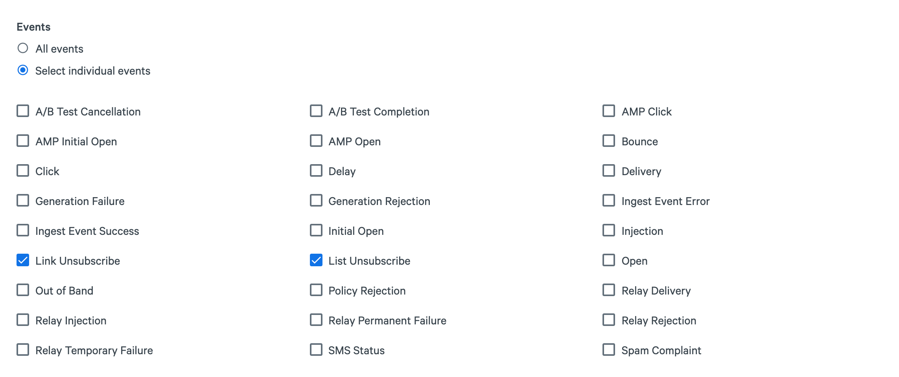

## How to Implement Link Unsubscribe and List Unsubscribe Events

### Link Unsubscribe Example

To use the link unsubscribe, simply add a link in your email in the following format:

```html
<a data-msys-unsubscribe="1"
   href="YOUR_APP_UNSUBSCRIBE_HANDLER"
   title="USEFUL_NAME">UNSUBSCRIBE_LINK_DISPLAY_NAME</a>
```

`YOUR_APP_UNSUBSCRIBE_HANDLER` is the webpage where we will redirect the user once they click on the unsubscribe link, e.g. the "Sorry to see you go" page.

For the plain text part, use the following format:

```
http://www.yourdomain.com[[data-msys-unsubscribe="1"]]
```

That's it. When users click on this link to unsubscribe, your webhook consumer will receive a `link_unsubscribe` event.

### List Unsubscribe Example

List unsubscribes are triggered from within the ***email client*** when a customer clicks on the Unsubscribe button in the email client. **Every** non-transactional email from SparkPost has a properly formatted `List-Unsubscribe` entry in the email's header. To use this feature, you just need to listen to the list-unsubscribe webhook events.

## Example Implementation

### Scenario

You have one or more recipients who have opted-in to your one-to-many emails (such as a newsletter). You are good email citizens and have included CAN-SPAM information in your one-to-many (bulk) email transmissions. The CAN-SPAM information contains an Unsubscribe link as required.

1. A targeted recipient no longer wishes to receive email and clicks on the Unsubscribe link in your email (opt-out).
1. A targeted recipient no longer wishes to be part of a distribution list and clicks on their email client's Unsubscribe feature to stop receiving (opt-out) of messages from this list.

### A Solution

Our [Suppression List API](https://www.sparkpost.com/api#/reference/suppression-list "Suppression List API Documentation") provides an easy way for developers to manage the list of people who SHOULD NOT be delivered email during non-transactional transmissions. SparkPost's **List Unsubscribe** and **Link Unsubscribe** event types added to the Message Category Webhook (see [Webhooks API](https://www.sparkpost.com/api#/reference/webhooks) for more information, in particular the Event-To-Field Mapping for Message Events Category) make it easy for your mobile/web application to monitor for these events and take the appropriate action for that recipient.

[Create a webhook](https://www.sparkpost.com/docs/user-guide/defining-webhooks/) or update an existing webhook to include the **List Unsubscribe** (and/or) the **Link Unsubscribe** event types in the Message Category.

#### In the SparkPost UI



* [Creating a Webhook using the API](https://developers.sparkpost.com/api/webhooks.html#webhooks-create-post)
* [Updating an existing Webhook using the API](https://developers.sparkpost.com/api/webhooks.html#webhooks-update-and-delete-put)

Once your webhook has been created or updated, you will want to [verify the webhook is validated](https://developers.sparkpost.com/api/webhooks.html#webhooks-validate-post) and the consumer is ready to start receiving the updated payload. 

Once your webhook is configured to start sending out the `link_unsubscribe` and `list_unsubscribe` events, your webhook consumer should be configured to start listening for these unsubscribe events. When one of these events comes through it will have the following data footprint:

#### Link Unsubscribe Webhook Event Example

```json
{
  "msys": {
    "unsubscribe_event": {
      "template_version": "VERSION_NUMBER_OF_TEMPLATE",
      "template_id": "TEMPLATE_ID_VALUE",
      "ip_address": "IP_ADDRESS_OF_THE_UNSUBSCRIBE_SOURCE",
      "target_link_url": "HREF_OF_UNSUBSCRIBE_LINK",
      "timestamp": "UNIX_TIMESTAMP_WHEN_UNSUBSCRIBE_CLICK_OCCURRED",
      "rcpt_tags": [
        "ARRAY_OF_STRINGS_IN_TAGS_PROPERTY_OF_TRANSMISSION"
      ],
      "customer_id": "YOUR_SPARKPOST_ACCOUNT_ID",
      "transmission_id": "SPARKPOST_TRANSMISSION_ID",
      "user_agent": "USER_AGENT_STRING",
      "type": "link_unsubscribe",
      "rcpt_meta": {
        "META_KEYS": "META_VALUES"
      },
      "message_id": "MESSAGE_ID",
      "rcpt_to": "RECIPIENT_EMAIL_ADDRESS",
      "accept_language": "en-US,en;q=0.8",
      "target_link_name": "NAME_OF_UNSUBSCRIBE_LINK"
    }
  }
}
```

#### List-Unsubscribe Webhook Event Example

```json
{
  "msys":{
    "unsubscribe_event":{
      "type": "list_unsubscribe",
      "mailfrom": "FROM_ADDRESS_USED_DURING_DELIVERY",
      "friendly_from": "FROM_ADDRESS_DISPLAYED_TO_RECIPIENT",
      "rcpt_to": "RECIPIENT_EMAIL_ADDRESS",
      "customer_id": "YOUR_SPARKPOST_ACCOUNT_ID",
      "transactional": "1_EQUALS_YES_0_EQUALS_NO",
      "rcpt_tags": ["TAGS_USED_IN_TRANSMISSION"],
      "rcpt_meta": {
        "key": "value"
      },
      "transmission_id": "TRANSMISSION_ID",
      "template_id": "TEMPLATE_ID_VALUE",
      "node_name": "mta1",
      "message_id": "MESSAGE_ID",
      "template_version": "TEMPLATE_VERSION_NUMBER",
      "timestamp": "UNIX_TIMESTAMP"
    }
  }
}
```

Once you have either the List-Unsubscribe or Link Unsubscribe webhook events flowing to your webhook consumer, you just need to handle those events and [use your suppression list](https://www.sparkpost.com/api#/reference/suppression-list) to keep your recipient list healthy and your sending reputation in top form!
