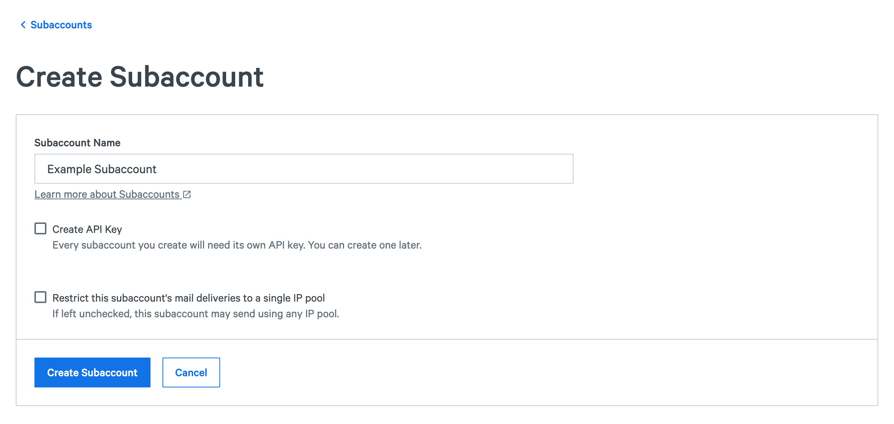
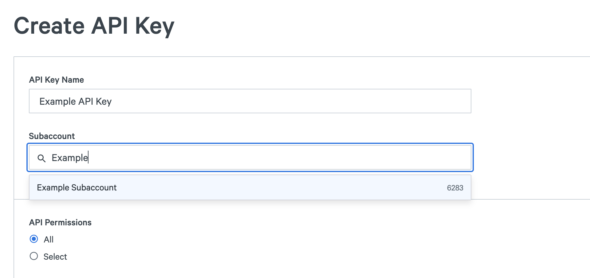
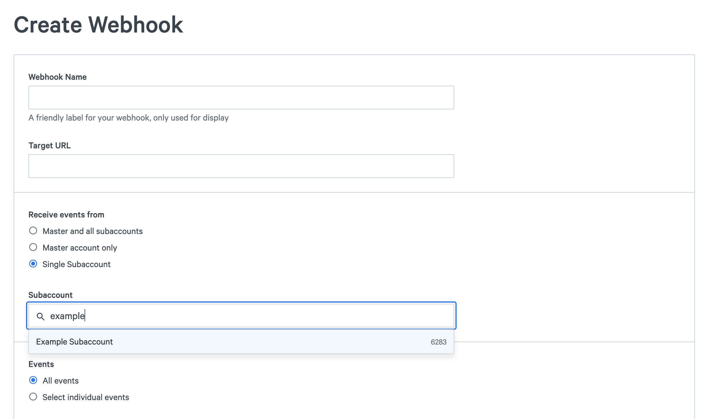
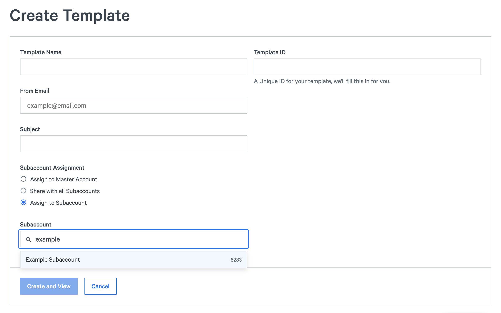

## Table of Contents

Use these links to jump to certain sections of this article

* [Overview](#overview)
* [Terminology](#terminology)
* [Summary of Subaccount Features](#summary-of-subaccount-features)
* [Use Cases](#use-cases)
* [Primary Account: Managing Subaccounts](#primary-account-managing-subaccounts)
* [Primary Account: Reporting by Subaccount](#primary-account-reporting-by-subaccount)
* [Primary Account: Operating on Behalf of a Subaccount](#primary-account-operating-on-behalf-of-a-subaccount)
* [Subaccount Self Service​](#subaccount-self-service)
* [Subaccount UI Access​](#subaccount-ui-access)

### Overview

This article is intended for primary account administrators (not subaccount users).  It introduces our subaccount functionality in SparkPost and SparkPost Enterprise. The subaccount functionality will allow you to support separate business units, mailstreams, or customers (if you are an email service provider) all from within your SparkPost account. Subaccounts enable you to give each of these units direct access to the SparkPost messaging service APIs.

### Terminology

**Primary Account** - This refers to the top-level organization from which all subaccounts originate.

**Subaccounts** - The individual entities you create in order to support separate business units, mail streams or individual customers.

**Subaccount Assets** - Data elements that belong solely to a subaccount, such as suppression lists, API keys, sending domains, templates, etc.

### Summary of Subaccount Features

You will have the ability to:

* Provision and manage access for individual subaccounts (includes providing an API key, allowed sending domains, etc.)
* Run reports in the app by subaccount
* Get raw message event data by subaccount
* Get aggregated statistics by subaccount using the Metrics API
* Separate suppression lists by subaccount automatically
* Create a webhook that will only receive raw event data for a subaccount
* Identify the subaccount on each raw event in the webhook data stream
* Create, edit, view, and use templates by subaccount

In addition, your subaccount users will be able to:

* Inject messages via SMTP
* Inject messages via REST API transmissions (inline templates and inline single/multiple recipients only)
* Set up their own sending domains via the API
* Get raw message event data via the API
* View and manage the suppression list via the API​
* Create their own webhook via the API
* Create, edit, view, and use templates via the API
* Access [Signals Analytics](https://www.sparkpost.com/docs/reporting/signals-analytics/) via the UI

### Use Cases

Subaccounts can be used in a variety of ways depending on your needs. The most common reason to set up subaccounts is to give each unit the ability to access/use SparkPost separately (using different sending domains and API keys) and to separate their reporting data accordingly.

The following is a list of potential, common use cases for using subaccounts:

*   You are a service provider for multiple unique customers.
*   You have unique internal business units who operate independently from one another.
*   You have a particular mailstream/campaign that is mission critical and you wish to track and sequester its data separately from other mailstreams/campaigns.

### Primary Account: Managing Subaccounts

**Creating Subaccounts**

Administrators within your business can create as many subaccounts as needed. Creating a subaccount can be done either via the app or the subaccounts API. When a subaccount is initially created, an API key unique to that subaccount will be created with your chosen permissions, unless you have elected to not create an initial API key via the app or API (see note immediately below). Additional subaccount API keys must be created using the app.

**Note**: You have the option to skip the initial creation of an API key when first creating a subaccount. This operation can be done via the app or the API. The following is a screenshot of the app skipping initial subaccount API key creation. Note the checkbox stating "create API key" is unchecked, which has removed all API key options from the app.

For documentation on how to skip API key generation upon initial subaccount creation by using the "setup_api_key" boolean string, please click [here.](https://developers.sparkpost.com/api/subaccounts.html#subaccounts-subaccounts-collection-post)

**Note**: Subaccounts cannot be nested beneath other subaccounts.

This is how subaccount creation appears in the app:

The following is a list of permissions supported for subaccount API keys:

* Send outbound messages via SMTP
* Send outbound messages via REST API transmission (inline templates and inline single/multiple recipients only)
* Sending domains (read/write)
* Tracking domains (read/write)
* Message Events API (read only)
* Suppression list (read/write) 
* Event Webhooks (read/write)
* Templates (read/write/preview)

**Default IP Pool Configuration**

**Note**: If you do not have dedicated IPs, you should not set default IP Pools.

After creating a subaccount, the primary account has the option of assigning a default IP Pool to the subaccount.  All messages injected by the subaccount will then automatically use that IP Pool. This means that subaccount transmissions do not need to specify the ip_pool value.  Subaccounts will receive an error if they attempt to specify an ip_pool value which differs from the assigned default IP pool.  The assignment of the subaccount's default IP pool can be performed through either the subaccounts app or subaccounts API endpoint.

**Note**: Minimal validation is done against the value set in the IP pool ID key/field. If a mismatch error occurs, all attempted messages from that subaccount will be rejected.

**Note**: If you do not set a default IP pool for a subaccount, the subaccount may use any of the account's IP pools.  If no  IP Pool is specified in the subaccount's transmission, SparkPost will use the account level default IP pool. If the account  does not have any dedicated IPs, the SparkPost shared IP Pool will be used.

**Permissions**

Primary account Admin and Developer users can create subaccounts. Primary account Templates and Reporting users can see information about all subaccounts. Reporting Users can optionally be assigned to a specific subaccount instead of the primary account - more information on this below in "Subaccount UI Access".

Learn more about user roles [here](https://www.sparkpost.com/docs/user-guide/managing-users/).

**Subaccount Statuses**

Administrators can also choose to edit the subaccount name, or change the subaccount status. There are three types of statues possible for a subaccount:

* **Active** - the subaccount can use all permissions granted with their API key
* **Suspended** - the subaccount permissions are changed to read-only. The subaccount cannot send messages any longer, and they cannot use create, edit, or delete operations. The subaccount can still view and retrieve assets in this state.
* **Terminated** - this status functions the same as suspended, but implies a permanent status change. Primary accounts can use this status to indicate that the subaccount is no longer a valid customer/business unit/message stream. Currently there is no support for deletion of subaccounts.

**What to Provide Subaccount Users**

All that you need to give your customer/subaccount user(s) is the subaccount API key - they will use it for all operations afforded via the default API key created upon subaccount creation.

You may optionally choose to create a Subaccount Reporting User login if you would like them to be able to access the SparkPost UI directly.

### Primary Account: Reporting by Subaccount

Primary accounts can filter reporting by a single subaccount in the app. These reports include:

* Summary
* Bounces
* Rejections
* Accepted
* Delayed
* Engagement​

The primary account can also filter reporting by a single subaccount in the API if a subaccount query string is added. This includes data found in the:​

* Message Events API
* Metrics API 

Subaccount event data is provided via webhooks and the message events API. The subaccount_id key/value pair indicates which subaccount the event is attributed. You can use this attribute to filter/manage raw events by subaccount outside of SparkPost. Please note, you can create a webhook to stream only raw event data for a specific subaccount.

### Primary Account: Operating on Behalf of a Subaccount

For each of the APIs listed below, the primary account may perform several operations on behalf of the subaccount. If you wish to perform an action on behalf of a subaccount, you must include the X-MSYS-SUBACCOUNT HTTP header (SMTP injection is an exception; see below) with the value set to the subaccount ID associated with the selected subaccount.

**Sending Domain**

The primary account may provision sending domains on behalf of the subaccount using the app or sending domains API by including the X-MSYS-SUBACCOUNT HTTP header.

When a sending domain is created it will be associated with the designated subaccount provided in the X-MSYS-SUBACCOUNT HTTP header (API) or the subaccount field in the app. If the header is not included in the API call, the sending domain will instead be associated to the primary account.

If you wish to associate a sending domain to a different subaccount, the sending domain must be deleted and re-created with the desired subaccount ID assigned to it.

**Note**: The primary account can create a sending domain and leave it assigned to the primary account. The primary account can then set a flag in either the API or the app to indicate that the sending domain can be used by all of their subaccounts and the primary account. In the API, the field is called "shared with subaccounts" and in the app, there is a checkbox labeled "**share with subaccounts**                 ". One of these must be enabled in order for both the primary account and all subaccounts to be able to use the same sending domain.

**Tracking Domains**

The primary account can perform CRUD (create/read/update/delete) operations on tracking domains for subaccounts in both the app and API.

* The primary account may assign a tracking domain to a subaccount upon creation.
* The primary account has the option to filter the list of tracking domains by subaccount.
* The primary account may verify a subaccount tracking domain if they have access to the DNS record.

The primary account has the ability to link a tracking domain to a sending domain. This option is located on the sending domains page. **Note**: Both the sending domain and tracking domain must both be assigned to the same subaccount. Also, tracking domains that are linked to the "shared" sending domains can also be used by all the subaccounts.

If the "Hide Subaccounts" checkbox is checked on the tracking domains page in the app, only primary account tracking domains will be displayed.

The primary account has the ability to set a default tracking domain for a subaccount. Only verified tracking domains can set as default. Note: Subaccounts can have more than one tracking domain assigned to them. If the subaccount does not have an associated tracking domain, it will use the primary account default tracking domain.

**Suppression Lists**

The primary account may update a subaccount's suppression list using the suppression list API with the X-MSYS-SUBACCOUNT HTTP header included. Suppression list API calls without the X-MSYS-SUBACCOUNT HTTP header will be executed against the primary account's suppression list.

Subaccount traffic is checked against the subaccount's suppresion list only, and does not check against the primary account's suppression list. If a primary account wants an address suppressed across all subaccounts, each subaccount suppression list must be updated accordingly.

**Transmissions API**

The primary account may send as the subaccount with the transmission API by including the X-MSYS-SUBACCOUNT HTTP header. If the header is not present, the transmission will be executed as the primary account.

**SMTP Injection**

The primary account may submit traffic on behalf of the subaccount SMTP by providing the subaccount's API key with an SMTP grant in the TLS auth-password field. **Note**: The primary account can send using a primary account API key by appending the standard "SMTP_Injection" user with the subaccount ID. Please refer to [the documentation](https://developers.sparkpost.com/api/?_ga=1.144252341.1033930248.1481562971#/introduction/smtp-relay-endpoints) for specifics on how to perform this operation.

**Event Webhooks**

The primary account may create a webhook as the subaccount with the webhooks API by including the X-MSYS-SUBACCOUNT HTTP header. If the header is 0 only events for non-subaccounts will be posted.  If the header is not present, the webhook contain all events for the account.

When creating new webhooks within the app, leaving the subaccount field blank will cause the created webhook to contain all events for the account. When selecting Primary Account, the webhook will only contain events for non-subaccounts. Selecting a subaccount will result in the webhook containing events from that subaccount only.

**Templates**

The primary account can create templates via the API and assign it to a single subaccount by using the X-MSYS-SUBACCOUNT HTTP header, or share it with all subaccounts using a primary account API key. Templates can also be created on behalf of subaccounts using the SparkPost app in the "Templates" page, as per the screenshot below:

**Notes on subaccount template usage:** If a primary account creates a template and does not elect to share it with subaccounts, only the primary account may use that template. If the template is shared with all subaccounts, every subaccount has access to use the template, but only the primary account has edit permissions. If the primary account creates a template on behalf of a subaccount and assigns it to a single subaccount, both the primary account and subaccount can use and edit that template.

### Subaccount Self Service

Subaccounts have limited access to system operations, data, and assets. The access will be limited to the API key permissions you provide to the subaccount. Subaccounts can only retrieve their own message events data, which is sourced from the message events API.

* The following APIs have self-service subaccount support; they will only be available for use by the subaccount if they have been assigned the appropriate permission by the primary account:
* SMTP API - SMTP injections
* Transmission API - REST injections (inline templates and single/multiple inline recipients only)
* Message Events API
* Sending Domains API
* Tracking Domains API
* Suppression List API
* Event Webhooks API
* Templates API

Sending domain and tracking domain functionality afforded to subaccount users are create, edit, and delete, as well as being able to verify their own sending domain/tracking domain. Subaccounts can also edit and retrieve their unique suppression lists, as well as create, edit, and delete their own templates.

**Note**: When making API requests for the above reports, the subaccount does not need to specify the subaccount ID in their payloads. Even if this is included, no matter the value, it will always be overwritten since the subaccount ID is tied to the API key associated with it. Due to this restriction, a subaccount will not be able to spoof a different subaccount ID and get access to any other subaccount's or primary account's data or assets.

### Subaccount UI Access
*Limited access. Reach out to our support team or your Technical Account Manager to have this option enabled for your account.

Users with the "Reporting" role can be assigned to a specific subaccount. These users only have access to information about that subaccount within the SparkPost UI. They can access Signals analytics and event data. They also have read-only access to templates and snippets associated with their specific subaccount or shared with all subaccounts.

Other details to keep in mind:
* Subaccount Reporting users can see their subaccount name and ID in the app.
* A Reporting user can only be assigned to a subaccount at account creation. If you want to assign a current user to a specific subaccount, you will need to delete and re-add the user.
* A Reporting user cannot be switched to a different subaccount or be changed to a the primary account. If you want to make these changes, you will need to delete and re-add the user.
* A Reporting user can only be assigned to a single subaccount.

Subaccount UI access is available to use for free internally to your company and can be made available to your customers via a reseller agreement. Reach out to our support team or your Technical Account Manager to have this option enabled for your account.

Full documentation for creating, listing, and editing subaccounts can be found in our API documentation [here](https://developers.sparkpost.com/api/?_ga=1.50518185.1033930248.1481562971#/reference/subaccounts-coming-in-april!). The documentation for the supported API calls listed above also includes additional options for subaccounts.
