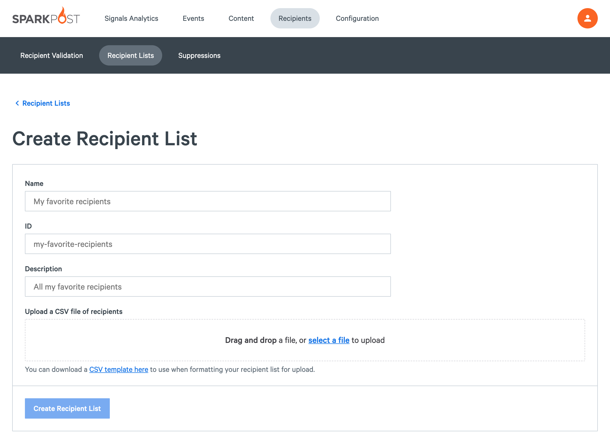
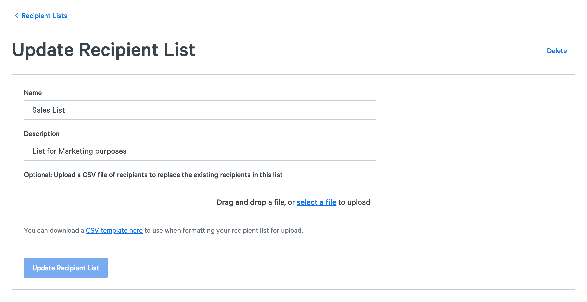

## Adding a New Recipient List 

In the SparkPost app, select **Recipients** > **Recipient Lists** then click the orange button that says "New Recipient List".

Fill in the Label (The ID Field will self fill) and the Description Field. Choose the File you would like to upload with the “Choose File” button. Then click “CREATE".

If you need an example of the format for your CSV file, select a sample to download by selecting "CSV template here".

You may upload tags and additional information for a given recipient if required - but it is not essential. A list of correctly formatted email addresses is also acceptable. You can also edit an existing recipient list by uploading a new file to an existing label (list name).

**Note:** The maximum supported size of a recipient list .csv file is **10MB**.

## Editing an Existing Recipient List

You can also edit an existing recipient list by uploading a new file to an existing label (list name).

* Click on the Label you want to update
* Update the Description Field
* Choose the File you would like to upload with the “Choose File” button
* Finally, click the UPDATE button 

