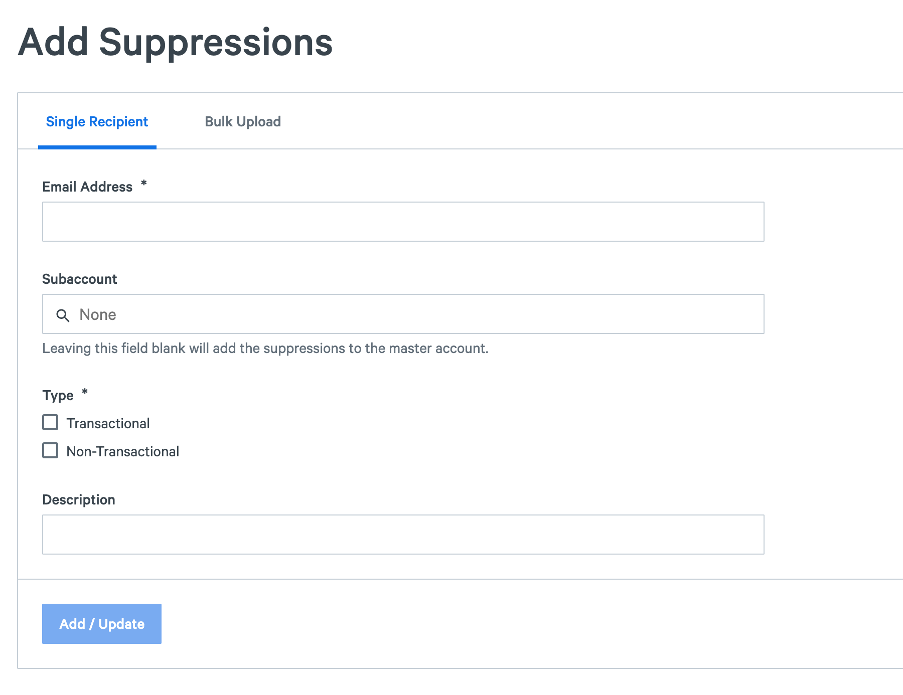
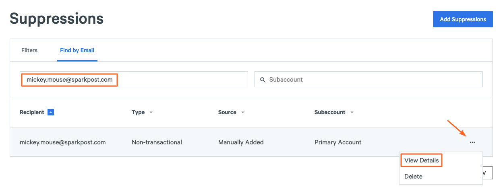
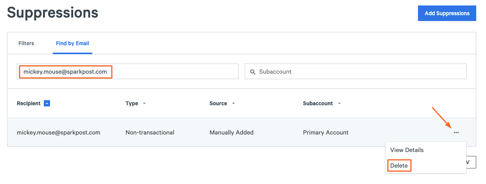

Protecting your sender reputation is essential to maximizing your email deliverability. Many inbox providers, e.g. Yahoo, Gmail, Hotmail/Outlook.com, or AOL, opt to limit or refuse message traffic based on it. Continuing to send messages to invalid email addresses or to recipients who no longer want to receive your emails can negatively impact your sender reputation. By maintaining an up-to-date suppression list, you can avoid sending unwanted messages. A suppression list — or exclusion list, as it is sometimes called — is a list of recipient email addresses to which you do NOT want to send email.

SparkPost supports two types of suppression lists: one (available via the [Suppression List API](https://developers.sparkpost.com/api/suppression-list/) and [app](https://app.sparkpost.com/lists/suppressions) ([EU](https://app.eu.sparkpost.com/lists/suppressions))) is specifically for your account, and a global suppression list. SparkPost maintains a global suppression list across all customers. **NOTE: The Global Suppression List data is not accessible via the Suppression List API**.

When a message is injected either using SMTP or HTTP, SparkPost will check the email address against the account-specific and global suppression lists. If an email address for a recipient matches an address on the list, that message will be rejected for delivery by SparkPost automatically.

**Note: each subaccount has its own separate suppression list which is separate from the primary account suppression list.**

## How are [recipients](https://www.sparkpost.com/api#/reference/recipient-lists "Recipient List API") added to [suppression lists](https://www.sparkpost.com/api#/reference/suppression-list "Suppression List API")?

* **Spam Complaints / FeedBack Loops (FBLs):** When a recipient clicks the “this is spam” button provided by the ISP, the ISP sends a Spam Complaint or FBL message to SparkPost. SparkPost will automatically add the recipient's email address to your suppression list.
* **Hard Bounces:** When messages bounce, the ISP will include a message that lets the sender know whether it was a “Soft Bounce” or a “Hard Bounce”. A “Soft Bounce” is a temporary error or delay indicating that the message was set to a valid recipient address, while a “Hard Bounce” indicates that the message was sent to an invalid email address that should not be retried. SparkPost will automatically add any email address associated with a “Hard Bounce” to your suppression list.
* **Unsubscribe Requests:** Recipients can request to be unsubscribed by clicking the SparkPost-provided unsubscribe link in the message or by using the List-Unsubscribe header. SparkPost will automatically add the recipient's email address to the suppression list.The unsubscribe header is not added automatically for transactional messages (using the option transactional=true)
* **Compliance Team:** Recipients can contact SparkPost and request that they no longer receive messages from a particular sender. Protecting our customers’ brands and maintaining high deliverability across all SparkPost's accounts is of the utmost importance. SparkPost's Compliance Team ensures that we’re acting as a good sender within the email community across all our customers and takes requests of recipients very seriously. If a request is received, the Compliance Team will add the recipient's email address to that sender’s suppression list.
* **Suppression List API:** Using the REST API, you can insert/update a single entry or multiple entries in your suppression list, check the suppression status for a specific recipient, or remove a recipient from your suppression list. For more information, see the [SparkPost Suppression List API](https://www.sparkpost.com/api#/reference/suppression-list "SparkPost Suppression List API").
* **Suppression list UI:** Using the User Interface (UI), select Recipients and then Suppressions.

**If you want to learn how your application can be notified of list pruning events, read our [using unsubscribe events](https://www.sparkpost.com/docs/user-guide/using-unsubscribe-reports/) guide.**

## Managing Suppression Lists with the SparkPost API

Now that you have unsubscribe events being broadcasted to your webhook consumer, you can begin to watch for those events and prevent sending reputation damage by populating your SparkPost Suppression Lists.

To Insert or Update a recipient on a Suppression List:

```
PUT /api/v1/suppression-list/{recipient_email} HTTP/1.1
Content-Type: application/json
Authorization: YOUR KEY HERE
```

```javascript
{
  "transactional" : false, // See the NOTE below for more information
  "non_transactional" : true,
  "description" : "User requested to not receive any non-transactional emails."
}
```

**NOTE:** If a message is designated as “Transactional”, the recipient will be suppressed from “Transactional messages. If the message is designated as “non-transactional”, the recipient will be suppressed from non-transactional messages.

To inspect the status of a recipient on a Suppression List:

```
GET /api/v1/suppression-list/{recipient_email} HTTP/1.1
Authorization: YOUR KEY HERE
Accept: application/json
```

To remove a recipient from a Suppression List:

```
DELETE /api/v1/suppression-list/{recipient_email} HTTP/1.1
Authorization: YOUR KEY HERE
Accept: application/json
```

## Managing Suppression Lists with the SparkPost User Interface (UI)

To add a recipient to your Suppression List, you can [Add Suppressions](https://app.sparkpost.com/lists/suppressions/create) ([EU](https://app.eu.sparkpost.com/lists/suppressions/create))

Note: CSV upload with subaccounts will need individual files for upload.



To inspect the status of a recipient on your Suppression List, you can [Find by Email](https://app.sparkpost.com/lists/suppressions) ([EU](https://app.eu.sparkpost.com/lists/suppressions)) and then select View Details 



To then remove a recipient from a Suppression List, select Delete



## Suppression List Events and Error Messages

If any address present on the given exclusion list for the type of message you are attempting to send (i.e. "transactional" or "non-transactional") is attempted, the message **will automatically fail**. The event data associated with a **customer-specific exclusion list event** will always begin with the same error message - **554 5.7.1 recipient address was suppressed due to customer policy** - and will follow with the specific reason for it (e.g. "Bounce Rule" [hard bounce], "Spam Complaint", "List Unsubscribe", or "Link Unsubscribe").

The event data associated with our **global proprietary suppression list event** will always begin with the same error message - **554 5.7.1 recipient address was suppressed due to system policy** - and will follow with the specific reason for it (e.g. "Bounce Rule" [hard bounce], "Spam Complaint", "List Unsubscribe", or "Link Unsubscribe").

**Note**: For single recipient transmissions, if a given email address is suppressed, the API response for the rejection will appear inline. However, if you are using multiple recipient transmissions, the API response will initially accept addresses which will be suppressed later in the message generation process. For multiple recipient transmissions which contain a suppressed address, you will notice that an injection event is recorded before the ultimate suppression, but an injection event is not recorded for a single recipient, inline suppression.
