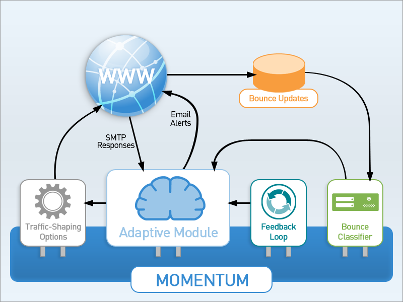

The Momentum Adaptive Delivery (AD) feature dynamically tunes parameters to help manage outbound traffic in accordance with the best practices of receivers. The following diagram gives an overview of AD, showing how the adaptive module responds to input and adjusts outbound traffic:

<a name="figure_overview"></a> 




This module can automatically suspend or throttle down traffic based on real-time feedback. From the perspective of Momentum configuration options, the core traffic shaping options that can be modified by AD are:

*   `max_outbound_connections`

*   `max_deliveries_per_connection`

*   `max_recipients_per_connection`

*   `max_recipients_per_batch`

*   `max_resident_active_queue`

*   `outbound_throttle_messages`

*   `retry_interval`

*   `max_retry_interval`

These traffic shaping options are automatically adjusted in real time by setting the equivalent adaptive option in the desired scope. For example, you can set limits on the maximum number of deliveries per connection for the `example.com` domain in the following way:

```
domain "example.com" {
  adaptive_max_deliveries_per_connection = ( 20 80 )
}
```

### Note

A complete listing of the parameters that are handled by AD is given at [“Rule Actions”](/momentum/3/3-ad/ad-adaptive-rules-actions).

For more fine-grained control of the behavior of the adaptive module, use Adaptive Rules. These rules are written in Lua and codify the practices of major email receivers such as Gmail™ and Yahoo!™. Rules can incorporate bounce and feedback loop information, take immediate action when specific SMTP responses are encountered and send email alerts detailing issues. The combination of the adaptive module with the Lua scripting language makes for a more powerful and more finely tuned Adaptive Delivery.

AD can be configured in the same way as other Momentum modules but in order to use it effectively you need to be familiar with the following concepts:

*   Scope – there are numerous Adaptive Delivery options that can be configured in a single scope or in a number of different scopes. When an option is configured in more than one scope, it can be difficult to determine which value applies. For a discussion of this topic see [Configuration Scopes and Fallback](/momentum/3/3-reference/3-reference-ecelerity-conf-fallback).

*   [Traffic Shaping Options](/momentum/3/3-reference/options-summary#shaping-options) – the main function of Adaptive Delivery is to manage traffic.

*   Lua Scripts – adaptive response rules are applied using the Lua scripting language. See [Implementing Policy Using Scriptlets](/momentum/3/3-reference/3-reference-implementing-policy-scriptlets).

*   [DuraVIP™ bindings](/momentum/3/3-reference/3-reference-cluster-config-duravip) – use this technology in a cluster configuration in order to improve the efficiency of Adaptive Delivery.

*   Bounces – AD can react to bounces in real time. For more information see [Live Bounce Updates – Module](/momentum/3/3-reference/3-reference-modules-live-bounce-updates) and [The bounce_classifier_override Module](/momentum/3/3-reference/3-reference-modules-bounce-classifier-override).

*   Feedback Loops – AD can be set up to react to feedback statistics using sweep rules. See [fbl – Feedback Loop Module](/momentum/3/3-reference/3-reference-modules-fbl).