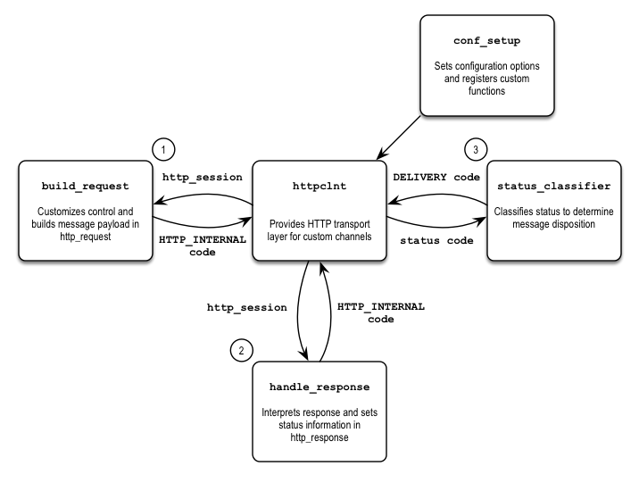

The Generic HTTP Client module is used in conjunction with the Generic Delivery module to provide connection services, message queuing services, message delivery via HTTP protocol, response reception, and message disposition handling. These features provide the core framework of a custom delivery module. However, the message control, payload, and response requirements vary for each delivery channel. You must implement these differences in custom functions that are registered as callbacks in the delivery module setup routine.

The custom functions are the following:

*   build_request callback routine – to customize the control and message payload for delivery

*   handle_response callback routine – to interpret the response and set the status information

*   status_classifier callback routine – to classify status information to determine message disposition

[“Custom Delivery Module Diagram”](/momentum/3/3-api/custom-channels-overview#figure_http_client_overview) shows the flow of a custom delivery module. The first time the delivery module is loaded, the conf_setup callback sets and registers the module configuration and custom handlers that the module will implement. The process flow is synchronous in nature. When the connection gets a message to process for delivery, the Generic HTTP Client (`httpclnt`) calls a custom build_request callback passing the connection session data (`http_session`). This callback creates the message payload content for the request data (`http_session`–>`http_request`). On return, httpclnt sends the HTTP request message via the HTTP connection and waits for a HTTP response message. When a response is received, httpclnt calls a custom handle_response callback that parses the response and sets the status code in the response data (`http_session`–>`http_response`). This status code is used by a custom status_classifier to determine the message disposition. Upon completion, httpclnt waits for the next message for delivery, up to a configurable amount of time.

 

Additionally, you must write a custom logger if logging is required. A generic logger is not currently available in Momentum.

Core Momentum hooks, as well as the callback points provided by the Generic Delivery module and the Generic HTTP Client module, are available for additional customization.