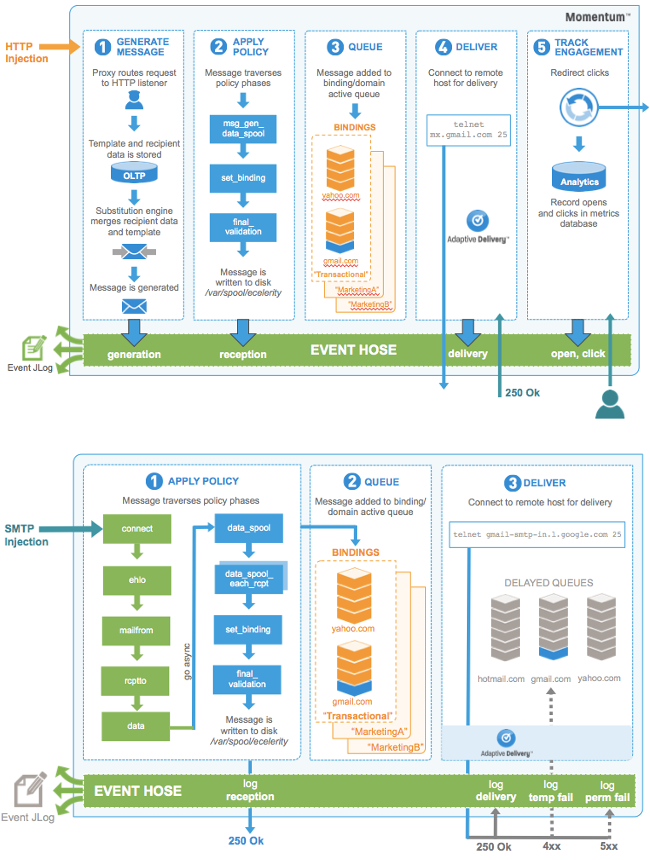

<a name="idp6928064"></a> 

In order to effectively implement your site policy, it is important to understand how mail transits through Momentum and when the policy is applied. [“Momentum Policy Phases”](/momentum/4/4-policy#policy.flow-diagram) provides visual representations of mail injected via HTTP and SMTP. Additional policy information is provided after the diagram. For more information about the other mail transmission stages, see [*Life of A Message*](/momentum/4/loam) .

<a name="policy.flow-diagram"></a> 




All messages go through validation checks, which can be active (such as terminating the connection) or passive (such as collecting information).

Messages pass through policy phases (or hook points), which enable you to define actions that will be executed at various points during validation. These actions can be related to decisions around message acceptance, modifying the message, or applying logic based on a property of the message. Policy can be defined to act on the connection or message associated with the phase of an SMTP session. All policy is applied to each message entering Momentum, and all policy decisions are made before Momentum accepts the message for downstream delivery.

The policy phases differ for each type of injection. For example, messages injected via HTTP pass through:

1.  msg_gen_data_spool (message modification is generally done in this phase)

2.  set_binding

3.  final_validation

While messages injected via SMTP pass through:

1.  connect

2.  ehlo

3.  mailfrom

4.  rcptto

5.  data

6.  dataspool

7.  data_spool_each_rcpt (message modification is generally done in this phase)

8.  set_binding

9.  final_validation

Momentum then assigns the message to a binding (i.e., an outgoing IP address used to send a message) and writes it to disk (in the `/var/spool/ecelerity` directory).

If the message does not pass the validation checks, it is rejected due to policy.

## <a name="policy.validation"></a> Validation and the Validation Context

The validation process in Momentum is extensible, designed to consist of any number of disparate modules provided either by Message Systems, a third-party vendor, or developed directly by a customer. Momentum provides a validation context which allows validation modules to store and share validation information over the various policy phases. The final decision about what to do with a message (discard, reject, quarantine, modify, forward etc.) can be made using policy scripts acting on the same connection or message but executing in different phases.

The validation context contains two dictionaries of information, referred to as the `connection context` and `message context` respectively. The former holds information associated with the remote client connected to Momentum, whereas the latter holds information about the current message. The message context is emptied for each message transmitted on a given connection, whereas the connection context retains its information for the lifetime of that connection.

A number of context variables are pre-defined by Momentum, depending on how the connection was made, and what modules are loaded. A complete list of pre-defined context variables can be found in [*Validation Context Variables*](/momentum/4/4-policy-context-variables) . In addition, the [context](/momentum/4/config/ref-context) option provides a mechanism to set arbitrary connection context key value pairs.

### <a name="policy.context-based-on-ip"></a> Setting Context Based on Connecting IP

It is often useful to bypass anti-spam checks when you know that the sender is a machine on your network. It could be either a local user or an internal mail exchange machine that is merely forwarding the mail on via Momentum. In the former case, it is not good for your own users not to be able to mail out of your network, and in the latter case, it does not help you if you are tarpitting your own mail infrastructure if spam has managed to leak in.

The example ESMTP_Listener configuration shown in [“Connection Context Variables in ESMTP_Listener”](/momentum/4/4-policy#policy.context-based-on-ip3.ex) will set `my_key` and `my_other_key` in the `connection context` for machines connecting from the netblock 0.0.0.0/0 (this matches all connections). It will set the `trusted_mx` connection context for machines connecting from the 10.0.0.0/32 network, which is assumed to be a trusted internal network. You can set any arbitrary context information using this mechanism.

<a name="policy.context-based-on-ip3.ex"></a> 


```
ESMTP_Listener {
   Listen "*:25" {
      Peer "0.0.0.0/0" {
         context = [
           my_key = "my_value"
           my_other_key = "my_other_value"
         ]

      }
      Peer "10.0.0.0/32" {
         context = [
            trusted_mx = "yes"
         ]
      }
   }
}
```

### <a name="policy.bypass"></a> Bypassing Validation Modules

To bypass validation modules, add a context variable to your listener by creating a context variable with the name __bypass_*`module_name`* and setting its value to `true`. For example, to bypass the spf_v1 module create a variable called `__bypass_spf_v1` and set its value to `true`.

To determine whether a module is a validation module, see [*Modules Summary*](/momentum/4/modules/summary-all-modules) .