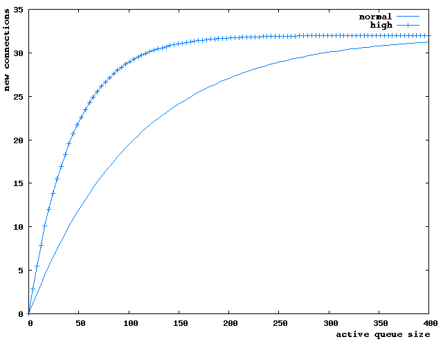

 
## Name

connection_allocation_aggressiveness — tune the aggressiveness for establishing new connections to domains

## Synopsis

`connection_allocation_aggressiveness = "normal"`

`connection_allocation_aggressiveness = "high"`

 
## Description

When set to `high`, Momentum will be more aggressive when opening up new connections to domains. Momentum achieves this by considering the max_outbound_connections setting (global or domain-specific, whichever is configured) and the size of the active queue for that domain. A setting of "normal" will produce a gradual increase in the number of connections, while "high" will result in a rapid number of new connections, up to the maximum allowed.

The following figure illustrates a typical scenario, with an active queue of 400 messages and a max_outbound_connections = 32 (the default).

 

The default value is `normal`.

 
## Scope

connection_allocation_aggressiveness is valid in the binding, binding_group, domain, and global scopes.