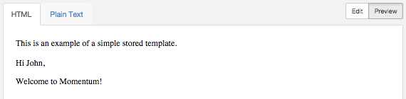

You can preview and test your template by specifying test data in the New Template form. Test data must be in the form of a JSON object of key/value pairs of recipient-specific data. Click Edit, select the Test Data tab, and type your test data using the online editor. Note that the test data is not saved.

[“Test Data”](/momentum/4/web-ui-templates-preview#figure_test_data) shows test data for the Simple Template. In this example, *John*, *simple stored template* , and *My Company*         will replace *`{{name}}`*, *`{{subject}}`*, and *`{{company}}`*, respectively, in the preview of your template.

 

###  Previewing Your Email

You can preview the HTML content, plain text content, and top-level header substitution of your email using the UI. To preview your template, click Preview and select the appropriate tab.

[“Preview Template”](/momentum/4/web-ui-templates-preview#figure_preview_template) shows a preview of the HMTL content for the Simple Template. Notice the substitution for *`{{name}}`* and *`{{subject}}`*.

 

[“Preview Template Details”](/momentum/4/web-ui-templates-preview#figure_preview_details) shows a preview of the Template Details for the Simple Template. Notice the substitution for *`{{name}}`* and *`{{company}}`*.

 

###  Sending a Test Email

In addition to the preview function, you can send a test email from the UI, using your test data to expand your template. Click the arrow on the right-hand side of the Save Draft button. In the list, click Send Test.

 

In the Sent Test form, enter your recipient's address and click Send.

 

If successful, a message will briefly appear indicating that your message was successfully queued. Your recipient should receive an email with your test data included in the message body.