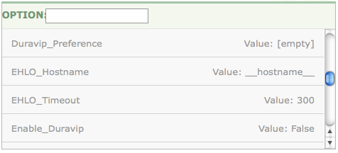

##  The smpp Modules

 

Mobile Momentum supports SMPP version 3.4 and provides the ability to identify and capture email for Short Message Peer-to-Peer Protocol (SMPP) delivery. It provides a simple conversion of an email message to a Short Message Service (SMS) text message destined for a mobile phone.

Mobile Momentum provides an SMPP client within Momentum for transforming and forwarding email messages as SMS messages. In the language of the SMPP specifications, it is the implementation of an External Short Message Entity (ESME) that sends to Message Centers (MC) or Short Message Service Centers (SMSC), also known as a Short Message Gateway (SMG), using the Short Message Peer-to-Peer Protocol (SMPP). Mobile Momentum is also capable of transforming SMS to email.

When transforming email to SMS, Mobile Momentum first attempts to determine the destination email from the message text or subject. Failing this, Mobile Momentum attempts to look up the destination email address in a reverse address mapping database, using the source and destination telephone numbers as selection criteria.

During installation the SMPP reverse address mapping PostgreSQL table, `smpp.reverse_address_mappings`, is created in the `ecelerity` database. For information about this database see [PostgreSQL](/momentum/3/3-reference/operations-postgresql). This table is populated as email to SMS conversions occur. This allows address mappings to persist across restarts. During installation a datasource named `ram` is created to cache the results of database look-ups. This datasource is defined as follows:

Datasource "ram" {
  uri =
  ("pgsql:host=*`hostname`*;dbname=ecelerity;user=ecuser;password=*`passwd`*")
  no_cache = "true"
}
### Note

For Mobile Momentum 2.0, Early Availability version, you must manually create this datasource. You also need to set up a cron job to periodically clean up expired ram records. The script **/opt/msys/ecelerity/bin/clean_expired_pgsql.pl** is provided for this purpose. Modify it if your database configuration differs from the default.

For more information about datasources see [ds_core – Datasource Query Core](/momentum/3/3-reference/3-reference-modules-ds-core).

The SMPP element of Mobile Momentum is made up of the `smpp` module and the `smpp_logger` module. The smpp module is defined as `smpp {}` and is autoloaded as required so need not be explicitly included in your configuration file. Apart from the `enabled` option, the `debug_level` option is the only option valid within the smpp module scope. You only need to set this option if you are performing module-level debugging. The `debug_level` option is set in the same way as it is for other modules but you can only use error, warning and debug levels. The notice, info and critical levels are **not** available.

There are numerous mobility options that apply in the smpp_logger scope and others applicable in the global, domain, binding and binding_group scopes. The module-specific mobility options are found in [“smpp_logger Module Configuration”](/momentum/mobile/mobile-reference/mobility-configuration-smpp). The other options that affect Mobile Momentum are listed in [Table 3.1, “smpp options”](/momentum/mobile/mobile-reference/mobility-smpp-options#table-smpp-options). The most important are the server and port used to identify the target Message Center.

The minimum requirements in order to configure Mobile Momentum for interoperation with a Short Message Service Center (SMSC) are:

*   IP address of target SMSC(s)

*   SMPP TCP port number(s) on target SMSC(s)

*   Bind Credentials

*   SMSC System ID

*   SMSC Password

*   SMSC System Type – may be required by SMSC

Typical global and domain configuration options are shown in the following example:

 

SMPP_SMSC_Port = 2775
SMPP_SMSC_Server = "*`ip_address`*"

domain "example.com" {
  SMPP_SMSC_Server  = "*`ip_address`*"
  SMPP_SMSC_Port = "8888"
  SMPP_SMSC_System_ID = "myid"
  SMPP_SMSC_Password = "mypass"
  SMPP_SMS_Data_Coding = "LATIN1"
  SMPP_ESME_Address = "57425"
  SMPP_Inactivity_Timer = 600
  SMPP_Enquire_Link_Timer = 90
  SMPP_Response_Timer = 60
  SMPP_Default_Email_Address = "user@example.com"
}

The `SMPP_SMSC_Server`, `SMPP_SMSC_Port` and `SMPP_Persistent_Connections` options are valid in the global and domain scopes only. The `SMPP_SMSC_Server` option can be either an IP address or a hostname. Following the usual semantics, the most specific definition applies. For example, in the above configuration the `SMPP_SMSC_Port` for the domain `testsmpp` is `8888` while all other domains default to `2775`. Besides these three options, all other mobility configuration options are valid in the binding, binding_group, domain and global scopes. All configuration options in all scopes can be set through the web UI in exactly the same way as other options.

If you expect SMS-to-email traffic (and not just email-to-SMS), you should also set a `SMPP_Default_Email_Address`; this is used as a catch-all in case the reverse address mappings can't determine what email address to send SMS-to-email replies to.

You can set any options by manually changing the `ecelerity.conf` file. You can also use the web UI. For example, to change or add an SMS binding configuration option through the web UI, point your browser at the machine hosting the UI, navigate to the Administration page and choose the "Advanced Configuration Editor" menu. Select the desired binding from the list box on the left. After selecting a binding you should see a list of all available options on the right side of the screen. The following image shows a partial list of the available options:

 

Click on the desired option and set its value. For more information about using the web UI see [Using the Web Console](/momentum/3/3-reference/web-3).