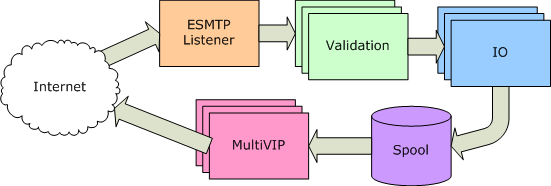

  

In order to effectively implement your site policy in Momentum, it is important to understand how mail transits through Momentum. [“Mail flow through Momentum”](/momentum/3/3-reference/3-reference-policy#policy.flow-diagram) gives a visual representation that will be useful in the following discussion.

Momentum waits for connections to be made to its ESMTP Listener. Once a connection has been made, the SMTP session undergoes a validation process, which allows you to perform various validation checks at each stage of the SMTP conversation. These validation checks can be passive (collecting information) or active (perhaps terminating the connection).

Once a message has passed all the validation checks, it is sent to the IO layer, which attempts to journal the message to the spool. Once the message is successfully stored in the spool, an acknowledgment is returned to the sender, and the message is enqueued to the delivery subsystem.

The delivery subsystem looks at each message to decide which MultiVIP© binding will be used for outbound delivery. It then determines the domain for the recipient and attempts to connect to the domain's mail exchange and deliver the mail onwards.