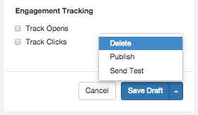

From the Templates tab, you can select a template to delete. Select the template you wish to delete by clicking its label. The detailed view of the template is displayed.

To delete your template, click the arrow on the right-hand side of the Save Draft button. In the list, click Delete, as shown in [Figure 48.12, “Delete Template”](web-ui.templates.delete#figure_delete_template "Figure 48.12. Delete Template").

 

**Figure 48.12. Delete Template**

The `Delete` option is a "hard delete". ALL versions of the template will be deleted from the system, both published AND draft versions.

If you delete a template DURING the build of a transmission that is currently using that template, you will get an error in the response. You must retry the delete when the template is no longer being used.