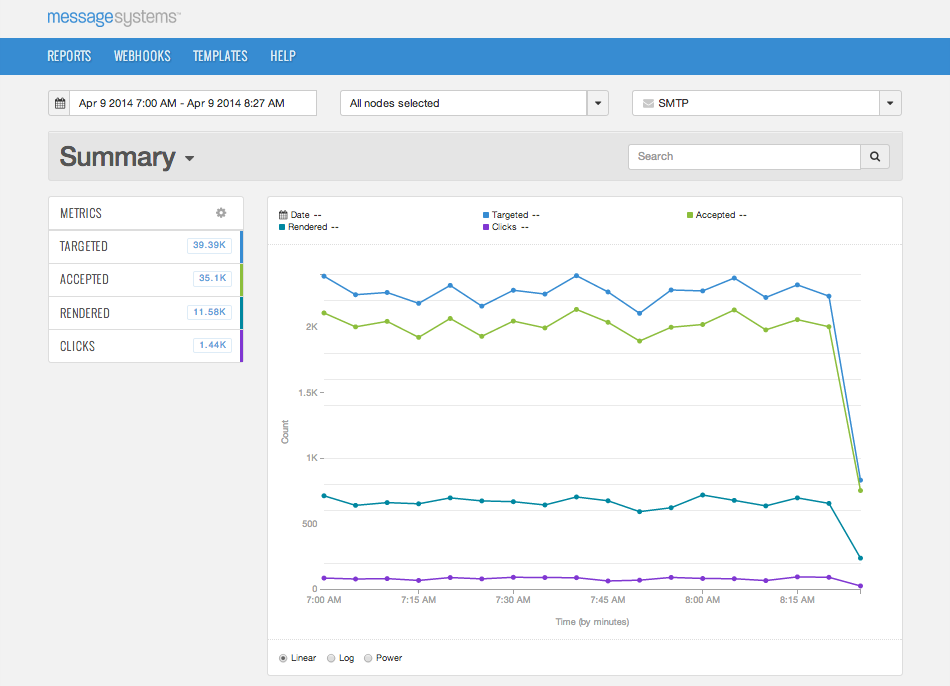
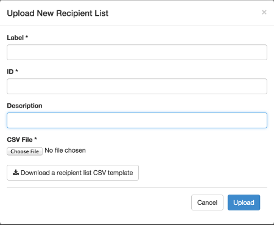
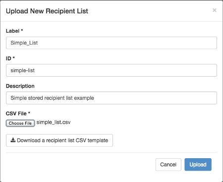
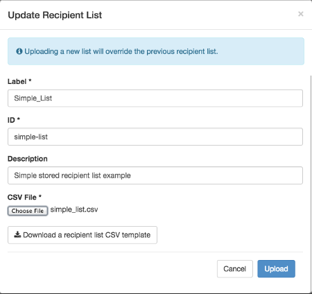

### Warning

**The Momentum Web-based User Interface has been deprecated and is no longer available, as of the new MTA-only architecture introduced in release 4.2.28, and in all subsequent new releases. This section, and all other support site content pertaining to the Web-based User Interface, is only applicable for releases prior to 4.2.28\. An exception to this is when established customers upgrade from releases where the Web-based User Interface was supported, using release bundles provided to them specifically for that purpose.** 

**User Interface** 

Open the UI by pointing your web browser at the appropriate IP address and log in using your credentials. Administrators can log in using the admin username/password chosen during installation.

### Note

The UI is configured to start automatically as a service on the server where it is installed. Immediately prior to installation, information about the services is displayed. The IP address for the UI is identified during installation as Reporting UI: http://*`example IP address`* .

The UI supports the following browsers:

*   Firefox

*   Internet Explorer, versions 9 and 10

It supports the current and previous major releases of these browsers on a rolling basis. Each time a new version is released, the UI will begin supporting that version and stop supporting the third most recent version. All browsers must have cookies and JavaScript enabled. The UI is viewed best with a screen resolution of at least 1200 pixels wide. When viewed at lower resolutions, the built-in responsive design ability will adjust the layout as though displaying on a tablet device.

The UI opens in the Summary section under Reports, as shown in [“User Interface”](/momentum/4/web-ui#figure_summary_report). It supports your native language by setting the rules for date format, number format, and sorting based on the language set in your browser.

<a name="figure_summary_report"></a> 




Using the UI, you can perform the following:

*   API Keys:

    **Configuration Change. ** Version 4.1 and later support managing your API keys using the UI. Version 4.2 and later add View Adaptive Delivery Data grant type.-->

    *   View details about your existing API keys

    *   Create a new API key

    *   Update or delete an existing API key

*   Reports:

    **Configuration Change. ** Version 4.2 and later adds reporting by template in all reports, filtering by domain in the Engagement report, and an Adaptive Delivery report.

    *   Select metrics and filters for your specific reporting needs

    *   View detailed reports about your messaging events and engagement data

    *   Evaluate your message deliverability and campaign performance

*   Webhooks:

    **Configuration Change. ** Version 4.1 and later support managing your webhooks using the UI. Version 4.2 and later add adaptive delivery events.

    *   View details about your existing webhooks

    *   Create a new webhook

    *   Test, update, or delete an existing webhook

*   Templates:

    **Configuration Change. ** Version 4.1 and later support managing your templates using the UI.

    *   View details about your existing templates

    *   Create a new template

    *   Preview and test an existing template

    *   Update, publish, or delete an existing template

*   Recipient Lists:

    **Configuration Change. ** Version 4.2 and later support managing your recipient lists using the UI.

    *   View information about your existing recipient lists

    *   Upload a new recipient list CSV file

    *   Delete an existing recipient list

*   Transmissions:

    **Configuration Change. ** Version 4.2 and later support managing your transmissions using the UI.

    *   View details about your existing transmissions

    *   Schedule a new transmission

    *   Preview, edit, duplicate, or delete an existing transmission

Click the appropriate tab to navigate the UI.

For additional documentation, click Help to go to the Documentation web page.

## <a name="web-ui.recipients"></a> Recipient Lists

<a name="idp5891312"></a> 

**Configuration Change. ** Version 4.2 and later support managing your recipient lists using the UI.

You can manage your recipient lists using the Recipient Lists API or the Recipients section in the UI. The UI provides a flexible, easy-to-use interface to view your recipient lists, upload new recipient lists, or update or delete existing recipient lists.

### <a name="web-ui.recipients.view"></a> Viewing Your Recipient Lists

The Recipients tab provides a tabular view of your existing recipient lists, as shown in [“Recipient Lists Table”](/momentum/4/web-ui#figure_recipient_list). The following information is displayed in the table for each recipient list:

*   Label - Label specified when you created the recipient list

*   ID - ID specified when you created the recipient list

*   Description - Detailed description specified when you created the recipient list

*   Recipients - Number of recipients in the list

*   Actions - Enables you to update or delete the recipient list

<a name="figure_recipient_list"></a> 


You can sort by column in ascending or descending order by clicking the sorting icon in the column header. This icon is visible in the header of the currently sorted column. If the icon is not visible, hover over the name in the header, and the icon will appear. You can also filter your recipient lists using the Search function. Enter the label of the list that you want in the Search box. The entry will pre-fill after three letters. The table is updated displaying only lists for that label.

You can export your recipient list information to a CSV file. Click the Save as CSV button to export the data.

### Note

Internet Explorer, version 9 does not support exporting data to a CSV file. If you need this function, upgrade Internet Explorer or use Firefox.

### <a name="web-ui.recipients.create_csv"></a> Creating a Recipient List

Prior to adding a new recipient list in the UI, you must specify your recipient list details as a properly formatted Comma Separated Values (CSV) file. Formatting requirements are specified below:

**<a name="idp5870064"></a> General CSV File Formatting Requirements**

*   The CSV file must contain a header row.

*   All quotes in the CSV file must be formatted (escaped) properly.

    ### Note

    It is recommended that you use MS Excel to modify the CSV file, as that will properly format the quotes when saving the file.

**<a name="idp5866736"></a> CSV Header Requirements**

*   The following fields are required in the header row and must be named exactly as shown below:

    *   email - The recipient's valid email address.

    *   name - The recipient's user friendly name.

    *   return_path - A valid email address that will be used as the envelope FROM header when sending to the recipient.

    *   metadata - Key/Value pairs associated with the recipient.

    *   tags - An array of text labels associated with the recipient.

    *   substitution_data - Key/Value pairs associated with the recipient that are provided to the substitution engine.

    ### Note

    The order of the header row fields does not matter.

**<a name="idp5819952"></a> CSV Content Requirements**

*   email is the only required field in each content row.

*   metadata, substitution_data, and tags are optional content, but note that they are validated if provided.

*   name and return_path are also optional content, but are not validated.

*   Data types for each content row are defined below:

    *   email - string

    *   name - string

    *   return_path - string

    *   metadata - JSON object

    *   tags - array

    *   substitution_data - JSON object

### Note

The maximum size for a CSV file is 20MB. Also note that the larger the file size, the longer it may take for the recipient list to upload.

**<a name="idp5909552"></a> Example CSV File**
```
email,name,return_path,metadata,substitution_data,tags
example-recipient@example.com,Example Recipient,reply@example.com,"{""foo"": ""bar""}","{""member"": ""platinum"", ""region"": ""US""}","[""test"", ""example""]"
johndoe@example.com,John Doe,,,,"[""test"", ""anotherExample""]"
testing@example.com,Another Recipient,,,,,
lastOne@example.com,,,,,,
```
**<a name="idp5911232"></a> CSV Template**

You can also download a CSV template has all the appropriate headers as well as an example recipient to show the proper format for each column. To download the template, click the Download a recipient list CSV template button on the Upload New Recipient List form.

### <a name="web-ui.recipients.upload"></a> Uploading a Recipient List

To upload your recipient list, click the New Recipient List icon in the upper-right corner of the Recipient Lists tab to open the Upload New Recipient List form, as shown in [“Upload New Recipient List”](/momentum/4/web-ui#figure_list_upload).

<a name="figure_list_upload"></a> 




Enter the following information in the Upload New Recipient List form:

*   Label - User-friendly label for the recipient list

*   ID - Short, unique, alphanumeric ID used to reference the recipient list

*   Description - (optional) Detailed description of the recipient list

*   CSV File - Select the file containing the recipient list details

The example shown in [“Example Recipient List Details”](/momentum/4/web-ui#figure_list_details) uploads the recipient list specified in the file `simple_list.csv`.

<a name="figure_list_details"></a> 




Click Upload to upload your recipient list. There are three possible outcomes:

*   If all content in the CSV file passed validation, a green message will briefly display on the Recipients tab above the Recipient table. This message will indicate that the recipient list was created successfully and will also display the number of recipients accepted. The number of recipients accepted will also be displayed in the Recipient column of the in Recipient Lists Table.

*   If some content in the CSV file did not pass validation, a yellow message will briefly display on the Recipients tab above the Recipient table. This message will indicate that the recipient list was created and will also display the number of recipients accepted and the number rejected. The number of recipients accepted will also be displayed in the Recipient column of the in Recipient Lists Table.

*   If none of the content in the CSV file passed validation, a red message will appear on the Upload New Recipient List form. This message will indicate that validation errors occurred and the recipient list could not be created.

### <a name="web-ui.recipients.update"></a> Updating a Recipient List

You can update either the list content or the recipient list metadata (label, ID, description).

To update recipient list content, edit the previously uploaded CSV file as needed. Be sure to follow all formatting requirements. Click the New Recipient List icon in the upper-right corner of the Recipient Lists tab to open the Upload New Recipient List form, as shown in [“Update Recipient List”](/momentum/4/web-ui#figure_list_update).

<a name="figure_list_update"></a> 




Enter the same label, ID, and description information as before. Click Upload to upload your recipient list. The updated list is subject to the same three outcomes described above.

To update the metadata only, do not change the recipient list content. Click the New Recipient List icon to open the Upload New Recipient List form, and enter a new label, ID, and/or description. Click Upload. A a green message will briefly display on the Recipients tab above the Recipient table. This message will indicate that the recipient list was updated successfully.

### <a name="web-ui.recipients.delete"></a> Deleting a Recipient List

To delete a recipient list, click Delete in the Actions column of the recipient list that you want to delete.

In the Delete Recipient List window, click Delete to confirm your request, as shown in [“Confirm Delete”](/momentum/4/web-ui#figure_confirm_list_delete).

<a name="figure_confirm_list_delete"></a> 


The system will stop sending to the recipients after transmissions currently queued to be delivered using that recipients list are sent.