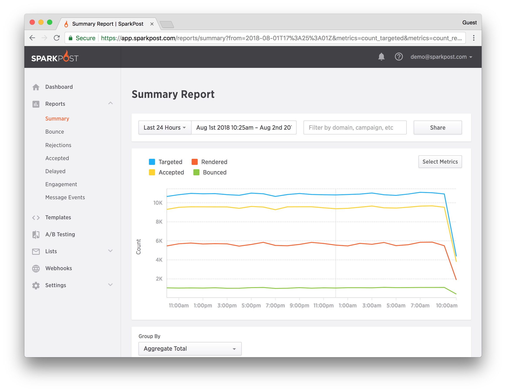

The [SparkPost add-on in Heroku](https://devcenter.heroku.com/articles/sparkpost) provides developers an easily accessible application to leverage for email delivery.

SparkPost is available via a modern RESTful API and has supported client libraries for [Node.js](https://github.com/SparkPost/node-sparkpost), [Python](https://github.com/SparkPost/python-sparkpost), [PHP](https://github.com/SparkPost/php-sparkpost), [Java](https://github.com/SparkPost/java-sparkpost), [Go](https://github.com/SparkPost/go-sparkpost), and [Elixir](https://github.com/SparkPost/elixir-sparkpost) as well as documented examples in all those languages plus Swift, Objective-C and VB.

## QuickStart

If you’re in a hurry, here’s a video tutorial to get you up and running quickly:

[](media/using-sparkpost-heroku-add-on/how-to-the-sparkpost-heroku-email-add-onhttpsimgyoutubecomviyg4z3vvcfhi0.jpg)

## Provisioning The Add-On

SparkPost can be attached to a Heroku application via the CLI:

A list of all plans available can be found [here](http://elements.heroku.com/addons/sparkpost).

```
$ heroku addons:create sparkpost
-----> Adding sparkpost to sharp-mountain-4005... done, v18 (free)
```Once SparkPost has been added, a SPARKPOST_API_KEY setting will be available as an app configuration variable and will contain the access token to use when calling the SparkPost APIs. This can be confirmed using the heroku config:get command.```
$ heroku config:get SPARKPOST_API_KEY
14ac5499cfdd2bb2859e4476d2e5b1d2bad079bf
```

The following settings are available in the app configuration:

| Config Setting           | Description                        |
|:-------------------------|:-----------------------------------|
| SPARKPOST_API_KEY        | The API key for the SparkPost API  |
| SPARKPOST_API_URL        | The base URI for the SparkPost API |
| SPARKPOST_SANDBOX_DOMAIN | Sandbox domain                     |
| SPARKPOST_SMTP_HOST      | SMTP Host                          |
| SPARKPOST_SMTP_PASSWORD  | SMTP Password                      |
| SPARKPOST_SMTP_PORT      | SMTP Port                          |
| SPARKPOST_SMTP_USERNAME  | SMTP Username                      |

After installing SparkPost the application should be configured to fully integrate with the add-on.

In order to use the API key, it’s necessary to accept the terms of use via the SparkPost dashboard.

SparkPost is setup with a sandbox domain which can be used to send up to 5 messages. To send more messages, create a sending domain via the SparkPost dashboard or the API.

## Local Setup

### Environment Setup

After provisioning the add-on it’s necessary to locally replicate the config vars so your development environment can operate against the service.

Use the Heroku Local command-line tool to configure, run and manage process types specified in your app’s [Procfile](https://devcenter.heroku.com/articles/procfile). Heroku Local reads configuration variables from a .env file. To view all of your app’s config vars, type heroku config. Use the following command for each value that you want to add to your .env file.

```
$ heroku config:get SPARKPOST_API_KEY -s  >> .env
```

Credentials and other sensitive configuration values should not be committed to source-control. In Git exclude the .env file with: `echo .env >> .gitignore`.

For more information, see the [Heroku Local](https://devcenter.heroku.com/articles/heroku-local) article.

## Using The API

SparkPost is available via API and has supported SDKs for Node.js, Python, and PHP. The SparkPost API enables client applications to integrate with SparkPost and perform actions associated with account management, message generation, and reporting. More information can be found at[sparkpost.com/api](https://www.sparkpost.com/api).

## Using With Node.js

SparkPost has a Node SDK for your favorite SparkPost APIs. The module source can be found on[Github](https://github.com/SparkPost/node-sparkpost).

```
$ npm install sparkpost --save
```

The following code shows an example of including the SparkPost module and sending a transmission.

```javascript
'use strict'
var SparkPost = require('sparkpost');
var client = new SparkPost(); // uses process.env.SPARKPOST_API_KEY
var from = 'test@' + process.env.SPARKPOST_SANDBOX_DOMAIN; // 'test@sparkpostbox.com'
var txObject = {
	campaign: 'first-mailing',
	from: from,
	subject: 'Hello from node-sparkpost',
	html: '<p>Hello world</p>',
	text: 'Hello world',
	substitutionData: {
		"<YOUR_SUBSTITUTION_DATA_KEY_VALUE_PAIRS_HERE>": "value"
	},
	recipients: [
		"<YOUR_LIST_OF_RECIPIENT_OBJECTS_HERE>"
	]
};
var txResponseHandler = function txResponseHandler(err, data) {
	if(err) {
		console.error('ERROR: ', err);
		new Error(err);
	} else {
		console.log('WOOHOO, Transmission accepted by SparkPost!');
		console.log(data);
	}
};

// Simplify sending transmission and response handling using the SparkPost Node SDK Transmission request
client.transmissions.send(txObject, txResponseHandler);
```

## Using With Python

SparkPost has an official Python module. The module source can be found on [GitHub](https://github.com/SparkPost/python-sparkpost).

To use, install from PyPI using pip:

```
$ pip install sparkpost
```

The following code shows an example of including the SparkPost module and sending a transmission.

```python
from sparkpost import SparkPost
import os
sp = SparkPost() # uses environment variable
from_email = 'test@' + os.environ.get('SPARKPOST_SANDBOX_DOMAIN') # 'test@sparkpostbox.com'
response = sp.transmission.send(
		recipients=['someone@somedomain.com'],
		html='<p>Hello world</p>',
		from_email=from_email,
		subject='Hello from python-sparkpost'
)
print response # outputs {u'total_accepted_recipients': 1, u'id': u'47960765679942446', u'total_rejected_recipients': 0}
```

## Using With PHP

SparkPost has an official PHP SDK. The module source can be found on [GitHub](https://github.com/SparkPost/php-sparkpost).

The recommended way to install the SparkPost PHP SDK is through [composer](https://getcomposer.org/).

```
curl -sS https://getcomposer.org/installer | php
```

Next, run the Composer command to install the SparkPost PHP SDK:

```
composer require sparkpost/php-sparkpost
```

After installing, you need to require Composer’s autoloader:

```
require 'vendor/autoload.php';
```

The following code shows an example of including the SparkPost module and sending a transmission:

```php
<?php SparkPost::setConfig(["key"=>getEnv("SPARKPOST_API_KEY")]);
try {
	// Build your email and send it!
	Transmission::send(array('campaign'=>'first-mailing',
			'from'=>'test@' . getEnv("SPARKPOST_SANDBOX_DOMAIN"), // 'test@sparkpostbox.com'
			'subject'=>'Hello from php-sparkpost',
			'html'=>'<html><body><h1>Congratulations, {{name}}!</h1><p>You just sent your very first mailing!</p></body></html>',
			'text'=>'Congratulations, {{name}}!! You just sent your very first mailing!',
			'substitutionData'=>array('name'=>'YOUR FIRST NAME'),
			'recipients'=>array(array('address'=>array('name'=>'YOUR FULL NAME', 'email'=>'YOUR EMAIL ADDRESS' )))
	));

	echo 'Woohoo! You just sent your first mailing!';
} catch (Exception $err) {
	echo 'Whoops! Something went wrong';     var_dump($err);
} ?>
```

## Dashboard

For more information on the features available within the SparkPost dashboard please see the docs at [**sparkpost.com/docs**](https://www.sparkpost.com/docs).

The SparkPost dashboard allows you to view metrics and create sending domains and templates.



The dashboard can be accessed via the CLI:`$ heroku addons:open sparkpost Opening sparkpost for sharp-mountain-4005`or by visiting the [Heroku Dashboard](https://dashboard.heroku.com/apps) and selecting the application in question. Select SparkPost from the Add-ons menu.

## Migrating Between Plans

Use the heroku addons:upgrade command to migrate to a new plan.

```
$ heroku addons:upgrade sparkpost:gold
-----> Upgrading sparkpost:gold to sharp-mountain-4005... done, v18 ($574.95/mo)
Your plan has been updated to: sparkpost:gold
```

Sending may be disabled for up to 24 hours if a user downgrades to a plan and has exceeded the hourly or daily limit for the new plan. The request is denied if a user tries to downgrade to a new plan whose monthly limit is less than their current monthly usage.

## Removing The Add-On

SparkPost can be removed via the CLI. The account will be suspended and sending will be disabled for your API key.

```
$ heroku addons:destroy sparkpost
-----> Removing sparkpost from sharp-mountain-4005... done, v20 (free)
```

## Support

All SparkPost support and runtime issues should be submitted via one of the [Heroku Support channels](https://devcenter.heroku.com/articles/support-channels). Any non-support related issues or product feedback is welcome at [hello@sparkpost.com](mailto:hello@sparkpost.com).
