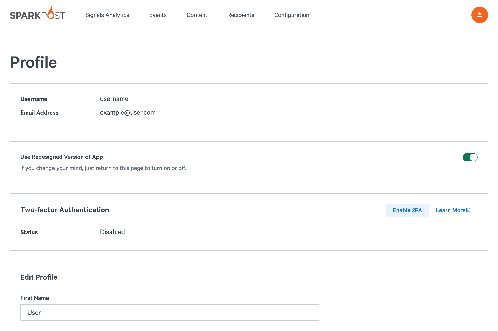
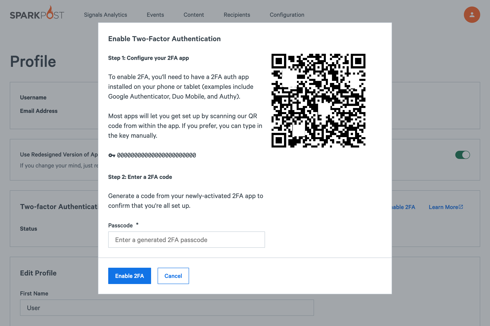
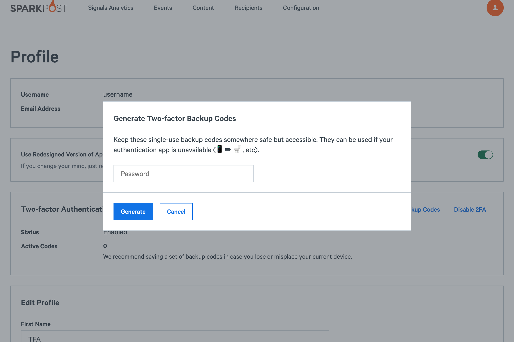
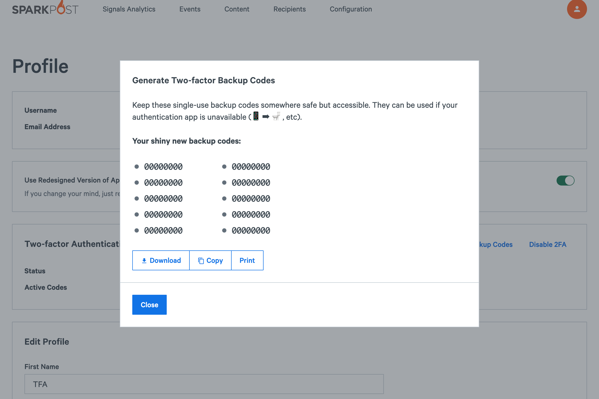
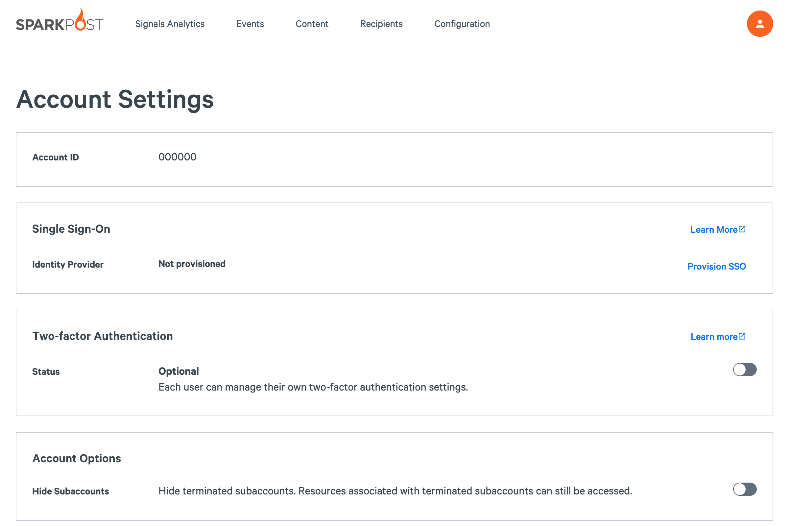
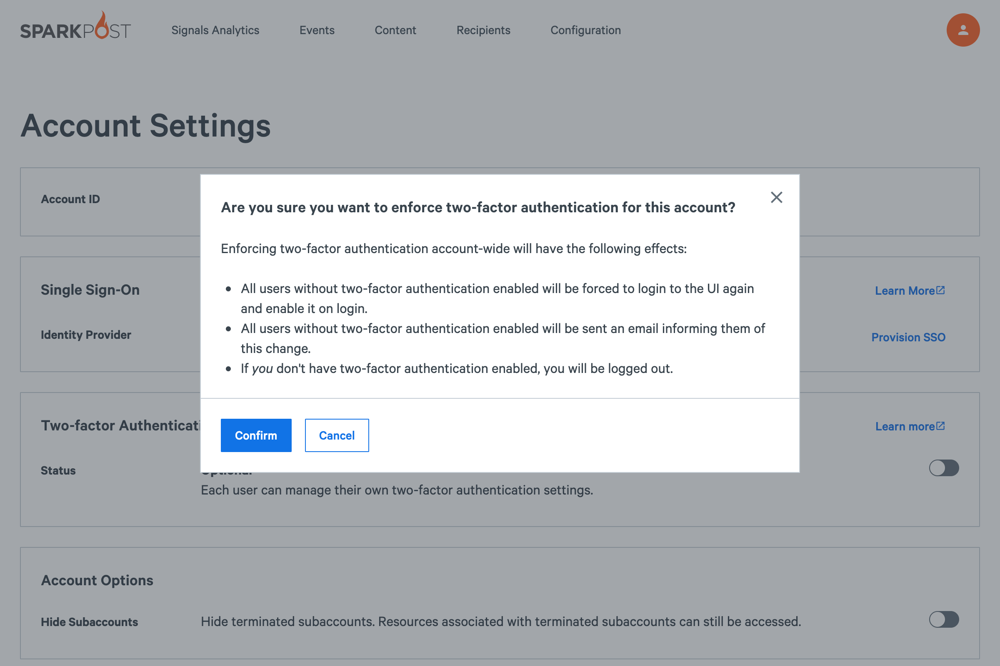
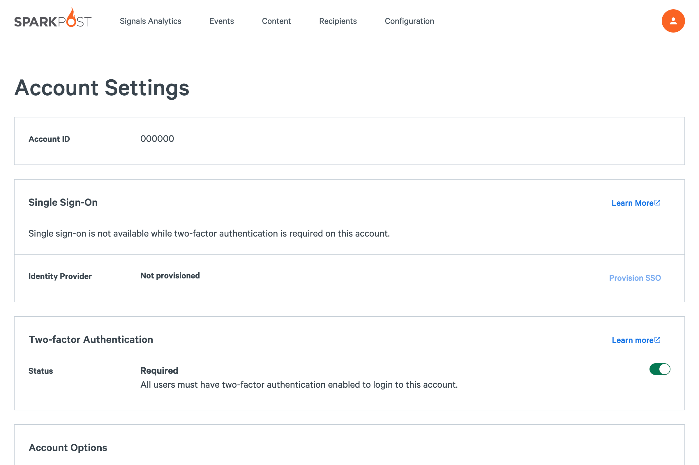
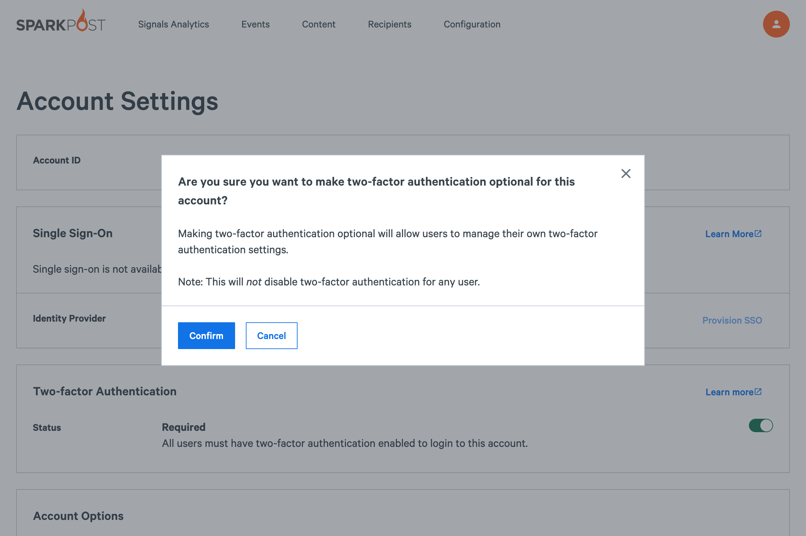
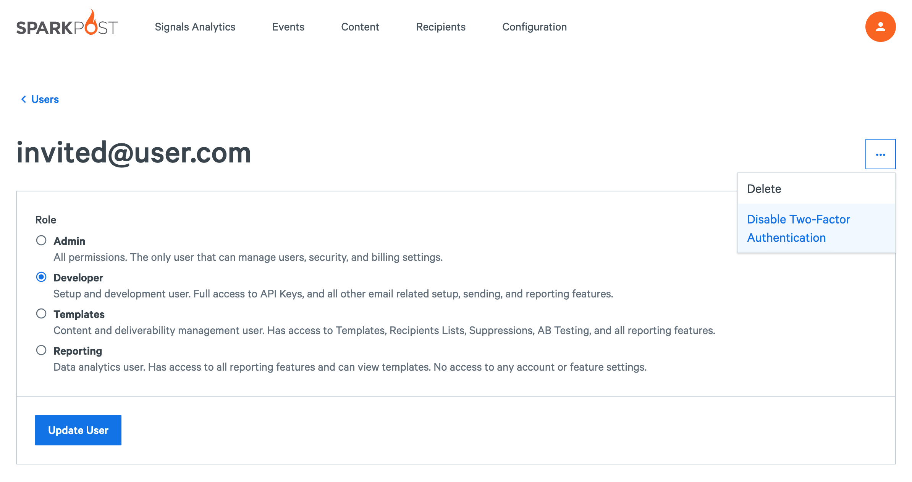

Add an extra layer of security to your account with two-factor authentication. This allows you to use your account in conjunction with a standard 3rd party authenticator app such as [Google Authenticator](https://support.google.com/accounts/answer/1066447), [Duo](https://duo.com/product/trusted-users/two-factor-authentication/duo-mobile), or [Authy](https://www.authy.com/app/mobile/) available for iOS, Android, etc. Enabling two-factor authentication will prevent anyone that does not have access to your authenticator app or backup codes from logging into your account - even if they somehow get your username and password.

* [Enabling Two-Factor Authentication](#enabling-two-factor-authentication)
* [Requiring Two-Factio Athentication For All Users](#requiring-two-factor-authentication-for-all-users)
* [Recovering Access](#recovering-access-to-account)

# Enabling Two-Factor Authentication

To enable two-factor authentication, go to your [profile](https://app.sparkpost.com/account/profile)([EU](https://app.eu.sparkpost.com/account/profile)).

Click on **Enable 2FA** and you'll see a screen like this:

Open up your chosen authenticator app and scan the QR code. If you can’t scan the QR code, you can also type the 23-character key into your App. Note: You can store the key somewhere safe in order to re-configure two-factor auth on a new device.

Enter a generated 2FA passcode and click on **Enable 2FA** to finish enabling 2 factor authentication.

You may also generate backup codes (after entering your password), which are 8 digits long and can be used instead of entering the code generated by your chosen Authenticator App.

These codes only expire when they are used, and come in handy if you lose your phone.

The next time you log in to your account, after entering your username and password into the login page, you'll see this second level of authentication requested:

Open up your authenticator app and look for the SparkPost entry. Enter the 6-digit number into the secondary log in page and you'll then be logged in to your account. This field also accepts backup codes.

Now you are all set! Two-Factor Authentication is now enabled for your account.

# Requiring Two-factor Authentication For All Users
Requiring two-factor authentication enforces that *all* users on the account (including the admin) set up two-factor authentication before performing sensitive account actions. Once set, any users without two-factor authentication enabled will be required to logout and set up two-factor authentication on next login.
**Turning on the Two-factor requirment will disable single sign-on for all users.**

### Enabling Two-factor Authentication Requirement
Two-factor authentication can be configured from an account admini's [Account Settings](https://app.eu.sparkpost.com/account/profile) ([EU](https://app.eu.sparkpost.com/account/settings)) page in the **Two-factor Authentication** section. When disabled, the status will be set to `Optional`.

To require two-factor authentication for all users, set the slider the from `Off` to `On`.

A warning will prompt you to confirm the changes to the account. Once enabled, the status will change to `Required`. An email will be sent all users informing them of the new security requirements, along with steps needed to set up two-factor authentication.

### Disabling Two-factor Authentication Requirement
An account admin can remove the requirement for two-factor authentication from the [Account Settings](https://app.sparkpost.com/account/settings) ([EU](https://app.eu.sparkpost.com/account/settings)) page.

Set the slider `Off` to disable it.

You will be prompted with a warning notifying you of potential changes to the specific user. The status will change to `Optional`. Removing the two-factor authentication requirement will not change existing settings for users.

# Recovering Access to Account
In the event that a user has lost or replaced their authentication device while two-factor authentication is enabled, they have a few options to recover access to their account:
* Reconfigure on a different device or app using orginal 23 character key.
* Enter a backup code into the two-factor log in screen, gain access, then re-configure their two-factor authentication settings.
* Have an account admin reset their two-factor authentication settings.

### Resetting Two-Factor Settings 
An account admin can reset the user's two-factor settings, allowing them to log in with just their password. If an admin lost their authentication device and there are no other admins that can reset their settings, please email [compliance@sparkpost.com](mailto:compliance@sparkpost.com) for help recovering the account.

If two-factor authentication is required for all users, the user will need to re-enable two-factor authentication at next login. **Any existing backup codes will be invalidated and new codes will need to be requested by the user.** 

To reset two-factor authentication settings for a user, head to the [Users](https://app.sparkpost.com/account/users) ([EU](https://app.eu.sparkpost.com/account/users)) page and select the user you want to edit.

From the user settings page, click the **Disable Two-factor Authentication** option. Confirm the prompt to disable it.
