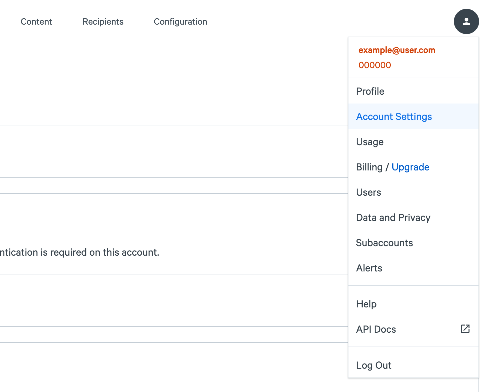

**This integration with Okta is currently under development and is not available to all customers yet. Please file a support ticket to learn more.**

## Features
- **Create users** Okta users will be created in the SparkPost application.
- **Update user roles** SparkPost user roles can be changed via Okta.
- **Deactivate users** Deactiving an Okta user will remove it in the SparkPost application.
- **Import users** Users created in SparkPost can be imported into Okta and either matched against existing Okta users or created as new Okta users.

## Requirements
- You must be a premier or enterprise customer. See our [pricing page](https://www.sparkpost.com/pricing/) for more details. Test accounts can also evaluate SCIM Provisioning.
- SAML SSO must be configured and enabled for your account. See instructions [here](https://www.sparkpost.com/docs/my-account-and-profile/sso/).
- Only admin users can generate SCIM access tokens.

## Configuration in SparkPost
1. From your SparkPost dashboard, navigate to your Account Settings page by clicking on your username at the upper right corner of the screen.

1. Under "Single Sign-On" click "Generate SCIM token".

1. Your token will be displayed. Copy it - you won't be able to see it again (don't worry, if you lose it you can generate a new one).

## Configuration in Okta
1. From the Okta admin console, navigate to "Applications" and select the SparkPost app.
1. Select the "General" tab. Under "App Settings" check the "Enable SCIM Provisioning" box.

1. Select the "Sign On" tab. Ensure that under "Credentials Details", "Application username format" is set to "Email".

1. Select the "Provisioning" tab, and from the "Integration" menu select "Edit".

1. In the "SCIM connector base URL" field:
    - For US-hosted customers, enter `https://api.sparkpost.com/api/v1/users/scim/v2`
    - For EU-hosted customers, enter `https://api.eu.sparkpost.com/api/v1/users/scim/v2`
    - For Enterprise customers, enter `https://<host>/api/v1/users/scim/v2`
    
        *Enterprise customers: note that you must replace < host > with your SparkPost tenant name. Please see your TAM if you need assistance determining your callback URL.*
    
1. Enter `email` in the "Unique identifier field for users"
1. Under "Supported provisioning actions", check the following boxes:
    - "Import New Users and Profile Updates"
    - "Push New Users"
    - "Push Profile Updates"
1. From the "Authentication Mode" drop-down menu, select "HTTP Header".
1. In the "HTTP Header" section, paste the token you generated [here](#generate-an-authorization-token) into the "Authorization" field.
1. Click "Test Connector Configuration" to verify settings are correct.
1. Click "Save".
1. In the "To App" section of the "Provisioning" tab, enable "Create Users", "Update User Attributes", and "Deactivate Users".

1. In the "To App" section, delete all attribute mappings except "Given name", "Family name", and "Primary email".

1. To allow updating user roles:

    - In the "To App" section, select "Go to Profile Editor".
    - Select "Add Attribute".
    - Enter the following values:
        - Data type: string
        - Display name: role
        - Variable name: role
        - External name: role
        - External namespace: urn:ietf:params:scim:schemas:core:2.0:User
        - Description: admin, reporting, templates, or developer
    - Click "Save Attribute".
1. In the "To Okta" section, delete all attribute mappings except "First name", "Last name", and "Primary email".

1. In the "To Okta" section, next to "Imported user is an exact match to Okta user if", select "Email matches".

## Known Issues / Troubleshooting
- N/A
