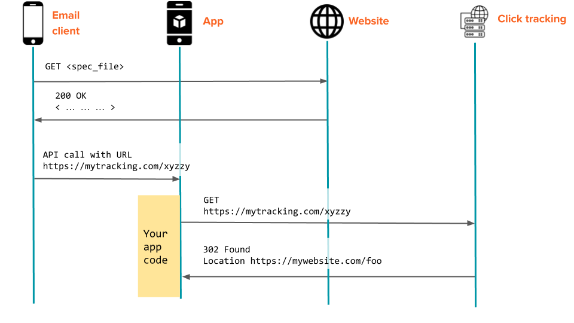
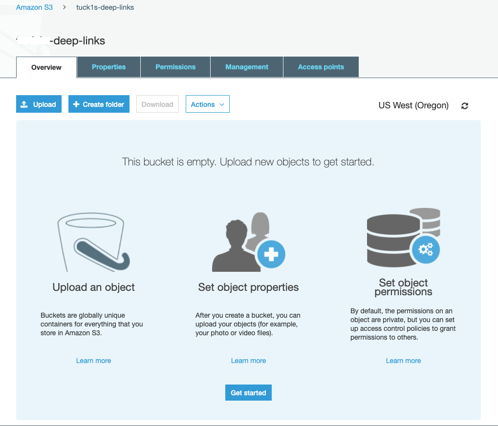
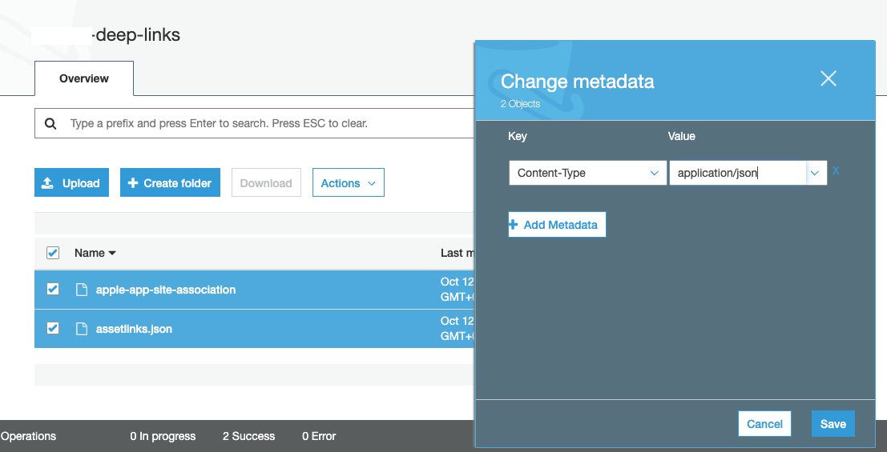
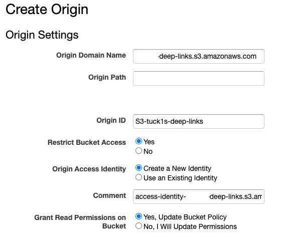
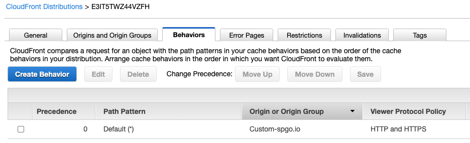
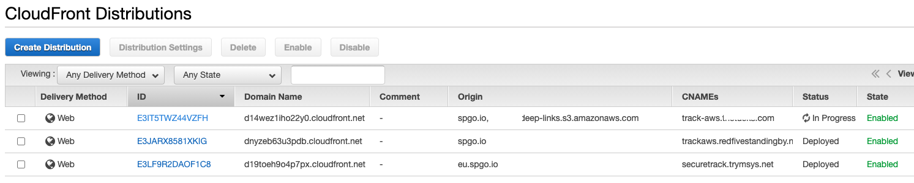
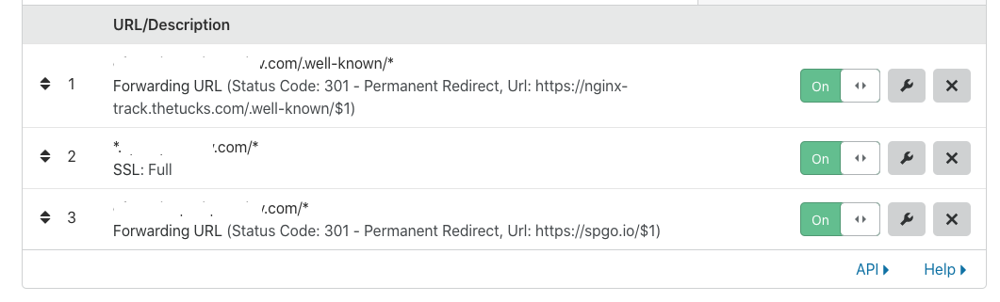

## Introduction

Email is often read and engaged with on mobile devices. Both iOS (9 and later) and Android (6.0 and later) provide a way for links in your content to take your users directly into an app that you have created, providing your users with a richer interactive experience.
The links that connect a user directly to your app are referred to as deep links.

This article describes how to configure your content and mobile apps to support deep links.

> iOS uses the term Universal Link. The Android term is "App link". We use the term "deep link" in this article to cover the aspects common to both.

When correctly configured, a deep link takes your user directly from the email to your app, without opening the mobile web browser. If the app is not installed, the mobile web browser will open and display the specified page instead.

## Setup requirements

- Known URL path(s) that you want to deep link to your application.
    - When using SparkPost Click Tracking, you choose the Tracking Domain and the custom link sub-path, explained [here](#tracking). It's best to choose a subdomain (e.g. `track.example.com`), so that subdomain can be redirected, while your website uses your organizational domain.

- Deep linking spec files hosted on your website or CDN, in the correct location for the devices to find. The spec file declares the identity of your app, and which URL paths lead to your app - described [here](#spec-file). The spec files must be accessible via HTTPS.

- A mobile app that is registered to handle incoming deep link requests - see [example code](#app-examples).

The deep link will operate only when all of these match correctly. When you're ready, check your setup against the [summary of setup steps](#summary).

##  <a name="app"></a> Writing your mobile app
The following developer documentation explains the deep linking mechanisms in detail.
- [Apple's Universal Links](https://developer.apple.com/library/content/documentation/General/Conceptual/AppSearch/UniversalLinks.html)

- [Android App Links](https://developer.android.com/training/app-links/index.html)

## <a name="spec-file"></a>Deep linking spec files

The spec files must be published on your domain(s) and accessible via HTTPS. They may be hosted on a regular web server, or via a CDN - examples [here](#hosting).

- For iOS devices, the file is named `apple-app-site-association`
- For Android devices, the file is named `assetlinks.json`

These files should be placed on your website in the directory `.well-known`.

### <a name="ios-spec-file"></a> iOS: example `apple-app-site-association`

```javascript
{
  "applinks": {
    "apps": [],
    "details": [
      {
        "appID": "ABCD1234.com.mycompany.testlinks",
        "paths": [
          "/f/open-in-app/*"
        ]
      }
    ]
  }
}

```

The `appID` is available from your XCode development environment, or from your [Apple Developer Account](https://developer.apple.com/), and follows a specific format:
- A hex prefix (e.g. `ABCD1234`)
- A "team ID" or "bundle ID" that identifies the developer of the app (e.g. `com.mycompany`)
- The app name (e.g. `testlinks`).

Your app needs access to the [Apple "associated domains" entitlement](https://developer.apple.com/documentation/safariservices/supporting_associated_domains). You need a paid Apple Developer account for this. Set up the "associated domains" to match your paths.


Configure the `paths` section to match the links in your email HTML content, depending on your chosen SparkPost click tracking setup (explained [here](#tracking)).

### <a name="android-spec-file"></a> Android: example `assetlinks.json`

```javascript
[{
    "relation": ["delegate_permission/common.handle_all_urls"],
    "target": {
        "namespace": "app_namespace",
        "package_name": "com.example.deeplinking",
        "sha256_cert_fingerprints":
        [<Your_APP_FINGERPRINT>]
    }
}]
```


---
## <a name="tracking"></a> Deep links and click tracking

Setting up a [custom tracking domain](https://www.sparkpost.com/docs/tech-resources/enabling-multiple-custom-tracking-domains/) is useful for branding and email reputation. It is required for click tracking of deep links in your HTML email.

It's best to choose a subdomain (e.g. `track.example.com`), so that subdomain can be redirected, while your website uses your organizational domain. Each tracking domain can serve regular email tracked links and deep links. Your content can use a mixture of both kinds of link inside the same email.

### HTTPS secure links

It is good practice to use secure (HTTPS) tracking domains, and it's essential if your website has an [HSTS](https://en.wikipedia.org/wiki/HTTP_Strict_Transport_Security) policy. We have articles describing the setup of this for:

-  [Various CDNs](https://www.sparkpost.com/docs/tech-resources/enabling-https-engagement-tracking-on-sparkpost/)
- Your own [web server reverse proxy such as NGINX](https://www.sparkpost.com/docs/tech-resources/using-proxy-https-tracking-domain/)

In both cases, your CDN (or proxy) redirects the specific tracking subdomain(s) to the SparkPost click tracking service, while your web content is served in the usual way.

### How click tracking works

It might be useful to understand how the SparkPost click tracking feature works with HTML links. Other email-service-provider click tracking services work in a similar way.

> When SparkPost encounters an anchor tag in an HTML email, it will replace the `href` attribute with a new URL pointing to the SparkPost click tracking service. When your recipient clicks that link, the SparkPost service receives the request (via CDN for HTTPS links), records the click, and redirects the recipient to your original URL.


*Normal click tracking (without deep links)  icons by [The Noun Project](https://thenounproject.com/)*

Deep links supersede this flow; after checking the spec file, the  device passes the request directly to your app instead. This means your app will receive the tracked link via an API call and can show the user an appropriate part of your app.

SparkPost won't receive the request and won't register the click in your analytics, unless your app code makes it happen.

A workaround is to disable tracking for deep links. This may be appropriate if you already have analytics for measuring in-app activity.

The preferred solution is to set up Sparkpost click tracking and include code in your app to follow the link. We'll review each of these.

### Workaround: Disabling Tracking of deep links

If you disable SparkPost's click tracking for the mobile deep links in your email, they work just fine with your mobile app with no further effort. This works because SparkPost does not alter untracked links in your email.

The "path" in your Apple spec file needs to match your iOS app "associated domains".

If you're using the SparkPost REST API, you can use the `data-msys-clicktrack` attribute to [disable click tracking for a single link in your email](https://developers.sparkpost.com/api/template-language/#header-per-link-disabling-of-click-tracking):

```html
<a data-msys-clicktrack="0" href="http://my.universallink.example.com/path/">Open in app</a>
```

You can also disable click-tracking on plain-text email content as follows. See [this article](https://developers.sparkpost.com/api/template-language/#header-custom-link-attributes) for more information.

```
http://www.example.com[[data-msys-clicktrack="0"]]
```

This is appropriate where your content has a mix of deep links and links leading to an ordinary website destination.

Alternatively, you can [disable click tracking for a whole transmission request](https://developers.sparkpost.com/api/transmissions.html#header-options-attributes) by setting the `click_tracking` option to `false`. The [SMTP API](https://developers.sparkpost.com/api/smtp-api.html#header-open-and-click-tracking)  supports a similar flag.
You can control [click tracking for SMTP messages](https://app.sparkpost.com/account/smtp) at the account level too.

### Preferred solution: Using SparkPost click tracking on deep links



*Deep link flow, app triggers click tracking. icons by [The Noun Project](https://thenounproject.com/)*

The device operating system "wakes up" your app with an API call, passing in  the URL. Your app issues an HTTP(S) GET to the URL, which registers the click. Your app receives the original URL in the response "Location" header; there's no need to follow the redirect and fetch the entire web-page.

Set up your spec files to match your [custom tracking domain](https://www.sparkpost.com/docs/tech-resources/enabling-multiple-custom-tracking-domains/) and custom link sub-path.

#### Custom Link Sub-Paths

Your spec file states which *link paths* should be treated as deep links. Any other paths on that domain will be opened via the device web browser in the usual way. This enables you to use both regular tracked links and deep links with that tracking domain. Deep links are distinguished from regular tracked links as follows.

SparkPost will include a specific string *in the path part* of a tracked URL when your content has the `data-msys-sublink` attribute, for example:

```html
<a href="http://my.universal-link.example.com" data-msys-sublink="open-in-app">Open in app</a>
```

This will cause the tracked link path to start with `/f/open-in-app/` which simplifies writing your `apple-app-site-association` file.

SparkPost supports the use of custom sub-paths on an individual link basis.  This allows you to choose, when setting up your spec file, which app opens depending on the custom subpath.

You can also set up custom sub-paths in plain text email content as follows. See [this article](https://developers.sparkpost.com/api/template-language/#header-custom-link-attributes) for more information.

```
http://www.example.com[[data-msys-sublink="open-in-app"]]
```

If a custom sub-path is not used, the spec files can be configured to open on a wildcard path.

Examples for iOS and Android are shown [here](#app-examples).

---
## <a name="summary"></a> Summary of setup steps

1. Configure your CDN or reverse proxy to host your custom tracking domain.
1. Configure and verify a custom tracking domain on your SparkPost account.
1. Choose the link sub-path(s) to be used for deep linking.
1. Ensure the spec files are set up for your tracking domain(s) and link sub-path(s).
1. Test that your spec files are accessible via HTTPS.
1. Send your email through SparkPost with click tracking enabled, using your custom tracking domain and link sub-path:
    ```
    Your invoice is available <a data-msys-sublink="open-in-app" href="https://www.example.com/invoice/101">here</a>.
    ```
1. Check the fallback cases:
    - the link opens correctly via desktop browser.
    - on a mobile device without your app installed, the link opens via browser.
1. Check the link launches your app on mobile devices.

    *To enable SparkPost to track deep links:*
1.  Have your mobile app code make an HTTP GET request to the SparkPost click tracking service when it handles the incoming click event. Details and sample code for this [below](#app-examples).
1. Have your app take action based on the original URL which SparkPost returns in its "3xx redirect" HTTP response.


---
## <a name="app-examples"></a> Example application code

## iOS - Swift - forwarding clicks to SparkPost

In your app `AppDelegate.swift`, in class `AppDelegate`, add a handler for an `NSUserActivity`:

```swift
func application(_ application: UIApplication, continue userActivity: NSUserActivity, restorationHandler: @escaping ([UIUserActivityRestoring]?) -> Void) -> Bool {
    print("Continue User Activity called: ") // debug
    if userActivity.activityType == NSUserActivityTypeBrowsingWeb,
        let url = userActivity.webpageURL {

        // Follow the link to trigger click tracking

        let task = URLSession.shared.dataTask(with: url, completionHandler: { (data, response, error) in
            guard let originalURL = response?.url else {
                print("Unexpected URL \(url.absoluteString)")
                return
            }
            print(originalURL)
        })
        task.resume()
        }
    }
    return true
}
```

This code calls the SparkPost click tracking service, which responds with a "3xx" redirect to the original URL from your email, which can be used by your app.

This simple code gets the `Location` header and also follows the redirect to fetch the web-page, which consumes device bandwidth. It's more efficient, but needs more code to stop after the "302" response is received; complete example iOS [app here](https://github.com/SparkPost/deep-links/tree/main/iOS).

#### iOS User Agent

In SparkPost event reporting, the attribute `user_agent` carries information on app name and OS version, for example `"testlinks/1 CFNetwork/1197 Darwin/20.0.0"`. This enables you to use SparkPost analytics to find out which links are being opened via your app.

## Forwarding Clicks From Android To SparkPost

When an Android email client recognizes that an app link has been clicked based on your apps' `AndroidManifest.xml`, it sends an `intent` which triggers the registered `Activity` in your app. You can then make an HTTP request to the link to trigger a "click" event in Sparkpost and retrieve the original tracked URL from the message.

Here is a sample `Activity` with the corresponding `AsyncTask` that will perform an HTTP GET to the SparkPost click tracking service after an Android App Link has been clicked:

```java
public class LinkDestinationActivity extends AppCompatActivity{

    @Override
    protected void onCreate(@Nullable Bundle savedInstanceState) {
        super.onCreate(savedInstanceState);
        setContentView(R.layout.link_destination_activity);

        //Grab the Tracking Link from the intent
        Intent intent = getIntent();
        Uri linkUri = intent.getData();

        //Pass the tracking link into the AsyncTask for network communication
        RequestTask task = new RequestTask();
        task.executeOnExecutor(AsyncTask.THREAD_POOL_EXECUTOR, linkUri.toString());
    }

    /**
     * Android requires network communication off the main UI thread
     */
    protected class RequestTask extends AsyncTask<String, Void, Void> {

        @Override
        protected Void doInBackground(String... strings) {
            String uri = strings[0];
            //Activate Click Tracking
            try {
                URL url = new URL(uri);
                HttpURLConnection connection = (HttpURLConnection) url.openConnection();

                InputStream in = new BufferedInputStream(connection.getInputStream());

                int numRead = 0;
                byte [] buffer = new byte[1024];
                StringBuilder builder = new StringBuilder();

                while ((numRead = in.read(buffer)) > 0) {
                    String newString = new String(buffer, 0, numRead);
                    builder.append(newString);
                }
                //Simply print out the response
                System.out.println(builder.toString());
                connection.disconnect();
            } catch (MalformedURLException e) {
                e.printStackTrace();
            } catch (IOException e) {
                e.printStackTrace();
            }
            return null;
        }
    }
}
```
*Android Java example*

---
##  <a name="hosting"></a> Hosting the spec files

You can use a CDN or an ordinary web-server to host your spec files. Ensure you have a valid certificate for your domain, as devices need to fetch these files using HTTPS.

When set up, you can get a security report by running the [SSL Labs server test](https://www.ssllabs.com/ssltest/analyze.html).

### <a name="apache"></a> Apache

1. Find the directory used by your web server, known as the web root. The  default is `/var/www/html`, but yours may vary. You can find this by locating the `DocumentRoot` setting in your `.conf` files.

 1. Within this, create a directory `.well-known` if it doesn't already exist, and upload/create your spec files here. This will usually require root privilege on your server.

3. Restart Apache.

4. You can check they are served using your web browser.

    

*Checking spec files*

Click the padlock symbol and check the certificate is valid and as expected. Repeat for the Android `assetlinks.json` file.

### NGINX

1. Follow the steps in [this article](https://www.sparkpost.com/docs/tech-resources/using-proxy-https-tracking-domain/) to set up your secure tracking domain.

1. Check where your NGINX root directory is, by running `nginx -V`. Look for the path shown after `--prefix=`, for example `--prefix=/usr/share/nginx` (and adjust the following example to suit). This should contain a directory named `html` which is used for your files.

1. Within this, create a directory `.well-known` if it doesn't already exist, and upload/create your spec files here. This will usually require root privilege on your server.

1. Add `location` blocks to your config to declare the spec files. Here is a complete example, including the engagement-tracking `proxy-pass` block done in step 1.

    ```
    server {
        listen 80;
        listen 443 ssl;
        server_name     nginx-track.example.com;
        ssl_certificate /etc/letsencrypt/live/nginx-track.example.com/fullchain.pem;
        ssl_certificate_key /etc/letsencrypt/live/nginx-track.example.com/privkey.pem;

        # Security improvements - needed to get an "A" rating
        ssl_protocols TLSv1.2;
        ssl_prefer_server_ciphers on;
        ssl_ciphers ECDH+AESGCM:ECDH+AES256:ECDH+AES128:DH+3DES:!ADH:!AECDH:!MD5;

        # Serve the deep linking spec files using specific patterns
        location = /.well-known/apple-app-site-association {
            root /usr/share/nginx/html;
            default_type "application/json";
            }

        location = /.well-known/assetlinks.json {
        root /usr/share/nginx/html;
        default_type "application/json";
        }

        # pass all other requests through to SparkPost engagement tracking
        location / {
            proxy_pass      https://spgo.io;
        }
    }
    ```

    Note the security settings to use only newer TLS versions and disable weaker ciphers, to get an "A" rating on the [SSL Labs server test](https://www.ssllabs.com/ssltest/analyze.html). You may wish to adjust these to suit your own IT policy, e.g. to accept TLS v1.1 as well for compatibility with older email clients / web browsers.

1. Check your configuration is valid using `sudo nginx -t`. If no errors are reported, then reload using `sudo nginx -s reload`.

1. Check that your spec files are correctly published and available on the Internet - see [troubleshooting tips](#troubleshooting).

---

### AWS CloudFront

> As described [here](#spec-file), it's easy to create spec files in your web site top-level domain's `/.well-known` directory, and write your apps to match those domain(s) *and* the tracking sub-domains. The following steps are needed *only* if you wish to serve particular, different spec files for your *tracking domain* URLs.

First set up your secure tracking domain using CloudFront - instructions [here](https://www.sparkpost.com/docs/tech-resources/enabling-https-engagement-tracking-on-sparkpost/#aws-create). This establishes your tracking domain routing and certificate in AWS. This section describes how to:

 * Create an S3 bucket for the spec files;
 * Set up our CloudFront distribution to selectively serve requests on our tracking domain from the bucket;
 * Test the files are served correctly;
 * Ensure our app domain association matches our tracking domain.

With CloudFront we are working with the specific sub-domain used for link tracking. It's therefore an alternative to updating your main website's `.well-known` directory.

#### Create S3 bucket

1. On [AWS S3](https://s3.console.aws.amazon.com/s3/), create a new bucket if you don't already have a bucket for your website. Give it a name, and choose region.

    

    * Step 2, "Congfigure options", you can leave these options unset.

    * Step 3, "Set permissions", leave this at default ("Block all") for now.

    * Step 4, "Review", choose "Create bucket". This returns you to the S3 console.

1. On your bucket permissions tab, select Edit, then uncheck "block all public access" and select "Save", then "confirm". Refer to [AWS documentation](https://docs.aws.amazon.com/AmazonS3/latest/dev/WebsiteAccessPermissionsReqd.html) if needed.

    

    > Note: you don't need to create a Bucket Policy at this stage, because CloudFront creates a specific policy for you in the next step.

    > There is also no need to enable "Static website hosting", as CloudFront will selectively match specified URL path patterns to serve your files.

1. Select your bucket. If you don't already have a folder named `.well-known`, then create it.

    

    Leave security settings at "None (Use bucket settings)" and select Save.

1. Select your folder, then select "Upload". Drag and drop in your spec files.

    

    Select Next. Leave access permissions for your user ID at their defaults, and select Next.

    Choose "Standard" storage class and select Next. After review, complete the upload.

    You should now have two files in your bucket.

    

1. Select both files via the check-boxes. Under the "Actions" drop-down menu, select "Change metadata". Under "Select a key", choose `Content-Type`, and type in the value `application-json`. Select "Save" then "Change".

    

    Your files are now uploaded in S3.

#### Set up AWS CloudFront to serve your spec files

1. On [AWS CloudFront](https://console.aws.amazon.com/cloudfront/home), under "Origins and Origin Groups", select "Create Origin".

    

    * In Origin Domain Name, start typing the name of your S3 bucket, then choose it from the drop-down list presented.

    * Leave Origin Path blank, as we have created the S3 bucket with the correct folder-name to fit the incoming path already.

    * On Origin Access Identity, choose "Create a New Identity" if you don't have one already.

    * On Grant Read Permissions on Bucket, choose "Yes, Update Bucket Policy".

    * Leave the other settings at defaults. Scroll down and select "Create".

1. Set up which URL paths will be forwarded by CloudFront to the files in your bucket.

    Select your distribution by clicking on its name. Select the "Behaviors" tab and then "Create Behavior".

    

    * In Path Pattern, type `.well-known/*`

        

    * In Origin or Origin Group, select your S3 bucket from the drop-down list.

    * In Viewer Protocol Policy, select "HTTPS Only" (as mobile devices will always request using HTTPS).

    * Leave the remaining settings at default. At the bottom of the page, select "Create".

    * Back on the CloudFront Behaviors list view, you should see your new rule has been created.

1. Return to the CloudFront Distributions list, you should see Status "In Progress" as the distribution is deployed.

    

1. Check your S3 bucket configuration is secure using [this tool](https://console.aws.amazon.com/trustedadvisor/home?#/category/security).

1. In case of difficulty, see [troubleshooting tips](#troubleshooting).

---

### CloudFlare

> As described [here](#spec-file), it's easy to create spec files in your web site top-level domain's `/.well-known` directory, and write your apps to match those domain(s) *and* the tracking sub-domains. The following steps are needed *only* if you wish to serve particular, different spec files for your *tracking domain* URLs.

Unlike AWS CloudFront, you need to already have the spec files (`apple-app-site-assocation` and `assetlinks.json`) hosted elsewhere, such as on a web server.

1. In your CloudFlare dashboard, an additional page rule is necessary to serve the spec files.

    * Page Rules Tab -> Create Page Rule

        

    * Enter your domain without the https prefix, like so: `track.yourdomain.com/.well-known/*`

    * Add a Setting -> Forwarding URL (specify a 301 redirect option)

    * Destination URL is determined by where the spec files are hosted.  The destination URL should be configured as `https://<DEEP_LINK_DESTINATION>/.well-known/$1`. (The `$1` placeholder contains the file name matched by the `*` in the domain rule.)

    * CloudFlare page rules are evaluated in priority order.  Set this page rule to be first, with the page rules for forwarding to SparkPost Engagement Tracking afterwards.

1. Your rules should now look like this.

    

1. In case of difficulty, see [troubleshooting tips](#troubleshooting).

---
## <a name="troubleshooting"></a>Troubleshooting tips

### Check your spec files

You can check your spec files are correctly published and available on the Internet, using `curl` or a web browser. Be sure to specify `https`.

```
curl https://##your-tracking-domain-here##/.well-known/apple-app-site-association

curl https://##your-tracking-domain-here##/.well-known/assetlinks.json
```

> Note: If your tracking sub-domain does not have spec file(s), mobile devices will also look on the root domain for files in the `/.well-known` directory. This is shown in the above simple [Apache example](#apache).

### Check your tracked links

You can view your encoded links using Gmail, by selecting the three dots menu top-right, then "Show Original". Check the domain is as expected, and the `<A HREF ..` links are using HTTPS.

### Check your app matches your tracking domain

The domains entitlement in your app(s) must match your tracking domain. This can be done specifically, or with a wildcard matching a sub-domain. Refer to
* [Apple](#ios-spec-file) configuration
* [Android](android-spec-file) configuration


## Further reading

1. [Branch.io](https://blog.branch.io/how-to-setup-universal-links-to-deep-link-on-apple-ios/) article on setting up iOS Universal Links
1. [Apple](https://developer.apple.com/documentation/xcode/allowing_apps_and_websites_to_link_to_your_content/supporting_universal_links_in_your_app) article on Universal Links including info on MacOS and WatchOS as well as iOS
1. [Tips](https://shinesolutions.com/2017/06/15/universal-linking-a-few-things-to-be-prepared-for/) on iOS app debugging with Universal Links and the XCode device simulator
1. [Apple WWDC 2020](https://developer.apple.com/videos/play/wwdc2020/10098) presentation
1. More on AWS [CloudFront Distributions](https://docs.aws.amazon.com/AmazonCloudFront/latest/DeveloperGuide/distribution-create-delete.html)
1. View email internals including tracked links, with Gmail [Show Original](https://support.google.com/mail/answer/29436?hl=en-GB)
1. NGINX [Location](https://docs.nginx.com/nginx/admin-guide/web-server/web-server/#locations) block
1. [Understanding and Configuring Cloudflare Page Rules](https://support.cloudflare.com/hc/en-us/articles/218411427-Understanding-and-Configuring-Cloudflare-Page-Rules-Page-Rules-Tutorial-)