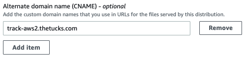
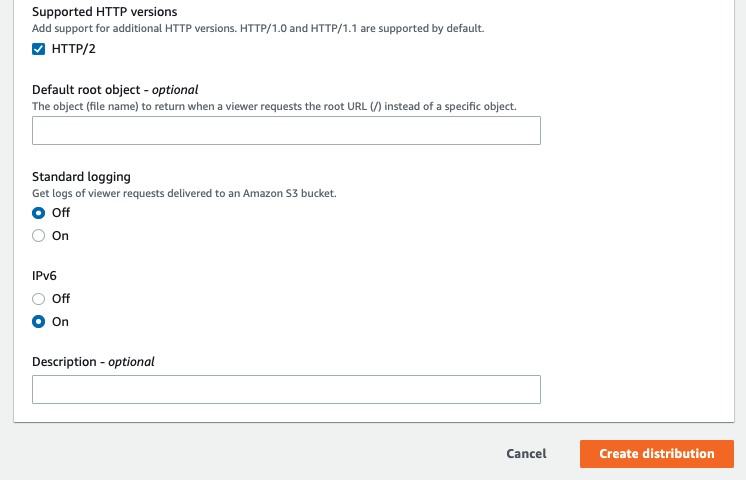
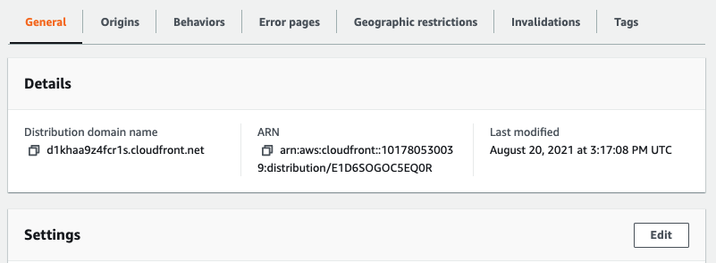

## Overview

SparkPost supports HTTPS engagement tracking for all self-service customers. This article describes how to use a Content Delivery Network (CDN) to enable SSL engagement tracking for your domain. After completing the steps below, your email recipients will see HTTPS links in the email you send. When they visit a tracked link, your CDN will handle the SSL connection, then pass the HTTP request on to SparkPost. SparkPost will record the click event and redirect the recipient to the original URL.

## Configuring SSL Certificates

In order for HTTPS engagement tracking to be enabled on SparkPost, our service needs to present a valid certificate that will be trusted by the email recipient’s browser.  SparkPost does not manage certificates for customer engagement tracking domains, as we are not the record owner for our customers’ domains.

Use a CDN like [Cloudflare](http://www.cloudflare.com), [Fastly](http://www.fastly.com) or [AWS Cloudfront](https://aws.amazon.com/cloudfront/) to manage certificates and keys for any custom engagement tracking domains.  These services forward traffic onwards to SparkPost so that HTTPS tracking can be performed.

## How to Create a Secure Tracking Domain on SparkPost

In addition to SSL certificates, link forwarding, and page rules (see the step by step guide below), you will need to create a tracking domain with the tracking domains API using the `"secure": true` string. Detailed information on this operation can be found in our API documentation [here](https://developers.sparkpost.com/api/tracking-domains.html#tracking-domains-create-and-list-post).

## <a name = "switch-to-secure"></a> How to Switch a Tracking Domain from Insecure to Secure

If you have previously created a tracking domain (whether verified or unverified), and wish to switch it from insecure (the default value for tracking domains) to secure, use the tracking domains API `PUT` call to update the tracking domain with the `"secure": true` string. Detailed information on this operation can be found in our API documentation [here](https://developers.sparkpost.com/api/tracking-domains.html#tracking-domains-retrieve,-update,-and-delete-put).


## Step by Step guides

This document includes step by step guides for the following CDNs.

* [CloudFlare](#cloudflare): create a Domain
* AWS CloudFront:
    * [Create a Domain](#aws-create)
    * [Issue a Certificate](#aws-cert)
    * [Update an Existing Domain](#aws-update) to pass `User-Agent` information
* [Fastly](#fastly): create a Domain

Please note, if you are using a CDN not listed here, the steps will likely differ in workflow. Please refer to your CDN's documentation and contact their respective support departments if you have any questions.

---
## <a name="cloudflare"></a> Step by Step Guide with CloudFlare

1. Create CloudFlare account
2. Go to “DNS” tab on the CloudFlare UI:

    

3. Add domain and then add the following Cloudflare NS records (**please note**, for other providers, the NS records to be used will differ):

    ```
    NS	aron.ns.cloudflare.com
    NS	peyton.ns.cloudflare.com
    ```
    These values can be found under the DNS tab on the Cloudflare UI.

    **Example:**

    Using the domain `track.example.com`, below is a command line DIG command to confirm that the NS records have been updated to reflect the required changes:

    ```
    dig example.com NS

    ; <<>> DiG 9.8.3-P1 <<>> track.example.com NS
    	;; global options: +cmd
    	;; Got answer:
    	;; ->>HEADER<<- opcode: QUERY, status: NOERROR, id: 25635
    	;; flags: qr rd ra; QUERY: 1, ANSWER: 2, AUTHORITY: 0, ADDITIONAL: 0

    	;; QUESTION SECTION:
    	;track.example.com.			IN	NS

    	;; ANSWER SECTION:
    	track.example.com.		86400	IN	NS	peyton.ns.cloudflare.com.
    	track.example.com.		86400	IN	NS	aron.ns.cloudflare.com.

    	;; Query time: 128 msec
    	;; SERVER: 10.76.3.194#53(10.76.3.194)
    	;; WHEN: Tue May  9 10:15:20 2017
    	;; MSG SIZE  rcvd: 88
    ```

4. Create the appropriate page rule settings for the domain. In the page rules tab, perform the following instructions:
    * Page Rule Tab -> Create Page Rule
    * Enter your domain like so: `track.yourdomain.com/*`
    * Add a Setting -> Forwarding URL (you may need to specify a 301 redirect option)
    * Destination URL is https://<CNAME_VALUE>/$1. Replace <CNAME_VALUE> with the value displayed in the tracking domains section of the SparkPost UI. E.g.: for SparkPost US, this would be `spgo.io`; for SparkPost EU, this would be `eu.spgo.io`; for PMTA+Signals, refer to your user guide.
    * Save and Deploy (turn page rule on)

    

5. Cloudflare has Universal SSL for all accounts, but it's good to ensure that setting on the page rule is "SSL". This is required for how CloudFlare will validate the certificate on the origin.

    


    More information on SSL options for Cloudflare can be found [here](https://support.cloudflare.com/hc/en-us/articles/200170416).

6. Turn the page rule ON.

7. If you with to also set up [Mobile Universal and App Links](https://www.sparkpost.com/docs/tech-resources/deep-links-self-serve/), an additional page rule is necessary. A prerequisite for this configuration is that the desired universal link files (apple-app-site-assocation/assetlinks.json) are already hosted either via a CDN or webserver.
    * Page Rule Tab -> Create Page Rule
    * Enter your domain like so: `track.yourdomain.com/.well-known/*`
    * Add a Setting -> Forwarding URL (you may need to specify a 301 redirect option)
    * Destination URL is determined by where the universal link files are hosted.  The destination URL should be configured as https://<UNVERSAL_LINK_DESTINATION>/.well-known/$1.  Note that CloudFlare page rules are evaluated in priority order.  This page rule should be first, with the page rule from Step 4 second.

    

8. Add a CNAME entry into DNS for your tracking domain. The value in the record doesn't matter; the record simply needs to exist. For example, if your tracking domain is `track.example.com`, a CNAME value of `example.com` is sufficient. Without a record to reference, the the page rule never gets triggered, and the proper redirection will not occur. Please note that the typical time to progagation of new CNAME records is often around five to ten minutes, but can be longer depending on your DNS provider.

9. Run the [Update a Tracking Domain API](https://developers.sparkpost.com/api/tracking-domains/#tracking-domains-put-update-a-tracking-domain) using the following Post Data:

    ```
    {
        "secure"  : true
    }
    ```

Note: If you would like this tracking domain to be the default, please add `"default": true` to the JSON object above, before updating the domain.

10. Navigate to the Tracking Domains section in the UI and click the orange "test" verification link. At this point, the process is complete.


---
## <a name="aws-create"></a> Step by Step Guide with AWS CloudFront

Note: If you utilize CloudFront as your CDN to manage certificates and keys for any custom engagement tracking domains, it will result in a loss of user agent data. We include steps below to minimize data loss.

The following is a sample guide for use with AWS CloudFront **only**; please note, the steps to configure your chosen CDN will likely differ from CloudFront in workflow. Please refer to your CDN's documentation and contact their respective support departments if you have any questions.
For up to date information on creating a distribution via CloudFront, please refer to the [AWS docs](https://docs.aws.amazon.com/AmazonCloudFront/latest/DeveloperGuide/distribution-web-creating-console.html).

1. Login with your credentials onto AWS console and navigate to [CloudFront](https://console.aws.amazon.com/cloudfront/).

1. Choose **Create Distribution**:

    

1. On the "Select a delivery method for your content" page, under the **Web** section, choose **Get Started**.

    

1. On the Create Distribution page fill out the following:
    * Under Origin Settings, fill in the **Origin Domain Name**. Use the value displayed in the tracking domains section of the SparkPost UI. E.g.: for SparkPost US, this would be `spgo.io`; for SparkPost EU, this would be `eu.spgo.io`.

        

    * Under Origin Settings, for **Origin Protocol Policy**, select **HTTPS Only**.

        

    * Under "Cache and origin request settings", choose "Use legacy cache settings".

        

    * Enable forwarding of the `User-Agent` header. Set the configuration **Cache Based on Selected Request Headers** to "Whitelist".  Type in `User-Agent` and select "Add Custom". This allows `User-Agent` data to be present in your engagement events received from SparkPost.

        

        An orange warning indicator appears. This is expected.

    * Under Default Cache Behavior Settings, set **Query String Forwarding and Caching** to "Forward all, cache based on all".

        

    * Under Distribution Settings, fill in **Alternate Domain Names (CNAMEs)** with your custom tracking domains (i.e., www.customtrackingdomain.com).
        * **Note:** Can add up to 100 domains.

        

    * Under Distribution Settings, for "SSL Certificate", select **Custom SSL Certificate** - Upload certificates as needed.

        

        > If you want to have AWS create a new certificate within AWS instead of importing an existing one, leave this set at "Default" and the Alternate Domain Names field blank for the time being.

    * At the bottom of the page, press **Create Distribution**. This returns you to the main CloudFront Distributions list.


        


1. <a name="cname"></a> Create, or update, a CNAME record with your DNS service to route queries for tracking domain(s) with your CloudFront distribution ID. This will be specific to your DNS service.

   * Get the "Domain Name" for your distribution.

        

    * Create the CNAME record within your DNS service (this will be specific to your provider). If you have a TTL (time to live) field, we suggest to set this to 1 hour.

        

        _Example DNS provider CNAME setup_

        You can verify that the routing is successful using `ping` on your created record. You should see a response from `xyzzy.cloudfront.net`.

### <a name="sparkpost-app"></a> In the SparkPost app

1. Log into SparkPost app, or use the SparkPost [Tracking Domain API](https://developers.sparkpost.com/api/tracking-domains/#tracking-domains).

1. Add **custom tracking domain**. It can't be verified just yet.

1. Ensure your domain is set to `secure` mode as [above](#switch-to-secure).

1. Verify the tracking domain.

1. Use tracking domain while sending messages.

---
### <a name="aws-cert"></a>Using AWS Certificate Manager (ACM) to issue a certificate for your domain(s)

Once your CNAME is set up with your DNS provider, instead of providing an existing certificate, you can have AWS issue a certificate for your custom tracking domain(s).

1. Navigate to the AWS Certificate Manager (ACM). Choose Request a Certificate, then select Request a public certificate.

    Add your domain name(s), select Next.

    

1. Choose DNS validation. Add tags if you wish. Select Review, then Confirm and Request.

    

1. On your DNS provider, create the CNAME records that are used to by AWS to validate that these domain(s) are yours.

    

1. Check that the certificate is shown with status "Issued", with Validation status of "Success".

    

#### To attach the issued certificate to your CloudFront distribution:

1. Navigate to CloudFront. Select your distribution, then select "Edit":

    

1. Enter your domain names, select "Custom SSL certificate", and select from the drop-down list.

    

1. At the bottom of the page, click on the "Yes, Edit" button.

      

1. Go back through the [steps in the SparkPost app](#sparkpost-app) to validate your domain, as this requires the certificate to be present and valid.

---
### <a name = "aws-update"></a> Updating an Existing Domain on AWS CloudFront

If you use AWS CloudFront to enable HTTPS engagement tracking, by default, CloudFront replaces the User-Agent header with "Amazon CloudFront," obscuring device and client information. To regain the device and client information, configure CloudFront to forward the original User-Agent header.

1. Navigate to the CloudFront console.

1. Click on your distribution's ID.

      

1. Click on the "Behaviors" tab.

      

1. Click on the checkmark next to the first item in the list.

      

1. Click on the "Edit" button.

      

1. Under "Cache and origin request settings", choose "Use legacy cache settings".

    

1. Set the configuration **Cache Based on Selected Request Headers** to "Whitelist".  Type in `User-Agent` and select "Add Custom". This allows `User-Agent` data to be present in your engagement events received from SparkPost.

      

    An orange warning indicator appears. This is expected.

1. At the bottom of the page, click on the "Yes, Edit" button.

      

---
## <a name="fastly"></a> Step by Step Guide with Fastly

Sign up for Fastly or log in to an existing account.

1. Click **Configure** on the Dashboard.
2. Click the gear icon to open the **Manage Service** menu and click **Create**.

Set the options as follows:

Server address and port: For SparkPost US, this would be `spgo.io :  443`; for SparkPost EU, this would be `eu.spgo.io : 443`
Domain: Your click tracking domain, e.g. `click.business.com`
Description: SparkPost (or whatever you like!)
