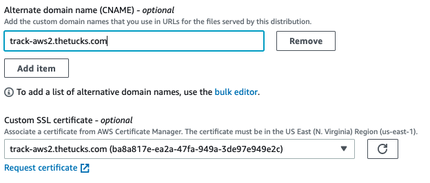

## Overview

SparkPost supports HTTPS engagement tracking for all self-service customers. This article describes how to use a Content Delivery Network (CDN) to enable SSL engagement tracking for your domain. After completing the steps below, your email recipients will see HTTPS links in the email you send. When they visit a tracked link, your CDN will handle the SSL connection, then pass the HTTP request on to SparkPost. SparkPost will record the click event and redirect the recipient to the original URL.

> Alternative: to configure HTTPS engagement tracking using your own proxy, see [this article](https://www.sparkpost.com/docs/tech-resources/using-proxy-https-tracking-domain/).

## Configuring SSL Certificates

In order for HTTPS engagement tracking to be enabled on SparkPost, our service needs to present a valid certificate that will be trusted by the email recipient’s browser. SparkPost does not manage certificates for customer engagement tracking domains, as we are not the record owner for our customers’ domains.

Use a CDN such as [Cloudflare](http://www.cloudflare.com), [Fastly](http://www.fastly.com) or [AWS Cloudfront](https://aws.amazon.com/cloudfront/) to manage certificates and keys for any custom engagement tracking domains. These services forward requests onward to SparkPost so that HTTPS tracking can be performed.

## Step by Step guides

This document includes step by step guides for the following CDNs.

* CloudFlare:
    * [Create a Domain](#cloudflare)
        * (Cloudflare certificates are auto-issued)
* AWS CloudFront:
    * [Create a Domain](#aws-create)
    * [Issue a Certificate](#aws-cert)
    * [Update an Existing Domain](#aws-update) to pass `User-Agent` information
* Fastly:
    * [Create a Domain](#fastly-create)
    * [Issue a Certificate](#fastly-cert)

> If you plan to use [deep linking](./deep-links-self-serve) with Android apps, CloudFlare serves files via a `301` redirect, which can prevent Android apps autoverifying domains.

If you are using a CDN not listed here, the steps will differ in workflow. Please refer to your CDN's documentation and contact their respective support departments if you have any questions.

## <a name="endpoints"></a>SparkPost tracking endpoints

This address is configured as the address your CDN forwards HTTPS requests to, usually known as the "origin server".
|Service|Endpoint|
|--|--|
|SparkPost US|`spgo.io`|
|SparkPost EU|`eu.spgo.io`|
|PowerMTA+Signals|Refer to your PowerMTA User Guide documentation|

## Create a secure tracking domain on SparkPost

After configuring your CDN, you need instruct SparkPost to encode your links using HTTPS and verify your domain - instructions [here](#switch-to-secure).

---
## <a name="cloudflare"></a> Step by Step Guide with CloudFlare

1. Create CloudFlare account.

1. Go to “DNS” tab on the CloudFlare UI:

    

1. Add domain and then add the following Cloudflare NS records (**please note**, for other providers, the NS records to be used will differ):

    ```
    NS	aron.ns.cloudflare.com
    NS	peyton.ns.cloudflare.com
    ```
    These values can be found under the DNS tab on the Cloudflare UI.

    **Example:**

    Using the domain `track.example.com`, below is a command line DIG command to confirm that the NS records have been updated to reflect the required changes:

    ```
    dig example.com NS

    ; <<>> DiG 9.8.3-P1 <<>> track.example.com NS
    	;; global options: +cmd
    	;; Got answer:
    	;; ->>HEADER<<- opcode: QUERY, status: NOERROR, id: 25635
    	;; flags: qr rd ra; QUERY: 1, ANSWER: 2, AUTHORITY: 0, ADDITIONAL: 0

    	;; QUESTION SECTION:
    	;track.example.com.			IN	NS

    	;; ANSWER SECTION:
    	track.example.com.		86400	IN	NS	peyton.ns.cloudflare.com.
    	track.example.com.		86400	IN	NS	aron.ns.cloudflare.com.

    	;; Query time: 128 msec
    	;; SERVER: 10.76.3.194#53(10.76.3.194)
    	;; WHEN: Tue May  9 10:15:20 2017
    	;; MSG SIZE  rcvd: 88
    ```

1. Create the appropriate page rule settings for the domain.

    * In the page rules tab: Create Page Rule:

        

    * Enter your domain with a trailing `/*`, e.g. `track.yourdomain.com/*`.

    * Add a Setting -> Forwarding URL (specify the 301 redirect option).

    * Destination URL is `https://<CNAME_VALUE>/$1`. Replace `<CNAME_VALUE>` with the correct endpoint address for your service, see [here](#endpoints).

        

    * Save and Deploy (turn page rule on).

1. Cloudflare has Universal SSL for all accounts on the client side, but it's good to ensure that the origin side (towards SparkPost) also uses HTTPS.

    * Create a new page rule:

        

    * Enter your domain with a leading and trailing `/*`, e.g. `*.track.yourdomain.com/*`

    * Select settings "SSL" and "Full".

    * Save and Deploy.

    * Turn the page rule ON. Using the priority buttons, ensure that the SSL rule is first and the forwarding rule is second.

        

        More information on CloudFlare SSL options can be found in [this article](https://support.cloudflare.com/hc/en-us/articles/200170416).


1. Cloudflare does not offer control of cache "time to live" (TTL) on free accounts. This may mask repeat opens/clicks, as described [here](#ttl). If you have a paid account, under Caching, set your TTL value.

1. Add a CNAME entry into DNS for your tracking domain. The value in the record doesn't matter; the record simply needs to exist. For example, if your tracking domain is `track.example.com`, a CNAME value of `example.com` is sufficient. Without a record to reference, the the page rule never gets triggered, and the proper redirection will not occur. Please note that the typical time to progagation of new CNAME records is often around five to ten minutes, but can be longer depending on your DNS provider.

1. Follow [these steps](#switch-to-secure) to update and verify your tracking domain.

---
## <a name="aws-create"></a> Step by Step Guide with AWS CloudFront

Note: If you utilize CloudFront as your CDN to manage certificates and keys for any custom engagement tracking domains, it will result in a loss of user agent data. We include steps below to minimize data loss.

The following is a sample guide for use with AWS CloudFront **only**; please note, the steps to configure your chosen CDN will likely differ from CloudFront in workflow. Please refer to your CDN's documentation and contact their respective support departments if you have any questions.
For up to date information on creating a distribution via CloudFront, please refer to the [AWS docs](https://docs.aws.amazon.com/AmazonCloudFront/latest/DeveloperGuide/distribution-web-creating-console.html).

1. Login with your credentials onto AWS console and navigate to [CloudFront](https://console.aws.amazon.com/cloudfront/).

1. Choose **Create Distribution**:

    

1. On the "Select a delivery method for your content" page, under the **Web** section, choose **Get Started**.

    

1. On the Create Distribution page fill out the following:
    * Under Origin Settings, fill in the **Origin Domain Name** with the correct endpoint address for your service, see [here](#endpoints).

        

    * Under Origin Settings, for **Origin Protocol Policy**, select **HTTPS Only**.

        

    * Under "Cache and origin request settings", choose "Use legacy cache settings".

        

    * Enable forwarding of the `User-Agent` header. Set the configuration **Cache Based on Selected Request Headers** to "Whitelist".  Type in `User-Agent` and select "Add Custom". This allows `User-Agent` data to be present in your engagement events received from SparkPost.

        

        An orange warning indicator appears. This is expected.

    * Under Object Caching, choose "Customize" and set the Default TTL to 10 seconds (explanation [here](#ttl)).

        

    * Under Default Cache Behavior Settings, set **Query String Forwarding and Caching** to "Forward all, cache based on all".

        

    * Under Distribution Settings, fill in **Alternate Domain Names (CNAMEs)** with your custom tracking domains (i.e., www.customtrackingdomain.com).
        * **Note:** Can add up to 100 domains.

        

    * Under Distribution Settings, for "SSL Certificate", select **Custom SSL Certificate** - Upload certificates as needed.

        

        > If you want to have AWS create a new certificate within AWS instead of importing an existing one, leave this set at "Default" and the Alternate Domain Names field blank for the time being.

    * At the bottom of the page, press **Create Distribution**. This returns you to the main CloudFront Distributions list.


        


1. <a name="cname"></a> Create, or update, a CNAME record with your DNS service to route queries for tracking domain(s) with your CloudFront distribution ID. This will be specific to your DNS service.

   * Get the "Domain Name" for your distribution.

        

    * Create the CNAME record within your DNS service (this will be specific to your provider). If you have a TTL (time to live) field, we suggest to set this to 1 hour.

        

        _Example DNS provider CNAME setup_

        You can verify that the routing is successful using `ping` on your created record. You should see a response from CloudFront.

1. Follow [these steps](#switch-to-secure) to update and verify your tracking domain.

---
### <a name="aws-cert"></a>Using AWS Certificate Manager (ACM) to issue a certificate for your domain(s)

Once your CNAME is set up with your DNS provider, instead of providing an existing certificate, you can have AWS issue a certificate for your custom tracking domain(s).

1. Navigate to the AWS Certificate Manager (ACM). Choose Request a Certificate, then select Request a public certificate.

    Add your domain name(s), select Next.

    

1. Choose DNS validation. Add tags if you wish. Select Review, then Confirm and Request.

    

1. On your DNS provider, create the CNAME records that are used to by AWS to validate that these domain(s) are yours.

    

1. Check that the certificate is shown with status "Issued", with Validation status of "Success".

    

#### To attach the issued certificate to your CloudFront distribution:

1. Navigate to CloudFront. Select your distribution, then select "Edit":

    

1. Enter your domain names, select "Custom SSL certificate", and select from the drop-down list.

    

1. At the bottom of the page, click on the "Yes, Edit" button.

      

1. Follow [these steps](#switch-to-secure) to update and verify your tracking domain, as this requires the certificate to be present and valid.

---
### <a name = "aws-update"></a> Updating an Existing Domain on AWS CloudFront

If you use AWS CloudFront to enable HTTPS engagement tracking, by default, CloudFront replaces the User-Agent header with "Amazon CloudFront," obscuring device and client information. To regain the device and client information, configure CloudFront to forward the original User-Agent header.

1. Navigate to the CloudFront console.

1. Click on your distribution's ID.

      

1. Click on the "Behaviors" tab.

      

1. Click on the checkmark next to the first item in the list.

      

1. Click on the "Edit" button.

      

1. Under "Cache and origin request settings", choose "Use legacy cache settings".

    

1. Set the configuration **Cache Based on Selected Request Headers** to "Whitelist".  Type in `User-Agent` and select "Add Custom". This allows `User-Agent` data to be present in your engagement events received from SparkPost.

      

    An orange warning indicator appears. This is expected.

1. At the bottom of the page, click on the "Yes, Edit" button.

      

---
## <a name="fastly-create"></a> Step by Step Guide with Fastly

Sign up for Fastly or log in to an existing account.

1. Select the **Configure** tab on the Dashboard, then "Create Service". Give your service a name, and add your tracking domain under "Domains".

    


1. Select "Origins" on the left. Add the correct endpoint address for your service, see [here](#endpoints).

    

    Fastly detects that SparkPost supports TLS, and shows the host entry like this. Optionally you can use the "pencil" edit icon to set a meaningful name.

    

    Fastly's default settings pass the `user_agent` and `ip_address` through to SparkPost engagement tracking as expected.

1. On "Settings", "Cache Settings", set the "Fallback TTL" to ten seconds (explanation [here](#ttl)).

    

## <a name="fastly-cert"></a> Issue a certificate with Fastly

1. Select the "HTTPS and network" tab, then "Get Started".

    


1. Enter your tracking domain. Let's Encrypt certificates are free, and can be auto-renewed by Fastly, via an additional CNAME record that you will need to create with your DNS provider.

    

    Other options are to use GlobalSign, or to upload your own private key & certificate.

1. For Let's Encrypt option: copy the information shown and create a CNAME record in your DNS provider's account.

    

1. After you create the CNAME, Fastly requests the certificate.

    

    After a short time, you should see

    

1. Select "More Details .." and look for "CNAME records". This is the address the Fastly will use to serve your incoming requests.

    

1. Create the CNAME record within your DNS service (this will be specific to your provider). If you have a TTL (time to live) field, we suggest to set this to 1 hour.

    

    _Example DNS provider CNAME setup_

    You can verify that the routing is successful using `ping` on your created record.

1. Follow [these steps](#switch-to-secure) to update and verify your tracking domain.

Fastly keeps previous versions of your configuration, and can show the "diff" between them. You can also set up advanced routing rules using the VCL language, and monitor statistics on served requests.


---

## <a name="ttl"></a> Cache Time To Live (TTL) settings

CDNs apply caching, with a "Time to Live" (TTL) for each unique request URL. When a request is first fetched, it is cached. Within the TTL, later requests *may* be served to the client from the CDN cache, without touching the SparkPost endpoint. The client is redirected to the landing page as usual, but a side-effect is that SparkPost does not record the repeat opens/clicks.

SparkPost engagement tracking URLs are unique to a particular recipient, message, and (for links) each individal link in the message.

A TTL of zero means "always pass through to the origin", which is, perhaps surprisingly, not ideal. Some inbound mail gateways repeatedly scan email links, which leads to erroneous high event counts.

To enable SparkPost to record human-driven repeat opens/clicks, while screening robot-driven repeat opens/clicks, we suggest setting the default TTL to 10 seconds.


## <a name="switch-to-secure"></a> Switch tracking domain to secure, and validate

If you have previously created a tracking domain (whether verified or unverified), and wish to switch it from insecure (the default) to secure, use the [Update a Tracking Domain API](https://developers.sparkpost.com/api/tracking-domains/#tracking-domains-put-update-a-tracking-domain) `PUT` call, to update the tracking domain with the `"secure": true` string.

1. Run the PUT call with the following data:

    ```
    {
        "secure"  : true
    }
    ```

    Note: If you would like this tracking domain to be the default, please add `"default": true` to the JSON object above, before updating the domain.

    Detailed information on this operation can be found in our API documentation [here](https://developers.sparkpost.com/api/tracking-domains.html#tracking-domains-retrieve,-update,-and-delete-put).

1. Navigate to the Tracking Domains section in the UI and click the  "test" verification button.

1. Send a test email, examine the internals of the email and check the expected HTTPS URLs using your tracking domain are present.

1. Check that clicking the links takes you to the expected landing page.

### <a name="troubleshooting"></a> Troubleshooting tips

You can test that your tracking domain is correctly routed to SparkPost, using `curl -v` (verbose). Note the `/f/` path.

```
curl -v https://track.mydomain.com/f/
```
The output will show the TLS negotiation including info on the certificate served by your CDN for your domain. Example:

```
* Server certificate:
*  subject: CN=track-aws.thetucks.com
*  start date: Oct  8 00:00:00 2020 GMT
*  expire date: Nov  7 12:00:00 2021 GMT
*  subjectAltName: host "track-aws.thetucks.com" matched cert's "track-aws.thetucks.com"
*  issuer: C=US; O=Amazon; OU=Server CA 1B; CN=Amazon
*  SSL certificate verify ok.
```

If forwarding is configured properly, you will see a response relayed back from the SparkPost endpoint. The `server` header value below indicates that your CDN is routed to a SparkPost endpoint.

```
< HTTP/2 200
< content-type: text/plain
< content-length: 0
< date: Sat, 31 Oct 2020 10:52:44 GMT
< server: msys-http
```
