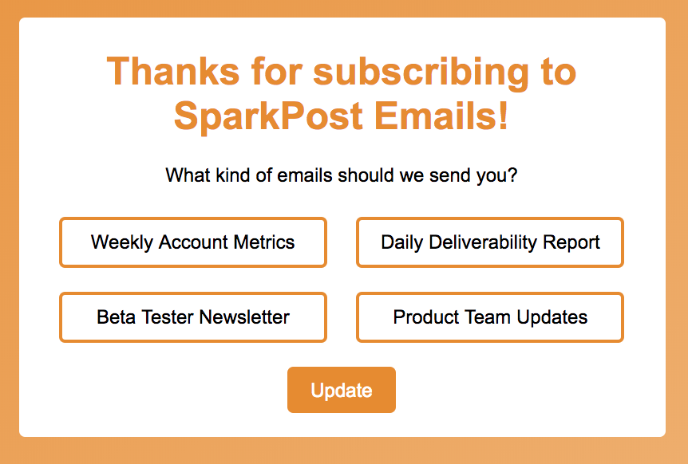
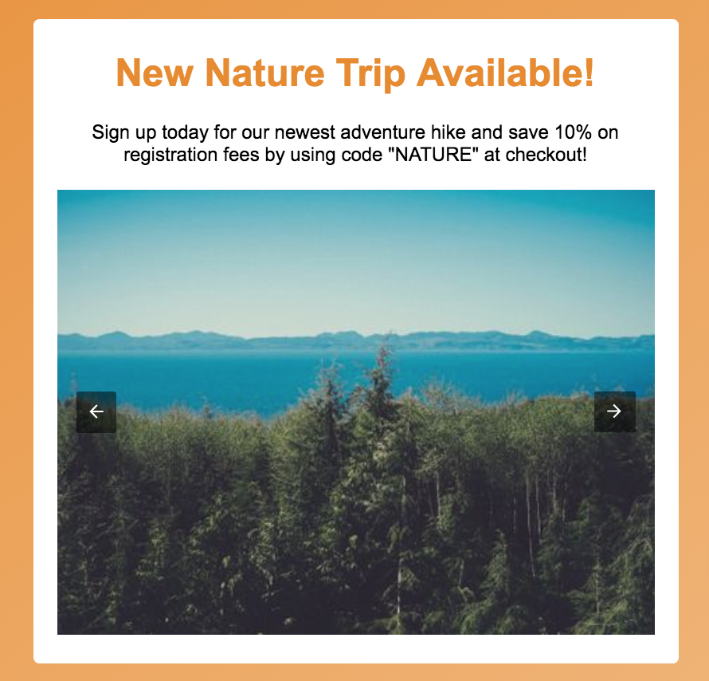
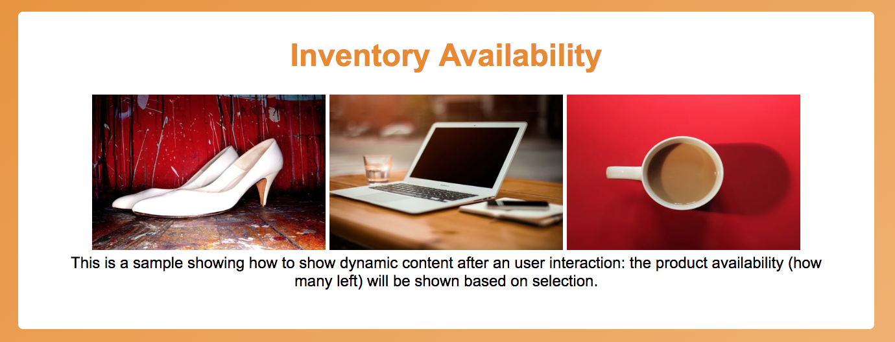
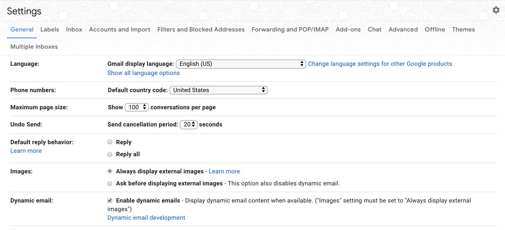
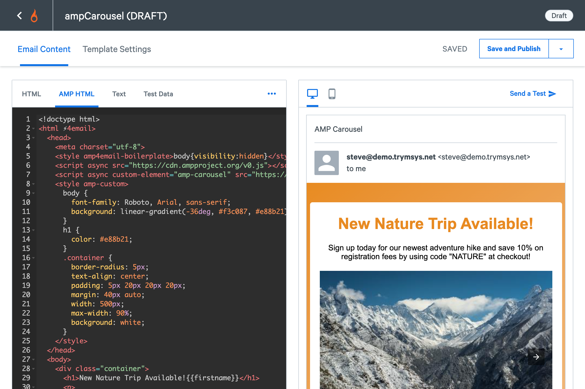
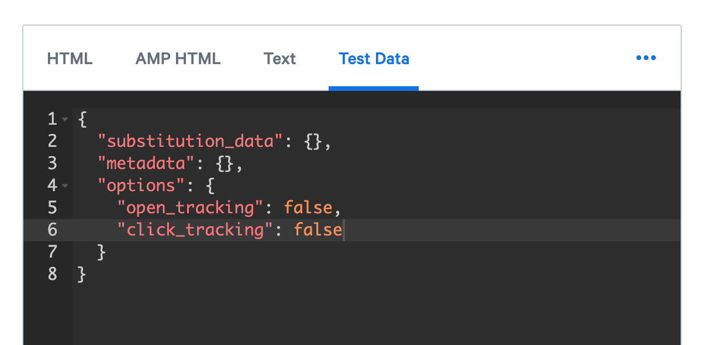
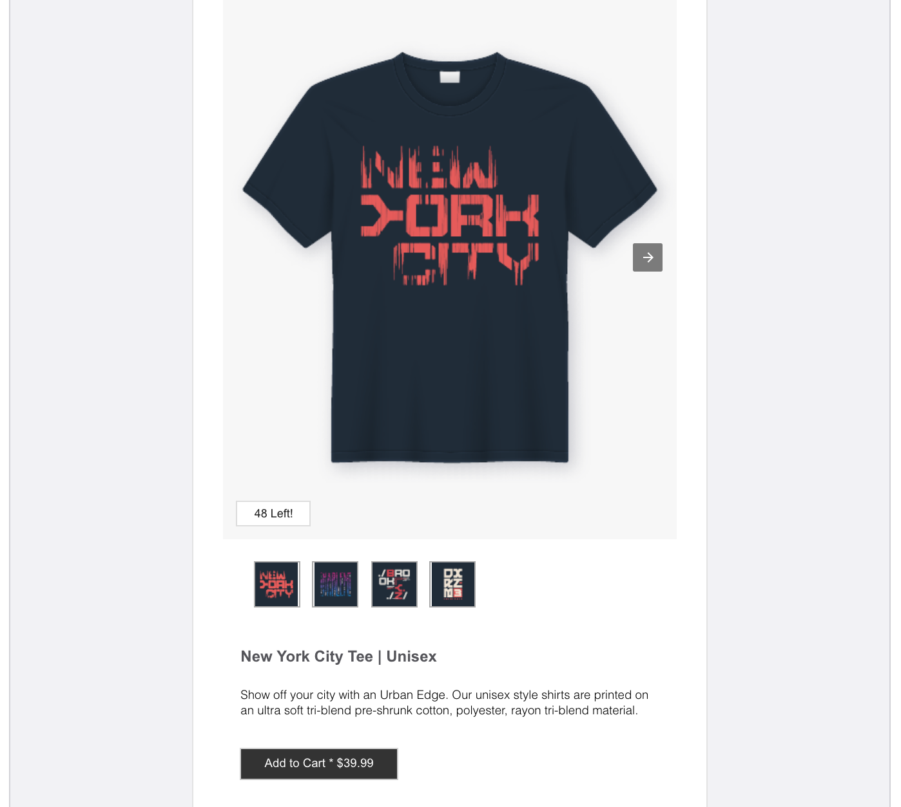

Learn how to create your very first AMP email! We'll run through content setup and best practices to have in place before you begin sending. We'll also point out some useful resources along the way to help you get the best from SparkPost, such as our [SparkPost API documentation](https://developers.sparkpost.com/api/).

AMP (Accelerated Mobile Pages) initially launched as an open-sourced code to help publishers develop fast web pages on mobile clients. It’s had a huge impact on SEO and now it’s ready for email. AMP for Email is the ability to combine personalization and interactivity through a set of HTML tags backed by JavaScript with a focus on performance and security. The AMPHTML Email format provides a subset of AMP components, like carousels, responsive form elements, and the ability to retrieve fresh content from a backend, that can be included into email messages. Email recipients can view and interact with the AMP components directly in the email, all within the inbox. AMP for Email not only provides interactive content, but uniquely provides dynamic up-to-date content to the inbox. 

Sections
* [The AMPHTML Email Format](#the-amphtml-email-format)
* [AMP Components](#amp-components)
* [CSS Requirements](#css-requirements)
* [AMPHTML Email Body](#amphtml-email-body)
* [Examples](#examples)
* [Adding AMP to new and existing emails](#adding-amp-to-new-and-existing-emails)
* [Sending Through SparkPost](#sending-through-sparkpost)
* [Help](#help)

## The AMPHTML Email Format

### Registration

An important note - in order to send AMP emails, you must register with Google. In addition to being subject to Google's [Bulk Senders Guidelines](https://support.google.com/mail/answer/81126), there are AMP specific requirements for sending dynamic emails. When you are ready to start sending, follow their [registration guide](https://developers.google.com/gmail/ampemail/register) to get started.

### Required Markup
A properly formed AMP email must adhere to a basic structure in order to be considered an AMPHTML email. Here's each component: 

| Component | Description |
| --- | --- |
| `<!doctype html>` tag|Doctype declaration is the first line and is required |
| `<html ⚡4email>` tag | Tells the world that this is an AMPHTML email. `<html amp4email>` is accepted as well  |
| `<head>` `<body>` tags | Optional in HTML but not in AMPHTML Email |
| `<meta charset="utf-8">` tag | The charset definition must be the first child of the `<head>` tag. This identifies the encoding for the page |
| `<script async src="https://cdn.ampproject.org/v0.js"></script>`| The AMP runtime |
| `<style amp4email-boilerplate>body{visibility:hidden}</style>` | The AMPHTML Email boilerplate. This is the CSS boilerplate to initially hide the content until AMP JS is loaded |

The following example code includes all components listed above and represents the minimum amount of markup required to create a valid AMPHTML email:
```
<!doctype html>
<html ⚡4email>
<head>
  <meta charset="utf-8">
  <style amp4email-boilerplate>body{visibility:hidden}</style>
  <script async src="https://cdn.ampproject.org/v0.js"></script>
</head>
<body>
Hello World! Let's get started using AMPHTML together!
</body>
</html>
```
Note the lack of a `<link rel=canonical>` element compared to the traditional AMP spec. This is because an AMP email doesn’t have a canonical email!

## AMP Components

The following is a list of AMP components that are supported today and are grouped in the following categories:
* [Dynamic Content](https://www.ampproject.org/docs/interaction_dynamic/amp-email-format#dynamic-content)
* [Layout](https://www.ampproject.org/docs/interaction_dynamic/amp-email-format#layout)
* [Media](https://www.ampproject.org/docs/interaction_dynamic/amp-email-format#media)

### Dynamic Content

| Element |   Description   |
| --- | --- |
| `<amp-form>` | Form element. The action-xhr attribute must be used in place of the regular action attribute. Can be used in conjunction with `<template type="amp-mustache">` to render a response. |
| `<amp-list>` |Remotely fetches JSON data that will be rendered by an `<amp-mustache>` |
| `<template type="amp-mustache">` | A Mustache template markup to render the results of an amp-list call |
| `<amp-selector>`| A multi-select widget for use within a form |
| `<amp-bind>` and `<amp-state>` | Simple scripting language in AMP that allows the manipulation of a state machine for interactions between elements. Can also be used to add behavior on certain events. `<amp-state>` is used to remotely fetch the initial state machine values |

### Layout

| Element |     Description     |
| --- | ------ |
| `<amp-accordion>` |	UI element that facilitates showing/hiding different sections |
| `<amp-carousel>` |	Carousel UI component |
| `<amp-sidebar>` |	Sidebar for navigational purposes |
| `<amp-image-lightbox>` |	Lightbox for containing images |
| `<amp-lightbox>` |	Lightbox for containing content |
| `<amp-fit-text>` |	Helper component for fitting text within a certain area |
| `<amp-timeago>` |	Provides a convenient way of rendering timestamps |

### Media

| Element |     Description     |
| --- | ------ |
| `<amp-img>` |	An AMP component that replaces . Note: Binding to [src] is not allowed |
| `<amp-anim>` | Embeds GIF files. Note: Binding to [src] is not allowed |

## CSS Requirements

Any and all CSS in any AMP document must be included in a `<style amp-custom>` tag within the header or as inline style attributes. The entire `<style>` tag cannot exceed 50,000 bytes.  The CSS allowed withim email messages will vary depending on the email provider. The list of CSS properties allowed within Gmail can be found [here](https://developers.google.com/gmail/design/reference/supported_css). 

Example:
```
<style amp-custom>
  /* any custom styles go here. */
  body {
    background-color: white;
  }
  amp-img {
    border: 5px solid black;
  }
  amp-img.grey-placeholder {
    background-color: grey;
  }
</style>
```

## AMPHTML Email Body
In AMPHTML, most HTML tags can be used directly as you'd normally expect. However, certain tags, like ``, are replaced with the equivalent or enhanced AMPHTML tags(`<amp-img>`). Check the [AMP Components](#amp-components) section for details on the specific AMPHTML tags supported. Please note that URLs must use absolute paths in AMPTHML email.

Example:

```json
<div class="emailbody">
  <div class="helloworld">Hello!</div>
  ```


## Examples
`<amp-selector>` example link [here](https://codepen.io/isaac-kim/pen/EOdByj)


`<amp-carousel>` example link [here](https://codepen.io/isaac-kim/pen/bQmPJJ)


`<amp-bind>` `<amp-state` example link [here](https://codepen.io/isaac-kim/pen/zMyvxX?editors=1100)

  
  
## Adding AMP to New and Existing Emails

### MIME Part
Email is structured as a MIME tree. This MIME tree contains the message body and any attachments to the email.
Embedding AMP within an email is simple, add a new MIME part with a content type of `text/x-amp-html` as a descendant of multipart/alternative. It should live alongside the existing `text/html` or `text/plain parts`. This ensures that the email message works on all clients.

### MIME Part Ordering
MIME Part Ordering:
* `text/plain`
* `text/x-amp-html`
* `text/html`

We recommend you structure your MIME part with plain text first, x-amp-html second, and then html last.  The reason being, some email clients will only render the last MIME part, so we recommend placing the `text/x-amp-html` MIME part before the `text/html` MIME part. Also, the email client strips out the `text/x-amp-html` part of the MIME tree when a user replies to or forwards an AMP email message. This is why it is important that an email provide alternative content in the HTML part.

### Replies and Forwarding
To start, the email client strips out the `text/x-amp-html` part of the MIME tree when a user replies to or forwards an AMP email message. This is why it is important that an email provide alternative content in the HTML part.

### Document Dimensions
Width: 800px or less (any wider and content may be unexpectedly truncated on some clients)
Height: variable, the client allows the user to scroll through the content

## Sending Through SparkPost

Even if you’re not an approved AMP sender, you can still send test emails to yourself and ensure your AMP content really does work! 
To accomplish this, go to your email account and access Settings. Then on the “General” tab, click on Dynamic Email Development under Dynamic Email. Type in your sender email address in order to opt in, to be able to display dynamic emails during development. 



It is recommended that this setting is only used on test accounts and in private browsing mode. You will be able to send your AMP messages from SparkPost to this email!

### Injecting AMP Emails
SparkPost makes it simple to send AMP-enabled messages. The SparkPost [Transmissions API](https://developers.sparkpost.com/api/transmissions/) supports a new optional field, `content.amp_html` in the `content` JSON object, a UTF-8 encoded string representing the AMP for Email HTML content. SparkPost inserts this as a `text/x-amp-html`  MIME part in the appropriate location of the MIME tree and performs engagement tracking (if enabled) as well as substitutions.

Here's an example:
```
{
  "options": {
    "open_tracking": true,
    "click_tracking": true
  },
  "campaign_id": "AMP_Test",
  "return_path": "test@bounces.sparkpost.com",
  "recipients": [
    {
      "return_path": "test@bounces.sparkpost.com",
      "address": {
        "email": "[insert_email_here]",
        "name": "John Doe"
      }
    }
  ],
	"content": {
		"from": "bounces-amptest@mail.sparkpost.com",
		"subject": "This is an AMP message test",
		"text": "Hello from the TEXT part",
		"amp_html": 
			"<!doctype html>
			<html ⚡4email>
			<head>
  				<meta charset="utf-8">
 				 <style amp4email-boilerplate>body{visibility:hidden}</style>
  				<script async src="https://cdn.ampproject.org/v0.js"></script>
			</head>
			<body>
			Hello World! Let's get started using AMPHTML together!
			</body>
		</html>",
		"html": "Hello from the HTML part" }}
```

Those injecting via SMTP will also have AMP support. Be sure to use the proper MIME structure; text/x-amp-html must be a descendant of multipart/alternative, and live alongside at least one of text/html and/or text/plain MIME parts.

### Engagement Metrics
Basic engagement tracking for opens and clicks will be supported through an AMP-specific tracking pixel. SparkPost Events and Webhooks will support AMP-specific opens and clicks, allowing you to compare AMP opens and clicks versus traditional HTML opens and clicks. Down the road, we may provide additional, advanced engagement tracking for AMP messages, depending upon our customers’ needs.

In order for engagement tracking to work properly and to have AMP content render without breaking, HTTPS engagement tracking is required. Please refer to [SparkPost documentation](https://www.sparkpost.com/docs/tech-resources/enabling-https-engagement-tracking-on-sparkpost/?_ga=2.79716823.1187573678.1555510062-535257696.1506374471) on how to enable HTTPS engagement tracking. 

### Stored Templates with AMP Preview
AMP for Email is supported in SparkPost templates, including metadata and substitution data in a template’s AMP MIME part. With SparkPost templates, you’ll be able to add can edit the subject line, the FROM domain, FROM Name, Template Name, and make changes to the email content itself (text, HTML, AMP HTML). You can save your template as a draft or publish it to be production ready.



If you do not have HTTPS enabled for your engagement tracking, and you plan to send a test AMP email from AMP Preview, please add in the following under test data to disable engagement:



As you create your email template, click on the “Preview & Send” button. This will quickly show  you how your content will be rendered in the inbox. On the “AMP HTML” tab, you will be able to verify that your AMP content is in working condition, whether that’s clicking through a carousel of pictures, rendering a list, rating a product and providing feedback, or answering a poll. Verify that everything is in working order all within the UI.



From the Preview Screen, you can type in the email address that has approved the sender email address, and then send the test email. Navigate to to your inbox to find the AMP email rendered properly.

## Help
### Content Validation
A web-based validator is available [here](https://validator.ampproject.org/#htmlFormat=AMP4EMAIL).
Simply paste in the AMP HTML to ensure the document meets all the AMPHTML Email restrictions. This tool shows you the validation errors directly inline.

### SparkPost API Documentation
To learn more about how to send AMPHTML, refer to the [SparkPost API Documentation](https://developers.sparkpost.com/api/).
Learn more about AMP-specific engagement tracking (clicks and opens) [here](https://developers.sparkpost.com/api/events/).


